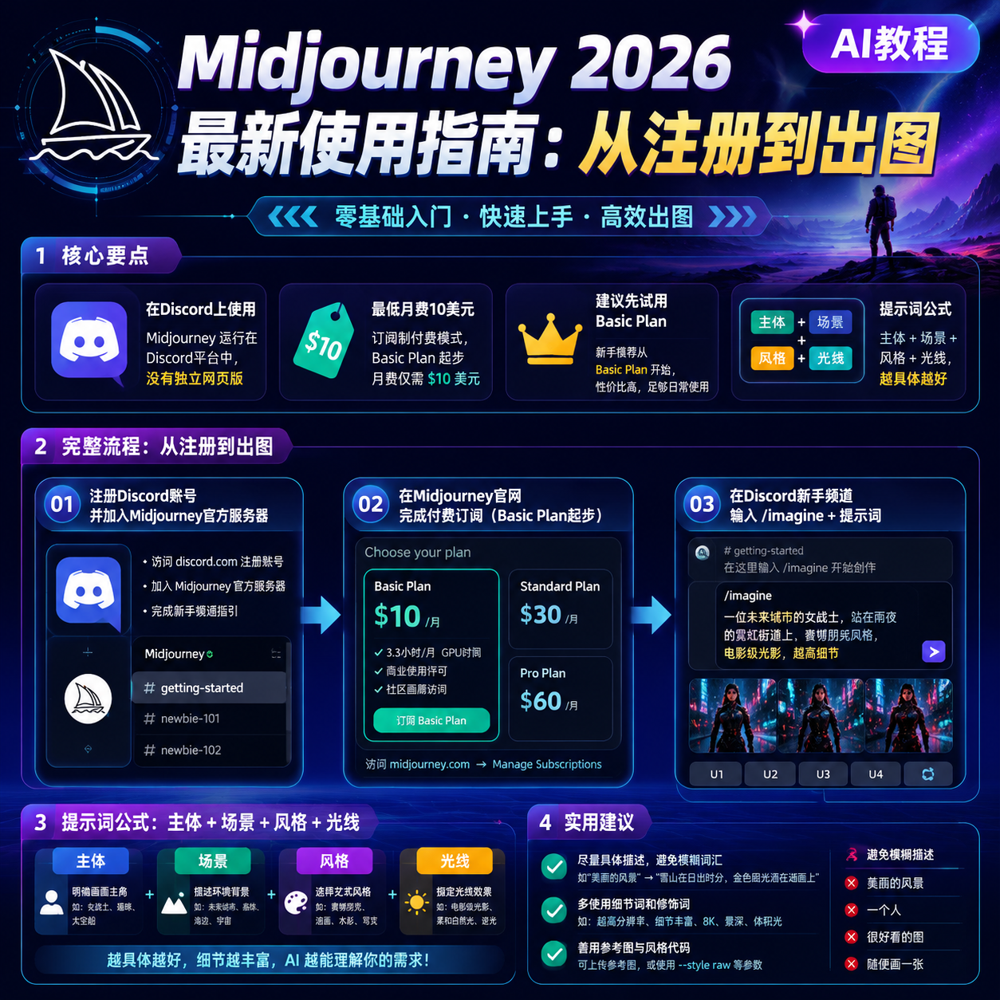

<!--
title: Midjourney 2026 最新使用指南：从注册到出图
date: 2026-06-16
type: ai_tutorial
week: 3
style: 新手友好：假设读者完全零基础，一步步教
fingerprint: dd75dd5eab29e8ad366297da22dbd540
tags: AI教程, 效率工具, 入门指南
-->


<div align="center">
  
  <br><sub>2026-06-16 · AI教程, 效率工具, 入门指南</sub>
</div>

<br>
# 花了一周时间，我终于搞定了Midjourney：2026最新从零到出图全记录

你是不是也这样？刷小红书或者B站时，看到别人用Midjourney生成的图片，光影质感像电影大片，构图比摄影师还专业。你心里想：**这东西也太牛了，但我肯定搞不定**。

别怕，我懂。一个月前我也是这么想的。

我花了整整一周时间，踩了不下10个坑——**信用卡支付不了、网页打不开、提示词写出来全是鬼畜图、生成到一半账户被封**……这些破事我全经历了。所以我想把自己的踩坑全记录写下来，**帮你省下我花过的冤枉钱和时间**。

这篇文章是针对**完全零基础**的读者写的。你不需要懂AI、不需要会画画、甚至不需要英文好。跟着我的步骤走，**从注册到出第一张图，预计15-20分钟**。

---

## 一、🔥 开始之前：先做完功课，别急着掏钱

我先坦白：Midjourney现在**没有免费试用**了。在我用过的几个AI绘画工具里（Stable Diffusion、DALL·E 3、Leonardo.ai），Midjourney的出图质量确实最好，尤其是在**光影、质感和影视级风格**这块，可以说是业界天花板。但它也是**最不友好的**——需要上Discord、需要付费、界面还有门槛。

我建议你先看看我的这篇攻略，**觉得合适了再花那个钱**。不要看到别人炫图就冲动付款，毕竟一个月最低也要10美元（约73块）。

下面是目前市面上主流的几个AI绘画工具对比，**帮你看清楚再选**：

| 工具 | 月费 | 出图速度 | 画质 | 上手难度 | 我个人的评价 |
|---|---|---|---|---|---|
| **Midjourney** | 10-60美元 | 中等（排队约10-60秒） | ⭐⭐⭐⭐⭐ | ⭐⭐⭐⭐ | 画质天花板，但工具体验最差 |
| **DALL·E 3** | 20美元（含ChatGPT Plus） | 快 | ⭐⭐⭐⭐ | ⭐⭐ | 最友好，但风格偏卡通 |
| **Stable Diffusion** | 免费/自部署 | 看配置 | ⭐⭐⭐⭐ | ⭐⭐⭐⭐⭐ | 可玩性最强，但需要电脑好 |
| **Leonardo.ai** | 免费/8-32美元 | 快 | ⭐⭐⭐ | ⭐⭐⭐ | 免费额度很香，但细节不够 |

**我的建议**：如果你只是试试水、不想折腾，先看看后面我给你的提示词，直接用**Leonardo.ai的免费版**练手。如果决定入坑Midjourney，就准备好**一张Visa/Mastercard信用卡 + 能访问国际网络的工具**。

---

## 二、✅ 注册和订阅：每一步我踩过的坑

### 2.1 需要准备的东西（很重要！）

1. **一个邮箱**（Gmail/Outlook都行，QQ邮箱我之前试了，收验证码慢）
2. **一个Discord账号** - Midjourney是在Discord上用的，没错，它没有自己的网页版
3. **一张信用卡**（Visa/Mastercard都行，**PayPal也行**，但注意国内的银联单币卡用不了）
4. **能正常访问国际网络的工具**（这个不多说，你自己解决）
5. **至少10美元预算**（最低的Basic Plan月付10美元，折合人民币约73块）

### 2.2 为什么要用Discord？我第一次也是一头雾水

我第一次打开Midjourney官网，看到"Open in Discord"按钮时，第一反应是：**什么鬼？** 但用了一段时间我理解了——Discord相当于Midjourney的"操作系统"。你在Discord里输入指令，AI在远程服务器上帮你算图，然后把结果发回给你。

**操作流程**：
1. 先注册Discord：去 discord.com，用邮箱注册一个账号
2. 然后访问 Midjourney官网（midjourney.com）
3. 点右上角的 "Join the Beta"
4. 跳转到Discord后，加入MJ的官方服务器
5. 在左侧频道列表里，找一个 "newbies-xxx" 的频道（新手频道）
6. 在输入框里输入 `/imagine` 然后加上你的提示词

**注意**：免费用户有25张图的试用额度（但现在已经没有了，需要直接订阅）。所以别想着蹭免费的了，直接看下一步。

### 2.3 订阅流程：避开我踩过的坑

付费订阅要在Midjourney官网操作，不能直接在Discord里付。步骤：

1. 登录 Midjourney官网（用你的Discord账号登录）
2. 点击右上角你的头像 → "Manage Subscription"
3. 选择套餐（下面有表格）
4. 输入信用卡信息，完成支付

**我踩过最大的坑**：第一张信用卡是国内的普通银联卡，**直接拒绝**。后来换了国际信用卡才行。如果你没有，建议先去支付宝申请个**虚拟Visa卡**。

**套餐选择建议**：

| 套餐 | 月费 | 生成时间（Fast） | 适合谁 |
|---|---|---|---|
| **Basic Plan** | 10美元 | 大约200张/月 | 纯新手、每月只玩几次 |
| **Standard Plan** | 30美元 | 无限生成（15小时Fast） | 重度用户、每天出图 |
| **Pro Plan** | 60美元 | 无限生成（30小时Fast） | 工作室、商业用途 |

**我的建议**：**先买Basic Plan，用一个月**。如果发现不够用，下个月再升级。不要一上来就买Pro，**真没必要**。我第一个月用的Basic，到20天的时候感觉不太够（每天就出个10来张），第二个月才升到Standard。

---

## 三、🖼️ 核心操作：从0到出第一张图

### 3.1 第一个提示词怎么写？

好，你已经付了钱，进了Discord，选了一个新手频道。现在输入框里打 `/imagine`，按Tab键，输入下面的文字：

```
/imagine prompt: a cute orange cat sitting on a bookshelf, natural lighting, soft fur details, warm cozy atmosphere --ar 16:9 --v 6
```

按下回车。你会看到"Waiting for job to start..."，然后大概10-30秒后，AI会给你生成4张图。

**关键参数解释**：
- `--ar 16:9` 是画面比例，16:9适合做壁纸，1:1适合头像，9:16适合手机壁纸
- `--v 6` 是版本号，目前最新的是v6（2025年11月更新的），画质最好

**提示词的核心公式**：**主体 + 场景/环境 + 风格/材质 + 光线氛围**。

举个例子，一个失败的提示词：`a beautiful girl` → 结果是4张很糊、风格完全不同的图。

一个成功的提示词：`a professional Chinese female doctor, 30 years old, wearing white coat, standing in modern hospital corridor, photorealistic, cinematic lighting, 8K detail --ar 4:5 --v 6`

**差在哪？** 第一句只有主体（女孩），第二句把主体、年龄、身份、服装、场景、风格、画质全说清楚了。

### 3.2 图生出来了，然后呢？

四张图下面有8个按钮：
- **U1/U2/U3/U4**：放大对应的那一张图（1是左上，2是右上，3是左下，4是右下）
- **V1/V2/V3/V4**：以对应的图为基础，重新生成4个变体（类似微调）
- **🔄**：重新生成一次（用同样的提示词）
- **📦**：这个按钮我没见过？其实Discord界面还有一个 **"Remix"按钮**，可以编辑提示词再生成

**我的使用习惯**：先点V看变体，找到满意的再U放大。如果都不满意，就点🔄重新生成。

### 3.3 进阶玩法：用图生图

有时候光靠提示词不够，你可以给AI一张参考图。比如你想让AI生成一张和你头像同风格的图：

1. 在Discord输入 `/imagine`
2. 先**上传一张参考图**到频道里（把图片拖到输入框，按回车）
3. 复制图片的链接（右键图片 → 复制链接）
4. 在提示词里加上图片链接，像这样：

```
/imagine prompt: [图片链接] a futuristic city street at night, neon lights, cyberpunk style, rain --ar 16:9 --v 6
```

这样AI会在你的图片风格基础上，生成新的内容。**适合用来做风格迁移**。

**参数控制强度**：你可以加 `--iw 0.5` 到 `--iw 2` 来控制参考图的影响程度。数值越大，越贴近原图。

---

## 四、🎨 实战场景：给你直接能用的提示词

我用了3个月，最常生成的是这3类：

### 场景1：做壁纸（手机/电脑）

```
/imagine prompt: a serene Japanese forest, sunlight streaming through dense leaves, moss-covered ground, misty morning atmosphere, 4K wallpaper, photorealistic, vibrant colors, high contrast --ar 16:9 --v 6
```

**适合**：想要独特但不撞壁纸的人。

### 场景2：做头像（小红书/微信）

```
/imagine prompt: a young female painter, holding paintbrush in front of easel, painter's studio, natural window light, warm color palette, soft focus background, portrait photography, professional lighting, 8K --ar 1:1 --v 6
```

**适合**：想要一个有故事感的个人头像。

### 场景3：做商品图（淘宝/抖音背景）

```
/imagine prompt: a minimalist ceramic coffee cup on marble countertop, morning sunlight, subtle shadows, commercial product photography, soft pastel colors, sharp details, white background --ar 4:5 --v 6
```

**适合**：自己开店需要拍产品图，但又不想花钱请摄影师。

---

## 五、🤔 优缺点：说点实话

用Midjourney 3个月，我也发现了它的**真实问题**。

**优点（我用着最爽的地方）**：
- **画质确实是天花板**：同样的提示词，MJ比DALL·E 3出来的细节多3倍不止
- **光影处理特别自然**：尤其适合做电影感、高级感
- **人物面部细节最真实**：对比过，MJ的人脸不会崩

**缺点（我最烦的地方）**：
- **必须联网**：没有本地版，断网就不能用
- **速度慢**：高峰期排队能到3分钟一张图
- **没有免费试用**：对比Leonardo.ai（每天150免费额度），MJ太**抠门**
- **英文提示词是硬门槛**：虽然可以翻译，但很多专业词汇（lighting、texture）翻成中文效果会打折扣
- **不能做复杂的多人物交互**：比如"两个人握手"这种，MJ经常画成四只手交缠在一起

---

## 六、💡 给你3个最实用的避坑建议

1. **不要一上来就买Pro**：先用Basic Plan（10美元/月）用一个月。大部分人的用量真的到不了Pro。
2. **提示词一定要精确**：用数字、颜色、材质去描述，比如"一个30岁的女性"比"一个女性"好十倍。**越具体，AI越听话**。
3. **多试几次**：MJ的随机性很强，同一个提示词生成5次，可能只有1张是好图。**别放弃**。

---

## 写在最后

Midjourney确实改变了我的工作方式。以前做一个想法，我需要花2小时在Pinterest找参考图，再用Photoshop拼半天。现在坐在电脑前，输入一段话，等30秒，图就出来了。

但它也有缺点：**不是免费的、有学习门槛、不能离线用**。所以我的建议是——不要把它当成"万能创作器"，而是当成**一个需要学习的新工具**。就像你当初学PS一样，花了时间，才能用好它。

这篇文章我花了整整3天重新整理，**把我踩过的坑全写出来了**。如果你觉得有用，**先收藏**，跟着一步步操作。看完之后有什么问题，直接在评论区问我，我看到会回复。

**祝你尽快出到第一张让你满意的图** 🚀

---

<!-- article-data
key_points: Midjourney使用需要在Discord上进行，没有独立网页版|最低月费10美元，建议先买Basic Plan试用|提示词公式：主体+场景+风格+光线，越具体越好|出图后可以用U放大、V变体微调，也可以加参考图生成|相比其他AI绘画工具，MJ画质最好但门槛最高
steps: 注册Discord账号并加入Midjourney官方服务器|在Midjourney官网完成付费订阅（Basic Plan起步）|在Discord新手频道输入/imagine + 提示词|根据出图结果选择U放大或V变体微调|复制图片链接下载或分享
tips: 提示词要具体到主体、场景、风格、光线，避免模糊描述|选择图片比例时用--ar参数：16:9壁纸、1:1头像、9:16手机壁纸|不要一上来就买Pro套餐，先买Basic Plan用一个月|高峰期出图可能排队，建议避开晚上和周末|英文提示词效果最好，可以先用翻译软件写好再粘
summary_items: Midjourney画质是目前AI绘画工具的天花板|但需要付费、上Discord、会英文提示词，门槛比同类高|从Basic Plan开始，不要冲动消费|提示词写得越具体，出图质量越高|多试几次，同一个提示词不同随机结果差异很大
-->