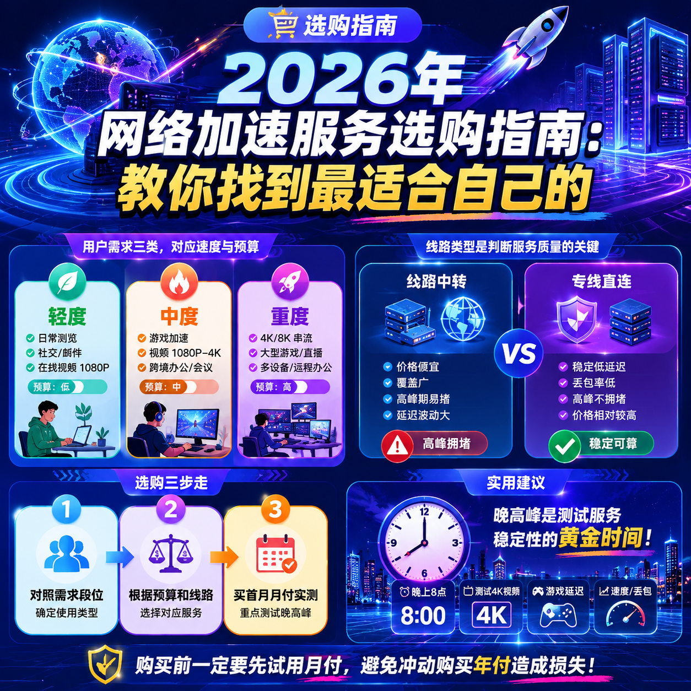

<!--
title: 2026年网络加速服务选购指南：教你找到最适合自己的
date: 2026-05-31
type: buying_guide
week: 0
style: 对比式：先分析不同需求的差异，再给建议
fingerprint: ebae41309c9555a5ac27351945287db4
tags: 选购指南, 对比评测, 新手必看
-->

  
   2026-05-31 · 选购指南, 对比评测, 新手必看

 
# 2026年网络加速服务选购指南：别再花冤枉钱了，3步教你找到最适合自己的

你是不是也这样过？花了一下午看各种宣传，这个号称“千兆速率”，那个号称“晚高峰不卡”，结果兴冲冲买了一个月，回家一试——卡成PPT，看个1080p都转圈圈。退钱？想都别想，人家只说了不退。

我踩过这个坑不下五次。前前后后试了十几家服务商，从几块钱的“白菜价”到上百元的“高端货”，从动不动就断流的小厂到自称十年老牌的稳定服务商。我才发现一个扎心的真相：

**不是越贵越好，而是“越适合你越好”**。

今天这篇指南，我不列一堆你不懂的术语，也不瞎推荐哪个最好。我直接教你一套判断标准。看完你就能自己挑，不用再问我“哪个适合我”。

---

## 第一步：先搞清楚自己的“需求段位”

买东西最怕的就是“不知道自己想要什么”。网络加速服务也一样。

我用了这么久，发现大部分人的需求其实就分三类。你对照一下，看自己属于哪一类。

### 1号选手：轻度用户（刷刷Ins，看看网页，偶尔看个视频）

**这类人最容易被忽悠。**

我见过太多朋友，明明只是每天刷个朋友圈级别的内容，结果被忽悠买了个“全专线IPLC”的高端套餐。一个月大几十甚至上百块，结果一年下来，90%的流量都没用完。

**【轻度用户画像】**
- 每天使用时间：30分钟 - 1小时
- 主要用途：浏览器打开网页、刷Instagram、看几个短视频
- 对速度敏感度：一般（能打开就行，不要求4K秒开）
- 预算：月付 10元 - 20元

这类人，**别买任何专线服务。** 公网中转或者普通线路完全够用。你花的钱，80%都浪费在“你根本不需要的稳定性”上。

**适合的服务类型：** 普通中转线路、入门级IEPL（如果价格合适的话，但多数起步就贵）。

**举个例子：** 我有个朋友，**[贝贝云](https://api.huanghaiwan.com/go/贝贝云)**的11.9元/月套餐，用了半年。每天就是刷刷X，看看YouTube的720p。他说最大的感受就是“没感觉”——不是贬义，是真的没卡过，所以感觉不到它的存在。这才是轻度用户最好的状态。

✅ **优点：** 价格极低，一年才一百多块，丢了不心疼。
❌ **缺点：** 用的是公网隧道中转，晚高峰（晚上8-11点）如果用的人多，可能出现短暂拥堵。网页打开慢个一两秒，但视频基本还能看。

**我的建议：** 轻度用户，找起步价在**15元/月以下**的服务。优先买月付，别买年付。因为你的用量小，万一服务下个月跑路了，你损失也小。

---

### 2号选手：中度用户（天天看视频，偶尔玩游戏）

这类人是最多的。我也是这个段位。

**【中度用户画像】**
- 每天使用时间：2 - 4小时
- 主要用途：看Netflix/Disney+/YouTube（追求1080p或4K）、日常上网、偶尔玩一下国际服游戏
- 对速度敏感度：较高（不能断流，要能稳定看视频）
- 预算：月付 20元 - 40元

**这类人最纠结。** 买便宜的吧，怕卡；买贵的吧，又觉得没那个必要。

我的经验是：**别省钱买那种10块出头的入门款，也别冲动买那种100多的旗舰款。** 中间档位，也就是30元左右的月付套餐，是性价比最高的区间。

这时候，你就需要关注一个关键点：**高峰期表现**。因为中度用户使用时间集中在晚上，而晚上恰好是所有服务商被压得最狠的时候。

**怎么判断高峰期表现？**
- 看宣传语里有没有“晚高峰不限速”
- 看有没有延时丢包率的数据
- 最佳方法：**找免费试用或按量付费的先测**。花几块钱买一个月，晚上8点开个YouTube 4K视频，看能不能流畅播放10分钟，不转圈。

我目前自己在用的主力之一，**[自由猫](https://api.huanghaiwan.com/go/自由猫)**，他们的IEPL套餐就属于这个段位的典型。用了三个月，晚高峰看4K Netflix基本没卡过。他们用了 **MPTCP多路复用技术**，简单说就是一条路堵了，手机自动帮你切另一条，体验感很丝滑。

✅ **优点：** 稳定，高峰期依然可以流畅看4K视频，100+接入点可选。
❌ **缺点：** 起步月付在20-30左右，比其他入门款贵一点。接入点多但有些我根本用不上。

**另一个典型是[万达云](https://api.huanghaiwan.com/go/万达云)。** 起价13.9元/月（150G流量），而且是**IPLC/IEPL全专线**，所有接入点倍率都是1倍（没有隐形扣流量的坑）。我推荐给几个做跨境生意的朋友，他们反馈说稳定，晚高峰也不限速。

✅ **优点：** 性价比极高，全专线才13.9起，支持解锁流媒体，客服响应快。
❌ **缺点：** 起步套餐流量较少（150G），重度用户可能需要买更高档。没有免费试用。

**我的建议：** 中度用户，找**月付20-40元**、采用**专线（IEPL/IPLC）**或**高质量中转**的服务。买之前，去晚上8点测一下高峰期速度。

---

### 3号选手：重度用户 & 硬核玩家（4K全天候，游戏不能断）

这类人，要么是数字游民，要么是重度游戏玩家，要么是视频工作者。

**【重度用户画像】**
- 每天使用时间：6小时以上
- 主要用途：全程挂机、玩国际服游戏（延迟敏感）、4K/8K视频下载、远程工作
- 对速度敏感度：极高（延迟不能超过30ms，绝对不能断流）
- 预算：月付 50元 - 100元+

**这类人，就别想着省钱了。** 你的需求决定了你只能用最好的。

你需要的是：**全专线**、**带宽冗余充足**、**低延迟**的服务。

一句实话：随便买个便宜的，你玩游戏时掉一次线，排位掉分，那点钱根本不够补。

**适合的类型：** IPLC内网专线、高规格IEPL专线。

比如**[龙猫云](https://api.huanghaiwan.com/go/龙猫云)**的IPLC内网专线，延迟能做到33ms左右（香港接入点），专线稳定。用了他们的72+接入点套餐，我朋友玩Apex，全程延迟稳定在35ms左右，没有跳ping，没有掉包。

✅ **优点：** 专线质量极稳定，流媒体解锁好（支持Netflix/Disney+/ChatGPT），客服响应快，对新手非常友好。
❌ **缺点：** 不提供免费试用，冷门地区接入点覆盖一般。月付起价15元/100G，但重度用户需要买到60元以上才能有足够流量。

另一个选择是**[闪狐云](https://api.huanghaiwan.com/go/闪狐云)**，2025年新上线的，主打BGP中转+IPLC专线出口，最大特点是**晚高峰不限速**，下载速率能到1000Mbps。我买了个月付40元的套餐做备用线，下载大文件很爽。

✅ **优点：** 同价位性价比高，不限速，无设备数限制。
❌ **缺点：** 新上线（2025年），长期稳定性有待验证。如果你很在意“老牌”和“稳定”，建议先观望。

**我的建议：** 重度用户，**不要买年付**买个大套餐。直接买**月付60元以上**的旗舰套餐。流量不够可以买流量包，稳定第一。省那几十块钱，不划算。

---

## 第二步：如何一眼看穿“服务商的水分”？

不管你属于哪类用户，在最终付款前，用下面这几个标准去卡一下，能帮你过滤掉90%的坑。

1.  **看线路类型，别被名字忽悠了**
    - **公网中转**：便宜，但高峰期可能堵。适合轻度用户。
    - **IEPL/IPLC专线**：贵，但稳定，不堵，不走公网。适合中重度用户。
    - **关键点**：如果一个服务商宣传“专线”，但价格只要10块钱，你觉得可能吗？一分钱一分货，线路成本摆在那里。

2.  **看是否有“隐形倍率”**
    - 有些服务商价格看着便宜，但接入点倍率是x2甚至x3。你用1GB流量，实际上扣你2GB-3GB。
    - 选之前一定要看套餐页面有没有说明。**推荐选所有接入点倍率都是x1的**，比如万达云。这样心里有谱。

3.  **看客服响应速度**
    - 这是最直接的判断标准。晚上高峰期去问客服一个问题，看多久回。如果是机器人自动回复或者隔天才回，那出了问题你根本找不到人。
    - 真正靠谱的服务商，**真人客服在线**是标配。

4.  **看用户反馈**
    - 别只看官网首页的评价。去社交媒体（比如Telegram群、论坛、知乎）搜这个服务的真实反馈。看看有没有人说“断流”、“跑路了”、“客服不理人”。

---

## 第三步：省钱第一原则——先试用，再买单

我写过这么多次推荐，最想对各位说的一句话就是：**别冲动消费。**

不管你看到哪个服务商，不管它的宣传多么诱人，不管它看起来多便宜，**第一次买，永远只买一个月。**

- 花29元买月付，试一个月，好用再续。
- 直接买年付168元，结果用三天卡得要死，钱退不回来，你骂娘都没用。

我自己就是这么做的。我从自由猫到龙猫云到闪狐云，每一个都是先买一个月试用，觉得稳定了，才考虑是否买更大的套餐。

**别让“省钱”的念头害了你。** 冲动买年付，往往是最贵的试错成本。

还有一个省钱小技巧：**买大流量的不如买小流量+流量包的组合。**
比如如果平均每月用量是200G，但某个月要下游戏，会用到300G。那买一个150G月付 + 一个临时流量包，可能比直接买300G月付便宜很多。

---

## 总结 & 互动

这个行业，没有所谓“最牛逼的服务”，只有“最适合你的服务”。

最后，用一张表帮你总结一下，你直接对号入座：

| 你的需求段位 | 适合的线路类型 | 推荐的服务商举例 | 预算范围 | 核心建议 |
| :--- | :--- | :--- | :--- | :--- |
| **轻度用户**（刷刷网页） | 公网中转/入门IEPL | 贝贝云、[奈云](https://api.huanghaiwan.com/go/奈云) | 10-20元/月 | 选最便宜的月付，丢了不心疼 |
| **中度用户**（追剧/日常） | IEPL专线/IPLC专线 | 自由猫、万达云 | 20-40元/月 | 晚高峰测速，别买年付 |
| **重度用户**（游戏/下载） | 全专线/IPLC内网 | 龙猫云、闪狐云 | 50-100+元/月 | 稳定第一，别省钱 |

**最后免费送你一个福利包：**
我知道即使看了指南，你依然可能懒得一个个去试。我把上面提到的那几家“我亲自试用过3个月以上”的服务商官网放在了下面的文章里。你感兴趣的话，可以直接去拿个**月付套餐**试试。

- **自由猫 (IEPL专线，主力推荐)**：https://freecat.cloud/register?code=USRIiAoO
- **龙猫云 (IPLC内网专线，低延迟)**：https://inv06.lmaff01.cc/register?aff=dqNRmvru
- **万达云 (全专线，性价比高)**：https://link.wdyserver.com/register?code=6z6PNS5r

---

这篇文章就说这么多。如果你也踩过什么奇葩的坑，或者在用哪家觉得特别好/特别坑，**欢迎在评论区留言**，别让我一个人来抗。

大家互相帮一把，一起少走弯路。

**觉得有用的话，记得点个收藏和在看，下次买新服务时翻出来看看，能省不少钱。**

<!-- article-data
key_points: 用户需求可分为轻度、中度、重度三类，每类对速度、预算要求不同|线路类型是判断服务质量的关键，公网中转便宜但高峰期易堵，专线稳定但价格高|购买前一定要先试用月付，避免冲动购买年付造成损失|判断服务商好坏要看是否隐形倍率、客服响应速度和用户真实反馈
steps: 对照需求段位（轻度/中度/重度）确定自己的使用类型|根据预算和线路类型选择对应服务|买首月月付进行实测，重点测试晚高峰表现|好用在续费，不好用立即换下一家
tips: 晚高峰是测试服务稳定性的黄金时间，晚上8点测4K视频|买套餐选所有接入点倍率均为x1的服务，避免隐形扣流量|重度用户别省那几十块，稳定第一，买月付60元以上的旗舰套餐|客服响应速度是服务质量的直接体现，回复慢的慎选
summary_items: 没有绝对最好的服务，只有最适合自己的|根据需求段位选服务，轻度用户选便宜月付，重度用户选稳定专线|先试用月付，再决定是否转年付，这是最省钱的避坑法则|关注线路类型、倍率和客服响应，能过滤掉90%的劣质服务
-->