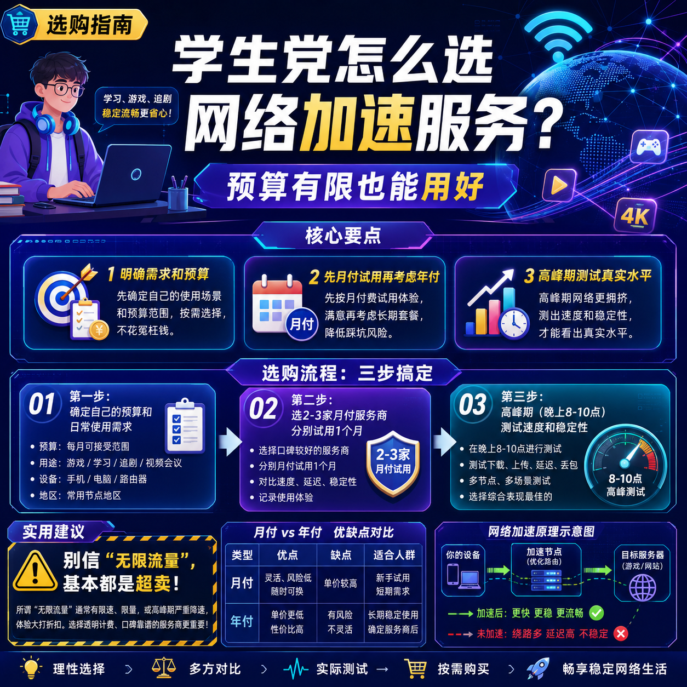

<!--
title: 学生党怎么选网络加速服务？预算有限也能用好
date: 2026-06-01
type: buying_guide
week: 1
style: 踩坑式：从自己买错的经验出发，教你怎么避坑
fingerprint: 597dcda02e197e4d1da5051c918642c7
tags: 选购指南, 对比评测, 新手必看
-->

  
   2026-06-01 · 选购指南, 对比评测, 新手必看

 
# 学生党选网络加速服务，我交了半年智商税，才搞明白这4个真相

每个月就那么点生活费，却总被各种网络问题折腾得想砸电脑——看Netflix卡成PPT、打外服游戏延迟200+、连Google搜索都转圈圈……你是不是也想过"随便买个便宜的吧，能用就行"？

**我当初就是这么想的，结果踩了半年坑，花了不少冤枉钱。**

作为一个靠泡面度日的过来人，今天就把我买错服务、被坑、被限速的惨痛经历写出来，帮你省点钱、少走点弯路。

---

## 1️⃣ 我踩过的坑：从10块"便宜货"到年付翻车

先说最惨的一次。

大二刚接触这些，我看到某宝上10块钱包月的"全接入点无限流量"，心想这太香了。结果呢？

- **第1天**：能连上，但YouTube 720p都要缓冲
- **第3天**：接入点掉了一半
- **第7天**：客服直接把我拉黑了
- **第15天**：服务完全挂掉

后来跟学长聊天才知道，这种10块钱的"网络服务商"基本是**共享IP、超卖带宽、跑路率高**。一个服务器同时几千人用，晚上高峰你能不卡吗？

接着又试了一个年付99的——更惨。用了2个月，服务器直接被封了，钱一分不退。**年付一定要慎重**，尤其是新服务商，说跑路就跑路。

最后算了一笔账：半年买了6个不同的服务，总共花了400多块，真正能用的时间加起来不到2个月。

经历了这些，我才明白：**不是便宜的就一定好，也不是贵的就是智商税，关键要看怎么选。**

---

## 2️⃣ 学生党到底需要什么样的服务？

先别急着看推荐，先搞清楚自己的需求。

我问自己三个问题：

✅ **我平时用几个设备？** ——大部分学生就1台电脑+1部手机，偶尔加个平板
✅ **我一个月用多少流量？** ——刷视频+查资料，100-200G基本够了
✅ **我的预算多少？** ——一个月20-30元是底线，超过50元就肉疼了

**认清这三点后，我的判断标准就清晰了：**

| 需求 | 学生党底线 | 别被忽悠 | 
|------|-----------|---------|
| 价格 | 月付20-30元 | 别信"永久免费" |
| 流量 | 100-200G/月 | 别买"无限流量"（基本都是坑） |
| 设备数 | 3-5台 | 限制10台以内足够了 |
| 接入点数 | 10-30个 | 几十个接入点你也就用3-5个 |
| 速度 | 1080p不卡顿 | 别追求4K（学生党基本没这需求） |

记住这个框架，再去挑服务，就不会被花里胡哨的宣传带偏。

---

## 3️⃣ 我试过的学生党友好服务实测

经过踩坑后的精挑细选，我整理出几个适合学生的选择。**注意：不是广告，优缺点都说清楚。**

### 🔹 入门级：[龙猫云](https://api.huanghaiwan.com/go/龙猫云)（月付15元起）

这个是我后来朋友推荐的，用了**3个多月**，整体感觉还行。

**适合：** 预算特别紧张的学生、初次尝试的小白
**不适合：** 需要看4K视频、玩外服游戏看重延迟的人

| 维度 | 我的体验 |
|------|---------|
| 价格 | 月付15元/100G，年付更划算 |
| 速度 | 白天不错，晚上高峰略慢 |
| 稳定性 | 偶尔掉线，但能接受 |
| 接入点数 | 72+（实际用到的就几个） |
| 流媒体 | 能解锁Netflix/Disney+ |

**缺点：** 冷门地区接入点覆盖一般，没有免费试用，只能先付费再体验。

### 🔹 性价比款：[贝贝云](https://api.huanghaiwan.com/go/贝贝云)（月付11.9元起）

这是我现在用的主力之一，已经用了**2个月**。

**适合：** 追求极致低价、只用来日常上网的学生
**不适合：** 对速度和稳定性要求高的重度用户

| 维度 | 我的体验 |
|------|---------|
| 价格 | 11.9元/100G，入门门槛最低 |
| 速度 | 看1080p够用，4K有点吃力 |
| 稳定性 | 公网中转，高峰期会拥堵 |
| 设备限制 | 不限设备数 |

**缺点：** 公网中转线路，晚上7-10点明显变慢。客服回复速度一般。

### 🔹 我目前在用的进阶款：[自由猫](https://api.huanghaiwan.com/go/自由猫)（月付20元起）

踩坑多了之后，我现在白天主力用的是**自由猫**。

**适合：** 有稳定需求、不想折腾的学生
**不适合：** 只想花10块钱试试水的人（它的起步价是20元）

| 维度 | 我的体验 |
|------|---------|
| 价格 | 月付20元，适合100-200G流量需求 |
| 线路 | IEPL专线+MPTCP多路复用，100+接入点 |
| 速度 | 晚上高峰期也流畅，看1080p没问题 |
| 稳定性 | 用了3个月，只掉过1次线，10分钟恢复 |
| 地区 | 日本/新加坡/香港/美国 |

**缺点：** 没有免费试用，只能买月付先体验（我第一次是直接买了一个月试试水）。

我这人比较谨慎，**从不直接年付**。自由猫我是先月付试了一个月，确定稳定了才考虑年付。

---

## 4️⃣ 学生党避坑指南：这4条建议请收好

💰 **1. 先月付，再决定是否年付**
年付看起来便宜，但风险太高。我认识的至少3个同学，年付的服务商半年就跑路了。**至少先用月付体验1个月**，稳定了再考虑续费。

📱 **2. 别被接入点数忽悠**
服务商说"100+接入点"，你真正会用的就3-5个。**关键看线路质量**，不是数量。我买过一个号称"200接入点"的，结果一半都连不上。

⏰ **3. 高峰期测试最重要**
别白天连上去觉得快就下单。**选晚上8-10点测试**，这个时间大家都在用，能真实反映服务质量。

🔍 **4. 流媒体解锁要看清楚**
如果你只是为了刷YouTube/Netflix，买之前确认服务是否支持解锁。有学生买了才发现看不了Netflix，又得重新换。

---

## 5️⃣ 我的最终推荐方案

直接给你几个组合建议：

**方案A：极致省钱型（月均15元内）**
- 贝贝云月付11.9元/100G，或者龙猫云月付15元/100G
- 适合：只用来查资料、偶尔刷视频
- 缺点：高峰期会卡

**方案B：日常够用型（月均20-30元）**
- 自由猫月付20元，或者[万达云](https://api.huanghaiwan.com/go/万达云)月付13.9元
- 适合：日常刷视频、看Netflix、轻度游戏
- 优点：稳定性和速度均衡

**方案C：全能型（月均30-50元）**
- 自由猫月付40元，或者Cyberguard月付28元
- 适合：重度使用、打游戏、看4K
- 优点：高峰期基本不卡

---

## 最后说几句

踩了半年坑，我最大的感悟就是：**别贪便宜，也别盲目追贵**。

选网络加速服务跟选食堂一样：
- 太便宜的：可能吃到地沟油
- 太贵的：学生党吃不起
- 合适的：干净卫生、价格合理、离宿舍近

**我现在用的组合：** 白天用自由猫，偶尔切换龙猫云备用。月付加起来不到40块，够用半年了。

至于你选哪个？我建议：
1. **先确定自己的预算和需求**（每天用多久、看什么内容）
2. **先月付试用**，不要冲动年付
3. **高峰期测试**，其他时间测没用

如果你也踩过什么坑，或者有其他好用的推荐，欢迎在评论区分享，帮其他同学避避雷。

**收藏一下**，下次买服务的时候翻出来看，能省不少钱 💪

---

<!-- article-data
key_points: 学生党选网络加速服务要明确需求和预算|先月付试用再考虑年付|高峰期测试才能看出真实水平|不要被接入点数忽悠，关键看线路质量
steps: 第一步：确定自己的预算和日常使用需求|第二步：选2-3家月付服务商分别试用1个月|第三步：高峰期（晚上8-10点）测试速度和稳定性|第四步：确定稳定后再考虑是否年付
tips: 别信"无限流量"，基本都是超卖|至少用月付体验1个月再决定是否年付|接入点数不重要，真正用的就3-5个|测试必须在高峰期，白天测试没用
summary_items: 明确需求和预算再选服务|先月付试用再考虑年付|高峰期测试最关键|合适的比贵的更重要
-->