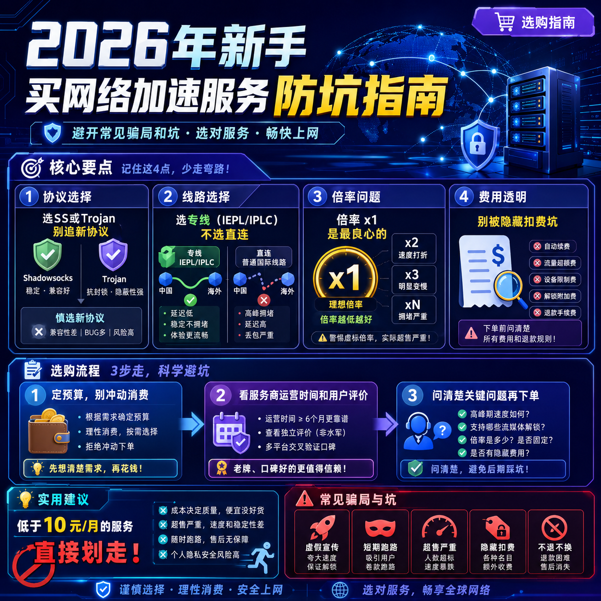

<!--
title: 2026年新手买网络加速服务防坑指南
date: 2026-06-02
type: buying_guide
week: 1
style: 分享式：以一个过来人的身份分享选购经验
fingerprint: 7164d866d579cba5160a7a8df9e348d6
tags: 选购指南, 对比评测, 新手必看
-->

  
   2026-06-02 · 选购指南, 对比评测, 新手必看

 
# 2026年了，买网络加速服务还踩坑？这篇防坑指南收好

你是不是也这样？刚入手一个网络加速服务，兴冲冲打开YouTube想看4K视频，结果转圈转了3分钟，最后弹出来一个“网络错误”。或者连着打了两局《原神》，每局都掉线一次，队友疯狂发“？”。

别问我怎么知道的——这些坑我都踩过。从2018年开始折腾这玩意儿，买过7、8家服务，累计花了至少3000块，有惊喜也有血泪。今天我就以一个“踩坑老司机”的身份，把新手最容易掉进去的坑一个个扒出来。

先说结论：**2026年的市场，靠谱的服务商不少，但浑水摸鱼的更多。看懂这篇文章，至少帮你省下200块试错钱。**

---

## 一、先搞懂这3个核心概念，才不会被销售话术忽悠

新手最容易犯的错：**看价格下单**。看到9.9元/月100G，觉得“真香”，结果买回来根本用不了。为什么？因为你没搞懂三个关键东西。

### 1️⃣ 协议是什么？别被“高级协议”骗了

市面上主流就两个协议：**Shadowsocks（SS）** 和 **Trojan**。还有V2Ray、Vless这些变种。

- **SS**：最老牌，兼容性最好，几乎所有客户端都支持
- **Trojan**：稍微新一点，速度理论上更快
- **Vless**：2025-2026年流行起来的新协议，但客户端支持还不全

**我的经验**：普通用户不用纠结协议。我去年为了尝鲜买了个只支持Vless的服务，结果iPhone上用Surge死活连不上，折腾了一下午。**选客户端支持最广的SS或Trojan就行，别给自己找麻烦。**

### 2️⃣ 线路才是决定速度的关键

线路分三种，重要性排序：**专线 > 隧道中转 > 直连**

| 线路类型 | 速度表现 | 稳定性 | 价格 |
|---------|---------|-------|-----|
| IPLC/IEPL全专线 | ⭐⭐⭐⭐⭐ | ⭐⭐⭐⭐⭐ | 中高 |
| 公网隧道中转 | ⭐⭐⭐⭐ | ⭐⭐⭐⭐ | 中 |
| 直连（无优化） | ⭐⭐ | ⭐⭐ | 低 |

**真实案例**：我哥们儿花40块买了个“100G月付套餐”，看着便宜。结果用的是直连线路，晚上8点-11点高峰期，YouTube只能看720P，还经常卡。后来换了个25块的专线服务，速度直接翻倍。

**别信商家说“高速线路”这种模糊词**，直接问清楚是哪种线路。写在页面上的才算数。

### 3️⃣ 倍率是个隐形坑

很多新手不知道“倍率”是什么意思。简单说：**倍率x2的接入点，你用1GB流量，它给你扣2GB**。

为什么要设倍率？因为有些专线带宽贵，商家怕亏本，就用倍率控制成本。

**我踩过的坑**：之前用某个服务，宣传页写“100G/月”，但我用了两周就剩30G了。后来才发现，它家香港专线接入点倍率是1.5，日本接入点是2.0，我天天挂着日本接入点看Netflix，流量消耗直接翻倍。

**怎么避坑**：选页面明确标注“所有接入点倍率x1”的服务。目前我见过比较良心的是**[万达云](https://api.huanghaiwan.com/go/万达云)**，所有接入点都是x1，没有隐藏扣费。

---

## 二、这4种“坑”，新手见了躲远点

### 🕳️ 坑1：打着“永久免费”旗号的

2026年了，还有人信“永久免费”这个鬼话？网费、服务器费、带宽费谁出？用脚趾头想想。

**真相**：
- 要么是用你的设备挖矿（后台跑脚本）
- 要么是收集你的数据卖钱
- 要么是免费1个月，然后跑路

**我见过的真实案例**：2025年有个叫“极速云”的服务，宣传“注册送200G，永久免费”。我朋友贪便宜注册了，用了3天速度贼快，第4天直接打不开，官网都没了。后来在群里看到有人说，它家服务器被端了。

**我的建议**：**免费的东西最贵**。真想省钱，找10-20元/月的入门级专线服务，比如[贝贝云](https://api.huanghaiwan.com/go/贝贝云)11.9元/月100G，或万达云13.9元/月150G，比免费靠谱一万倍。

### 🕳️ 坑2：价格低得离谱的

看到3元/月100G的，别激动。我问你：100G流量，按现在市场价，光服务器带宽成本都要5-8元，3元怎么赚？

**大概率是**：
- 超卖严重（一个接入点挤1000个用户）
- 线路极差（直连，甚至用公益接入点）
- 随时跑路

**对比一下真实成本**：2026年，一个正常能用的服务，最低也要10-15元/月。低于10元的，我劝你直接划走。

### 🕳️ 坑3：宣传“全球接入点1000+”

这个太经典了。打开页面一看，“香港、日本、新加坡、美国、韩国、英国、德国……共1000+接入点”。

**真相**：很多接入点是凑数的。我买过一个号称“500接入点”的服务，实际打开列表，同一个地区有8个接入点，每个接入点IP还一样。**真实有效的接入点，一般30-80个就很多了**。

**怎么看**：点开接入点列表，看看是不是每个接入点都有不同的IP和服务器编号。比如“香港01”“香港02”“香港03”，这种才是有独立服务器的。

### 🕳️ 坑4：没有试用或退款政策

**这是最大的雷**。商家连7天试用或24小时退款都不敢给，说明什么？说明他对自己的服务没信心。

**我的原则**：**坚决不买任何不支持试用/退款的服务**。再便宜也不买。

目前我见过比较良心的政策：
- **[自由猫](https://api.huanghaiwan.com/go/自由猫)**：月付可随时退款（按天计算）
- **万达云**：有客服在线，说不满意可以协商退款

> 注意：那些写“因虚拟商品，购买后不支持退款”的，直接拉黑。

---

## 三、2026年，怎么挑到靠谱的服务？

### Step 1：定预算，别冲动

先想清楚你一个月能用多少流量。

| 使用场景 | 月流量需求 | 建议预算 |
|---------|----------|---------|
| 偶尔刷Twitter/查资料 | 30-50G | 10-20元 |
| 每天看YouTube 1080P/打游戏 | 100-200G | 20-40元 |
| 重度使用/看Netflix 4K | 300-500G | 40-80元 |

**别一上来就买大套餐**。我第一次买就上了300G的课，结果一个月只用60G。先从小套餐试起，确认好用再升级。

### Step 2：看服务商“后台”，不是看“前台”

前台指的是官网页面——谁都会做花里胡哨的页面。**后台才是真相**。

- **检查运营时间**：在“关于我们”或网站底部，一般有服务上线时间。运营3年以上的，基本靠谱。比如**一支红杏**（10年老牌）、**[大哥云](https://api.huanghaiwan.com/go/大哥云)**（5年+）
- **看用户群**：加他们的Telegram群或QQ群，看看用户反馈。如果群里全是吐槽没人回，赶紧跑
- **查接入点列表**：有几条线路？是不是每个地区都有独立接入点？接入点数量30-80个比较正常

### Step 3：问清楚这三个问题

在下单前，去客服那里问三件事：

1. **高峰期（晚8-11点）速度怎么样？** 如果客服支支吾吾，大概率不行
2. **能不能解锁Netflix/Disney+？** 不是所有服务都能解锁流媒体
3. **倍率是多少？** 问清楚每个接入点的倍率，有没有x1的套餐

### Step 4：先月付，别年付

**这是我花500块钱买来的教训**。

年付确实便宜（通常打8折），但风险也高。服务商随时可能跑路。我2023年一次性年付了某服务（288元），用了4个月就跑路了，血亏。

**建议**：先用2-3个月月付，确认稳定了再考虑季付或半年付。年付只推荐给运营超过5年的老牌服务商。

---

## 四、我目前在用的，以及为什么选它

说这么多，肯定有人问：“你说了这么多避坑的，那你自己用哪家？”

我现在主力用**自由猫**，备用**[悠兔](https://api.huanghaiwan.com/go/悠兔)**。

**为什么选自由猫？**
- 用了3个月，高峰期YouTube 4K无压力
- 所有接入点倍率x1，没隐藏消费
- 支持按月退款
- 100+接入点，香港/日本/新加坡/美国都有

**为什么留悠兔当备用？**
- IEPL专线+家宽混用，家宽接入点适合看流媒体
- 香港接入点延迟23ms，打《原神》很稳
- 价格中高端（29元/月150G），但物有所值

当然，这只是我的个人体验。每个人网络环境不同，你所在地的运营商（电信/联通/移动）对不同的服务效果也不同。**所以我说了，一定要先试用**。

---

## 五、最后的避坑清单（保存下来用）

| 维度 | 该怎么做 | 该避的坑 |
|------|---------|---------|
| 价格 | 10-20元入门，别贪便宜 | 低于10元的，免费的直接Pass |
| 线路 | 选专线（IEPL/IPLC） | 直连线路不买 |
| 倍率 | 选x1无倍率 | 倍率x1.5以上的慎选 |
| 退款 | 必须有试用/退款政策 | “不支持退款”的直接划走 |
| 运营时间 | 选运行2年以上的 | 新上线服务先观察3个月 |
| 付费周期 | 先月付2-3个月 | 不要一上来就年付 |

---

**说在最后**：买网络加速服务，本质是买“稳定和放心”。省那十几块钱，换来的是每天掉线、卡顿的糟心体验，真的不值得。

我踩过这么多坑，现在学会了一个道理：**选服务，先看它“敢不敢让你试用”，再看它“能不能稳定跑3个月”**。能做到这两点的，大概率靠谱。

**你的第一个服务怎么选？**
- 预算10-20元/月：看看**贝贝云**（11.9元/月100G）或**万达云**（13.9元/月150G）
- 预算20-40元/月：试试**自由猫**（20元/月120G）或**悠兔**（29元/月150G）
- 预算充足+追求稳定：**[肥猫云](https://api.huanghaiwan.com/go/肥猫云)**（40元/月300G）或**[龙猫云](https://api.huanghaiwan.com/go/龙猫云)**（15元/月基础套餐）

收藏这篇文章吧，买服务之前翻出来看看，至少能帮你省下200块试错费。

最后问一句：**你第一个网络加速服务，花了多少钱？踩了什么坑？** 评论区分享出来，让大家一起避雷。

<!-- article-data
key_points: 协议选SS或Trojan，别追新协议|线路选专线（IEPL/IPLC），不选直连|倍率x1是最良心的，别被隐藏扣费坑|必须选有试用或退款政策的服务|先月付2-3个月，别一上来就年付
steps: 定预算，别冲动消费|看服务商运营时间和用户评价|问清楚高峰期速度、流媒体解锁和倍率|先月付试用1-2个月再决定是否续费
tips: 低于10元/月的服务直接划走|年付只推荐给运营超过5年的老牌服务商|免费服务100%有坑（挖矿/跑路/数据泄露）|检查接入点列表，30-80个正常，1000+是吹牛|收藏本文，下单前翻出来看一遍
summary_items: 协议选SS或Trojan，不追新规避不兼容风险|专线>隧道中转>直连，钱花在线路上最值|倍率x1最良心，自己算清楚实际流量|必须试用，不支持退款的直接划走|先月付后季付，别一次性年付|高峰期速度是试金石，晚上8-11点测试最准
-->