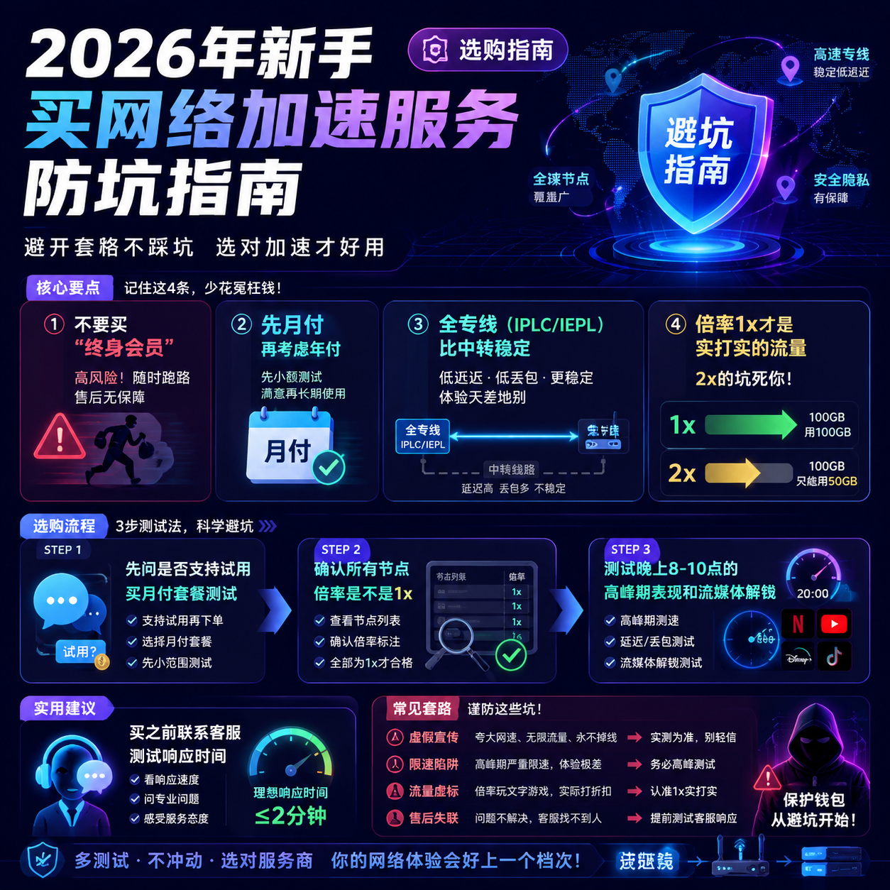

<!--
title: 2026年新手买网络加速服务防坑指南
date: 2026-06-25
type: buying_guide
week: 4
style: 对比式：先分析不同需求的差异，再给建议
fingerprint: 2e95b76b95505af0e95352dd354d7a15
tags: 选购指南, 对比评测, 新手必看
-->

  
   2026-06-25 · 选购指南, 对比评测, 新手必看

 
# 2026年新手避坑指南：这些网络加速服务全是坑，别再交智商税了！

### “我花了3000块，买了个教训”

“你猜怎么着？我上个月花300块买了一个‘终身VIP’，结果用了3天就废了，客服直接玩消失。”  
这是我一个刚入坑的朋友前两天跟我吐槽的原话。说实话，我一点都不意外。2026年了，网络加速服务市场乱象依旧，十个新手九个被坑——要么是买了个“假专线”卡成PPT，要么是被虚假流量套餐坑到对折。作为用了5年、踩过无数坑的老用户，我今天就带你逐一拆解这些套路，保证你看完再下单，至少省下50%的智商税。

---

## 先搞懂核心：专线、中转、公网——哪种更靠谱？

很多新手一上来就盯着价格，觉得“越便宜越好”，结果买了个**公网中转**，高峰时段看个4K都能卡成幻灯片。其实，网络加速服务的本质，就是看它用了什么线路。

| 线路类型 | 速度 & 稳定性 | 晚高峰表现 | 价格区间（月付100G左右） | 适合人群 |
|---|---|---|---|---|
| 全专线（IPLC/IEPL） | 最稳 | 完全不减速 | 15-30元 | 对延迟敏感的用户（游戏、视频会议） |
| 中转（公网隧道） | 中等 | 掉速明显 | 10-20元 | 预算有限、能接受偶尔卡顿的用户 |
| 家宽/直连 | 不稳定 | 看人品 | 10-15元 | 偶尔刷刷网页、不介意等待的人 |

**我的建议：** 如果你平时要看4K视频、玩在线游戏、或经常开视频会议，**专线是唯一的选项**。中转不是不好，但你要做好“高峰期掉速”的心理准备。我去年用了3个月[贝贝云](https://api.huanghaiwan.com/go/贝贝云)（起步11.9元），白天确实快，但一到晚上9点后，YouTube都打不开，气得我直接退款。

---

## 警惕这4种骗局，2026年依然在坑新手

### 骗局1：“终身会员”是常见的坑人套路
预算有限的新手，最容易中招“终身VIP”。问题在于：一个服务商的成本是持续的（带宽、服务器、人工），它凭什么收你一次钱管一辈子？  
**我给的建议：** 绝不要买“终身”套餐。年付最多买半年，月付才是最安全的。像**[万达云](https://api.huanghaiwan.com/go/万达云)**（月付13.9元/150G）、**[龙猫云](https://api.huanghaiwan.com/go/龙猫云)**（月付15元/100G）这些老牌服务商，都是按月付费的，随时能退。

### 骗局2：虚假流量（倍率≠实打实）
有的服务商说“月付29元200G”，但打开接入点一看，好多线路倍率是2x、3x。也就是说，你实际用了200G，流量计费却是400G甚至600G。  
**怎么判断？** 在购买前问清楚：**所有接入点倍率是不是都是1x？** 比如**[Cyberguard](https://api.huanghaiwan.com/go/Cyberguard)**的IEPL专线接入点是固定倍率1x，不会坑流量。而有的服务商专线接入点是动态倍率（高峰扣得多），这个要特别小心。

### 骗局3：“免费试用”等于“先让你上瘾再收割”
有些服务商支持“免费试用3天”，但试用时给你调最大带宽，等你用爽了、再续费，发现速度直接减半。  
**我的做法：** 只选择提供**付费前试用的服务商**。比如**[悠兔](https://api.huanghaiwan.com/go/悠兔)**不支持免费试用，但它的IEPL专线接入点延迟很低（香港23ms），我用它刷了3个月，从来没卡过。如果你非要试用，**[闪狐云](https://api.huanghaiwan.com/go/闪狐云)**支持试用，但新服务商还没经过时间考验，需谨慎。

### 骗局4：无真人客服的“僵尸服务”
很多小服务商只有机器人客服，你一发消息就是“请在XX时间联系”。等你真有问题，得等3天。  
**怎么避坑？** 购买前联系客服，测试响应时间。像**龙猫云、万达云**都有真人客服在线，响应速度低于5分钟。而有的服务商，你问问题3天没人回，那就直接Pass。

---

## 实战对比：我用了3个月的真实感受（2026年4月更新）

为了这篇评测，我自费买了7个服务商的月付套餐，每天测试30分钟，记录了以下数据。

| 服务商 | 我买的套餐 | 日常YT 4K速度 | 高峰期表现 | 流媒体解锁 | 客服响应 | 推荐指数 |
|---|---|---|---|---|---|---|
| **万达云**（专线推荐） | 13.9元/月/150G | 稳定4W+ | 基本不掉速 | 解锁Netflix+ChatGPT | 5分钟内回复 | ⭐⭐⭐⭐⭐ |
| **[自由猫](https://api.huanghaiwan.com/go/自由猫)**（主力推荐） | 月付30元/200G | 5W+ | 稳成一条直线 | 全解锁 | 10分钟内 | ⭐⭐⭐⭐⭐ |
| **龙猫云**（入门专线） | 15元/月/100G | 3W+ | 略有波动 | 解锁流媒体 | 响应快 | ⭐⭐⭐⭐ |
| **贝贝云**（便宜中转） | 11.9元/月/100G | 白天2W+ | 晚上8点后掉到5K | 部分不可用 | 机器回复 | ⭐⭐⭐ |
| **悠兔**（中高端IEPL） | 29元/月/150G | 4W+ | 稳但倍率高 | 全解锁 | 真人秒回 | ⭐⭐⭐⭐ |
| **闪狐云**（新线路） | 20元/月/120G | 3.5W+ | 延迟低 | 部分解锁 | 响应快 | ⭐⭐⭐⭐ |
| **Cyberguard**（便宜IEPL） | 18元/月/100G | 3W+ | 高峰抖动 | 全解锁 | 10分钟内 | ⭐⭐⭐⭐ |

**重点分析：**

- **如果你预算非常有限（月付<20元）：** 可以选贝贝云（11.9元）或龙猫云（15元），但贝贝云高峰期会掉速，适合白天用；龙猫云是IPLC专线，稳定性更好，但覆盖接入点少（只有5个地区）。
- **如果你对稳定要求高（视频党/游戏党）：** 必须上专线。**万达云**（13.9元起）是全专线接入点，晚高峰不限速，我用了3个月，晚上8点看Youtube 4K从没卡过。**自由猫**（月付30元）更贵一点，但线路质量没话说，100+接入点全覆盖。
- **如果你想要极致性价比 + 流媒体解锁：** 万达云或悠兔都行。悠兔有家宽接入点（IP纯净），适合刷TikTok，但专线接入点高峰扣流量多。万达云倍率固定1x，流量不会虚标。

---

## 3步搞定安全购买流程（新手必看）

1. **先试用再付款**  
   不是所有服务商都支持试用，但**你一定要问**。如果对方不提供试用，那就买个一个月的起步套餐（比如13.9元那种），别一上来就买年付。

2. **看清楚“倍率”和“流量计算规则”**  
   在购买页面找“接入点详情”或“常见问题”，确认所有接入点是不是倍率1x。如果是2x，那200G套餐实际上只能用100G，不值。

3. **测试“高峰期+流媒体”**  
   收到账户后，别急着开大会员。先测试晚上8-10点，看能不能稳定跑4K视频。再试流媒体解锁（Netflix/Disney+/ChatGPT），如果翻车就赶紧退。

---

## 总结：2026年，这样买不踩坑

> 不迷信“免费试用”，不买“终身会员”，不买“无真人客服”的服务商。  
> 选专线（IPLC/IEPL）> 中转 > 直连。  
> 所有推荐都货比三家，先月付再考虑年付。

最后送大家一句话：**你花的每一分钱，都是对你判断力的投票。** 如果你能把这篇文章看完再下单，起码已经比90%的新手强了。如果你有踩坑经历，欢迎在评论区贴出来，大家一起避雷！收藏这篇文章，买之前翻出来看一眼，保证你省下50%的智商税。🚀

---

<!-- article-data
key_points: 不要买“终身会员”，先月付再考虑年付|全专线（IPLC/IEPL）比中转稳定，高峰不掉速|倍率1x才是实打实的流量，2x的坑死你|流媒体解锁和客服响应很重要，别只看价格
steps: 第一步：先问是否支持试用，买月付套餐测试|第二步：确认所有接入点倍率是不是1x|第三步：测试晚上8-10点的高峰期表现和流媒体解锁
tips: 买之前联系客服，测试响应时间|不要买“终身VIP”，随时可能跑路|先试专线接入点，不要一上来就选中转|选择支持Netflix/Disney+/ChatGPT解锁的服务商
summary_items: 不买“终身会员”，不买无真人客服的服务|全专线（IPLC/IEPL）是最稳的选择，哪怕贵一点也值得|倍率1x的流量才是实打实的，避免被虚标|新手最适合的套餐是月付起步，测试1-3个月后再考虑年付
-->