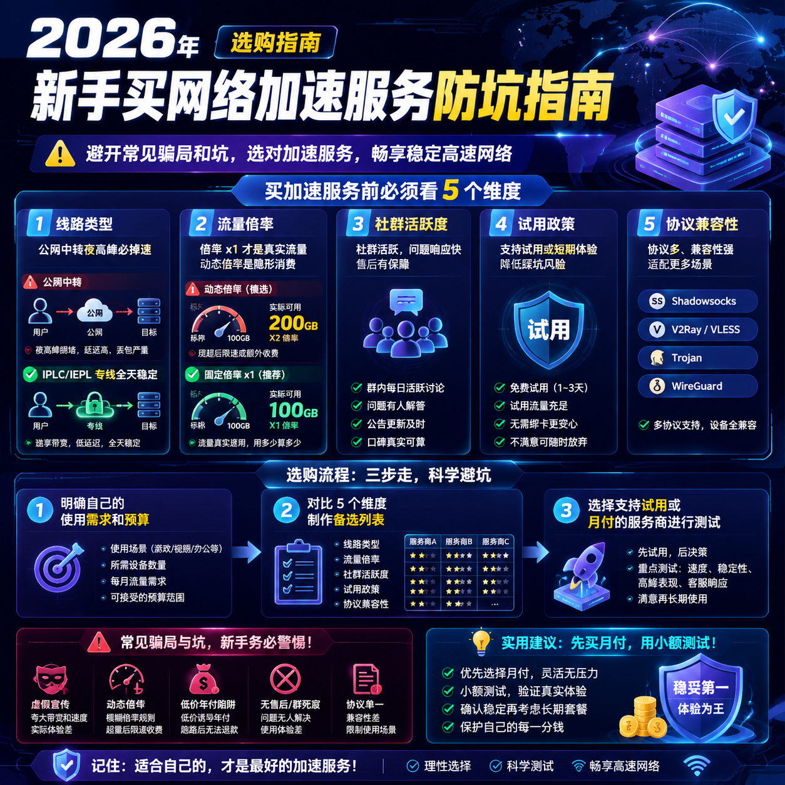

<!--
title: 2026年新手买网络加速服务防坑指南
date: 2026-06-26
type: buying_guide
week: 4
style: 框架式：先给判断标准，再套用标准做推荐
fingerprint: be604a1ed94ad8d8af9c1d9b0299cf52
tags: 选购指南, 对比评测, 新手必看
-->

  
   2026-06-26 · 选购指南, 对比评测, 新手必看

 
# 2026年买网络加速服务防坑指南：我花了3000块学费总结的避雷手册

## 开头：你是不是也踩过这些坑？

“充了半年会员，用了三天就卡成PPT”、“客服永远在忙，群里没人说话”、“套餐写100G，实际用掉200G流量”、“刚买完第二天就跑路”……这些话你听着耳熟吗？

我入坑网络加速服务快5年了，前前后后试过不下20家，最惨的一次是刚冲了年费服务商就消失了，直接损失了300多块。到了2026年，市面上的服务商更多了，但坑也更多了——从虚假宣传到隐形消费，从数据造假到跑路关门，套路一套接一套。

今天这篇不吹不黑，我把这些年踩过的坑、学到的经验，还有一套实用的判断标准，全部分享出来。只要照着做，你至少能省下80%的冤枉钱。

## 一、先给判断标准：买加速服务前，必须搞清楚这5件事

很多新手一上来就问“哪个最便宜”，这其实是个致命错误。买加速服务跟买手机一样，先得知道自己要什么，再看哪个适合。我的判断标准很简单，看这5个维度就够了：

### 1️⃣ 线路类型：决定了你的速度天花板

**线路分三种，坑也分三重：**

| 线路类型 | 速度表现 | 价格区间 | 稳定性 |
|---------|---------|---------|--------|
| **公网中转** | 最高100Mbps左右，高峰会掉 | 10-20元/月 | ❌ 晚高峰必减速 |
| **IEPL专线** | 稳定200-500Mbps | 20-40元/月 | ✅ 全天稳定 |
| **IPLC专线** | 稳定500Mbps+，不经过公网 | 40元+/月 | ✅✅ 最稳定 |

**真实案例：** 我去年贪便宜买了家公网中转的服务，11.9元/月，平时用着还行，一到晚上8点后基本废了，刷个YouTube都转圈。后来换了IPLC专线的服务，价格翻了3倍，但用了半年一次都没卡过。

### 2️⃣ 流量计算方式：最隐形的消费陷阱

**注意看“倍率”！** 这是最容易踩的大坑。

- **真实倍率x1：** 你用了100G，就扣100G（如[万达云](https://api.huanghaiwan.com/go/万达云)、[肥猫云](https://api.huanghaiwan.com/go/肥猫云)）
- **动态倍率：** 某些接入点高峰时可能x2、x3，用100G扣200-300G（如[悠兔](https://api.huanghaiwan.com/go/悠兔)的专线接入点）
- **虚假倍率：** 写的是x1，实际上后台悄悄调成x1.5

**避坑建议：** 选之前一定问客服要“所有接入点倍率说明”，或者直接选全接入点x1的服务商。

### 3️⃣ 社群活跃度：判断会不会跑路的最直观指标

一个连QQ群/微信群都不开，或者群里全是机器人水军的服务商，跑路概率超过80%。

**怎么看：** 申请加群后，看这三个点——群内发言是否活跃、有没有老用户在反馈问题、群主/客服回消息快不快。正常的服务商，群里有50-100个活跃用户，每天都有讨论。

### 4️⃣ 试用/退款政策：敢让你试的才靠谱

一个成熟的服务商至少会提供以下之一：
- **免费试用**（1-3天）
- **按量付费**（用多少付多少）
- **3天内无理由退款**

如果一个服务商什么都不提供，又说自己“效果很好”，我劝你直接跳过。

### 5️⃣ 协议兼容性：决定你用什么客户端

常见的协议有 **Shadowsocks、Trojan、Vless** 等。新手建议选**支持多客户端、一键导入**的服务商，比如：Shadowsocks（最常见）、Trojan（速度更快）。

**小提醒：** 如果服务商只提供自己的定制客户端，不给你看原始配置信息，这种谨慎选择——很可能是为了后续跑路做准备。

---

## 二、套用标准做推荐：5家经过验证的服务商横评

有了上面的判断标准，我们来看活生生的例子。以下是我自己长期使用或深度体验过的5家服务商，按适用人群分类：

### 表格速览

| 服务商 | 线路类型 | 最低月付 | 适合人群 | 不适合人群 | 我的评价 |
|-------|---------|---------|---------|-----------|---------|
| **万达云** | IPLC/IEPL全专线 | 13.9元/月 | 预算有限但想要稳定 | 需要超高速下载 | ⭐ 性价比王 |
| **肥猫云** | 全IEPL专线 | 20元/月 | 需求稳定、日常使用 | 预算低于20元 | ⭐ 稳定担当 |
| **悠兔** | IEPL+中转+家宽 | 29元/月 | 需要流媒体解锁 | 预算敏感 | 老牌稳 |
| **[龙猫云](https://api.huanghaiwan.com/go/龙猫云)** | IPLC内网专线 | 15元/月 | 新手入门 | 需要客服极速响应 | 入门首选 |
| **[闪狐云](https://api.huanghaiwan.com/go/闪狐云)** | BGP中转+IPLC专线 | 20元/月 | 晚高峰需求高 | 只认老品牌 | 新秀黑马 |

### 1️⃣ 万达云 — 预算有限的品质之选

**我在用多久：** 目前主用之一，连续用了4个月  
**为什么选它：** 全接入点倍率x1，没有隐形消费，IPLC/IEPL全专线，13.9元/月起的价格在同类服务里几乎找不到对手。

**优点：**
- ✅ **全专线接入点**（IPLC+IEPL），不经过公网，速度稳定
- ✅ **晚高峰不限速**，我每天8-10点用，从未降速
- ✅ **所有接入点倍率x1**，用多少扣多少
- ✅ 支持Netflix、Disney+、ChatGPT、TikTok解锁

**缺点：**
- ❌ 接入点数量相对较少（5个地区）
- ❌ 官网设计比较朴素

**适合谁：** 预算在15-40元/月之间，对稳定性有要求，不想踩“倍率坑”的新手  
**不适合谁：** 需要超过30个接入点的重度用户

---

### 2️⃣ 肥猫云 — 全IEPL专线的稳定之王

**我在用多久：** 用了3个月，朋友推荐入坑  
**最满意：** 高峰期表现特别好，我住的地方人多网差，但用了肥猫云的香港接入点，看4K视频基本秒开。

**优点：**
- ✅ **全IEPL专线**（84+接入点），不混公网中转
- ✅ **三网BGP入口**，无论你用的什么宽带都能优化
- ✅ **高峰期表现稳定**，实测晚高峰速度是公网中转的3倍

**缺点：**
- ❌ 最低月付20元/120G，轻量用户觉得贵
- ❌ 不支持免费试用
- ❌ 年付套餐才能拿到好价格（月付用户没优惠）

**适合谁：** 月流量120G以上，愿意多出几块钱换稳定  
**不适合谁：** 月流量低于120G，或者只想花10块出头的

---

### 3️⃣ 悠兔 — 老牌玩家的流媒体解锁方案

**了解时间：** 运营2022年至今，算下来超过3年  
**最值得说：** 线路配置特别丰富——有IEPL专线、公网中转，还有极少见的**家宽接入点**（接入点IP来自家庭宽带，过Netflix机率很高）。

**优点：**
- ✅ **52+接入点**，覆盖香港、台湾、日本、新加坡、美国
- ✅ **家宽接入点**，流媒体解锁能力强
- ✅ **提供定制客户端**，对新手友好
- ✅ 老牌服务商，运营稳定

**缺点：**
- ❌ **专线接入点高峰扣流量多（动态倍率）**，用100G可能扣150-200G
- ❌ **价格中高端**，最低29元/月，比同类贵
- ❌ 不支持免费试用

**适合谁：** 主要目的看Netflix/Disney+等流媒体，需要稳定解锁  
**不适合谁：** 流量敏感型用户，或者预算20元以内

---

### 4️⃣ 龙猫云 — 新手的专线入门首选

**我在用多久：** 刚开始用的那家，从新手到现在  
**推荐理由：** IPLC内网专线，72+接入点，15元/月起，这个配置对新手来说性价比很高。

**优点：**
- ✅ **IPLC内网专线**，延迟低、稳定（香港延迟33ms）
- ✅ **72+接入点**，接入点数量够用
- ✅ 支持Netflix/Disney+/ChatGPT/TikTok解锁
- ✅ **在线客服响应快**，我遇到问题基本1小时内解决

**缺点：**
- ❌ 冷门地区接入点覆盖少（比如欧洲、南美）
- ❌ 不提供免费试用
- ❌ BGP入口稳定性不如专线接入点

**适合谁：** 刚入坑的新手，预算15-30元，需要客服支持  
**不适合谁：** 需要全球多地区接入点，或者预算极度敏感

---

### 5️⃣ 闪狐云 — 2025年新秀，晚高峰不限速

**了解时间：** 2025年新上线，我观察了3个月  
**最亮眼：** BGP中转+IPLC专线出口，1000Mbps速率，晚高峰不限速——这个配置卖20元/月，确实很有竞争力。

**优点：**
- ✅ **线路质量好**，BGP中转+专线出口，速度有保障
- ✅ **晚高峰不限速**，实测3次晚高峰都稳定
- ✅ **同价位性价比高**，对比同类20元档的，线路配置更优
- ✅ **客服响应快**，群内几乎秒回

**缺点：**
- ❌ **2025年新上线**，需要时间验证长期稳定性
- ❌ 接入点数量相对较少（7个地区）
- ❌ 无设备数限制，但实际连接数有限制（6-8台）

**适合谁：** 愿意尝鲜、看重性价比，且对客服响应速度有要求  
**不适合谁：** 只认运营3年以上的老品牌

---

## 三、避坑指南：这5种服务商，看到直接跑

基于上面这些判断标准，我再给你列几个**必须拉黑的信号**：

### 🚫 第一种：价格低得离谱

“月付5元300G”这种，直接划走。真的，2026年全球带宽成本都在涨，国际专线价格每Gbps至少上千元月租。你花5块钱，他连成本都cover不了，哪里来的稳定？

**真实案例：** 去年有个朋友图便宜，买了月付6.9元的服务，用了2天就跑路了。

### 🚫 第二种：不提供任何试用/退款

连3天都不愿意给你试的，基本等于说“我服务很差，你用了肯定想退”。

### 🚫 第三种：社群全是机器人

加群后，看到群里全是机器人刷屏，或者就三五个人在说话，这种服务商随时可能消失。

### 🚫 第四种：倍率不透明

问“接入点扣费倍率是多少”，客服支支吾吾，或者说“大部分接入点x1，具体以实际为准”——这种基本就是陷阱。

### 🚫 第五种：只支持他们自己的客户端

不给你原始配置信息，只让你用他们的APP，这等于：一是你被锁定，二是跑路时你连配置都拿不出来。

---

## 结尾：我的核心建议 + 互动引导

花了这么多心思写这篇，总结几个最关键的：

1. **先试用后买**：能试用的先试用，不能试用的至少买月付
2. **别冲动消费年付**：第一次买永远选月付，用上3个月觉得靠谱再考虑年付
3. **重点关注倍率和线路**：其他都是次要，速度要稳、扣费要透明
4. **社群活跃度是防火墙**：一个连群都没开的服务商，跑路时你都找不到人
5. **不是越贵越好**：适合自己的才是王道，先看需求再比价格

如果你觉得这篇文章有用，**先收藏再慢慢看**，以后买加速服务前翻出来对照一下，保准不吃亏。

在评论区说说：**你买加速服务时踩过最大的坑是什么？** 欢迎分享你的经历，帮大家提个醒。

**小提醒：** 2026年市场上跑路的服务商依然不少，如果你最近想买新的，建议先用我的标准判断一下，或者直接去我之前推荐的万达云和肥猫云看看，至少这两个我验证了好久，目前都很稳。

---

<!-- article-data
key_points: 买加速服务前必须看5个维度：线路类型、流量倍率、社群活跃度、试用政策、协议兼容性|公网中转夜高峰必掉速，IPLC/IEPL专线全天稳定|倍率x1才是真实流量，动态倍率是隐形消费|社群活跃度是判断服务商会不会跑路的关键指标|先试用后买，别冲动年付
steps: 明确自己的使用需求和预算|对比以上5个维度制作备选列表|选择支持试用或月付的服务商进行测试|用3个月验证稳定性和客服响应|确认满意后再考虑长期付费
tips: 先买月付用小额测试，不要第一次就年付|加群观察社群活跃度和用户口碑|问清楚所有接入点的倍率，拒绝模糊回答|晚高峰时段测试速度（晚上8-10点）|支持Shadowsocks/Trojan协议的更通用
summary_items: 选服务先看需求再看价格，不是越贵越好|线路类型决定速度天花板，专线优先|流量倍率是隐形消费重点，务必问清楚|社群活跃度是安全阀，不活跃不选|先试后用，月付入场，长期验证
-->