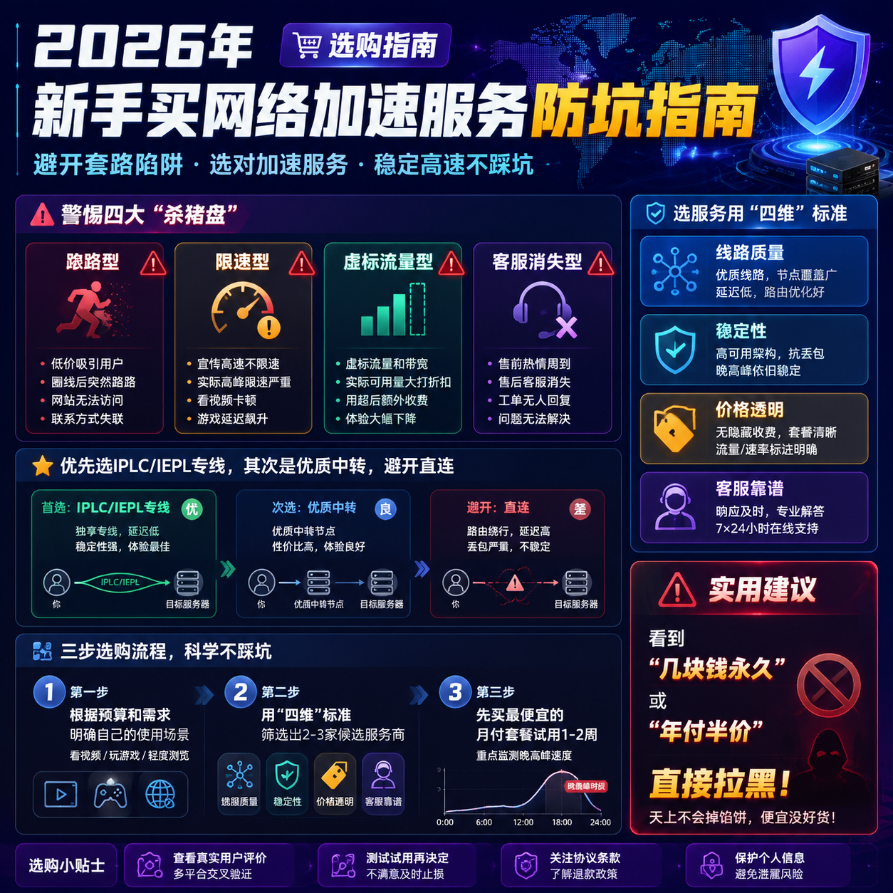

<!--
title: 2026年新手买网络加速服务防坑指南
date: 2026-06-28
type: buying_guide
week: 4
style: 框架式：先给判断标准，再套用标准做推荐
fingerprint: 7d396e455f61036501623153f707f4bb
tags: 选购指南, 对比评测, 新手必看
-->

  
   2026-06-28 · 选购指南, 对比评测, 新手必看

 
好的，没问题！这篇选购指南，我们就来聊聊怎么避开那些坑，把钱花在刀刃上。

---

# 2026新手买网络加速服务防坑指南：别再当韭菜了！

“兄弟，我刚买了一个月的‘高速专线’，结果用了三天就卡成PPT，客服还联系不上...太坑了！”

是不是感觉这句话特别熟悉？或者说，你正在经历？作为一个每天都要访问国际网络的重度用户，我太懂这种花了钱还买罪受的感觉了。2026年了，市面上的网络加速服务（我们俗称“网络服务商”或“服务商”）多如牛毛，价格从几块到上百块不等，陷阱也是层出不穷。

今天这篇文章，我就以一个“老韭菜”的身份，把我和我的朋友们踩过的所有坑，全部摊开给你看。**我们先讲避坑标准，再给你精准推荐，让你看完就知道怎么选，保证不花一分冤枉钱。**

## 避坑第一步：先搞清楚这几大“杀猪盘”

在选择服务之前，你得先知道市面上最常见的“坑”长什么样。我总结了四个，你务必记好：

### 陷阱一：极速“跑路型”服务商
这是最恶心的一种。价格低得离谱（比如几块钱一个月，流量还几百G），你刚充值，用了好几天都挺稳，然后突然某天接入点全挂了，网站也打不开了，客服更是人间蒸发。我一朋友去年就碰上一个，充了60块的年费，用了两周就凉凉，血本无归。

**判断标准：** 看到那种价格低于市场均价很多，而且不支持月付只强制年付的，心里就得拉响一级警报。正经服务商最差也让你月月付，因为跑路成本高。

### 陷阱二：“限速+负载”唱双簧的伪专线
很多服务商号称“全专线”、“无限速”，结果一到晚上七八点，或者你下载个大文件，速度立马跌到几百KB/s。这种就是典型的**接入点负载严重超标**，一个接入点可能塞了几百甚至上千个用户，线路再好也白搭。

**判断标准：** **务必要找承诺“晚高峰不限速”的服务商**。同时，看看他们的套餐有没有“倍率”坑。比如，有的接入点虽然不限速，但用1GB流量扣你3GB的余额，这就是变相抬价。点开套餐详情，明确写着**所有接入点倍率x1**的，才是真良心。

### 陷阱三：流量虚标“数字游戏”
你买的是100G流量，结果用了不到一半，客户端就提示用完了。这就是流量统计不准确，或者直接“偷流量”。这种情况在那些看起来便宜但没什么名气的小作坊里很常见。

**判断标准：** 找**有长期运营记录、口碑好、支持提供流量示例截图**的服务商。或者，你先买最小套餐试试水，自己心里有个底。一般像主流服务商，流量统计都比较靠谱。

### 陷阱四：客服“消失术”
出了问题，发工单没人回，加QQ群禁言，只能发邮件但几天没动静。这种服务商你拿他一点办法都没有。

**判断标准：** **好的服务商一定有活跃的在线客服**，最好是**真人客服**，回消息速度快。可以去他们的网站上看看有没有在线聊天入口，或者问问他们群里的活人多不多。如果页面冷清得像鬼城，千万别买。

---

## 避坑第二步：用“金标准”套一套，选出真命天子

好了，知道坑在哪了，我们来看看怎么选。我一般用下面这“四维”标准来评估，你照着套就行，准没错。

| 评估维度 | 最佳标准 | 为什么重要？ |
| :--- | :--- | :--- |
| **线路质量** | **IPLC/IEPL专线** > 中转 > 直连 | 专线延迟低、稳如狗，晚高峰也不掉速。中转便宜，稳定性看服务商能力。直连基本不建议，看脸。 |
| **稳定性** | 晚高峰不限速，接入点负载低 | 你最关键的使用场景（比如晚上看4K视频）都卡，那平时再快也没用。 |
| **价格与配置** | 价格透明，倍率x1，月付灵活 | 别被低价迷惑，算算单价。倍率x1的套餐才是明码标价。月付跑路成本低，不喜欢随时换。 |
| **客服与运营** | 有真人在线客服，运营时间1年以上 | 出了问题有人管，跑路概率小。运营越久，积累的口碑和资源越可靠。 |

**我目前主力在用的是『[自由猫](https://api.huanghaiwan.com/go/自由猫)』和『[万达云](https://api.huanghaiwan.com/go/万达云)』**，用了差不多半年多，基本没出过什么大问题。

*   **自由猫**：用的是**IEPL专线+MPTCP多路复用**技术。简单说，就是后台同时用好几条路给你传数据，所以**晚高峰看4K视频、打游戏都很稳**，延迟基本不跳动。他们的接入点数量也多（100+），覆盖了美日新港等核心区域。**缺点**是价格稍微偏上一点点，但绝对物有所值。**适合**对稳定性和速度有高要求的、常常晚上7点后还要高强度使用的朋友。**不适合**预算非常紧张，一个月就想花10块以内的人。
*   **万达云**：这个如果你追求极致性价比，我强烈建议你看一眼。它家最牛的地方在于**IPLC/IEPL全专线，而且承诺晚高峰不限速，所有接入点倍率都是x1**。这意味着你看到的流量就是用到的流量，没有隐藏消费。它的**基础套餐月付13.9元就有150G流量，还能同时连接5台设备**，对新手和轻度用户来说性价比高到离谱。**缺点**是接入点相对自由猫少一点（但核心地区都有）。**适合**预算有限、追求高性价比、不想在倍率上被坑、喜欢月付灵活的朋友。**不适合**需要大量冷门接入点（比如非洲、南美）的极客用户。

---

## 避坑第三步：我的“闭眼入”推荐清单，照着选就行

根据上面的标准，我再给你推荐几款经过市场和时间考验的，你可以根据自己的需求直接抄作业。

### 1. 极致性价比 & 新手首选：『万达云』
*   **为什么推荐它？** 便宜、透明、稳定。
*   **关键信息**：
    *   **线路**：IPLC/IEPL全专线，1000-2000Mbps大带宽。
    *   **价格**：月付13.9元起（150G流量，5台设备），24元起（300G，10台）。
    *   **优势**：倍率x1无坑，晚高峰不限速，解锁流媒体，真人客服。
    *   **适合人群**：预算有限的学生党、第一次用的新手、追求稳定不折腾的用户。
    *   **不适合人群**：需要极低延迟玩竞技游戏的电竞玩家（虽然它已经很稳了，但专门的电竞线路可能更优）。

### 2. 综合实力派 & 老牌稳定：『[悠兔](https://api.huanghaiwan.com/go/悠兔)』
*   **为什么推荐它？** 线路丰富，运营时间久（2022年至今），老牌子。
*   **关键信息**：
    *   **线路**：IEPL专线 + 公网隧道中转 + 家宽，线路种类齐全。
    *   **价格**：月付29元起（150G，无限设备数）。
    *   **优势**：香港专线延迟极低（23ms左右），流媒体解锁好，适合新手。
    *   **缺点**：**专线接入点高峰期可能扣流量多（动态倍率）**，所以买前要问清楚。价格中高端。
    *   **适合人群**：看重品牌和稳定性，愿意为稳定支付一定溢价，对延迟敏感（比如玩外服游戏）。
    *   **不适合人群**：预算非常紧张，无限设备连接但价格高，更适合家庭/多设备党。

### 3. 技术流 & 多设备党：『[龙猫云](https://api.huanghaiwan.com/go/龙猫云)』
*   **为什么推荐它？** 接入点数量多（72+），IPLC内网专线，稳定性一流。
*   **关键信息**：
    *   **线路**：IPLC内网专线 + BGP入口，线路直达内网。
    *   **价格**：月付15元起（100G，不限设备数）。
    *   **优势**：流媒体解锁表现极好（Netflix、Disney+等），客服响应快，对新手友好。
    *   **缺点**：冷门接入点（如俄罗斯、印度）覆盖较少。
    *   **适合人群**：家里设备多（手机、电脑、电视、路由器都要用），追求专线稳定性和流媒体体验。
    *   **不适合人群**：需要全球冷门接入点的小众需求用户。

---

## 总结一下，不想被坑就这么做：

1.  **绝对不要买低于行业均价很多的年付套餐**，这是跑路重灾区。
2.  **优先选IPLC/IEPL专线，其次是优质中转**，别碰直连。
3.  **牢记“倍率x1”，别被动态倍率坑了流量**。
4.  **先买月付试试水**，稳定用一个月再考虑长期。
5.  **客服响应速度是衡量服务商靠谱度的黄金指标**。

如果你看完还是觉得选择困难，我的建议是：**先入『万达云』的基础款（13.9那个），用一个月试试看**。它便宜、没套路，是新人试错成本最低的选择。如果觉得不够用，再升级也不迟。

好了，这份2026年新手避坑指南就到这里。如果你还有其他问题，或者有自己被坑的经历，欢迎在评论区分享出来！**觉得有用的话，别忘了收藏、转发给你的朋友，别让他们再当韭菜了！**

<!-- article-data
key_points: 警惕四大"杀猪盘"：跑路型、限速型、虚标流量型、客服消失型|选服务用"四维"标准：线路质量、稳定性、价格透明、客服靠谱|优先选IPLC/IEPL专线，其次是优质中转，避开直连|牢记"倍率x1"，别被动态倍率坑了流量|先买月付试水，稳定后再考虑长期
steps: 第一步：根据预算和需求，明确自己的使用场景（看视频/玩游戏/轻度浏览）|第二步：用"四维"标准筛选出2-3家候选服务商|第三步：先买最便宜的月付套餐试用1-2周，重点监测晚高峰速度|第四步：确认服务商客服响应速度，有问题能及时解决|第五步：稳定使用1个月后，再考虑是否购买更贵的套餐
tips: 看到"几块钱永久"或"年付半价"的，直接拉黑|选服务前，先去他们的网站看看是否有公告或历史活动信息|可以问客服要一个测试接入点，看看自己本地网络的延迟和速度|同时关注服务的解锁能力（如Netflix、ChatGPT），看是否满足需求|保存好服务商的官网或备用地址，防止失联
summary_items: 避坑核心：拒绝低价年付，选择线路透明、倍率x1、客服在线的服务|性价比推荐：万达云（全专线、倍率x1、入门价低）|综合实力推荐：悠兔（老牌稳定、线路丰富）|技术流推荐：龙猫云（接入点多、专线、流媒体解锁好）|最终建议：先试用万达云基础款，成本最低，试错风险最小
-->