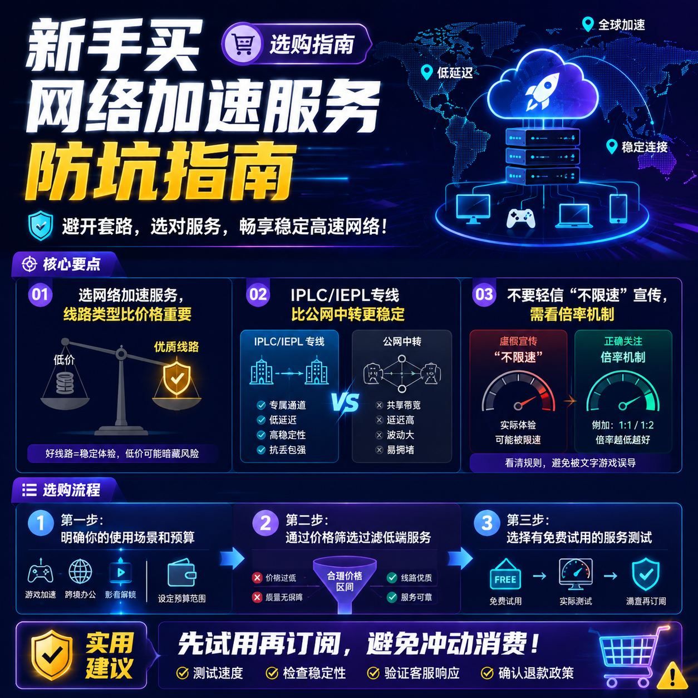

<!--
title: 新手买网络加速服务防坑指南
date: 2026-07-13
type: buying_guide
week: 7
style: 踩坑式：从自己买错的经验出发，教你怎么避坑
fingerprint: d9f107e6bdf46d57ec252c040ba1c4a4
tags: 选购指南, 对比评测, 新手必看
-->

  
   2026-07-13 · 选购指南, 对比评测, 新手必看

 
# 新手买网络加速服务防坑指南：我花了3年踩出来的5个教训

你是不是也遇到过这种情况？买了一个网络加速服务，宣传页上写着"高速稳定、全球接入点"，结果用了三天就慢得像蜗牛爬，客服还找不到人。或者更惨——买了年付套餐，一个月后服务商就跑路了。

我在这个圈子里摸爬滚打了3年多，从2018年第一次入坑到现在，前前后后换过十几个服务商，踩过的坑连起来能绕地球一圈。今天就把这些血泪教训整理出来，帮你省点冤枉钱。

---

## 一、我踩过的第一个坑：廉价的"公网中转"服务

刚入坑那会儿，我第一想法就是——**越便宜越好**。看到月付11.9元、100G流量的套餐，眼睛都直了。心想：这不比那些几十块的香多了？

结果呢？用了3天就废了。原因很简单：**公网中转服务**，说白了就是你在"高速公路"上走，但这条道谁都能上。晚高峰一到，隔壁老王的BT下载、楼下阿姨的抖音、再加上十几个同样在用加速服务的用户——你的带宽直接被挤成渣。

我当时的体验是：白天还行，晚上7点到11点几乎没法用。刷个Instagram都要转圈，YouTube连720p都加载不出来。

**后来我才明白一个道理：选网络加速服务，不光是看价格，还要看线路类型。**

| 线路类型 | 特点 | 适合人群 | 缺点 |
|---------|------|---------|------|
| 公网中转 | 价格低，起步价11.9元/月 | 轻度用户，不常晚高峰使用 | 高峰期拥堵严重，速度不稳 |
| IEPL专线 | 延迟低，稳定，有冗余 | 重度用户，对流媒体、游戏有要求 | 起价稍高，20元+/月 |
| IPLC专线 | 极低延迟，高稳定性 | 追求极致的硬核玩家 | 价格最高，50元+/月 |

**避坑建议：** 如果你不能忍受晚高峰卡顿，就别碰廉价的公网中转服务。IPLC/IEPL专线虽然贵一点，但体验完全是两个世界。

---

## 二、第二个坑：被"不限速"的宣传迷惑

去年我看到一个服务商，广告打得贼响——"不限速！不限流量！"月付29元。我心想这不得上车？

结果用了才明白，**"不限速" 不等于 "不降速"**。用了不到一周，流量用了大概80G后，速度直接从200Mbps掉到5Mbps。问客服，客服说："我们采用公平使用策略，大流量用户会限速。"

我：？？？

后来我学乖了，**看一个服务好不好，关键看三点：**
- **是否有流量倍率机制**（有的服务商接入点有高倍率，名义流量扣得快）
- **是否明确标注"长期不限速"**
- **是否有晚高峰压力测试**（我一般会在晚上8-10点测速）

**注意：** 有些服务商会用"动态倍率"来玩套路。比如你连的是专线接入点，流量可能会按1.5倍甚至2倍扣。看起来流量包很大，实际能用的是打折扣的。

**对比一下两个靠谱的专线服务：**

| 服务商 | 起始价格 | 流量 | 接入点数 | 线路类型 | 特点 |
|-------|---------|------|--------|---------|------|
| [万达云](https://api.huanghaiwan.com/go/万达云) | 13.9元/月 | 150G | 5台 | 全IPLC/IEPL专线 | 晚高峰不限速，倍率x1无坑 |
| [自由猫](https://api.huanghaiwan.com/go/自由猫) | 月付活价 | 灵活 | 100+ | IEPL+MPTCP多路复用 | 线路冗余好，适合重度用户 |

目前我在用的是万达云，用了快4个月了，晚高峰基本没卡过。他们的IPLC/IEPL全专线是真的不限速，而且所有接入点倍率统一x1，不存在偷跑流量的情况。**适合预算有限但对稳定性有要求的人。**

---

## 三、第三个坑：盲目追求便宜，忽略了"隐藏成本"

这个坑特常见。你看到月付15元、100G的套餐，觉得"哇，好便宜"。但实际用下来，你会发现几个问题：

**1. 流媒体解锁是另外的价钱**

有些服务商的接入点，只能访问外网，但Netflix、Disney+、ChatGPT这些特定服务是打不开的。想要解锁？得加钱。或者换个接入点（但高倍率接入点扣流量快）。

**2. 设备限制**

有的服务只能同时连2台设备。你手机、平板、电脑、电视一共4台设备，结果只能连2台，剩下的全掉线。想多连？升级套餐或者额外交钱。

**3. 客服基本找不到**

便宜的服务，客服要么是机器人，要么回复要等半天。我遇到过一个问题，等客服回复等了整整2天。最后自己倒腾了两个小时才解决。

**所以选服务时，我建议你关注这几点：**
- ✓ 是否支持主流流媒体解锁（Netflix、Disney+、ChatGPT）
- ✓ 是否限制设备连接数
- ✓ 客服响应速度（最好有真人客服）
- ✓ 是否支持导入Clash、Surge、Shadowrocket等客户端

目前我用过的服务中，**[龙猫云](https://api.huanghaiwan.com/go/龙猫云)**和**[闪狐云](https://api.huanghaiwan.com/go/闪狐云)**在流媒体解锁这块做得不错，而且客服响应快。龙猫云月付15元起，有72+接入点，客服在线时间久，对新手的友好度很高。闪狐云是2025年新上线的，用Trojan协议，速度不错，但因为是新服务商，建议先观察几个月再入年付。

---

## 四、第四个坑：不看国家接入点分布，买错区域

这个坑说起来我都觉得好笑。我之前买的一个服务，宣传页上写着"全球200+接入点"，我一看，好家伙，结果绝大部分接入点都是美国的，日本、香港、新加坡这些我真正需要的地区加起来不到10个。

我主要访问的目标网站是日本和香港的，结果只能连美国接入点，延迟多了一百多毫秒，体验感很差。

**防坑方法：**
- **先确认你最需要的地区**：访问日本网站？还是香港？还是美国？
- **看接入点分布图**：不要只被"全球XXX接入点"的宣传迷惑，要看具体比例
- **关注低延迟接入点**：比如香港接入点延迟在30ms以内算优秀，日本50ms以内算不错

比如说，**[悠兔](https://api.huanghaiwan.com/go/悠兔)**有52+接入点，分布在香港、台湾、日本、新加坡、美国，香港接入点最低延迟23ms，适合对延迟敏感的用户。不过它的专线接入点高峰扣流量多（动态倍率），价格也相对中高端，月付29元起，适合预算充足的人。

**龙猫云**的香港接入点延迟33ms，IPLC专线稳定，而且72+接入点覆盖5个地区，流媒体解锁也好。月付15元起，性价比很高。

---

## 五、第五个坑：轻信"免费试用"，结果把自己坑了

你一定见过"免费试用3天""免费体验7天"的服务。看着很诱人，对吧？但**免费试用往往有隐藏条件**。

有的服务商免费试用期间给的是最好的接入点和带宽，让你体验飞一般的速度。等试用期一过，速度直接腰斩，接入点也缩水了。还有的试用需要绑定支付方式，试用期一过自动扣费，你想退都难。

**我的建议：**
- **先选月付，别急着年付**：一个服务好不好，至少用满一个月才知道。年付虽然便宜，但风险高。
- **选择有"按量付费"的服务**：比如**[Cyberguard](https://api.huanghaiwan.com/go/Cyberguard)**支持按量计费，用多少付多少，不用担心被绑死。它的30+接入点覆盖6个地区，月付18元起，适合想先试试水的新手。
- **观察晚高峰表现**：真正考验一个服务的不是白天，而是晚上8-11点。这期间测速，才能看到真实水平。

**我自己的策略：** 首月买最便宜的套餐，用满一个月。如果晚高峰不卡、流媒体解锁没问题、客服响应快，再考虑续费。如果任何一个环节有问题，直接换下家，不用犹豫。

---

## 怎么选一个靠谱的服务？我给你的实操指南

经过3年的踩坑，我总结了一套自己的选择框架，分享给你：

**第一步：明确需求**
- 你主要访问哪些地区？（香港/日本/美国/台湾）
- 你需要的流量多大？（日常刷刷社交媒体100G/月够用；看视频起码300G）
- 你需要解锁哪些服务？（Netflix/Disney+/ChatGPT）

**第二步：看线路类型**
- 预算有限，轻度使用 → 公网中转（[贝贝云](https://api.huanghaiwan.com/go/贝贝云)，11.9元/月）
- 预算中等，要求稳定 → IEPL专线（万达云，13.9元/月；[肥猫云](https://api.huanghaiwan.com/go/肥猫云)，20元/月）
- 追求极致 → IPLC专线（龙猫云，15元/月）

**第三步：看附加能力**
- 是否支持解锁主要流媒体
- 是否限制设备数
- 客服是否靠谱

**第四步：先试用再付款**
- 首月买最便宜的套餐
- 观察一周晚高峰表现
- 确认没问题再长期订阅

---

## 总结一下

买网络加速服务，最怕的不是花钱，而是花钱买罪受。我踩过的坑汇总一下：

| 坑 | 怎么避 |
|----|--------|
| 公网中转高峰期卡顿 | 选IPLC/IEPL专线 |
| 宣传"不限速"实则限速 | 看倍率机制和晚高峰测试 |
| 隐藏成本（设备限制、解锁另付） | 买前问清所有规则 |
| 接入点分布不均 | 确认你需要的地区的接入点比例 |
| 免费试用套路 | 先月付，别绑定支付方式 |

**最后说一句最实在的：** 网络上推荐的服务，不管谁说的，先别冲动消费。花十几块钱买一个月付套餐试几天，比看100篇推荐文章都靠谱。

你现在有没有踩过什么坑？或者用得好的服务？欢迎在评论区分享，让更多人少走弯路 👍

---

<!-- article-data
key_points: 选网络加速服务，线路类型比价格重要|IPLC/IEPL专线比公网中转更稳定|不要轻信"不限速"宣传，需看倍率机制|先明确需求再选择接入点分布和流量大小|首月试用月付，别急着年付省小钱吃大亏
steps: 第一步：明确你的使用场景和预算|第二步：通过价格筛选过滤低端服务|第三步：选择有免费试用的服务测试|第四步：观察晚高峰表现一周|第五步：决定是否长期订阅
tips: 先试用再订阅，避免冲动消费|不要盲目追求最低价格，公网中转适合轻度用户|选择IPLC/IEPL专线服务更稳定|关注服务商是否支持主流流媒体解锁|准备备选服务，应对大流量需求
summary_items: 别冲动，先试用再付款|线路选择比价格重要|性价比最高选择万达云|追求极致稳定选自由猫|评论区分享你的踩坑经历
-->