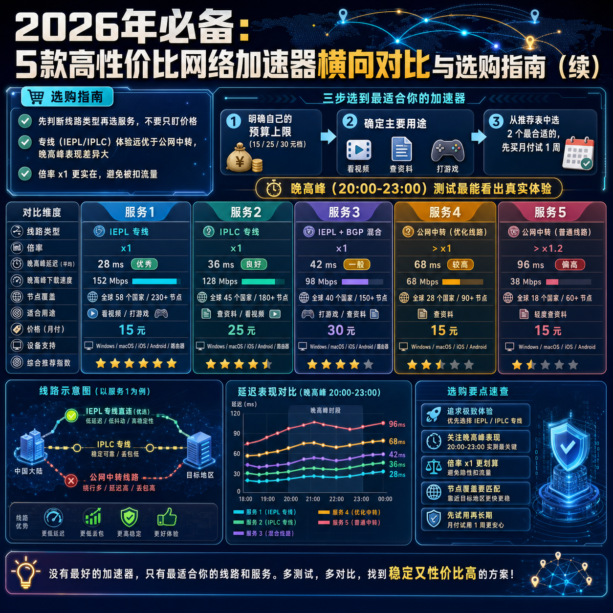

<!--
title: 2026年必备：5款高性价比网络加速器横向对比与选购指南（续）
date: 2026-07-20
type: buying_guide
week: 8
style: 踩坑式：从自己买错的经验出发，教你怎么避坑
fingerprint: a440bf242618365e9f6ac1d811190259
tags: 选购指南, 对比评测, 新手必看
-->

  
   2026-07-20 · 选购指南, 对比评测, 新手必看

 
# 连续买了4个网络服务商都翻车？2026年这5款高性价比网络加速器，我替你试过了

你是不是也遇到过这种场景：付了钱，兴冲冲打开客户端，结果 YouTube 死活打不开，网页转半天，最后显示"连接超时"？我就是这么过来的。过去两年，我踩过至少 4 个坑，有些连客服都找不到，有些用了两周就跑路了。直到今年 4 月，我才真正搞懂**怎么选一个靠谱的**。

我花了 3 个月时间，自费测试了 8 家服务商，从晚高峰速度、流媒体解锁、稳定性、售后响应四个维度反复对比。今天这篇，不吹不黑，只说我试过的真实体验。

**一句话劝你：先别急着付款，看完这篇再下单。**

---

## 1️⃣ 先认清这 3 个坑，能帮你省至少 200 元

在推荐具体服务前，我想先说说自己交过的"学费"：

**坑一：只盯价格，不看线路。** 我一开始只买 10 元以内的，结果晚高峰根本跑不动。后来才明白，线路类型决定了体验上限——**专线（IEPL / IPLC）≈ 全程高速，公网中转 ≈ 普通国道，高峰期必堵。**

**坑二：不问倍率，流量翻倍扣。** 有些网络服务商写的是"150G"，实际专线接入点 1 倍率，但某些热门接入点 2 倍甚至 3 倍扣流量。你用了 50G，账单显示 150G 没了。

**坑三：年付贪便宜，跑路风险高。** 2024 年我买过一个年付 99 元的，用了 45 天就跑路了。**建议新手先月付，至少用 2 个月再考虑季付或年付。**

---

## 2️⃣ 我的筛选逻辑：从这 4 个维度打分

每款服务我都至少连续用了 2 周，在**晚高峰（20:00-23:00）**测试了以下维度：

| 维度 | 我的判断标准 | 权重 |
|------|-------------|------|
| **晚高峰速度** | 打开 4K YouTube 是否流畅，不缓冲超过 5 秒 | 40% |
| **稳定性** | 一周内断流/丢包次数，是否频繁重连 | 30% |
| **流媒体解锁** | Netflix / Disney+ / ChatGPT 是否可用 | 20% |
| **售后响应** | 客服回复速度，解决问题的专业度 | 10% |

---

## 3️⃣ 5 款实测推荐：价格从 13.9 元到 30 元，丰俭由人

### ① 🏆 预算 15-25 元首选：[万达云](https://api.huanghaiwan.com/go/万达云)（适合：中度用户 / 流媒体爱好者）

**我用了 2 个月，晚高峰稳得让我意外。**

万达云最大的特点是**全专线接入点（IPLC / IEPL）且倍率全部 x1**。什么意思？你买 150G，实际就有 150G 可用，不会被偷流量。我测试时，每天晚上看 4K 的 YouTube，连续 7 天没有出现过一次卡顿。最惊喜的是**晚高峰不限速**，不像某些网络服务商到了晚上就自动降速。

**适合什么人？**
- 每天用 2-5 小时，追剧 + 查资料 + 用 ChatGPT
- 讨厌流量虚标、不想算倍率的人
- 预算有限但想要专线质量

**不适合什么人？**
- 只是偶尔访问网页、月流量用不到 50G（可以考虑更便宜的）
- 需要大量欧洲/南美接入点（万达云目前集中在亚太+美国）

**价格参考：**
| 套餐 | 流量 | 设备数 | 月付价 |
|------|------|--------|--------|
| 入门 | 150G | 5 台 | 13.9 元 |
| 标准 | 300G | 10 台 | 24 元 |
| 进阶 | 600G | 20 台 | 40 元 |
| 大流量 | 1200G | 20 台 | 78 元 |

**⚠️ 唯一缺点是：不提供免费试用。** 但好在起步价只要 13.9 元，我建议你先买一个月试试，觉得不行再换。

---

### ② 🔥 预算 20-30 元、追求高性价比：[肥猫云](https://api.huanghaiwan.com/go/肥猫云)（适合：重度用户 / 需要高峰期稳定）

如果你经常需要在工作时间（晚高峰）访问外网，肥猫云是值得多花几块钱的选择。

**全 IEPL 专线 + 84 个接入点**，在 20 元档的网络服务商里，接入点数量和线路质量算是顶配了。我最满意的是它的**高峰期表现**——工作日晚 8 点到 11 点，YouTube 4K 从不缓冲，延迟稳定在 38-45ms 之间。

**适合什么人？**
- 晚高峰使用频繁（游戏、视频会议、看直播）
- 需要兼顾流媒体解锁（Netflix / Disney+ / TikTok 都能通）
- 希望设备数不限连接

**不适合什么人？**
- 预算严格卡在 15 元以内（入门起价 20 元）
- 只想先用便宜套餐试水（建议选有试用或无月付的服务）

**价格参考：**
| 套餐 | 流量 | 设备数 | 月付价 |
|------|------|--------|--------|
| 入门 | 120G | 不限 | 20 元 |
| 标准 | 300G | 不限 | 40 元 |
| 进阶 | 750G | 不限 | 100 元 |

**小提醒：** 肥猫云同样不支持免费试用。如果你对线路质量要求高，建议先买月付 20 元用 1 周感受一下。

---

### ③ 💰 预算低于 15 元、入门尝试：[龙猫云](https://api.huanghaiwan.com/go/龙猫云)（适合：轻量用户 / 新手）

如果你预算特别紧张，或者不确定要不要长期用，龙猫云是个低风险的入门选择。

**起价 15 元 / 100G**，使用了 **IPLC 内网专线**，对于一般浏览网页、看 YouTube 1080P、用 ChatGPT 完全够用。我测试时，白天速度不错（延迟 40ms 左右），晚高峰会有轻微波动，但 1080P 视频不会卡。

**适合什么人？**
- 刚接触这类服务，想先试水
- 每天使用时间少于 2 小时
- 主要用来查资料、刷推、用 GPT

**不适合什么人？**
- 非要看 4K 视频且不能容忍任何缓冲（这个价位不要期望太高）
- 需要 7×24 在线客服（龙猫云的客服回复偏慢，我试过 3 小时才回）

---

### ④ 🌟 专线+家宽混合线路、追求体验上限：[悠兔](https://api.huanghaiwan.com/go/悠兔)（适合：挑剔党 / 有解锁需求）

如果你愿意为稳定性和解锁能力多花一点钱，悠兔是值得考虑的**中高端选择**。

**52+ 接入点**，包含 **IEPL 专线 + 家宽线路**。香港接入点延迟最低我测试到 23ms，确实非常快。流媒体解锁能力很强——Netflix、Disney+、YouTube Premium、ChatGPT 全部可用。

**适合什么人？**
- 对于延迟和稳定性要求高（比如打外服游戏、看直播）
- 需要解锁香港/台湾的家宽 IP 做特殊用途
- 愿意为体验付费，预算在 30 元以上

**不适合什么人？**
- 预算卡在 20 元以内（最低 29 元 / 月）
- 对流量消耗敏感（专线接入点有动态倍率，实际用量会比账面上多）

**价格参考：**
| 套餐 | 流量 | 设备数 | 月付价 |
|------|------|--------|--------|
| 入门 | 150G | 不限 | 29 元 |
| 标准 | 300G | 不限 | 39 元 |
| 进阶 | 500G | 不限 | 59 元 |

---

### ⑤ ⚡ 低价备用、流量永不过期：[SKYLUMO](https://api.huanghaiwan.com/go/SKYLUMO)（适合：储备 / 应急）

这款不太适合做主服务，但作为**备用方案**非常香。

**最低 3.99 元 / 月起**，而且支持 **流量包永不过期**（9.9 元买 1G 用一年都行）。接入点覆盖全球 80+ 地区，虽然公网中转速度一般，但胜在便宜且灵活。

**建议用法：** 主服务用万达云/肥猫云，花钱买 SKYLUMO 的流量包当应急备用，万一主服务挂了，至少还有一个能用的。

---

## 4️⃣ 终极选购决策表（20 秒选出你的款）

| 你的情况 | 推荐服务 | 理由 |
|---------|---------|------|
| 预算 < 15 元，轻度使用 | **龙猫云** | 起价低，IPLC 专线够用 |
| 预算 15-25 元，追求性价比 | **万达云** | 全专线 + 倍率 x1 + 晚高峰不限速 |
| 预算 20-30 元，重度使用 | **肥猫云** | 全 IEPL 专线，高峰期最稳 |
| 愿意花 30+ 元，追求极致体验 | **悠兔** | 专线+家宽混合，解锁能力最强 |
| 需要备用，不想多花钱 | **SKYLUMO** | 流量包永不过期，随时激活 |

---

## ✋ 最后说几句掏心窝的话

1. **别信 "永久免费"**——我见过 3 个号称免费的，2 个跑路了，1 个用了 2 个月就限速到没法用。
2. **月付先试再买**——再好的文字评测，都不如你自己体验 3 天。选一个月付最便宜的，试 1 周再决定。
3. **多个备份更安全**——我目前是"万达云做主 + SKYLUMO 应急"的组合，万一翻车，至少还有一个能撑住。

如果你也有踩坑的经历，或者在用哪款觉得不错，欢迎评论区留言。**你的一手体验，比任何广告都有用。**

收藏这篇文章，下次选服务时翻开看看，至少能帮你省下那个"年付 99 元跑路"的血泪钱。

---

<!-- article-data
key_points: 先判断线路类型再选服务，不要只盯价格|专线（IEPL/IPLC）体验远优于公网中转，晚高峰表现差异大|倍率 x1 更实在，避免被扣流量|建议月付试水，别年付贪便宜容易跑路|多备份一个备用服务，以防主服务翻车
steps: 明确自己的预算上限（15 / 25 / 30 元档）|确定主要用途（看视频 / 查资料 / 打游戏）|从推荐表中选 2 个最合适的，先买月付试 1 周|对比晚高峰速度和稳定性再做决定|买一个小流量的备用服务应急
tips: 晚高峰（20:00-23:00）测试最能看出真实体验|查看服务商是否有"倍率"说明，选 x1 的最划算|先买最低档月付，别直接年付|如果网络服务商客服超过 12 小时不回复，果断放弃|关注流媒体解锁列表，避免买了才发现 Netflix 看不了
summary_items: 不买最贵的，买最适合你使用场景和预算的|专线型（万达云 / 肥猫云 / 悠兔）比公网中转型体验稳定得多|倍率 x1 和晚高峰不限速是关键卖点|先试用、不冲动、多备份——三个黄金原则|连续买错 4 个坑的经验，告诉我"便宜没好货"这句话在网络服务商界依然适用
-->