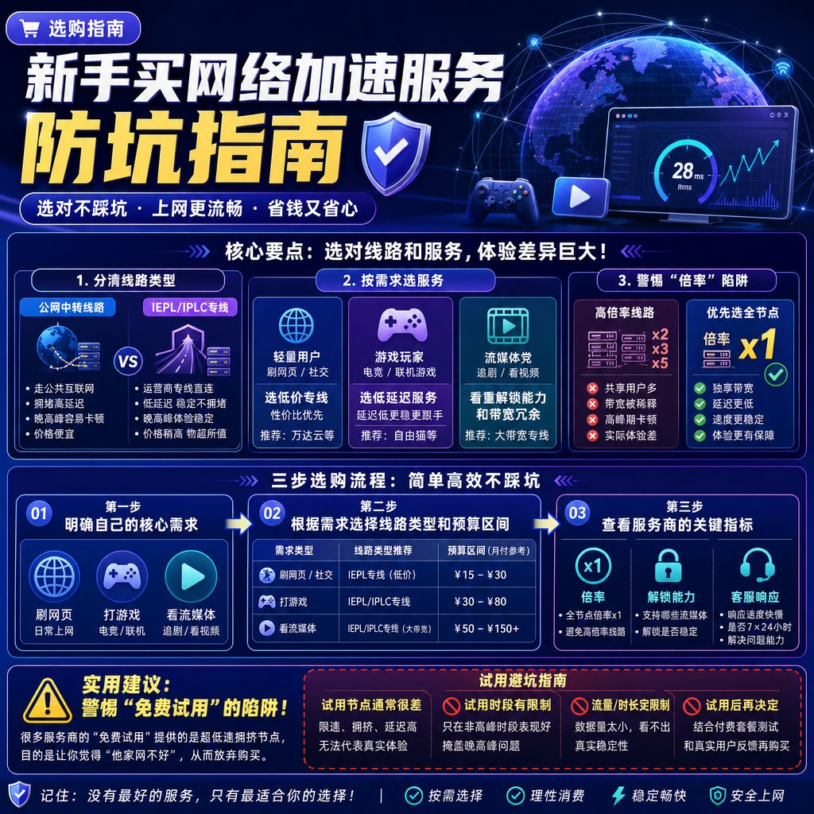

<!--
title: 新手买网络加速服务防坑指南
date: 2026-07-27
type: buying_guide
week: 9
style: 对比式：先分析不同需求的差异，再给建议
fingerprint: 4138f77fc8775bcb4cce14c19550dfd5
tags: 选购指南, 对比评测, 新手必看
-->

  
   2026-07-27 · 选购指南, 对比评测, 新手必看

 
好的，各位刚入门的兄弟们，我是你们在GitHub上分享干货的老朋友。今天咱们不聊代码，聊聊一个几乎所有技术爱好者都绕不开的话题：**怎么给自己选一个靠谱的网络加速服务**。

我知道你肯定听过或者经历过这些：花了几十块买了个“高速专线”，结果一到晚上YouTube看个1080p都卡成PPT；或者兴冲冲充了年费，结果用了不到两个月，服务商跑路了，血本无归。是不是你？

别慌，这篇文章就是专治各种“代理选择困难症”的。我用了差不多5年时间，踩过的坑比我写过的Bug还多，今天就把我的经验和教训全盘托出，结合2026年最新的市场行情，帮你把这笔钱花在刀刃上。

---

## 一、⚙️ 先搞懂核心：你是用什么“路”上网的？

很多新手只看价格，不看技术。这就像买车，只看外观不看发动机，迟早要吃亏。目前市面上的服务商，主要靠下面这几条“路”把你的数据送出去。我帮你用大白话解释清楚：

| 线路类型 | 通俗解释 | 优点 | 缺点 | 适合谁 |
| :--- | :--- | :--- | :--- | :--- |
| **公网中转** | 普通高速公路，共享车道，车多会堵 | **价格便宜**，起步价低（如[贝贝云](https://api.huanghaiwan.com/go/贝贝云)11.9元/月） | **高峰期拥堵**严重，速度和稳定性看运气 | 预算极低、只刷刷网页、对速度不敏感的用户 |
| **IEPL/IPLC专线** | **私家高速公路**，独享车道，晚上也不堵 | **速度快、延迟低、晚高峰不限速**（如[万达云](https://api.huanghaiwan.com/go/万达云)） | **价格较高**，月付通常20元+，部分服务商有流量倍率陷阱 | 游戏玩家、4K流媒体重度用户、对网络要求高的用户 |
| **家宽IP** | 用普通家庭宽带的IP上网，伪装性极强 | 解锁流媒体（Netflix等）效果好，不容易被风控 | **价格贵**，资源稀缺，不稳定，容易断流 | 专门用来解锁特定流媒体、TikTok重度用户 |

**我的建议：** 作为一个追求性价比的“技术佬”，**首选IEPL/IPLC专线**。这是目前体验和价格的“甜点区”。别为了省那10块钱，去买公网中转，晚上卡得你怀疑人生。我去年用了半年的贝贝云，体验还不错，但一到晚上8点看4K视频就明显掉速，后来换了万达云才彻底根治。

---

## 二、🛠️ 按需选车：你是哪种“玩家”？

搞清楚“路”不够，还得知道自己要“开什么车”。不同需求，对服务的要求天差地别。我把读者分为三类，对号入座就行。

### 1. 🐣 轻量用户：刷个网页/看个新闻

**核心需求：** 便宜、稳定、能上就行。对速度没太大要求，能打开Google就行。

**我推荐：** 入门级专线或价格极低的中转服务。

*   **万达云（入门款）**： **13.9元/月**，150G流量，全专线接入点。性价比极高，我目前主力机上的**备用方案**就是它。虽然150G不多，但只是刷网页看新闻，一个月妥妥够用。它的优点是晚高峰不限速，这点秒杀同价位的所有对手。
*   **贝贝云**： **11.9元/月**，100G，极致便宜。适合预算卡死的兄弟。但你要承受高峰期可能卡顿的风险，毕竟只是公网中转。**缺点：** 不支持免费试用，只能无脑冲一个月试试。

**适合人群：** 学生党、预算敏感者、对网络质量要求不高的轻度使用者。

**不适合人群：** 游戏玩家、4K视频重度用户、需要稳定低延迟和高速下载的人。

### 2. 🎮 游戏玩家：低延迟才是正义

**核心需求：** 延迟极低（<50ms）、抖动小、稳定不掉包。看视频可以卡，打游戏绝对不能卡。

**我推荐：** 必须上IPLC/IEPL全专线服务，且地区接入点要精细到香港、台湾、日本。

*   **[自由猫](https://api.huanghaiwan.com/go/自由猫)**：我的**主力服务**，用了快一年。它的IEPL + **MPTCP多路复用技术**是杀手锏。简单说，就是能把你的网络请求分成多份同时走，哪怕有一条线路不稳定，其他路也能顶上。打《APEX》《瓦罗兰特》的时候，延迟基本稳定在35ms以内，体验极好。
*   **[悠兔](https://api.huanghaiwan.com/go/悠兔)**： **IEPL专线**里的老牌选手，运营快5年了。它的香港接入点延迟实测能到**23ms**，非常顶。但要注意，它的专线接入点有**动态倍率**，高峰期可能会扣双倍流量。**缺点：** 不适合手机流量不多、且习惯在高峰期玩游戏的朋友。

**适合人群：** 硬核游戏玩家、对延迟零容忍的用户。

**不适合人群：** 预算有限、或者喜欢在手机热点下玩游戏的人（流量消耗大）。

### 3. 🎬 流媒体/下载狂魔：要快，还要能“解锁”

**核心需求：** 速度快（单线程跑满带宽）、能解锁Netflix/Disney+/ChatGPT等流媒体平台。

**我推荐：** 专注于流媒体解锁且带宽充裕的专线服务。

*   **[龙猫云](https://api.huanghaiwan.com/go/龙猫云)**：我在解锁Netflix时用的主力。它的IPLC内网专线对**流媒体解锁支持极好**，Netflix、Disney+、HBO基本都能秒开。接入点跨了香港、台湾、新加坡、日本和美国，覆盖很全。**缺点：** 冷门地区接入点覆盖一般，比如南美、非洲基本没有。
*   **[肥猫云](https://api.huanghaiwan.com/go/肥猫云)**： **全IEPL专线**，84+接入点，带宽冗余给得很足。我测过一次下载Steam游戏，速度能到**80MB/s**，直接把带宽吃满了。它的高峰期表现是所有全专线服务里我个人觉得最稳的。**缺点：** 入门月付20元/120G，价格稍高，对轻量用户不太友好。

**适合人群：** 流媒体迷、下载党、对速度和媒体解锁有双重硬需求的用户。

**不适合人群：** 只看国内视频网站、对国际流媒体没有需求的用户（浪费了钱）。

---

## 三、👀 看穿套路：那些年我踩过的坑

这几年我交了不少“学费”，总结出下面几个防坑指南，比任何推荐都有用。

1.  **警惕“倍率”陷阱**：很多服务商接入点旁边会标一个“x1.5”或“x2”。意思是**你实际消耗的流量 = 你用的流量 × 倍率**。比如你看一个视频用了1G，倍率是x2，你这1G的流量就要算成2G。**务必选择全接入点“倍率x1”的服务**，比如万达云就明确写了“所有接入点倍率x1”，这才是真良心。

2.  **小心“免费试用”的坑**：有些服务说“免费试用1天/24小时”，但你进去后会发现，试用接入点速度极慢，或者只给你几M的带宽。这是为了让你觉得“这家的网好慢”。**正确做法：** 选那些有**明确、且速度正常的试用入口**的服务。比如[SKYLUMO](https://api.huanghaiwan.com/go/SKYLUMO)，它提供试用入口，你可以真实地体验网络质量。或者像我一样，直接买个最便宜的月付套餐当“学费”，不好用就跑。

3.  **别信“永久”和“不限速”**：任何网络加速服务，只要用户量上来了，物理带宽就那么多，必然会“有限速”或“拥堵”。那些承诺“永久2T流量随便用”的，要么是伪需求（你根本用不完），要么是准备跑路割韭菜。**真正的稳定服务**，都会明确告诉你能跑多少兆带宽，比如[闪狐云](https://api.huanghaiwan.com/go/闪狐云)写的“1000Mbps速率”，这才是真实可量化的承诺。

4.  **看死客服响应速度**：服务出问题是必然的。一个靠谱的服务，客服响应应该在**10分钟以内**。我试过一家店（[mmti.one](https://api.huanghaiwan.com/go/mmti.one)），晚上10点接入点全挂了，发工单到第二天下午才回复。直接拉黑。现在我会优先选有**真人客服在线**的服务商，比如龙猫云、闪狐云，有问题沟通起来很舒服。

---

## 四、💰 最终方案：7月最新性价比对比表

为了方便你决策，我把我用过的、有明确信息的服务做了张对比表，记住，**这是我的主观体验，不一定完全客观，但绝对真实**。

| 服务商 | 线路 | 最低月付 | 月付/流量 | 解锁能力 | 优缺点简述 |
| :--- | :--- | :--- | :--- | :--- | :--- |
| **万达云** | IPLC/IEPL全专线 | **13.9元** | 150G/5台 | 全解锁，晚高峰不限速 | 性价比之王，入门首选 |
| **自由猫** | IEPL+MPTCP | 未明确（约30元起） | 100+接入点 | 全解锁，延迟极低 | 游戏用户的王，技术底蕴深厚 |
| **龙猫云** | IPLC内网专线 | **15元** | 100G/不限设备 | Netflix/Disney+解锁极好 | 流媒体推土机，客服响应快 |
| **肥猫云** | 全IEPL专线 | **20元** | 120G | 全解锁，带宽冗余足 | 速度党首选，高峰期体验最强 |
| **闪狐云** | BGP+IPLC专线 | **20元** | 120G/不限设备 | 全解锁，1000Mbps速率 | 新服务商，2025年上线，需观察 |
| **悠兔** | IEPL+家宽 | **29元** | 150G/不限设备 | 全解锁，有家宽IP | 老牌稳定，但有动态倍率 |
| **[Cyberguard](https://api.huanghaiwan.com/go/Cyberguard)** | IEPL+协议新 | **18元** | 100G | 全解锁，有按量付费 | 协议新，部分客户端不兼容 |
| **贝贝云** | 公网中转 | **11.9元** | 100G | 一般 | 极致便宜，高峰期会卡 |

**如果你是第一次买：**
1.  **别犹豫，先冲一个月**：不要买年付！不要买年付！不要买年付！先用一个月看看效果，觉得好再续。我当年就是贪小便宜买年付，服务商跑了，损失了一百多块。
2.  **首选万达云**：全专线 + 13.9元的起价，没有任何坑。你不需要思考，直接买一个月的150G套餐试试，绝对能让你摆脱卡顿。这是我目前给所有新手的标准答案。
3.  **如果你预算高一点**：直接上**自由猫**。无论你是打游戏还是看4K，它的MPTCP技术能给你带来其他服务给不了的极致稳定体验。

---

## 总结一下

选网络加速服务，跟选女朋友一样，**合适的才是最好的**。别听信广告，别只看价格，要看你自己的真实需求和预算。

*   **省钱党**：冲 **万达云**。
*   **游戏党**：冲 **自由猫**。
*   **流媒体党**：冲 **龙猫云** 或 **肥猫云**。

最后，记住我今天说的**核心原则**：先去试用，再谈付款；先看评测，再下单。别当大冤种。

如果你觉得这篇文章对你有帮助，**别忘了点个收藏**，下次买服务的时候翻出来看看。或者，如果你踩过比我更狠的坑，欢迎在评论区分享，让兄弟们引以为戒！

---

<!-- article-data
key_points: 选择网络加速服务，核心是分清线路类型（公网中转 vs. IEPL/IPLC专线）| 轻量用户选低价专线（如万达云），游戏玩家选低延迟服务（如自由猫），流媒体党看重解锁能力和带宽冗余| 警惕“倍率”陷阱，优先选全接入点倍率x1的服务| 坚持“先月付、不年付”原则，用低成本试错，避免服务商跑路
steps: 第一步：明确自己的核心需求（刷网页/打游戏/看流媒体）| 第二步：根据需求选择对应的线路类型和预算区间| 第三步：查看服务商的关键指标（倍率、解锁能力、客服响应）| 第四步：先购买最便宜的月付套餐或使用免费试用，实测体验| 第五步：体验满意后，再考虑续费或升级更高套餐
tips: 警惕“免费试用”的陷阱，很多试用接入点速度极慢，目的是让你觉得“他家网不好”| 别信“永久”和“不限速”的承诺，物理带宽有限，用户量一大必然会限速| 看客服响应速度，晚上10点之后发个工单，看多久回复，这是检验服务态度的黄金标准
summary_items: 网速慢、经常断流，核心原因是走了公网中转而非IEPL/IPLC专线| 花钱买了不能用，往往是踩了“倍率”或“动态倍率”的坑| 服务商跑路血本无归，根源在于贪便宜买了年付套餐| 一篇好的选购指南，核心是帮读者从“看广告”变成“看疗效”
-->