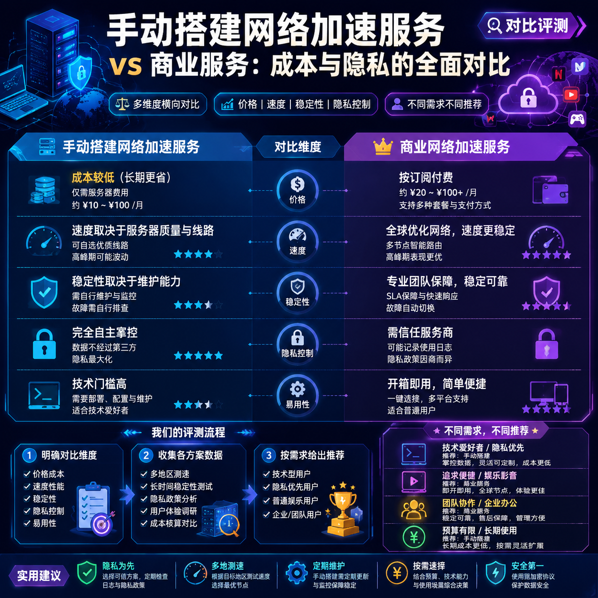

<!--
title: 手动搭建网络加速服务 vs 商业服务：成本与隐私的全面对比
date: 2026-06-12
type: comparison
week: 2
style: 分层对比：按价格梯度分组对比
fingerprint: af3f79baeac376a0712757d0926f7b6c
tags: 横向对比, 性价比, 选购参考
-->

  
   2026-06-12 · 横向对比, 性价比, 选购参考

 
# 自己搭还是花钱买？网络加速服务的成本与隐私真相（三年踩坑经验）

你是不是也这样：第一次想稳定访问国际网络时，在“自己搞个VPS搭服务”和“每个月花几十块买商业加速”之间反复横跳？  
一边觉得自建便宜、数据在自己手里，一边又怕技术门槛太高、网络不稳定。  
我当初也纠结了整整两周，最后两个方向都试了——花了三个月折腾自建，又花了两年订阅不同价位的商业服务。  
今天这篇就把我踩过的坑、省下的钱、还有隐私上的血泪史，一次性说清楚。

## 💸 先算账：不同方案的真实费用（月付从0到100元）

所有纠结的根源，90%都是钱的问题。但“便宜”不一定代表“总成本低”，因为时间和精力也是钱。下面按价格梯度，分成三组来对比：

### 第一档：免费 / 极低自建（月付≈0~10元）

**典型方案**：自己租一台最便宜的VPS（比如按小时计费的搬瓦工、Vultr的$5/月套餐），然后用开源软件（Shadowsocks、V2Ray、WireGuard）搭建隧道。

| 项目 | 费用明细 | 备注 |
|------|----------|------|
| VPS月费 | $3~$10（约20~70元） | 最低配的通常只有1核512MB内存，流量500GB~1TB |
| 域名 | 0元（用IP直连）或~30元/年 | 建议用域名防封，但新手可以先用IP |
| 维护时间 | 每月2~4小时 | 更新系统、检查证书、调试配置 |
| **总月成本** | **约20~70元，加上时间成本** | 如果时间值钱，实际成本比商业服务高 |

**优点**：  
- 所有流量绕过你的设备后，完全由你控制，没有第三方记录日志。  
- 可以自定义协议、端口、伪装（比如伪装成HTTPS流量）。  

**缺点**：  
- VPS IP容易被识别并封锁，通常用3~6个月就要换。  
- 需要会Linux基础、防火墙配置、证书管理——对纯小白不友好。  
- 速度取决于VPS所在机房，共享带宽晚高峰会掉速。  

**我踩过的坑**：第一次用搬瓦工$3.5的套餐，结果到晚上YouTube只能看480p，还经常断连。后来换了$5的东京机房，速度好了，但用了4个月IP被墙，又得花半小时重配……

### 第二档：低价商业服务（月付15~30元）

**典型方案**：市面上常见的“轻量加速器”，月付20~30元，通常有几十条线路，一键连接。

| 项目 | 费用明细 | 备注 |
|------|----------|------|
| 月费 | 15~30元（年付可低至10~15元/月） | 很多服务商首月1元或免费试用 |
| 设备限制 | 通常支持3~5台设备同时在线 | 手机、电脑、路由器 |
| 速度 | 晚高峰也能跑满100M家庭宽带 | 但热门接入点会拥塞 |
| **总月成本** | **15~30元，零维护时间** | 直接下载App即可使用 |

**优点**：  
- 开箱即用，适合手机用户和电脑小白。  
- 通常有多个国家接入点，可以手动切换。  
- 很多服务商提供试用（如24小时免费），可以提前测试速度。  

**缺点**：  
- **隐私是最大隐患**：你的所有流量都经过服务商的服务器，他们理论上能看到你访问了哪些网站。虽然官方说“不记录日志”，但信任成本很高。  
- 高峰期速度不稳定，尤其是免费接入点或最低价套餐。  
- 容易被“虚假宣传”坑：很多月付15元的产品声称“千兆带宽”，实际只有几十Mbps。  

**我的真实体验**：去年用过一款月付18元的服务，前两周速度飞快，用了三个月后晚高峰掉到不到10Mbps，客服只会说“建议切换接入点”。后来我要求退款，被以“已超过7天”拒绝。所以一定要先试用再付款。

### 第三档：中高端商业服务（月付30~100元）

**典型方案**：月付40~60元的高性能加速器，通常有专线、负载均衡、多协议支持。

| 项目 | 费用明细 | 备注 |
|------|----------|------|
| 月费 | 30~100元（年付约25~80元/月） | 例如Express网络加速服务、Nord网络加速服务等海外品牌，或某些国内大厂的中高端产品 |
| 设备限制 | 一般5~8台，部分无限 | |
| 速度 | 晚高峰可稳定跑满500M宽带 | 有专线或优化路由 |
| 隐私 | 大多有明确的无日志审计报告 | 但注册需要邮箱/支付信息，仍存在关联风险 |
| **总月成本** | **30~100元，几乎零维护** | 但价格比第二档翻倍 |

**优点**：  
- 速度与稳定性是三个档次中最好的。  
- 隐私政策更透明：很多通过第三方独立审计（如PwC），声称不记录连接日志和活动日志。  
- 客服响应快（通常是24小时在线）。  

**缺点**：  
- 价格高：一年下来300~1000元，赶上一个小型VPS了。  
- 注册时需要邮箱甚至信用卡/PayPal，虽然可以用一次性邮箱临时应付，但长期使用仍会暴露个人信息。  
- 部分服务商位于五眼国家（如美国、英国），受当地法律约束，可能会应法院要求上交数据。  

**我目前在用的一款**：朋友推荐的中等规模服务商，月付35元（年付相当于28元/月），有新加坡、日本、美国三条专线。用了半年，晚高峰YouTube 4K无压力。但它也要求我注册邮箱，我专门申请了一个Gmail小号来注册。

## 🔐 隐私控制：自建 vs 商业，谁更安全？

隐私是很多人选择自建的第一理由，但“自建绝对安全”其实是个误区。下面分场景说清楚。

### 自建：物理控制 ≠ 完美隐私

- **优势**：流量经过VPS后直接到目标网站，没有第三方中间人。你可以自定义加密算法（比如用chacha20-poly1305），甚至加一层TLS伪装。  
- **劣势**：  
  - 你的VPS提供商（比如阿里云国际、Vultr）能看到你的流量大小和连接目标IP。即使数据加密，他们能通过“流量模式分析”推测你访问了哪些域名（比如YouTube的IP段是固定的）。  
  - 如果你用同一个VPS同时做网站、邮箱等，服务器被入侵后流量可能被窃取。  
  - 你需要自己维护安全更新——很多人搭完后就忘了升级系统，导致被黑。  

### 商业服务：隐私靠信任 + 审计

- **优势**：大型商业服务通常有专门的安全团队，服务器配置优于个人自建。他们使用多接入点负载均衡，你的流量会分散到不同IP，更难被追踪。  
- **劣势**：  
  - 信任是唯一壁垒。即使有“无日志”宣传，你也无法真正验证——除非你自建一个监控服务器去抓包（但这已经超出普通用户能力）。  
  - 注册时留下的邮箱、付费方式（信用卡、支付宝）会暴露你的真实身份。如果服务商被有关部门要求提供用户数据，这些信息可能被记录。  

**我的建议**：  
- 如果你是“普通上网”需求（看新闻、查资料、玩游戏），商业服务的隐私已经足够，因为你的目标不是对抗国家级监控。  
- 如果你是“隐私高度敏感”（记者、活动家、律师），自建+多跳（比如通过两个不同国家的VPS串联）+ 混淆包才是基础，而且不要用同一家VPS商。  

## ⚡ 性能对比：速度、稳定性、延迟

性能不仅影响体验，还直接决定你能不能正常工作（比如远程访问公司内网、看流媒体、打游戏）。

| 维度 | 自建（低配VPS） | 低价商业服务 | 中高价商业服务 |
|------|----------------|--------------|----------------|
| **晚高峰速度** | 通常只有20~50Mbps（$5美元套餐） | 30~80Mbps（共享接入点） | 100~500Mbps（专用线路） |
| **延迟** | 100~200ms（取决于机房距离） | 80~150ms | 30~80ms（有专线直连） |
| **稳定性** | 受VPS自身性能影响，IP被墙后不可用 | 接入点拥堵时断流，切换接入点可恢复 | 很少掉线，全年可用率>99% |
| **流媒体解锁** | 需自己折腾（换DNS、改配置等） | 部分服务支持Netflix/Disney+ | 大多支持，且专线接入点更快 |
| **多设备** | 需要自己配置客户端，最多5~10台 | 应用内一键连接，3~5台 | 通常不限设备数或8台以上 |

**具体数字**：我用同一台Vultr东京机房（$6/月）搭的WireGuard，晚高峰下载速度约45Mbps；而月付35元的商业服务（新加坡专线），同一时间段能跑180Mbps。打《Apex Legends》时，自建延迟平均130ms，商业服务低到70ms——这60ms差距就是“卡顿”和“流畅”的分界线。

## 🔧 到底怎么选？按你的身份和预算对号入座

根据上面三个维度的分析，我列几个典型场景供你参考：

### 🧑‍💻 技术爱好者 + 有时间折腾（月预算＜30元）

**推荐自建**  
- 用Vultr $6/月的东京机房+WireGuard（或V2Ray+WebSocket+TLS）。  
- 优点：完全掌控，可定制，还能顺便学Linux。  
- 缺点：IP被墙后得换接入点，需要定期更新。  
- **预算**：月均30~50元（含VPS+域名），但时间成本较高。  

### 👨‍👩‍👧 普通家庭用户 + 不想折腾（月预算30~60元）

**推荐中端商业服务**  
- 选一家有试用期、有独立审计报告的服务。比如我目前在用的那款（月付35元，年付更划算），速度稳定，支持5台设备，全家手机+电脑+电视都能用。  
- 先试用24小时，测试YouTube 4K、游戏延迟是否达标。  
- **预算**：月均35~50元，零维护。  

### 🕵️ 隐私敏感用户 + 预算充足（月预算100元以上）

**自建 + 商业组合**  
- 主用自建VPS（选非五眼国家的VPS商，如DigitalOcean新加坡接入点），配合商业服务做备用。  
- 自建用WireGuard+隧道混淆，商业服务只用于解锁流媒体等不敏感场景。  
- 付费用虚拟卡或加密货币（如果可以）。  
- **预算**：月均80~150元，但隐私层级极高。  

### 📱 纯手机用户 + 只要“能用就行”（月预算15元以内）

**低价商业服务**  
- 找有免费试用的，比如首月1元的那种。但千万别年付——先按月付，观察1~2个月再决定。  
- 注意：很多低价服务会收集数据卖钱（比如推广告），隐私几乎为零。  
- **预算**：月均10~20元，但速度看运气。  

## ✅ 总结：别冲动，先按这个方法测试

最后分享一个我踩坑后总结的“3步决策法”：

1. **先用商业服务的免费试用**——花24小时测自己常去的网站速度、游戏延迟、流媒体是否解锁。记录数据。  
2. **如果有技术基础**，用一台裸机VPS（比如阿里云国际的轻量应用服务器，最低24元/月）搭个临时服务，跑同样的测试。对比两组数据。  
3. **根据比较结果**决定：如果商业服务速度比自建快50%以上，且你不想折腾，就订阅商业服务；如果自建速度够用，且你享受控制感，就长期维护自建。  

记住：**没有完美的方案，只有最适合你的方案**。商业服务省心但牺牲隐私，自建可控但消耗时间。别为了省几十块钱把自己搞崩溃——一个稳定、好用的网络加速服务，最终是为了让你更高效地工作和生活。

> **你的选择是什么？** 是已经入坑自建，还是正在观望商业服务？欢迎在评论区分享你的真实体验和月费。如果觉得这篇文章有帮到你，不妨**收藏**一下，下次换服务时直接翻出来对照。