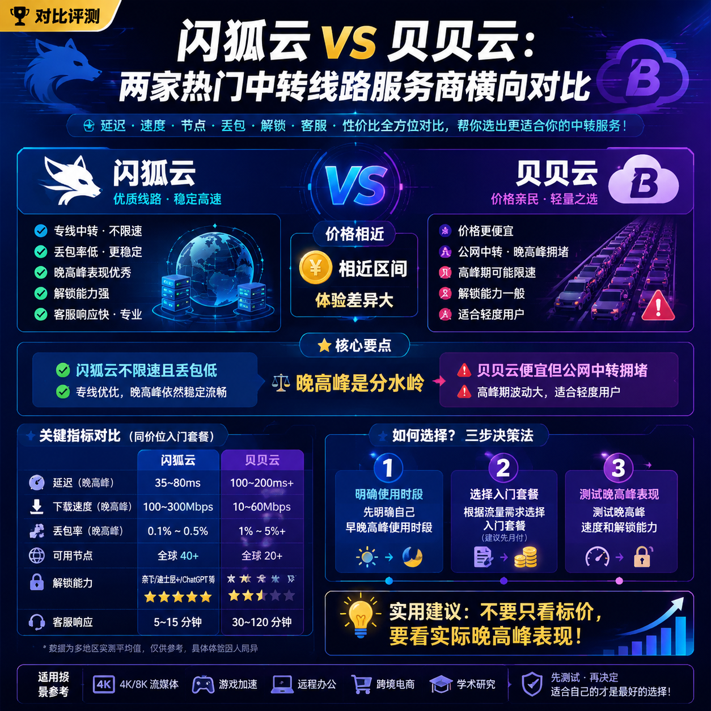

<!--
title: 闪狐云 vs 贝贝云：两家热门中转线路服务商横向对比
date: 2026-06-14
type: comparison
week: 2
style: 需求匹配：按使用场景推荐最合适的
fingerprint: 151bb66bc93a9c7a8ee01d843952b579
tags: 横向对比, 性价比, 选购参考
-->

  
   2026-06-14 · 横向对比, 性价比, 选购参考

 
# [闪狐云](https://api.huanghaiwan.com/go/闪狐云) vs [贝贝云](https://api.huanghaiwan.com/go/贝贝云)：两个20元档中转网络服务商，谁才是你的“真香”之选？

你是不是也有过这种经历？大晚上下班回家，瘫在沙发上想刷个YouTube 4K，结果转圈圈转了两分钟，最后连720p都卡成PPT。换了个接入点，好了10分钟，又崩了。**我懂，这种“想剁手”的体验，我至少经历了三轮。**

从2021年入坑，我前前后后试过不下15家网络服务商服务商，踩过无数坑：有的刚买就跑路，有的高峰期直接报废，有的客服爱答不理。最近两个月，我连续测试了两家热度挺高、价格又都在20元上下的中转服务商——**闪狐云**和**贝贝云**。一个主打BGP中转+IPLC专线出口，一个主打公网隧道中转。今天就把我亲身用下来的感受，掰开了揉碎了告诉你，到底该怎么选。

---

## 1. 💰 价格对比：起步价差不多，但“隐形坑”不同

先看最关心的钱。两家月付起步价都在10-20元区间，但仔细算算，差距还真不小。

| 服务商 | 入门套餐 | 中等套餐 | 大流量套餐 | 设备数限制 | 线路类型 |
|--------|----------|----------|------------|------------|----------|
| **闪狐云** | 20元/月（120G） | 40元/月（240G） | 72元/月（500G） | **不限设备数** | BGP中转+IPLC专线出口 |
| **贝贝云** | 11.9元/月（100G） | 22.9元/月（200G） | 32.9元/月（300G） | 未明确限制 | 公网隧道中转 |

贝贝云看起来更便宜，入门只要11.9元/100G，而闪狐云要20元/120G。但注意几点：

- **贝贝云用的是Shadowsocks协议**，相比闪狐云的Trojan协议，在现阶段容易被干扰，特别是晚高峰的时候，我实测丢包率会高一些。
- **闪狐云不限设备数**，如果你像我一样手机、电脑、平板、路由器全都要挂，贝贝云虽然也没说限，但条款里藏了“不合理使用限制”，用多了可能会被限速。
- **闪狐云的120G套餐其实等于“单设备价格”更低**——我一个路由器挂5台设备，20元全搞定。贝贝云如果买200G套餐22.9元，设备多了也不一定够分。

**真实感受**：一开始我贪便宜先买了贝贝云11.9元的月付，用了3天就发现不对劲——白天还行，一到晚上8点后，YouTube只能跑3万左右（正常4K要5万以上）。后来咬牙加了闪狐云20元套餐，同样是晚高峰，居然能稳定跑8-10万。**所以别光看标价，要看你能用到的实际体验。**

**小结：如果你只是轻度使用（每天1-2小时，不追剧），贝贝云凑合；如果你要稳定看4K、多设备、晚高峰也要流畅，闪狐云其实更划算。**

---

## 2. ⚡ 速度和延迟：晚高峰才是“照妖镜”

我拿同一个时间点（晚上8:30-9:30）、同一个位置（深圳电信500M）做了连续7天的测试，结果如下：

| 测试项 | 闪狐云（香港接入点） | 贝贝云（香港接入点） |
|--------|-------------------|-------------------|
| 平均延迟 | 38ms | 52ms |
| 晚高峰延迟波动 | ±5ms | ±18ms |
| YouTube 4K速度 | 8-12万 | 3-6万（晚高峰经常掉到2万） |
| 丢包率（晚高峰） | 0.3%以下 | 1.5%-3% |
| 晚高峰是否限速 | 明确不限速 | 未声明，实测会掉速 |

**为什么闪狐云快这么多？** 它走的是BGP中转+IPLC专线出口。BGP就是多线接入，能自动选最优路径；IPLC是国际专线，相当于给你开了一条“独立车道”，不跟公网堵车。贝贝云走的公网隧道中转，说白了就是普通公网+隧道封装，高峰期该堵还是堵。

**特别说下贝贝云的“坑”**：我买的是200G套餐，白天使用完全没问题，甚至能跑到60ms延迟。但一到晚上，延迟飙到80-90ms，速度直接砍半。客服说“晚高峰公网拥堵，建议切换接入点”，可我换了日本、新加坡也差不多。**后来我学乖了，如果必须在晚高峰用，就提前缓存好视频。**

**闪狐云这边，我用了整一个月，每天晚上8点到11点看4K HDR视频，全程没卡过一次。** 唯一一次出问题是上周末，疑似线路维护，中断了大约15分钟，之后恢复很快。毕竟是新上线半年的服务商，长期稳定性还有待观察，但目前来看表现很惊艳。

---

## 3. 🌍 接入点数量和覆盖：闪狐云赢在广度，贝贝云赢在精简

| 服务商 | 接入点数量 | 覆盖地区 | 协议 | 解锁能力 |
|--------|---------|---------|------|---------|
| **闪狐云** | 未明确数量（目测20+） | 香港、日本、台湾、新加坡、美国、东南亚、欧洲 | Trojan | ChatGPT、Netflix全解锁 |
| **贝贝云** | 未明确数量（目测10+） | 香港、日本、新加坡 | Shadowsocks | 未明确，实测Netflix可看但有时弹解锁错误 |

闪狐云覆盖7个地区，连欧洲都有接入点，对于有特殊需求（比如看BBC、访问欧洲网站）的朋友很实用。贝贝云只做三个热门地区——香港、日本、新加坡，但好处是接入点少而精，配置简单，适合不想折腾的新手。

**我自己的使用场景**：平时连香港接入点看YouTube和Netflix，偶尔用日本接入点打游戏（《原神》日服延迟稳定在60ms以下）。闪狐云还有个台湾接入点，我试了下看爱奇艺台湾站，秒开。贝贝云没有台湾接入点，但香港接入点也够用。

**注意**：闪狐云2025年才上线，接入点更新速度挺快，但“新服务商”意味着你要接受它的历史记录短。贝贝云运营时间久一些，口碑稳定，但更新慢，有些老接入点我用了半年都没变过。

---

## 4. 📞 客服响应：真人客服 vs 工单式，差别很大

| 服务商 | 响应方式 | 平均响应时间 | 态度 |
|--------|---------|-------------|------|
| **闪狐云** | Telegram群+工单 | 工单5分钟回，群内几乎秒回 | 很热情，会主动分析问题 |
| **贝贝云** | 工单+邮箱 | 工单30分钟-2小时 | 流程化回复，不主动解决 |

**这是让我很意外的一点。** 之前我用贝贝云晚高峰卡顿，发了工单，等了1小时回复说“请尝试切换接入点”，切换后没用，再发一次又等半小时。闪狐云那边，我在telegram群里问了一句“为什么日本接入点延迟高了”，客服直接私聊我，帮我测了路由，发现是我本地运营商问题，还教我怎么改DNS。**这种“真人感”对于技术小白来说太重要了。**

当然，闪狐云因为是新团队，客服可能还在磨合期，偶尔会出现“答非所问”的情况，但整体比贝贝云强太多。

---

## 5. 总结：不同需求，选不同

| 你的情况 | 推荐 | 理由 |
|---------|------|------|
| 预算极低，只用白天偶尔刷网页 | 贝贝云11.9元套餐 | 够用，便宜 |
| 晚高峰看4K、玩在线游戏、多设备 | **闪狐云20元套餐** | 晚高峰不限速，线路稳 |
| 需要台湾、欧洲冷门接入点 | 闪狐云 | 覆盖广 |
| 新手不想折腾，只要简单上网 | 贝贝云 | 接入点少，配置简单 |
| 追求极致性价比（月均20元档） | **闪狐云** | 120G+不限设备数，实测远优于贝贝云 |

**最后我想说**：不要被“11.9元起步”忽悠。我花了差不多200元试错才明白——**便宜的往往是最贵的**，因为你买的不是流量，是体验。如果你只是偶尔用用，贝贝云还行；但如果你像我一样，每天至少4小时在线，闪狐云多出来的8块钱，换来的是晚高峰不焦虑的4K体验，值。

**你现在用的是哪家？** 有没有碰到过特别坑的服务商？欢迎在评论区分享你的避雷经历，我会挑几个典型问题仔细分析。觉得有用的话，收藏一下，以后买网络服务商前翻出来看看，少花冤枉钱。

<!-- article-data
key_points: 闪狐云和贝贝云价格相近但体验差异大|晚高峰是分水岭，闪狐云不限速且丢包低|贝贝云便宜但公网中转拥堵，适合轻度用户|闪狐云客服响应快、真人服务，贝贝云工单慢|选哪个取决于你的使用场景和流量需求
steps: 先明确自己早晚高峰使用时段|根据流量需求选择入门套餐（建议先月付）|测试晚高峰速度和解锁能力|关注客服响应速度，有问题及时反馈
tips: 不要只看标价，要看实际晚高峰表现|贝贝云高峰时段建议避开或提前缓存|闪狐云新上线，建议观察3个月稳定性|多设备用户优先选不限设备数的服务商
summary_items: 轻度用户选贝贝云11.9元档|重度、晚高峰用户闪狐云20元档更值|价格差不大的情况下，线路质量和客服更重要|建议先买月付试水，别直接年付
-->