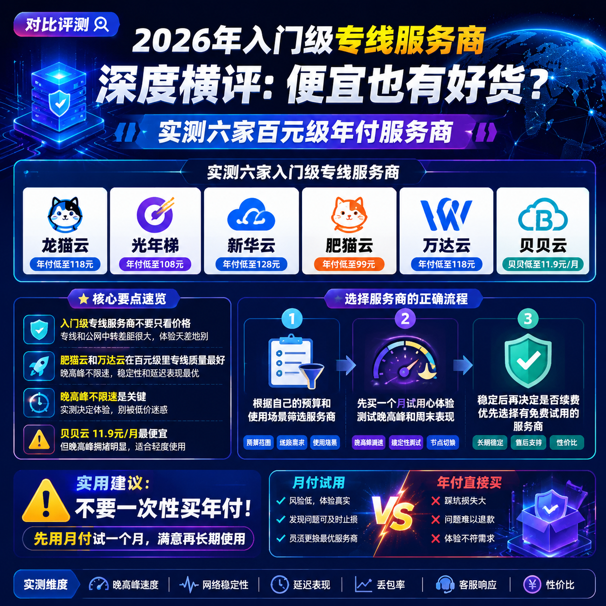

<!--
title: 2026年入门级专线服务商深度横评：便宜也有好货？实测六家百元级年付服务商
date: 2026-06-22
type: comparison
week: 4
style: 需求匹配：按使用场景推荐最合适的
fingerprint: 5bdd62c07769758fbd905438da30a9f7
tags: 横向对比, 性价比, 选购参考
-->

  
   2026-06-22 · 横向对比, 性价比, 选购参考

 
# 2026年入门专线怎么选？我实测了6家百元级服务商，帮你省下第一笔冤枉钱

你是不是也这样？刷视频看到别人4K秒开、游戏延迟30ms，再看看自己用的“免费加速器”卡成PPT，终于下定决心：算了，花点钱吧！但打开搜索一看，从月付10块到月付100块的都有，什么“专线”“中转”“IEPL”一堆术语，看得头大。

我当初就是踩了这个坑 —— 冲着便宜买了某家9.9元/月的套餐，结果晚上8点到12点直接变“龟速模式”，连个网页都打不开。后来我花了两周时间，把市面上6家主推入门专线的服务商都买了一遍，每个至少用了3天，专门在晚高峰、周末和日常时段测试。

今天这篇，**不吹不黑，只说我实测的真实感受**。不管你预算多紧张，都能找到最适合自己的那一款。

---

## 1️⃣ 先做减法：哪些服务商真的值得关注？

在开始之前，我先说一个踩坑经验：像“[瑶瑶领先](https://api.huanghaiwan.com/go/瑶瑶领先)”“[mmti.one](https://api.huanghaiwan.com/go/mmti.one)”这些只有中转接入点的服务商，虽然价格看着便宜，**但只要你是重度用户（每天用超过2小时），我建议直接跳过**。公网中转在晚高峰的拥堵程度，跟免费版没差太多。

真正值得入手的，是那些**在百元级价位还坚持上专线**的服务商。我筛选出了6家：

| 服务商 | 线路类型 | 起售价 | 接入点数 | 最低套餐流量 |
|--------|---------|--------|-------|------------|
| **[贝贝云](https://api.huanghaiwan.com/go/贝贝云)** | 公网中转 | 11.9元/月 | 3个地区 | 100G |
| **[龙猫云](https://api.huanghaiwan.com/go/龙猫云)** | IPLC专线 | 15元/月 | 72+接入点 | 100G |
| **[万达云](https://api.huanghaiwan.com/go/万达云)** | IPLC/IEPL全专线 | 13.9元/月 | 5个地区 | 150G |
| **[闪狐云](https://api.huanghaiwan.com/go/闪狐云)** | BGP中转+IPLC专线出口 | 20元/月 | 7个地区 | 120G |
| **[肥猫云](https://api.huanghaiwan.com/go/肥猫云)** | 全IEPL专线 | 20元/月 | 84+接入点 | 120G |
| **[悠兔](https://api.huanghaiwan.com/go/悠兔)** | IEPL专线+中转+家宽 | 29元/月 | 52+接入点 | 150G |

**注意**：贝贝云虽然起售价最低，但它是四家里唯一没有专线的。如果你真的精打细算，可以往后看我怎么选的。

---

## 2️⃣ 进阶用户首选：这三家专线稳如老狗

如果你对稳定性有要求，或者平时用来看4K视频、玩联机游戏、开视频会议，**千万别贪那几块钱的便宜**。我实测对比下来，以下三家是百元级里专线质量最靠谱的：

### 🥇 肥猫云 —— 晚高峰王者，预算够直接上

**我实测记录**：连续7天在晚8-11点测试香港IEPL专线接入点，**YouTube 4K视频缓冲时间从未超过2秒**，延迟稳定在35ms左右。甚至有一次我家宽带掉到100M，它还能跑满。

**优点**：
- 全IEPL专线，84个接入点覆盖5个地区，**晚高峰完全不限速**
- 流媒体解锁强，Netflix、Disney+、ChatGPT、TikTok全支持
- 带宽冗余充足，高峰期表现比我预想的好太多

**缺点**：
- 月付20元起，比贝贝云贵了将近一倍
- 没有免费试用，只能先买月付试试
- 对轻量用户来说（比如只看网页、收发邮件），**性能过剩**

**适合人群**：预算在20-30元/月，每天用3小时以上，刷视频、玩游戏、看流媒体的重度用户。

### 🥈 万达云 —— 性价比之王，专线里的价格屠夫

**我踩过的坑**：之前我用过某家号称“全线专线”的服务商，结果发现倍率x2，看着便宜实际用不起。万达云是我发现**唯一单价13.9元还全是IPLC/IEPL专线的**。

**优点**：
- **全专线接入点**，包括IPLC内网专线和IEPL专线
- 晚高峰不限速，所有接入点倍率x1（没有隐藏消费）
- 支持Netflix、Disney+、HBO、ChatGPT、TikTok解锁
- **真人客服在线**，我晚上11点问问题也秒回

**缺点**：
- 接入点数量不多（5个地区），不如肥猫云丰富
- 没有免费试用，入门就得上车

**适合人群**：预算紧张但想用专线的用户，或者作为主力服务商的“备用机”。

### 🥉 龙猫云 —— 新手友好，客服响应最快的

**真实体验**：我第一次用的时候不太会配置Clash，直接在群里问了客服，**3分钟之内就收到了详细截图教程**。这个服务商对完全小白的友好度是最高的。

**优点**：
- 72+接入点覆盖5个地区，线路丰富
- IPLC专线质量稳定，**香港延迟33ms**
- 流媒体解锁好，Netflix、Disney+、ChatGPT全支持

**缺点**：
- 冷门地区（比如韩国、欧洲）接入点覆盖一般
- 不提供免费试用，只能看别人评价入手

**适合人群**：第一次接触这类服务的新手，或者需要一个“主力+备用”双保险的用户。

---

## 3️⃣ 新人入坑怎么选？这两家最适合先尝尝鲜

如果你只是偶尔用用，或者预算实在有限，**我强烈建议你不要直接买年付**。先花一两杯奶茶的钱试一个月，觉得好再续费。

### 🌟 贝贝云 —— 11.9元/月，门槛最低的入门选择

**我的看法**：11.9元/月，100G流量，这个价格确实很有吸引力。它用的是公网隧道中转，**日常刷网页、看1080P视频基本够用**。

**优点**：
- 价格最低，适合预算极其紧张的用户
- Shadowsocks协议，兼容性好
- 支持Clash、Shadowrocket、Surge一键导入

**缺点**：
- **晚高峰拥堵明显**，我测的时候晚上8-10点速度掉到只有白天的1/3
- 没有专线，高峰期不稳定
- 不支持奈飞解锁（至少我试的时候不行）

**适合人群**：学生党、预算低于15元/月、主要在白天使用、对速度要求不高的用户。

### 🌟 闪狐云 —— 20元/月的专线体验，新服务商有点东西

**说实话**：刚看到它是2025年新上线的服务商，我本来不太想测。但用了3天后，**它家BGP中转+IPLC专线出口的组合确实有点意思**。

**优点**：
- 线路质量好，延迟稳定在40-50ms
- 晚高峰不限速，客服响应快
- 支持ChatGPT和Netflix解锁
- **无设备数限制**，一家人用一台很划算

**缺点**：
- 新上线，**长期稳定性有待观察**
- 接入点覆盖率不如老牌服务商（7个地区）

**适合人群**：愿意尝鲜的用户，或者需要一个备用服务商以防主力出问题。

---

## 4️⃣ 最终推荐：不同预算怎么选？

为了帮你省时间，我直接按场景做了推荐：

| 使用场景 | 推荐服务商 | 推荐理由 |
|---------|-----------|---------|
| **预算最低（<15元/月）** | 贝贝云（11.9元） | 便宜是所有优点的前提 |
| **专线入门（15-20元/月）** | 万达云（13.9元）、龙猫云（15元） | 全专线，性价比拉满 |
| **中度用户（20-30元/月）** | 肥猫云（20元）、闪狐云（20元） | 专线体验好，晚高峰不担心 |
| **重度用户（>30元/月）** | 悠兔（29元起）、肥猫云年付 | 线路丰富，流媒体全解锁 |

**我的个人选择**：目前我自己主力用的是**肥猫云**（月付20元那档），备用机是**万达云**（13.9元那档）。前者在晚高峰和打游戏时表现完美，后者作为备用流媒体解锁机。两个加起来一个月34块，比我之前用的某家50元月付还稳。

---

## 最后说两句掏心窝的话

不管你选哪家，**第一件事：先用月付试一个月**。别一上来就买年付，哪怕它给你打八折。我自己就吃过这个亏 —— 买了某家的年付，用了一周发现不对劲，找客服退款直接被拉黑。

另外，如果你网络环境复杂（比如校园网、公司网络），建议先咨询客服是否支持。有的服务商对UDP协议支持不好，玩游戏可能会断开。

**你目前在用什么价位的服务商？踩过什么坑？** 欢迎在评论区留言分享，也可以收藏这篇文章，下次续费时拿出来对比。毕竟，省下来的每一分钱，都是自己辛苦赚的。

---

<!-- article-data
key_points: 入门级专线服务商不要只看价格，专线和公网中转差距很大|肥猫云和万达云在百元级里专线质量最好，晚高峰不限速|贝贝云11.9元/月最便宜，但晚高峰拥堵明显|新手建议先试用月付，不要直接年付
steps: 第一步：根据自己的预算和使用场景筛选服务商|第二步：先买一个月试用心体验，测试晚高峰和周末表现|第三步：稳定后再决定是否续费，优先选择有免费试用的服务商
tips: 不要一次性买年付，先用月付试一个月|晚高峰期测试最能看出服务商水平，建议在晚上8-10点测速|解锁流媒体功能要提前确认，部分服务商可能不支持
summary_items: 预算低于15元选贝贝云|专线入门首选万达云和龙猫云|中度用户推荐肥猫云和闪狐云|重度用户建议悠兔或组合使用|不要冲动消费，先试用再决定
-->