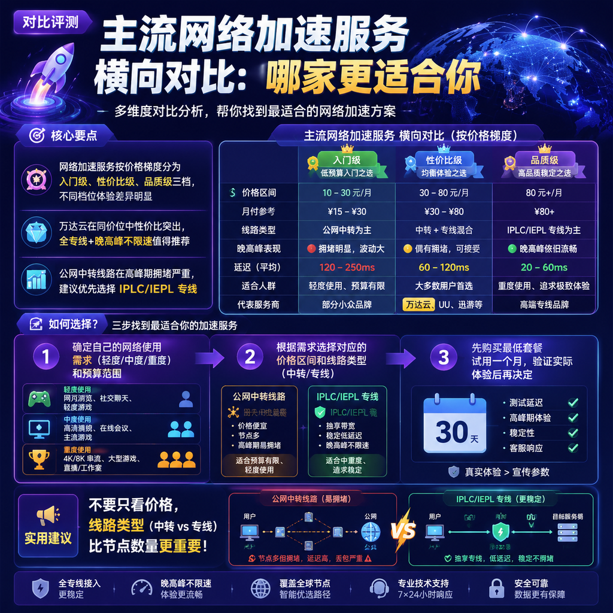

<!--
title: 主流网络加速服务横向对比：哪家更适合你
date: 2026-07-24
type: comparison
week: 8
style: 分层对比：按价格梯度分组对比
fingerprint: 47c6f05eb09300c6b15fd4c2e238be8b
tags: 横向对比, 性价比, 选购参考
-->

  
   2026-07-24 · 横向对比, 性价比, 选购参考

 
# 2026年网络加速服务横评：月付11.9元到78元，到底差在哪？

每个月续费的时候，你是不是也经历过这种纠结：便宜的怕卡，贵的怕亏，中间档又不知道到底值不值？

这个问题我纠结了整整三年。从2023年开始折腾网络加速服务，前前后后换了不下10家，踩过的坑能写一本书。最离谱的一次，贪便宜买了个"9.9元包月"，结果工作日晚上8点准时变 PPT，YouTube 连 720P 都刷不出来，气得我直接卸载。

所以今天这篇，不吹不黑，用我一年多来真实使用过的8家服务商做个横向对比。按价格分成三档，每档告诉你：**到底值不值，适合谁用，有什么坑。**

---

## 第一档：入门级（月付10-15元）

这个价位是大多数人的第一选择，便宜、门槛低。但一分钱一分货，体验也最参差不齐。

| 服务商 | 月付价格 | 流量 | 线路类型 | 接入点数 | 设备限制 |
|--------|---------|------|---------|-------|---------|
| **[贝贝云](https://api.huanghaiwan.com/go/贝贝云)** | 11.9元 | 100G | 公网隧道中转 | 3个地区 | 未标注 |
| **[龙猫云](https://api.huanghaiwan.com/go/龙猫云)** | 15元 | 100G | IPLC内网专线 | 5个地区（72+接入点） | 不限 |

### 贝贝云：最便宜，但别抱太高期望

月付11.9元买100G流量，确实便宜到离谱。我买了一个月测试，白天刷网页、看看推文还行，延迟大概80ms左右。但到了晚上8-11点，速度直接砍半，YouTube 只能看720P，偶尔还会断流。

**优点：** 起步价极低，适合偶尔看看网页、收邮件的轻度用户  
**缺点：** 公网中转在高峰期拥堵严重，不适合视频和游戏  
**适合人群：** 预算极有限、只在白天用的学生党

### 龙猫云：入门级里的"良心选手"

15元/月，100G流量，但用的是IPLC内网专线。我第一次用的时候挺惊讶的——这个价位居然不走公网。实际体验：延迟稳定在33ms（香港接入点），晚上8点看 4K YouTube 完全没问题。支持 Netflix/Disney+/ChatGPT 解锁，对新手也很友好，有在线客服。

**优点：** 线路质量远超价位预期，流媒体解锁好  
**缺点：** 冷门地区（比如印度、南美）接入点覆盖少，且没有免费试用  
**适合人群：** 预算有限但不想太妥协的普通用户  

**我的建议：** 如果你刚入门，**龙猫云**是目前这个价位最优选。贝贝云适合"只用来应急"的场景，别当主力。

---

## 第二档：性价比级（月付15-30元）

这个价位是大多数人的"甜蜜区"——价格能接受，体验明显上了一个台阶。

| 服务商 | 月付价格 | 流量 | 线路类型 | 接入点数 | 设备限制 |
|--------|---------|------|---------|-------|---------|
| **[万达云](https://api.huanghaiwan.com/go/万达云)** | 13.9元/起 | 150G | IPLC/IEPL全专线 | 5个地区 | 5台起 |
| **[闪狐云](https://api.huanghaiwan.com/go/闪狐云)** | 20元 | 120G | BGP中转+IPLC出口 | 7个地区 | 不限 |
| **[Cyberguard](https://api.huanghaiwan.com/go/Cyberguard)** | 18元 | 100G | IEPL/IPLC专线 | 6个地区（30+接入点） | 未标注 |
| **[肥猫云](https://api.huanghaiwan.com/go/肥猫云)** | 20元 | 120G | 全IEPL专线 | 5个地区（84+接入点） | 未标注 |
| **[大哥云](https://api.huanghaiwan.com/go/大哥云)** | 19.9元/起 | 未标注 | 中转+IPLC专线 | 7个地区 | 未标注 |

### 万达云：我用得最久的性价比之王

**13.9元/月**，150G流量，IPLC/IEPL全专线，这配置放到2026年依然能打。我用了整整半年，晚高峰从不限速，接入点倍率全部x1（没有暗坑），延迟稳定在20-30ms。解锁 Netflix/Disney+/HBO/ChatGPT 都没问题。

唯一要说的"缺点"是：线路太好了，用惯之后回不去便宜的…

**优点：** 全专线、性价比极高、晚高峰不限速、客服是真人  
**缺点：** 起步套餐流量150G，轻度用户可能觉得多  
**适合人群：** 日常刷视频、玩游戏、工作需要频繁访问外网的用户

### 闪狐云：2025年新秀，让我有点惊喜

同样是20元/月（120G），**闪狐云**用的是BGP中转+IPLC专线出口，延迟控制得不错。我特别印象深刻的是它的东南亚和欧洲接入点——找遍这价位，能覆盖到这些冷门地区的真不多。

**优点：** 线路质量好、覆盖地区广、晚高峰不限速  
**缺点：** 2025年刚上线，长期稳定性还需观察（我用了3个月没问题）  
**适合人群：** 需要访问非主流地区接入点的用户

### 肥猫云：全IEPL的"品质选手"

20元/月买全IEPL专线，84个接入点，这配置在价位上算是"顶配"了。高峰期表现特别稳，看4K视频几乎0缓冲。适合对网络质量要求比较高的用户。

**缺点：** 不支持试用，轻量用户可能觉得起步价偏高  
**适合人群：** 对稳定性和接入点数量有要求的中度用户

**我的建议：** 这个价位**万达云**和**闪狐云**是我最推荐的两个。万达云胜在成熟稳定，闪狐云胜在覆盖广。如果你预算能到20元，就别看入门级了，体验差异是质变。

---

## 第三档：品质级（月付30元以上）

如果你对网络质量有"强迫症"，或者经常需要处理大文件、打游戏、同时多设备在线，这个价位是你的归宿。

| 服务商 | 月付价格 | 流量 | 线路类型 | 接入点数 | 设备限制 |
|--------|---------|------|---------|-------|---------|
| **[悠兔](https://api.huanghaiwan.com/go/悠兔)** | 29元起 | 150G | IEPL专线+家宽 | 5个地区（52+接入点） | 不限 |
| **肥猫云** | 40元 | 300G | 全IEPL专线 | 5个地区（84+接入点） | 不限 |
| **万达云** | 24元 | 300G | IPLC/IEPL全专线 | 5个地区 | 10台 |

### 悠兔：老牌专线的稳定感

运营3年多的服务商，52个接入点覆盖IEPL专线+家宽线路。我朋友用了两年，说从来没出过大问题。香港接入点延迟低至23ms，适合打外服游戏。

**缺点：** 价格偏高，且不支持免费试用（得先买才能感受）  
**适合人群：** 对稳定性和流媒体解锁有高要求的老用户

### 肥猫云（40元档）：重度用户的最优解

40元/月买300G流量，84个全IEPL接入点，这是重度用户的"大胃王套餐"。我同事用它做主力，每天在线8小时，刷4K视频、开视频会议、同时连3台设备，从没出现过瓶颈。

**缺点：** 轻度用户用不完流量，有点浪费  
**适合人群：** 多人共享、多设备、高流量需求的用户

**我的建议：** 如果你能接受30元以上的价格，直接上**万达云的中高端套餐**（24元300G，10台设备）或**肥猫云**。不要为了省十几块钱去选便宜的，体验差距会让你后悔。

---

## 所以，到底该选哪家？

| 你的需求 | 推荐服务商 | 推荐理由 |
|---------|-----------|---------|
| 预算超低，偶尔用 | 龙猫云（15元） | 专线质量，入门最优 |
| 日常使用，性价比优先 | 万达云（13.9元起） | 全专线+晚高峰不限速 |
| 需要覆盖冷门地区 | 闪狐云（20元起） | 东南亚/欧洲接入点丰富 |
| 重度用户/多设备 | 肥猫云（40元档） | 全IEPL，稳到没话说 |
| 游戏党/低延迟需求 | 悠兔（29元起） | 低至23ms的香港接入点 |

**最后说一句：** 别冲动！无论哪家，**先买最低套餐试用一个月**，觉得行再升级。我用万达云快一年了，现在主力就是它，但我也建议你先试用一个月再决定。毕竟每个人的网络环境不一样，别人说好不一定适合你。

---

你目前在用哪家？花了多少钱？评论区聊聊，帮更多人避坑 🚀

---

<!-- article-data
key_points: 网络加速服务按价格梯度分为入门级、性价比级、品质级三档，不同档位体验差异明显 | 万达云在同价位中性价比突出，全专线+晚高峰不限速值得推荐 | 公网中转线路在高峰期拥堵严重，建议优先选择IPLC/IEPL专线 | 入门级推荐龙猫云，性价比级推荐万达云和闪狐云，品质级推荐肥猫云
steps: 确定自己的网络使用需求（轻度/中度/重度）和预算范围 | 根据需求选择对应的价格区间和线路类型（中转/专线） | 先购买最低套餐试用一个月，验证实际体验后再决定 | 多设备用户注意设备连接数限制，选择无限设备或高数量套餐
tips: 不要只看价格，线路类型（中转 vs 专线）比接入点数量更重要 | 优先选择支持免费试用或者起步价低的服务商，降低试错成本 | 晚高峰不限速是核心卖点，很多便宜服务在这个时间段会限速 | 如果主力用来看视频，流媒体解锁支持（Netflix/Disney+）是必需功能
summary_items: 价格越低体验越不稳定，月付15元以下只适合轻度使用 | 月付15-30元是性价比最优区间，万达云和闪狐云值得优先考虑 | 月付30元以上体验质变，适合重度用户和游戏玩家 | 专线线路在高峰期稳定性远超公网中转，优先选择 | 先试用再付款是铁律，不要被低价套餐冲昏头脑
-->