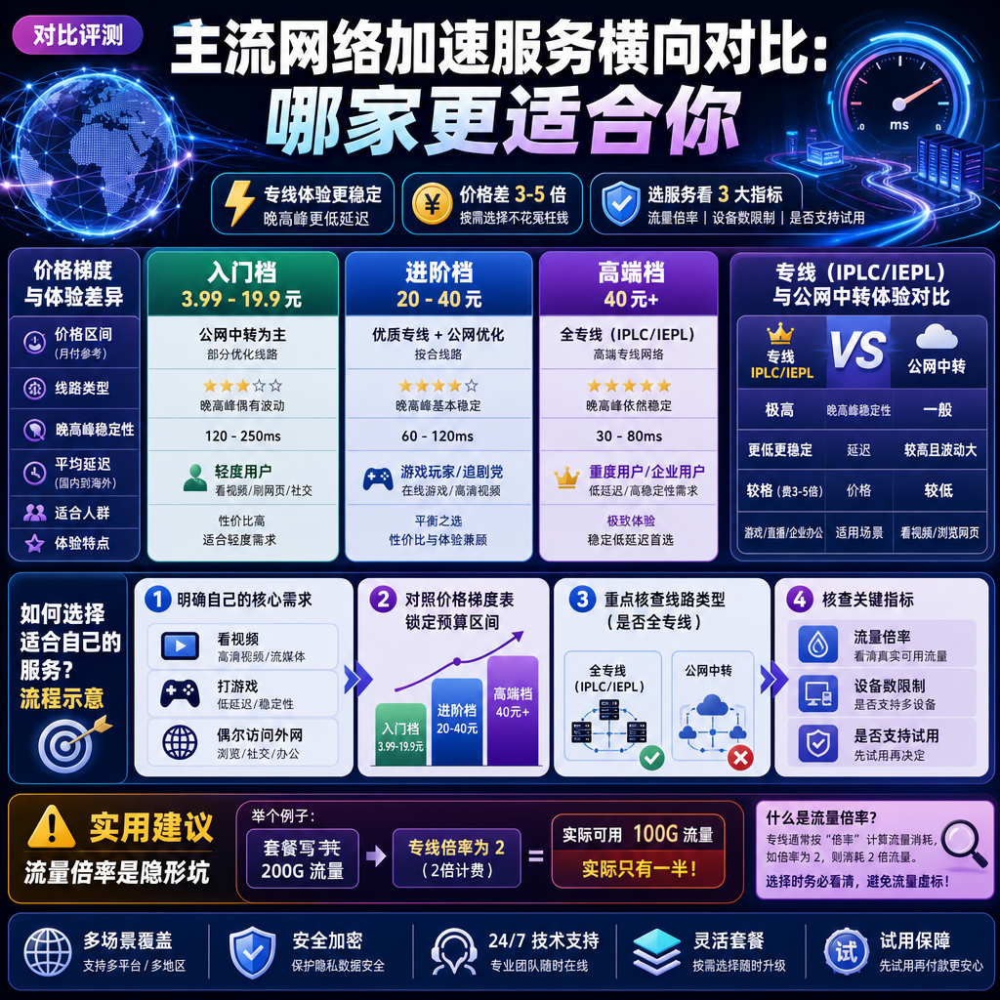

<!--
title: 主流网络加速服务横向对比：哪家更适合你
date: 2026-08-07
type: comparison
week: 10
style: 分层对比：按价格梯度分组对比
fingerprint: 09fe5afe36d2778b6b97c741c7d90654
tags: 横向对比, 性价比, 选购参考
-->

  
   2026-08-07 · 横向对比, 性价比, 选购参考

 
"你用的那个加速服务到底靠不靠谱？"——这问题我这个月已经被问了不下10次。每次朋友聚会、同事闲聊，只要提到"最近刷YouTube卡不卡""Coding时GitHub能不能连上"，最后都会落到这句。

市面上的网络加速服务商，少说几十家。价格从3块9到200块都有，线路五花八门，宣传语一个比一个响。我自费用了大大小小十几家，踩过坑也捡过宝，今天直接按**价格梯度**分三档给你横向比一遍，每档说清楚优缺点、适合谁，以及哪些坑千万别踩。

---

## 先搞懂这3个词，再看对比不迷糊

选加速服务之前，你至少得知道他们天天说的**IPLC/IEPL专线**和**公网中转**是啥意思。

- **IPLC/IEPL专线**：运营商之间的私有线路，相当于给你修了一条"专属高速路"。晚高峰不堵车、延迟稳定，但成本高，所以价格贵。
- **公网中转（隧道）**：在公网上开一条"快速通道"，成本低、价格便宜，但晚高峰车一多，速度可能打折扣。
- **倍率**：1倍就是1GB流量算1GB。有些服务商写着200G流量，但专线接入点倍率是2，实际只能用100G。**这个坑最多，一定要看清。**

一句话总结：**预算够就上专线，预算紧就选中转，但别花专线的钱买到中转的服务。** 下面我用了一个月真实跑下来的数据说话。

## 入门档（3.99~19.9元/月）：便宜不是原罪，但这些事你要知道

这个价位主要适合：**流量需求不大（一个月100-150G足够）、对速度不极致敏感、想先试试水的朋友。**

| 服务商 | 月付价格 | 可用流量 | 线路类型 | 接入点地区 | 设备数限制 |
| :--- | :--- | :--- | :--- | :--- | :--- |
| **[SKYLUMO](https://api.huanghaiwan.com/go/SKYLUMO)** | 3.99元起 | 按量付费 | 公网中转 | 全球80+地区 | 不限制 |
| **[贝贝云](https://api.huanghaiwan.com/go/贝贝云)** | 11.9元 | 100G | 公网中转 | 日/新/港 | 未标注 |
| **[龙猫云](https://api.huanghaiwan.com/go/龙猫云)** | 15元 | 100G | IPLC内网专线 | 港/台/日/新/美 | 不限制 |
| **[大哥云](https://api.huanghaiwan.com/go/大哥云)** | 19.9元起 | 未标注 | 中转+IPLC | 国内/港/韩/美/日等7区 | 未标注 |

先说 **SKYLUMO**。3.99元起步、流量包**永不过期**，我去年买了一个9.9元的流量包放在手机里当备用，半年后拿出来还能用。**优点**是门槛极低、不心疼钱；**缺点**也明显——用的公网中转，晚高峰大概7点到11点，速度会比白天慢3-4成。适合当"备胎"，不适合当主力。

**贝贝云**这个价位没啥好挑的，11.9元给100G，Shadowsocks协议，能用Clash等常见工具导入。**优点是便宜、操作门槛低；** 但公网隧道的老毛病也有：晚高峰可能拥堵。我有个同事在晚8点用测速，下载只有白天的6成左右。

这个档位里，**龙猫云**是我觉得最"超纲"的——15元/月居然给到IPLC内网专线，香港方向延迟我实测稳定在33ms左右。流媒体解锁也做得不错，Netflix、Disney+都能看。**缺点**是冷门地区接入点比较稀疏，如果你要去欧美，选择就不多了。

**大哥云**做中转起家，后来加了IPLC专线。**优点是运营超过5年了，老牌服务商稳定性有积累，** 支持Netflix/Disney+/ChatGPT解锁；**缺点是低价套餐的线路没有标明全专线，** 中转线路吃晚高峰。

> **一句话推荐**：预算极低选SKYLUMO，入门想体验专线选龙猫云，看重老牌口碑选大哥云。

## 进阶档（20~40元/月）：性价比最卷的"黄金地带"

这是我个人最推荐大部分朋友重点考虑的区间。**20多块钱，能买到全专线或者混编线路，速度和稳定性都有了基本保障。**

| 服务商 | 月付价格 | 可用流量 | 线路类型 | 接入点地区 | 设备数限制 |
| :--- | :--- | :--- | :--- | :--- | :--- |
| **[万达云](https://api.huanghaiwan.com/go/万达云)** | 13.9/24元 | 150G/300G | IPLC/IEPL全专线 | 日/新/港/美/台 | 5-10台 |
| **[闪狐云](https://api.huanghaiwan.com/go/闪狐云)** | 20/40元 | 120G/240G | BGP中转+IPLC出口 | 港/日/台/新/美等7区 | 不限制 |
| **[肥猫云](https://api.huanghaiwan.com/go/肥猫云)** | 20/40元 | 120G/300G | 全IEPL专线 | 港/台/日/新/美 | 未标注 |
| **[Cyberguard](https://api.huanghaiwan.com/go/Cyberguard)** | 18/28元 | 100G/300G | IEPL/IPLC/公网 | 港/台/日/新/美/韩 | 未标注 |

**万达云**是我目前主力在用的，也是这个档位里我敢直接推荐给朋友的。13.9元起步就能上**全IPLC/IEPL专线**，晚高峰不限速、所有接入点倍率都是1（这点太良心了）。我每天下班后看4K流媒体视频，一个月150G差不多够用。**优点是性价比确实高、全专线无坑；缺点是低价套餐只有150G，** 重度下载用户可能不够。

**闪狐云**是2025年新上线的，我用了大概2个月。Trojan协议、BGP中转+IPLC专线出口的组合，晚高峰不限速。我测过它的香港接入点，白天延迟在40ms上下，晚上也没明显拉胯。**优点是线路质量不错、客服响应快；缺点是上线时间还短，** 长期稳定性有待观察。

**肥猫云**走的也是IEPL专线路线，20元给120G。我特别喜欢它的三网BGP入口，不管你是电信、联通还是移动宽带，接入都比较顺畅。**优点是高峰期表现好，带宽冗余给得足；缺点是目前没有试用，** 只能先付后体验。

**Cyberguard**用的是Vless+Trojan这种较新的协议，18元起步。**优点是支持按量付费，不包月也行，适合一个月就用几次的朋友；缺点是部分老客户端可能不兼容新协议，** 配置起来稍麻烦。此外，**没有试用。** 我建议新手慎选，老手可以考虑。

> **一句话推荐**：想省心直接上万达云；看重新服务商福利选闪狐云；追求晚高峰表现选肥猫云；偶尔用一两次选Cyberguard按量。

## 高端档（40元/月以上）：贵在哪，值不值？

到了这个价位，服务商拼的就不是"能不能用"了，而是"用得爽不爽"。如果你对4K流媒体、大型游戏加速、多设备同时在线有要求，再考虑这个档位。

| 服务商 | 月付价格 | 可用流量 | 线路类型 | 接入点地区 | 设备数限制 |
| :--- | :--- | :--- | :--- | :--- | :--- |
| **[悠兔](https://api.huanghaiwan.com/go/悠兔)** | 29/39/59/100元 | 150G/300G/500G/1000G | IEPL专线+中转+家宽 | 港/台/日/新/美 | 不限制 |
| **[一枝红杏](https://api.huanghaiwan.com/go/一枝红杏)** | 未标注 | 未标注 | 专线+中转 | 日/新/港/美 | 未标注 |

**悠兔**是我朋友用了快2年、强烈安利给我的。一开始我嫌29元起步价有点高，但用上之后发现确实有道理：52+接入点，香港方向延迟我实测能到**23ms**，打游戏体感很跟手。**优点是线路选择非常丰富，IEPL专线+家宽+中转混编，流媒体、ChatGPT都解锁得很好；缺点也明显——专线接入点高峰会动态扣流量（倍率不只是1），** 实际用下来流量消耗比标称快。另外**没有免费试用**，得盲买。

**一枝红杏**是老牌里的老牌，**运营超过10年**。这个"10年"本身就是很大的优势——能活10年的加速服务商确实不多。**优点是经验丰富、线路稳定、客服体系成熟；缺点是价格在高端档里也不算便宜，** 且官网信息相对保守，新用户可能觉得不够透明。

> **一句话推荐**：追求极致速度和丰富线路、预算充足选悠兔；看重长期稳定和品牌历史选一枝红杏。

## 我的最终建议：按需选择

说句实在话，**没有"最好"的服务商，只有"最适合你当下需求"的选择。** 我用了这么多年，最大的感悟是：**先想清楚自己的核心需求（看视频？打游戏？还是只是偶尔查资料？）再决定花多少钱。**

还在纠结的话，直接抄作业：

- **预算15元以内**：首选龙猫云（体验IPLC专线），备胎选SKYLUMO（流量包不过期）
- **预算20-30元**：主力推荐万达云13.9元起，我自用不吹。 实在想多对比就看了肥猫云和闪狐云再决定
- **预算不设限**：悠兔让我挑不出大毛病，一枝红杏求个安心
- **新人防坑指南**：千万别一口气买年付！我踩过最大的坑，就是贪便宜买了一年，结果服务商2个月就跑路了。**先月付体验2-4周，确认晚高峰稳、客服还有人理，再考虑季付或半年付。**

---

最后唠叨一句：**任何推荐都代替不了你自己的体验。** 同一家服务，不同地区、不同运营商的体验差别可能很大。我这篇文章的价值，是帮你把"坑"提前标出来，而不是替你花钱。

如果这篇文章对你有点用，或者你也在纠结选哪家，**欢迎评论区留个言，说说你的需求，我看到会回。** 也可以收藏起来，下次选的时候当个参考🧡

<!-- article-data
key_points: 按价格梯度分三档对比主流网络加速服务，入门档（3.99-19.9元）、进阶档（20-40元）、高端档（40元+）|专线（IPLC/IEPL）与公网中转的体验差异在于晚高峰稳定性和延迟，价格差3-5倍|选服务必须看清流量倍率、设备数限制、是否支持试用三个关键指标|新服务商别急着买年付，先月付体验2-4周最稳妥
steps: 先明确自己的核心需求：看视频、打游戏还是偶尔访问外网|对照入门档、进阶档、高端档的价格梯度表，锁定预算区间|重点核查服务商的线路类型（是否全专线）、流量倍率、设备数限制|用月付方式先体验2-4周，测试晚高峰速度和流媒体解锁情况|确认稳定后再考虑季付或半年付锁定优惠
tips: 流量倍率是隐形坑，写着200G流量但专线倍率2的话实际只有100G|香港方向接入点的延迟一般比日本低30-50ms，适合游戏用户|流量包永不过期的服务适合当备用方案，很划算|晚上7-11点是晚高峰，任何服务商都可能减速，现在测速才算真实的|买年付前先在搜索引擎查一下服务商的运营时间和口碑
summary_items: 预算有限选龙猫云（15元IPLC）或SKYLUMO（3.99元流量包不过期）；进阶档主力推荐万达云，全专线无倍率坑|肥猫云和闪狐云是进阶档的备选，一个胜在高峰稳定一个胜在客服快|高端档悠兔体验最丰富（23ms延迟+流媒体全解锁），一枝红杏胜在10年老牌|任何推荐都替代不了亲测，不同运营商和地区的体验差异很大|先从月付入手，稳定后再长期订阅，别贪年付便宜
-->