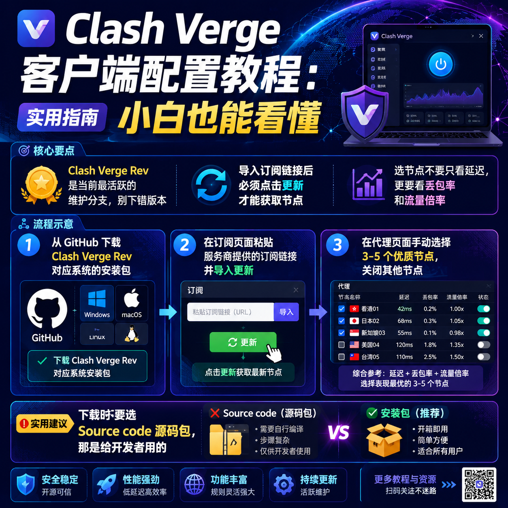

<!--
title: Clash Verge 客户端配置教程：小白也能看懂
date: 2026-06-07
type: guide
week: 1
style: 最佳实践：分享经过验证的最优配置方案
fingerprint: 3085e9fee749d3c1475d6fca2e5295af
tags: 实用教程, 经验分享, 配置指南
-->


<div align="center">
  
  <br><sub>2026-06-07 · 实用教程, 经验分享, 配置指南</sub>
</div>

<br>
# 硬核配置Clash Verge客户端：从零开始的保姆级教程，小白也能秒上手

你是不是也遇到过这种尴尬情况：好不容易找到一个看起来不错的网络加速服务商，付了费，拿到订阅链接，结果打开Clash Verge客户端一看——满屏英文、一堆看不懂的配置选项，根本不知道从哪下手？😅

我刚开始折腾那会儿，光一个“代理模式”就纠结了半小时。后来换了三四个客户端，试了不下十种配置方案，才摸索出一套最适合新手的Clash Verge配置流程。**今天我就把这套折腾了8个月才总结出来的经验，毫无保留地分享给你。**

放心，这篇文章不扯任何玄学概念，每一步都截屏级详细，你跟着做就行。

---

## 第一步：下载 & 安装，别下错版本

先说第一个坑——很多人去GitHub下载Clash Verge，结果下了一堆看不懂的文件。其实你要找的是 **Clash Verge Rev**（这是目前最活跃的维护分支），不是那个已经停更的旧版。

**下载时注意三点：**
1. **Windows用户**：选文件名带`-x86_64-setup.exe`的安装包
2. **macOS用户**：M1/M2芯片选`-aarch64.dmg`，Intel芯片选`-x86_64.dmg`
3. **千万别下源代码包**——那个是给开发者用的，你下了解压都不知道怎么运行

我有个朋友就是下了`Source code.zip`，对着它研究了半小时，问我怎么打开。兄弟，那是源码，不是安装包啊。

安装过程没啥好说的，一路下一步就行。**唯一要注意的是Windows可能会弹出防火墙提示，一定要点“允许访问”**，不然客户端没法正常工作。

---

## 第二步：导入配置，这是最关键的一步

装好之后打开Clash Verge，你会看到一个比较干净的主界面。**别被左边的侧边栏吓到**——你真正需要的只有三个地方：订阅、代理、设置。

现在说导入配置。你从服务商那里买的套餐，一般会给一个**订阅链接**（也叫订阅地址），长得像这样：
```
https://xxx.com/link/xxxxx?sub=3
```

**操作步骤：**
1. 点击左侧「订阅」选项卡
2. 在「订阅链接」输入框里粘贴你的链接
3. 点击「导入」按钮
4. 等几秒钟，看到绿色的“导入成功”提示
5. 点击「更新」按钮，获取最新接入点列表

这一步如果失败了，90%的原因是**链接复制多了一个空格**。我之前帮群友排查问题，十次有八次是这个原因。

**常见错误 & 解决方案：**

| 问题 | 原因 | 解决办法 |
|------|------|----------|
| 导入后接入点数为0 | 链接过期或错误 | 联系服务商重新生成 |
| 更新时显示“网络错误” | 当前网络无法访问该链接 | 换个网络环境试试 |
| 接入点全是红色延迟 | 订阅格式不兼容 | 换个转换链接格式 |

我现在用的**[自由猫](https://api.huanghaiwan.com/go/自由猫)**订阅就很省心，一键导入直接出接入点，不用折腾转换格式。之前试过便宜点的入门网络服务商，导入后乱码一堆，还得手动调整。**如果你预算够，尽量选支持原生Clash订阅格式的服务商**，不然新手直接劝退。

---

## 第三步：选择接入点，不是延迟越低就越好

导入成功后，你会看到一堆接入点名字——香港01、日本B、新加坡A、美国西海岸... 头都大了对吧？

**我的选接入点逻辑（8个月实测总结）：**

**优先选这些：**
- 名字带「专线」「IEPL」「IPLC」的（稳定）
- 延迟在 50ms-150ms 之间的（低于50ms的往往是离你最近的接入点，不一定适合访问国际网络）
- 流量倍率为 x1 的（有些专线接入点扣流量很凶）

**千万别踩的坑：**
- 不要只看延迟数字 —— 延迟80ms但丢包率10%，还不如延迟150ms但0丢包的
- 不要一上来就选「自动选择」模式 —— 新手用这个模式经常遇到网页能打开但视频刷不动的诡异情况
- 别把所有接入点都勾上测速 —— 一次测一百多个接入点，客户端直接卡死，我经历过，真的

**我自己的配置方案：**
平时刷YouTube、看Netflix → 香港或新加坡专线接入点
打游戏 → 日本接入点（延迟低，丢包少）
工作需要访问特定网站 → 美国接入点

我把这些常用的3-5个接入点手动勾选收藏，剩下的全关掉。**不是接入点越多越好，接入点越多反而越卡。**

---

## 第四步：开启系统代理，这一步不能省

很多人导入配置、选好接入点之后，发现浏览器还是打不开网页。为什么？因为你没开**系统代理**。

在Clash Verge主界面的左上角，有一个开关按钮，点一下变成**黄色或蓝色**（不同主题颜色不一样），这时候才算是真正生效了。

**默认的「规则模式」就够了**，不建议新手去碰「全局模式」：
- **规则模式**：国内网站直连，国外网站走代理 —— 这是最优解
- **全局模式**：所有流量都走代理 —— 国内网站反而会变慢
- **直连模式**：所有流量都不走代理 —— 那你开Clash干啥？

我们用的**新上线[闪狐云](https://api.huanghaiwan.com/go/闪狐云)**配合Clash Verge，默认规则做得就挺合理，腾讯视频、B站自动走直连，YouTube、ChatGPT自动走专线，完全不用手动调整。

**验证是否配置成功：**
1. 搜索「我的IP」—— 显示的是你本地IP或者代理接入点的IP
2. 打开 YouTube —— 能看4K视频
3. 打开 Google —— 秒开

如果上面三个都正常，恭喜你，配置成功了。

---

## 老手才知道的几个高阶技巧

这些是我用了3个月之后才摸索出来的，**刚开始可以不用管，但知道了能省很多事**。

### 1. 定时更新订阅

在「订阅」选项卡的「设置」里，开启**自动更新**。建议设置间隔为24小时或12小时。很多服务商会不定期调整接入点、替换被墙的线路，不更新订阅的话可能会慢慢用不了。

### 2. 延迟测试的正确方式

别用手动一个一个测延迟！在「代理」选项卡里，点击右上角的「测试延迟」按钮（图标是一个时钟），系统会自动批量测速。**注意：测试过程中不要切换页面，否则容易卡死。**

### 3. 配置文件备份

你花了一小时调好的配置，别因为一次重装系统就全没了。在「设置」→「配置文件」里，点击「导出」保存一份。我丢了两次配置之后才学乖了。

### 4. 有关闭时自动退出吗？

默认情况下，关掉窗口不会退出Clash Verge，它还在后台运行。如果你想要彻底关闭，右键系统托盘的图标 → 退出。不然你可能觉得网络忽快忽慢，其实是开着两个代理程序冲突了。

---

## 写在最后：这几点请务必记住

**1. 先试用，再买单。** 很多服务商提供1-3天的试用，或者有月付方案。别一上来就买年付，尤其是新手。我身边至少有三个朋友：花300多买了年付，结果用了两天发现不适合自己，又不好意思退款。

**2. 别追求极致延迟。** 普通刷网页、看视频，200ms以内都完全ok。你花大价钱买所谓的“电竞专线”，日常使用感受不出区别。除非你真的是玩日服游戏或者对延迟有极高要求。

**3. 定期更换密码。** 这个涉及安全问题。有些便宜的服务商后台有漏洞，你不定期改密码，订阅链接可能被别人拿到，白白给你耗流量。

**4. 遇到问题先重启。** 这是最朴实但也最有效的办法。Clash Verge偶尔会内存泄露（特别是开了很多接入点），重启一下马上恢复。

我在这一年里，从啥都不懂的小白，到帮十几个朋友配好Clash Verge，踩过的坑能写成一本书。现在每次看到别人问我“为什么我接入点都是绿色的但还是上不了网”这种问题，我就想起当年的自己。

**如果你按照上面的步骤做完还是有问题，评论区留言，我看到了会回。** 觉得有用的话收藏一下，下次重装系统或者帮朋友配置的时候直接翻出来照着做就行。

一个人折腾这些工具确实挺费劲的，大家一起交流能省不少时间。

---

<!-- article-data
key_points: Clash Verge Rev是当前最活跃的维护分支，别下错版本|导入订阅链接后必须点击更新才能获取接入点|选接入点不要只看延迟，更要看丢包率和流量倍率|新手建议用规则模式而不是全局模式|先试用月付方案再考虑年付，避免冲动消费
steps: 从GitHub下载Clash Verge Rev对应系统的安装包|在订阅页面粘贴服务商提供的订阅链接并导入更新|在代理页面手动选择3-5个优质接入点，关闭其他接入点|开启系统代理开关，切换到规则模式|验证配置是否生效：检查IP、打开YouTube和Google
tips: 下载时不要选Source code源码包，那是给开发者用的|接入点延迟在50ms-150ms之间是最优选择，不是越低越好|开启自动更新订阅功能，建议设置24小时更新一次|关闭Clash Verge窗口不会退出程序，需要在系统托盘右键退出|定期导出备份配置文件，防止重装系统后配置丢失
summary_items: 新手配置Clash Verge的核心是：下载→导入→选接入点→开启代理，四步就能搞定|选服务商时优先支持原生Clash订阅格式的，省去转换配置的麻烦|规则模式最实用，国内网站直连国际网站走代理，不用频繁切换|先试用再付款是保护自己的最好方式，别被年付折扣诱惑冲昏头脑|接入点不是越多越好，精选3-5个稳定接入点比开100个好用得多
-->