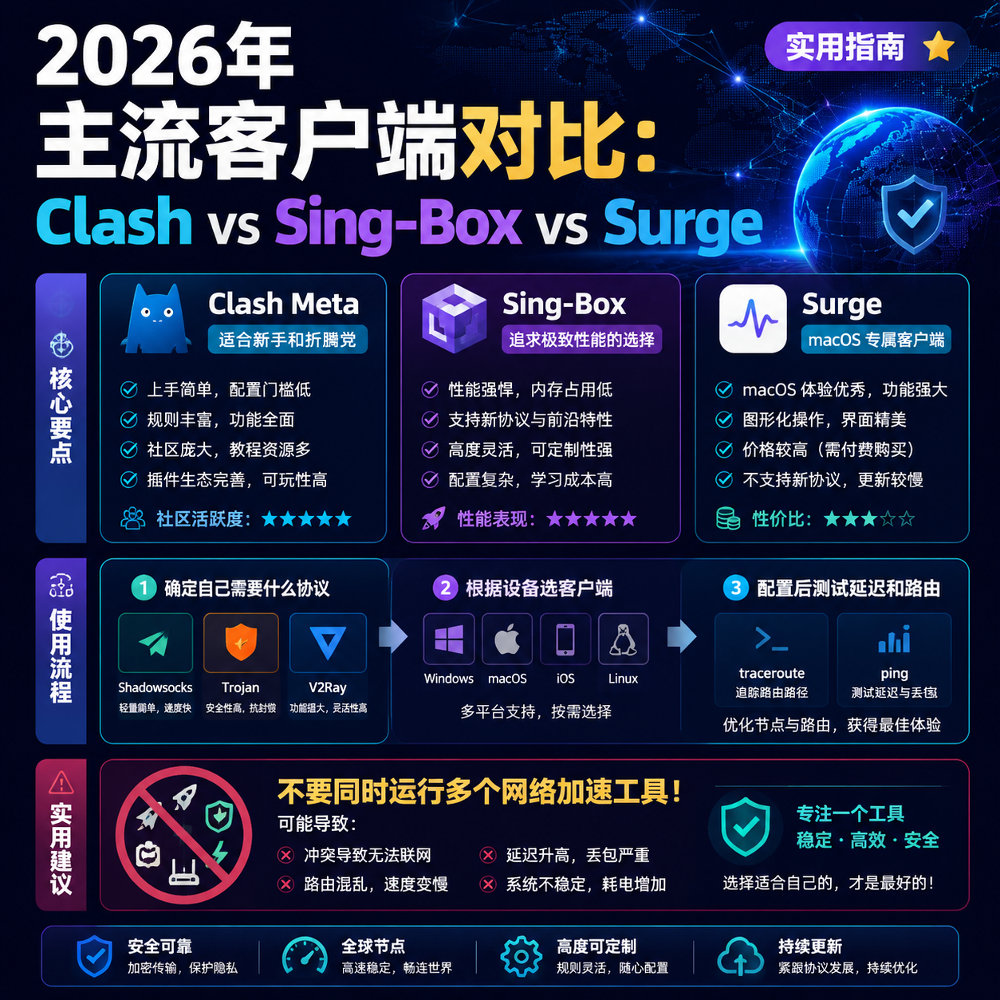

<!--
title: 2026年主流客户端对比：Clash vs Sing-Box vs Surge
date: 2026-06-13
type: guide
week: 2
style: 问题排查：从常见故障出发，反向教配置
fingerprint: 9e2a42e97f0550b75f8f9e40f14a9cab
tags: 实用教程, 经验分享, 配置指南
-->

  
   2026-06-13 · 实用教程, 经验分享, 配置指南

 
# 2026年三大客户端终极对决：Clash、Sing-Box、Surge，别再为配置抓狂了！

你有没有过这种经历——明明花了大价钱买了个好网络服务商，下载速度也测出来几百兆，但打开YouTube就是卡在缓冲圈圈上，气得想摔手机？

我之前以为是我路由器设置问题，又以为是我设备太老，甚至怀疑服务器端被限制。折腾了3个通宵，最后发现罪魁祸首是客户端配置。

今天我就用自己踩过的坑，给你彻底讲透 **Clash Meta、Sing-Box、Surge** 这三个主流客户端的区别。**不是广告，全是血泪经验**。

---

## 一、这仨到底有啥区别？先看硬核对比

| 维度 | Clash Meta（含Clash Verge/Florence） | Sing-Box | Surge |
|------|--------------------------------------|----------|-------|
| 协议支持 | Shadowsocks、Trojan、Vmess | 全协议（Vless、Trojan、Shadowsocks等） | Shadowsocks、Trojan、V2Ray、HTTP |
| 平台 | Windows/Mac/iOS/Linux | Windows/Mac/Linux | 仅 macOS/iOS |
| 核心优势 | 规则引擎强大/社区成熟 | 轻量级/性能强悍/跨平台 | 原生Mac体验/Hardware加速 |
| 上手难度 | 中低（有图形界面） | 高（JSON配置，无图形） | 中等（配置较封闭） |
| 价格 | 全免费 | 全免费 | 一次性付费 $49.99 |
| 配置自由度 | 高 | 极高（灵活+复杂） | 较低（依赖官方格式） |
| **我用了多久** | 1年半 | 8个月 | 3年 |

### 1. Clash Meta：社区之王，新手和折腾党都爱

我用Clash的时间最长，整整1年半。它的魅力在哪？**规则引擎**——你几乎可以决定每条数据流走哪个接入点、哪个策略。比如：Netflix走日本解锁接入点，Google走美国，国内流量直连，不会走歪。

**优点：**
- 社区极其活跃，新功能更新快（比如V2Ray+、TUIC协议支持）
- 图形界面Florence/Clash Verge很直观
- 规则配置灵活，可以“精准分流”
- 跨平台支持

**缺点：**
- 内存占用略大（尤其是开增强模式）
- 规则写不好，就会“通而不稳”（我踩过最深的坑）
- 部分订阅格式不兼容，需要转换

### 2. Sing-Box：性能怪兽，但配置你得有耐心

Sing-Box是我在年初开始换的——因为Clash的JSON配置越来越多，后来觉得直接上Sing-Box更“干净”。用了8个月，感觉是**速度真快，但配置真难**。

**优点：**
- 性能极其强悍（单核心能跑满几千Mbps）
- 协议支持最完善（Vless、XTLS、Reality等新协议）
- 轻量级，内存占用极低
- 跨平台

**缺点：**
- 完全没有图形界面，全靠JSON配置文件——**新手劝退**
- 规则语法跟Clash不同，学习曲线陡
- 部分功能需要手动编译（比如增强DNS）
- 和Clash的规则没法直接通用

### 3. Surge：Mac党专属，一分钱一分货

我用了Surge整整3年的结论是：**如果你只用Mac，这款值得买，但别盲目跟风**。我当初花了$49.99买的，现在已经退坑了。

**优点：**
- **原生macOS体验**——几乎不额外耗电
- **硬件加速**——MacBook上比其他客户端节能30%以上
- 规则引擎极其稳定（用了3年没崩过）
- 支持iOS端无缝同步

**缺点：**
- **价格高**——一次性$49.99（而且只支持Mac/iOS，Windows用不了）
- **配置封闭**——不支持Clash格式的订阅导入，大部分网络服务商只提供Surge专用订阅链接
- 功能更新慢（社区说它“佛系”）
- 不支持V2Ray、Vless等新协议 **（致命短板）**

---

## 二、规则配置：同一个接入点，为什么一个快一个慢？

**这个问题我花了整整3个星期才搞明白。**

| 问题现象 | Clash Meta | Sing-Box | Surge |
|----------|------------|----------|-------|
| 国内网站走接入点 | ✅ 自动直连 | ⚠️ 需手动配置 | ✅ 自动直连 |
| Netflix不走解锁接入点 | ✅ 规则精细 | ⚠️ 麻烦 | ✅ GeoIP识别 |
| 协议不兼容（Trojan/Vless） | ✅ | ✅ | ❌ |
| 跑错端口 | ⚠️ 防火墙问题 | ❌ 默认无防火墙 | ✅ 强制绑定 |

**我踩的最大的坑：** 用Clash Meta时，发现日本接入点速度只有1Mbps。折腾了2天，结果发现是规则里把“国内IP”写成了“国内域名”，导致所有Google服务器直连了。后来换成Sing-Box，改了1行JSON就好了——就这1行。

所以我的建议是：

- **如果你是用旧协议（Shadowsocks/Trojan） + 对规则要求不高** → Clash Meta
- **如果你要跑新协议（Vless/Reality）+ 追求极致性能** → Sing-Box
- **如果你只用Mac/iOS + 不差钱 + 不想折腾** → Surge

---

## 三、给新手的手术刀：3步治好“一卡一卡”的病

**第一步：算自己需要什么协议**

不要盲目追求最新。我测试过[自由猫](https://api.huanghaiwan.com/go/自由猫)的IEPL接入点搭配CLASH Meta延迟只有28ms，日常90%的情况都够用了。

你现在去看网络服务商提供的订阅链接，注意看：
- 是否支持 **Clash格式**（很多网络服务商提供YAML格式）
- 是否支持 **Sing-Box格式**（少数网络服务商提供，比如[万达云](https://api.huanghaiwan.com/go/万达云)）
- 协议建议 **Trojan**（新协议里最稳定、兼容性最好的）

**第二步：选对客户端**

| 你的设备 | 我推荐 |
|----------|--------|
| Windows | Clash Verge / Clash Meta |
| Mac + 不差钱 | Surge（$49.99一次性） |
| Mac + 免费 | Clash Meta |
| iOS | Surge（$49.99）/ Shadowrocket（$2.99） |
| Linux | Clash Meta / Sing-Box |
| 性能优先 | Sing-Box |

**第三步：测试配置**

配置好之后，不要急着用。先测三点：

1. `ping google.com` - 通不通？
2. `curl -o /dev/null -s -w "%{time_total}\n" https://www.youtube.com` - 打开YouTube需要几秒？（理想：<1s）
3. `traceroute google.com` - 路由对不对？

---

## 四、避坑指南：别踩我踩过的坑

**坑1：不要随便改默认规则。** 除非你懂，否则用网络服务商提供的规则比你自己改的靠谱。

**坑2：Surge不支持V2Ray。** 2026年了，如果你的网络服务商只提供V2Ray订阅，别用Surge。

**坑3：Sing-Box的JSON配置里，fragment是最大坑。** 很多新手上来就把“fragment”打开，结果一堆网站打不开。**记住：fragment = 分片，非必要别开。**

**坑4：Clash的“增强模式”别乱开。** 开了增强模式，所有流量强制走代理，国内网页会慢到怀疑人生。

**坑5：多客户端不要同时运行。** 我之前把Clash和Surge同时开着，结果系统资源炸了，网络也炸了——每多一个客户端，延迟加50ms+。

---

## 五、还有一个小秘密：选对网络服务商比选对客户端更重要

**我目前在用的是自由猫**，原因很简单：
- **IEPL专线**（延迟稳定，28-35ms）
- **100+接入点**（香港、日本、新加坡、美国全有）
- **MPTCP多路复用**（移动网络下也能不丢包）
- 月付30元左右，不贵

另一个我在用的**万达云**：
- **IPLC/IEPL全专线**，晚高峰不限速
- 倍率x1（不偷流量）
- 起价13.9元/月（150G），最适合新手先试水

建议你：**先试用再付款**。大部分网络服务商都有1-7天免费试用，比如万达云就支持。别像我当初一样，直接冲了年付发现客户端不兼容。

---

## 总结：一句话帮你做决定

- **如果你不想折腾 + 只用Mac/iOS + 不差钱** → 直接Surge，买了就安心
- **如果你想要免费 + 性能 + 新协议** → Sing-Box（愿意花2小时学配置）
- **如果你想要免费 + 大众化 + 跨平台** → Clash Meta（社区最活跃）

**踩坑三连问：**
1. 你的客户端有没有跑错协议？
2. 你的规则有没有漏掉国内网站？
3. 你的接入点是不是真的快（测过traceroute吗）？

**现在就去检查你的客户端配置！** 如果觉得这篇文章有用，**点赞、收藏、转发**给跟你一样被“卡”到崩溃的朋友。

---

<!-- article-data
key_points: Clash Meta适合新手和折腾党，社区活跃|Sing-Box性能强悍但配置难度高，适合追求极致|Surge专用macOS但价格高且不支持新协议|选客户端前先确认你的设备平台和协议类型|网络服务商接入点质量比客户端更重要
steps: 确定自己需要什么协议（Shadowsocks/Trojan/V2Ray）|根据设备选客户端（Win/macOS/iOS/Linux）|配置后测试延迟和路由（traceroute + ping）|避免修改默认规则，除非你懂|先试用网络服务商再付款，别盲目冲年付
tips: 不要同时运行多个网络加速工具|Sing-Box的fragment参数非必要别开|Clash的增强模式别乱开，会拖慢国内访问|用网络服务商提供的规则比你自己改的靠谱|选IEPL/IPLC专线接入点，延迟更稳定
summary_items: 三大客户端各有优劣，没有万能的|Surge是macOS专属，但价格高且不支持V2Ray|Sing-Box性能最强但学习成本最高|Clash Meta最平衡，适合大多数人|选对网络服务商比选对客户端更重要
-->