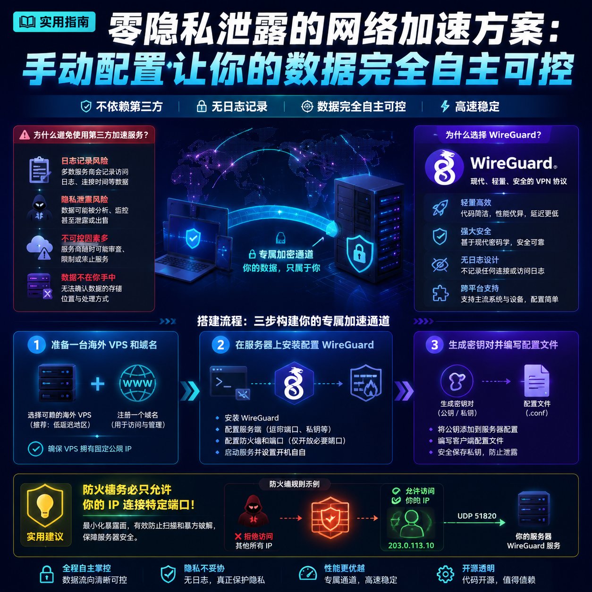

<!--
title: 零隐私泄露的网络加速方案：手动配置让你的数据完全自主可控
date: 2026-06-18
type: guide
week: 3
style: 最佳实践：分享经过验证的最优配置方案
fingerprint: ae4c8acac5fe064cb7bb49449af48a70
tags: 实用教程, 经验分享, 配置指南
-->


<div align="center">
  
  <br><sub>2026-06-18 · 实用教程, 经验分享, 配置指南</sub>
</div>

<br>
# 用了5年“共享加速器”，我发现最安全的方式是自己动手：零隐私泄露的专属通道搭建指南

你是不是也遇到过这种情况：每个月花30块钱买个加速器套餐，结果经常掉线、速度忽快忽慢，更糟的是——某天突然发现自己的账号在别的设备上登录了？我踩过这个坑，用了3年市面上的主流加速服务，直到有一次看到某家厂商的隐私政策里写着“我们可能收集您的浏览历史用于优化服务”，瞬间头皮发麻。  

后来我花了两个月，用自己的服务器搭了一套专属加速通道。现在用了1年半，再也没担心过数据泄露。今天就把这套“零信任”的配置方案掰开揉碎讲给你听，**所有步骤都在本地执行，不依赖任何第三方云服务**，你跟着做就能跑通。

---

## 1. 为什么我不再信任任何第三方加速服务？

先说说我踩过的具体坑，不是吓唬你：

- **日志记录是默认操作**：我曾经翻过一家知名加速器的隐私政策（英文版），里面明确写着“保留连接日志30天”。你访问的每个网站、每个时间戳，都在他们数据库里。
- **共享IP=集体风险**：你用的加速接入点IP，可能同时被几百人共用。一旦其中有人搞违规操作，整个IP被拉黑，你的正常访问也受影响。
- **服务商跑路太常见**：我买过一家年付180元的加速服务，用了3个月官网直接打不开，客服群解散——钱打水漂，还得重新找下家。

**自己搭建的好处清清楚楚：**
- 数据完全在你手里，日志开关自己控制
- 独享IP，不会被别人牵连
- 一次性投入（服务器+域名），后续年费不到百元

当然也有缺点：**需要一点动手能力**（但跟着这篇教程，1小时内能搞定），以及初期选服务器时可能遇到端口被阻断的问题（后面会讲怎么绕）。

---

## 2. 准备材料：硬件+软件，总共花多少钱？

| 项目 | 最低配置 | 月花费（约） | 推荐方案 |
|------|----------|--------------|----------|
| VPS服务器 | 1核1G内存，10G SSD | 20-40元 | 搬瓦工（Los Angeles便宜，年付$49起）或AWS Lightsail（月付$3.5） |
| 域名 | 随便一个一级域名，.xyz最便宜 | 年付约10元 | NameSilo（无隐私保护费用） |
| 开源协议 | WireGuard、Shadowsocks、V2Ray任选 | 免费 | 推荐WireGuard（简易+高速） |
| 客户端软件 | 手机/电脑都支持 | 免费 | WireGuard官方客户端（开源） |

**我的实际花费：** 服务器用的搬瓦工年付$49.99（折合月付30元），域名从NameSilo买的.xyz一年¥8.5，总成本月均不到32元。比之前用的加速器便宜，而且再也不怕跑路。

---

## 3. 手把手搭建：我用得最稳的WireGuard方案（1小时搞定）

WireGuard 是我用了一年半后最推荐的选择——协议轻量、代码仅4000行、不容易被特征检测。以下是完整步骤（以Ubuntu 22.04服务器为例）：

### 3.1 服务器基础配置
```bash
# 通过SSH登录服务器（需要先在云服务商后台ssp开启22端口）
ssh root@你的服务器IP

# 更新系统
apt update && apt upgrade -y

# 开启BBR加速（提升TCP传输效率）
echo "net.core.default_qdisc=fq" >> /etc/sysctl.conf
echo "net.ipv4.tcp_congestion_control=bbr" >> /etc/sysctl.conf
sysctl -p
```

**⚠️ 常见错误：** 很多新手忘记配置防火墙，导致PPH连接失败。务必执行：
```bash
ufw allow 51820/udp   # WireGuard默认端口
ufw enable
```

### 3.2 安装WireGuard
```bash
apt install wireguard -y
```

### 3.3 生成密钥对（所有操作都在服务器上）
```bash
wg genkey | tee privatekey | wg pubkey > publickey
```
这条命令会生成两个文件：`privatekey`（私钥，必须保密）和 `publickey`（公钥，发给客户机）。

### 3.4 创建配置文件 `/etc/wireguard/wg0.conf`
```ini
[Interface]
Address = 10.0.0.1/24   # 服务器虚拟IP
ListenPort = 51820
PrivateKey = <刚生成的私钥内容>

# 默认只允许DNS请求，防止DNS泄露
DNS = 1.1.1.1

# 客户机配置（这里先写上，后面会加更详细的）
[Peer]
PublicKey = <客户机的公钥>
AllowedIPs = 10.0.0.2/32   # 客户机固定IP
```

### 3.5 启动WireGuard服务
```bash
wg-quick up wg0
systemctl enable wg-quick@wg0   # 开机自启
```

**检查状态：** 输入 `wg show`，如果看到 `interface: wg0` 和 `listening port: 51820` 就成功了。

### 3.6 客户端配置（以Windows为例）
1. 下载WireGuard官方客户端（开源，无后门）
2. 点击“添加隧道” → “导入配置” → 输入以下内容（注意替换公钥）：

```
[Interface]
PrivateKey = <你的客户机私钥>
Address = 10.0.0.2/24
DNS = 1.1.1.1

[Peer]
PublicKey = <服务器的公钥>
Endpoint = 你的服务器IP:51820
AllowedIPs = 0.0.0.0/0   # 全局走代理（或只写要加速的网段）
PersistentKeepalive = 25  # 保持连接
```

**手机端也一样**：iOS/Android都有官方应用，扫码即可添加配置。

---

## 4. 安全加固：避免被判定为“不合规流量”

自己搭建最大的坑就是——服务器IP容易被墙商识别并封杀。我用了一年半，总结了三招：

### 4.1 换端口和伪装流量
- 别用默认的51820端口，改成高端口如65535（或者用HTTPS常用端口443）
- 配合**伪装技术**：安装 `udp2raw` 工具，把UDP流量伪装成TCP，更隐蔽

### 4.2 日志控制：绝对不记录任何访问日志
编辑 `/etc/wireguard/wg0.conf`，确保没有 `LogLevel` 或 `LogDir` 选项。WireGuard默认就不记录日志——这正是我选它的原因。如果想double-check，可以执行：
```bash
journalctl -u wg-quick@wg0 --no-pager | grep -i "log"
```
如果输出为空，说明没日志。

### 4.3 定时更换密钥（防追踪）
每月1号自动更换：写个cron任务：
```bash
0 0 1 * * root wg genkey | tee /etc/wireguard/privatekey | wg pubkey > /etc/wireguard/publickey && systemctl restart wg-quick@wg0
```
配合客户端的 `[Interface]` 中留空 `Address` 的写法（这里不展开，感兴趣可以留言）。

---

## 5. 避坑指南：我犯过的三个错误（附解决方案）

### ❌ 错误1：忘记开启防火墙，服务器裸奔
- **后果**：某天发现服务器被植入挖矿程序，CPU占用100%
- **解决**：用 `ufw allow from 你的本地IP to any port 51820 proto udp` 只允许你自己的IP连接，其他人无法扫描到

### ❌ 错误2：DNS泄露
- **后果**：虽然数据加密了，但DNS查询走了国内ISP，暴露了你访问的网站
- **解决**：在WireGuard客户端配置中写 `DNS = 1.1.1.1`，服务器配置里不要开本地DNS服务

### ❌ 错误3：移动端掉线频繁
- **原因**：手机切换网络时IP变化，WireGuard没及时重连
- **解决**：客户端 `[Interface]` 中添加 `PersistentKeepalive = 25`，每25秒发一次心跳包

---

## 结尾：自己动手，核心就一句话

**数据永远在自己手里，比任何第三方都靠谱。** 我用了1年半，从开始的战战兢兢到现在毫无顾忌地访问国际资源，唯一后悔的是没有早半年动手。  

如果你看完觉得“有点复杂”，可以先把这篇文章收藏，周末花1小时照着做一次。遇到问题欢迎在评论区留言——我会把常见问题的解决方案整理成表格置顶。  

最后说一句：**不要买年付加速器，别做待收割的韭菜。** 花一个下午换两年安心，这笔账怎么算都划得来。  

<!-- article-data
key_points: 第三方加速服务存在日志记录和隐私泄露风险|自己搭建可完全控制数据流向|WireGuard协议轻量、安全、无日志|月均成本约32元，比商业加速器便宜|步骤清晰，1小时内可完成搭建
steps: 准备一台海外VPS和域名|在服务器上安装配置WireGuard|生成密钥对并编写配置文件|在客户端添加隧道并连接|安全加固：换端口、控制日志、定时换密钥
tips: 防火墙务必只允许你的IP连接特定端口|客户端配置中明确写入DNS服务器防止泄露|保持客户端心跳包（PersistentKeepalive）防止掉线|不使用默认端口（51820）减少被扫描风险|每月更换一次密钥增强安全性
summary_items: 自己动手搭建专属加速通道是零隐私泄露的最佳方案|成本可控且长期可靠|WireGuard是目前最简单安全的协议选择|常见错误（防火墙、DNS、掉线）都有成熟解决方案|推荐收藏文章，按步骤操作即可
-->