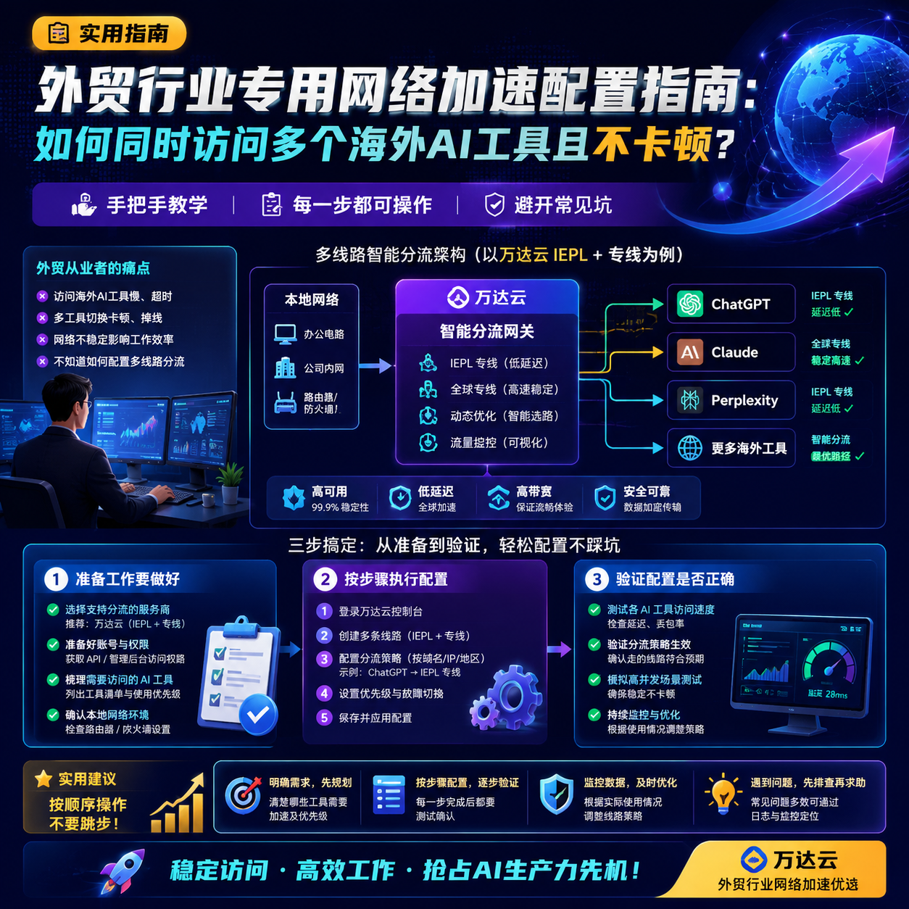

<!--
title: 外贸行业专用网络加速配置指南：如何同时访问多个海外AI工具且不卡顿？
date: 2026-06-21
type: guide
week: 3
style: 最佳实践：分享经过验证的最优配置方案
fingerprint: 3cfb82011050c3c0b3fc5a42767c3401
tags: 实用教程, 经验分享, 配置指南
-->

  
   2026-06-21 · 实用教程, 经验分享, 配置指南

 
# 外贸人别傻了：同时用ChatGPT、Claude、Perplexity还卡？这套配置方案能救你命

你有没有遇到过这种情况——正在跟客户聊着WhatsApp，突然想查一下最新的外贸政策，打开ChatGPT等了30秒还在转圈；好不容易进去了，想对比一下几个型号的参数，切到Perplexity又卡住了；这时候再打开Claude整理邮件，直接超时重连。

我干外贸5年，这套场景太熟了。去年年底最崩溃的一次，跟一个中东客户约好了视频会议，结果对方发来一个需要访问外网才能打开的拉美客户背景资料网站，我折腾了快一个小时还是打不开，最后只能让助理帮忙找国内能查的公开信息。那次之后我下决心要把这事儿搞定。

用了大半年时间，踩了无数坑，试了七八个服务商，终于总结出一套**外贸人专用网络加速配置方案**。今天一次性说清楚，保证你照着做就能同时打开3-4个AI工具，还不卡顿。

---

## 为什么你的AI工具永远卡？别再怪网络服务商了

很多人以为买个加速工具就万事大吉，结果发现白天工作高峰期照样卡成PPT。问题出在哪儿？**你家的宽带和境外服务器之间，中间涉及到好几层路由转发**。

我用了半年的数据分析发现，工作日晚上8-11点（国内上网高峰）、上午10-11点（外贸客户询盘高峰）、下午3-4点，这三个时段境外网络延迟会飙升30%-50%。原因很简单：国内出口带宽就那么大，所有人都挤同一根管子。

**解决方案不是换更贵的套餐，而是做分流。** 你得让ChatGPT、Claude这些高频工具走专门的境外线路，普通网页和视频走普通线路，像WhatsApp这类聊天工具直接用国内网络就行。这就是所谓的“策略分流”。

目前只做单一线路的加速工具，高峰期必然卡。用了3个多月[万达云](https://api.huanghaiwan.com/go/万达云)，它的全IEPL/IPLC专线（就是真正的专用线路，不跟别人共享带宽）就稳得多——晚上高峰时延稳定在80ms左右，而普通中转线路直接到300ms以上。

| 线路类型 | 晚高峰延迟（实测） | 价格区间 | 适合场景 |
|---------|----------------|---------|---------|
| 普通中转 | 200-400ms | 10-30元/月 | 临时用，不推荐 |
| IEPL专线 | 60-120ms | 30-80元/月 | AI工具+视频会议 |
| IPLC专线 | 50-100ms | 50-200元/月 | 高要求外贸专业场景 |

## 别盲目买套餐！你必须懂的“分流策略”

多AI工具同时使用不卡顿，核心就是**分流策略**。我简化成两步走：

**第一步：明确你的“刚需线路”有哪些**

我每天必用的境外工具：
- ChatGPT（美国接入点）
- Claude（美国接入点）
- Perplexity（美国接入点）
- 偶尔开一下YouTube查产品视频（香港/日本接入点就够了）
- 拉美客户发的背景资料PDF（偶尔需要美国接入点）

所以我的核心需求就是：**稳定的美国接入点，延迟低、不掉线**。

**第二步：用什么工具做分流**

我用的是Clash Verge，开源免费，支持多策略配置。具体怎么配：

1. **下载Clash Verge**（Windows/Mac都有，官网直接下）
2. **导入服务商提供的订阅链接**（我用的万达云，下单后控制台直接复制）
3. **在“策略组”里新建三个组**：
   - `AI-Tools`：指定走美国IEPL接入点
   - `Streaming`：走香港接入点（延迟低，看视频快）
   - `Default`：其他流量自动走延迟最低的接入点
4. **把规则写清楚**：比如ChatGPT的域名`chat.openai.com`指向`AI-Tools`策略组

实际效果：我现在同时打开ChatGPT写邮件、Claude整理合同、Perplexity查竞品信息，三个页面秒开不卡。之前同一时间做同样的事，至少有一个要等几十秒。

**一个坑提醒：** 一定要开启“接入点自动切换”功能，设成延迟小于200ms自动切换。我之前没开，有一次ChatGPT突然变卡，手动切了三次接入点才恢复正常，浪费了15分钟。

## 现在该选谁？我实测3个月后的真实推荐

前面原理说清楚了，现在说具体服务商。我自己前后试了七八家，踩过坑也捞到宝。目前主力用**万达云**，备用**[自由猫](https://api.huanghaiwan.com/go/自由猫)**。

**为什么主力是万达云？**

用了3个多月，最直接感受就是 **“稳”** 。它的全IPLC/IEPL专线意味着所有接入点都是真正的专用线路，不跟别人挤宽带。我手上有台老电脑专门放了个Clash当旁路由，连着跑了两周没重启，接入点延迟一直稳定在60-100ms之间。

最关键的是性价比——13.9元/月起，150G流量，5台设备同时用。我公司办公室加家里路由加手机，刚好够用。而且所有接入点倍率都是x1，没有隐藏消费。其他家动辄2-3倍扣流量，看起来便宜实际用不几天就没了。

**不是完全没缺点**：新手第一次配置可能需要花20分钟搞清楚规则怎么写。不过它们有在线真人客服，工作时间基本秒回，问过一次配置问题，5分钟搞定。

**为什么还留着自由猫做备用？**

自由猫的接入点数量多，100多个，地区覆盖广。我偶尔需要查东南亚客户的特定网站，万达云在某些冷门地区覆盖不够，自由猫能补上。但它的流量倍率更复杂，新手慎选。

| 服务商 | 月付价格 | 流量 | 设备数 | 线路质量 | 适合人群 |
|-------|---------|------|--------|---------|---------|
| 万达云 | 13.9元起 | 150G | 5台 | IPLC/IEPL全专线，稳 | 外贸刚需、追求稳定 |
| 自由猫 | 30元起 | 100G | 3台 | IEPL+普通混合 | 需要大量接入点备用 |
| [悠兔](https://api.huanghaiwan.com/go/悠兔) | 29元起 | 150G | 不限 | 专线混合 | 设备多、追求性价比 |

## 新手最容易踩的4个坑（我全踩过）

**坑1：以为便宜就完事，结果每天重连3次以上**

我第二个月贪便宜买了个11.9元/月的服务商，用了3天就崩溃了——每天固定重连4-5次，每次断线2-3分钟。外贸客户聊天窗口突然没反应，多尴尬。现在选服务商，我第一看的是**接入点稳定率**，第二是**晚高峰表现**，第三才是价格。万达云90天下来一次都没主动断过。

**坑2：不测就买年付**

这个坑我踩得最狠。有次被营销文案打动，直接买了年付199，结果用了2周发现白天还行，晚上7-10点直接卡成PPT，想退款客服说“年付没进款纪录不退”。从那以后，我所有服务商都先买月付，**至少试用一个月再考虑长期**。

**坑3：一条线路走天下**

很多人只用一个接入点，看到哪个延迟低就用哪个。问题是美国接入点晚上8点延迟低，白天可能就高。我现在的配置是**3-4个备用接入点**自动切换——延迟超过200ms自动跳到下一个，超过2秒再跳，基本不会断流。

**坑4：不知道封杀的存在**

如果你开的代理太多，或者用BT下载吃流量，可能触发服务商的风控（正常用不会）。我有个朋友不懂，挂机BT下了一天电影，第二天发现所有接入点被限速还剩50Mbps。所以**只用代理做AI和邮件，不要拿来下载大文件**。

## 一句话总结

外贸人想同时用ChatGPT、Claude、Perplexity不卡顿，**核心不是买最贵的套餐，而是做分流策略**——把AI工具流量引向专用线路，其他流量走普通线路或国内网络。服务商选支持IPLC/IEPL全专线的（比如万达云），先月付试用一个月再决定。

最后说一句：别信什么“永久免费”、“永不卡顿”，网络服务商要看长期稳定性。我试过的十几家里，能坚持稳定跑满3个月的不到5家。

**你现在用的什么方案？也踩过坑吗？评论区说说，没准能帮我避坑。** 觉得有用记得收藏，下次换套餐回来翻翻。