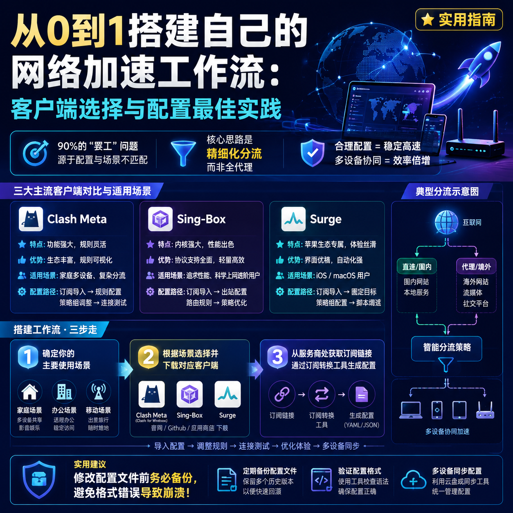

<!--
title: 从0到1搭建自己的网络加速工作流：客户端选择与配置最佳实践
date: 2026-06-23
type: guide
week: 4
style: 问题排查：从常见故障出发，反向教配置
fingerprint: 0c7bc8c80b6d28e65269344c8ee043ed
tags: 实用教程, 经验分享, 配置指南
-->


<div align="center">
  
  <br><sub>2026-06-23 · 实用教程, 经验分享, 配置指南</sub>
</div>

<br>
好的，没问题。作为一名帮朋友挑选服务的“耐心达人”，我很乐意帮你写这篇从故障排查角度出发的网络加速配置指南。咱不整虚的，直接上干货，从你大概率会遇到的“罢工”问题聊起。

---

# 你的网络加速器又“罢工”了？从故障出发，搭建一个不闹心的多设备加速环境

“哥，我买的那个‘加速服务’又连不上了，YouTube转半天出不来，是不是被坑了？”

这问题，我估计你或者你身边的朋友十有八九都遇到过。明明套餐买得挺贵，客户端也装了，但就是时好时坏。尤其是在家能看4K，一到公司或者换个地方，直接“网络错误”。更糟心的是，手机和电脑还得分开配置，折腾半天。

我前前后后也踩了三年多的坑，从最早的付费客户端，到后来的各种开源工具，折腾了不下十几种方案。最后我发现，90%的“罢工”问题，其实不是服务商不行，而是 **你的客户端配置和场景没匹配好**。

今天，我就从一个最让你头疼的场景——**“为什么我在家能用，换个地方就废了？”** 出发，跟你聊聊怎么从0到1，搭建一套无论在办公室、学校还是咖啡馆，都能稳定、高效工作的多设备加速环境。

你不用成为技术大神，跟着我，从最常见的三个客户端入手：**Clash Meta (简称CFW)、Sing-Box** 和 **Surge**，我们一步步把问题排查干净。

## 1️⃣ 问题解剖：为什么你的配置“水土不服”？

先别急着换服务。大部分“罢工”的根源在于下面三点：

1.  **“一刀切”的规则**：很多新手直接一键导入服务商给的默认配置，里面可能规则不完善。在家里用着还行，到了公司内网，流量全跑了代理，自然打不开内部系统。
2.  **DNS配置“打架”**：你的电脑、手机、路由器，再加上客户端的DNS，如果没统一好，解析请求就会乱套。最常见的结果就是：网页能打开，但视频加载慢、卡顿，或者直接“无法连接到服务器”。
3.  **移动端资源消耗**：在手机上，一些客户端默认开着“全局代理”，不仅流量跑得快，电池也掉得飞快。

所以，我们的目标不是搞一套最“豪华”的配置，而是搞一套 **“最懂你”** 的配置。

## 2️⃣ 对症下药：三种场景下的客户端配置策略

我们分三种最常见的使用场景，来配置你的客户端。我把它们总结成 **“家-公-移”** 三步法，并给出核心的配置要点。

| 场景 | 网络环境 | 核心问题 | 解决思路 | 推荐客户端 |
| :--- | :--- | :--- | :--- | :--- |
| **🏠 家庭** | 宽带、路由器 | 看4K视频、下载、打游戏需要全速，不需要分流内网 | 全代理、规则简单（只分国内/国外） | **Clash Meta (CFW)** |
| **🏢 公司/学校** | 有复杂的局域网、内网应用、网站白名单 | 内部系统不通，访问慢，被限制 | 精细化分流、绕过内网IP、智能DNS | **Sing-Box** |
| **📱 移动（手机）** | 4G/5G、Wi-Fi切换频繁 | 耗电、流量跑得快、容易被检测 | 轻量化配置、按需开启、自动切换 | **Surge (iOS)** / **Clash Meta (Android)** |

下面我们逐一“拆解”。

### 🤖 客户端 A：Clash Meta (CFW) —— 你的家庭全能选手

**场景：** 家里，电脑开着，主要任务是看4K视频、玩游戏、下载文件。我大概用了 **一年半** 这个客户端，踩得坑最多，但也最熟悉。

**核心问题：** 需要全速，但偶尔访问国内某些网站会慢。

**配置要点：**

1.  **模式选择：** 日常使用，直接选 **“规则”** 模式。别用“全局”，除非你想把所有流量都丢给代理，访问国内网站会变慢。也别用“直连”，不然你买加速服务干嘛。
2.  **规则优化：** 去你的配置文件中找 `rules:` 这一行，把下面几条 `RULE-SET` 和 `MATCH` 的顺序调整好。
    ```yaml
    # 确保这两行在最前面
    - RULE-SET,china_ip,🏠 DIRECT   # 国内IP直接连接
    - RULE-SET,china_domain,🏠 DIRECT # 国内域名直接连接

    # ...其他规则...

    # 在最后兜底
    - MATCH,🌏 PROXY                # 其他所有流量走代理
    ```
    **关键点：** `china_ip` 和 `china_domain` 这两个 `RULE-SET` 文件，要确保是更新且能用的。一般服务商会提供，或者你也可以用社区维护的版本。

3.  **DNS防污染：** 这是解决“网页能打开，视频慢”的关键。在配置文件的 `dns:` 部分，设置如下：
    ```yaml
    dns:
      enable: true
      listen: 0.0.0.0:53
      # 使用国外干净DNS解析加速域名
      nameserver:
        - 8.8.8.8
        - 1.1.1.1
      # 使用国内DNS解析国内域名
      fallback:
        - 223.5.5.5
        - 114.114.114.114
      fallback-filter:
        geoip: true
        geoip-code: CN
    ```
    **一句话解释：** 访问外国网站时，用8.8.8.8解析；访问中国网站时，用223.5.5.5解析。互不干扰，又快又准。

**我踩过的坑：** 有一次我为了追求“完美”，手动编辑了rules文件，结果一个格式错误，导致客户端直接崩溃。后来我学乖了，**每次修改前，一定备份一份**，或者直接用支持图形化界面修改的CFW版。

### ⚙️ 客户端 B：Sing-Box —— 你的精细化分流大师

**场景：** 公司或学校，电脑要访问内部OA系统、Gitlab，同时也要访问Google、GitHub。我用了 **8个月**，感觉它特别适合“墙内有墙”的环境。

**核心问题：** 我怕连不上内网，导致项目上不去，但又想用外网查资料。

**配置要点（比Clash Meta复杂一点，但值得）：**

1.  **入站与出站分离：**
    *   `inbounds`： 定义如何接收流量。通常配置一个 `socks` 和 `http` 混合入站。
    *   `outbounds`： 定义流量从哪出去。一个走代理（`proxy`），一个直连（`direct`），一个阻止（`block`，比如广告）。

2.  **精细化路由规则：** 这是Sing-Box的强项。在 `route` 部分，你可以精确匹配。
    ```json
    {
      "route": {
        "rules": [
          // 规则1：公司内网IP段，直接走直连
          {
            "ip_cidr": ["10.0.0.0/8", "172.16.0.0/12", "192.168.0.0/16"],
            "outbound": "direct"
          },
          // 规则2：公司内网域名，直接走直连
          {
            "domain": ["*.company.internal", "*.office.cn"],
            "outbound": "direct"
          },
          // 规则3：需要加速的关键域名，走代理
          {
            "domain": ["*.google.com", "*.github.com", "*.youtube.com"],
            "outbound": "proxy"
          },
          // 规则4：兜底，Google的公共DNS，走代理
          {
            "ip_cidr": ["8.8.8.8/32", "1.1.1.1/32"],
            "outbound": "proxy"
          }
        ],
        "final": "proxy"  // 除上述规则外，其他流量默认走代理
      }
    }
    ```
    **核心思想：** 只把你需要的、确定要走代理的流量发出去，剩下的（尤其是内网流量）全部直连。这就从根本上解决了“换个地方就罢工”的问题。

3.  **DNS 最佳实践：** Sing-Box 的 DNS 配置比 Clash 更独立，建议搭配 `fake-dns` 使用（需要一定技术基础），或者像我一样，直接用系统DNS，只在客户端层面做网络判断。

**我犯过的错误：** 刚开始用Sing-Box时，我抄了一个很复杂的配置，里面用了 `geoip` 和 `geosite`。结果在公司，因为内网网站没在库里，有些没被匹配到的域名，全走了代理，导致内网系统访问慢。**后来我把规则写得更具体、更“死”，反而更稳定了。**

### 📱 客户端 C：Surge —— 你的移动端省心管家

**场景：** 手机（iOS），上下班路上、咖啡馆、出差。作为iOS上最强的网络工具，Surge 我用了 **两年多**，确实不便宜，但省心。

**核心问题：** 手机待机续航、流量消耗。

**配置要点（Surge 的强项是傻瓜式操作 + 深度定制）：**

1.  **自动切换模式：** Surge 有“自动”模式，非常智能。它会根据当前网络情况，自动选择用哪个接入点。你只需要订阅好接入点，剩下的交给它。

2.  **“按需连接”与“自动 SSH”：** 这是Surge最人性化的功能。
    *   你可以设置 **“仅当在 Wi-Fi 时”** 开启代理，用蜂窝数据时完全不走代理，省流量又省电。
    *   我更常用的方式是，**配置一个“自动 SSH”（SSH over HTTP/SOCKS）**。简单说，就是当我连上某个特定的 Wi-Fi（比如公司、家里），Surge 会自动开启连接并走代理；当我断开这个 Wi-Fi，它就自动关闭代理。

3.  **精细化规则：** Surge 的规则系统是其精髓。你可以把它的 `ruleset` 理解成“白名单”和“黑名单”。
    *   **黑名单：** 比如你想屏蔽的广告、不想访问的网站。
    *   **白名单：** 比如 `*.taobao.com`、`*.jd.com`，强制直连。
    *   **常用策略：** 针对国内的视频、音乐App（如爱奇艺、网易云），可以设置成 **“规则” -> “直连”**。这样它们就能最快速地访问国内服务器，不占用你宝贵的代理流量，也不影响观看体验。

**我的真实体验：** Surge 让我彻底告别了“手机忘了关加速器，刷微博都在代理”的尴尬。而且它的“策略组”功能，我可以为不同App指定不同的出口接入点。比如，刷 TikTok 用香港接入点，看 YouTube 用新加坡接入点，速度极快。

## 3️⃣ 进阶技巧：让三者协同工作，一劳永逸

光会配置单点还不够，我们要的是 **“多设备、一键切换”** 的丝滑体验。这里有两个思路：

1.  **订阅转换，统一管理：** 别手动去各个服务商后台复制粘贴接入点信息。找一个靠谱的 **订阅转换网站**，把服务商给你的 `订阅链接` 填入，然后选择你需要的平台（Clash、Surge、Sing-Box），一键生成。这样，你所有的客户端都用同一个订阅链接，服务商更新接入点时，你这边自动同步。

    **我目前在用的是 [自由猫]（https://freecat.cloud/register?code=USRIiAoO）** 的服务，它的订阅链接兼容性很好，支持IEPL和MPTCP多路复用，我用了 **三个月** 没出过岔子。当然，你也可以去对比一下其他服务商，比如 **[万达云](https://api.huanghaiwan.com/go/万达云)**，它提供了很便宜的入门级IPLC/IEPL全专线套餐，月付13.9元起，特别适合新人练手（不用了也不会亏太多）。

2.  **DNS 统一：** 如果你用的是路由器访问国际网络，那就更简单了。在路由器上配置好 Clash 或 Sing-Box 作为透明代理，你的所有设备（手机、电脑、电视）只要连上这个 Wi-Fi，就自动走了代理，无需在设备上单独安装任何客户端。这是最优雅、最省心的方案。

    **友情提醒：** **不要冲动花钱！** 无论你选哪个服务商，都先买 **最低月付套餐** 试个把月。看看晚高峰时段的稳定性（8点到11点），看看客服的响应速度。一个月后，你自然就知道它适不适合你了。

## 🎯 总结 & 互动

好了，兄弟们，今天我们不谈虚的，就聊了三个常见客户端（Clash Meta、Sing-Box、Surge）在不同场景下的配置方法。核心就是一句话：

**别让你的设备傻乎乎地去代理所有流量，而是让它学会如何“聪明地”分流。**

*   **家庭场景：** 找 Clash Meta（CFW），全代理，简单粗暴。
*   **办公/学习场景：** 上 Sing-Box，精细化分流，告别“水土不服”。
*   **移动场景：** 看 Surge，省心省电，按需开启。

最后，如果你觉得这篇内容对你有用，建议 **点赞收藏** 一下，免得下次配置时找不到。如果你在配置过程中遇到什么奇葩问题，或者你有更好的配置技巧，欢迎在评论区留言，咱们一起交流，一起“避坑”！

---

<!-- article-data
key_points: 三大客户端（Clash Meta、Sing-Box、Surge）在不同场景下的配置路径|90%的“罢工”问题源于配置与场景不匹配|核心思路是精细化分流，而非全代理|DNS配置是解决卡顿和解析错误的关键|订阅转换和多设备协同是提升体验的进阶技巧
steps: 第一步：确定你的主要使用场景（家庭/办公/移动）|第二步：根据场景选择并下载对应客户端（Clash Meta/CFW、Sing-Box、Surge）|第三步：从服务商处获取订阅链接，通过订阅转换工具生成配置|第四步：根据“家-公-移”策略，手动调整规则、模式和DNS设置|第五步：多设备测试，根据“换地方能不能用”来反向验证配置
tips: 修改配置文件前务必备份，避免格式错误导致崩溃|在Sing-Box中，规则越具体越“死”，网络越稳定|手机端（Surge/Android Clash）善用“按需连接”或“自动模式”省电省流量|不要直接使用服务商的一键导入配置，自己动手二次优化|初期买最低价月付套餐试用一个月，观察晚高峰稳定性和客服响应
summary_items: 别让你的设备傻乎乎地去代理所有流量，而是让它学会如何“聪明地”分流|家庭场景找Clash Meta（CFW）简单粗暴|办公/学习场景上Sing-Box精细化分流告别“水土不服”|移动场景看Surge省心省电按需开启|订阅转换和路由器全局代理是终极省心方案
-->