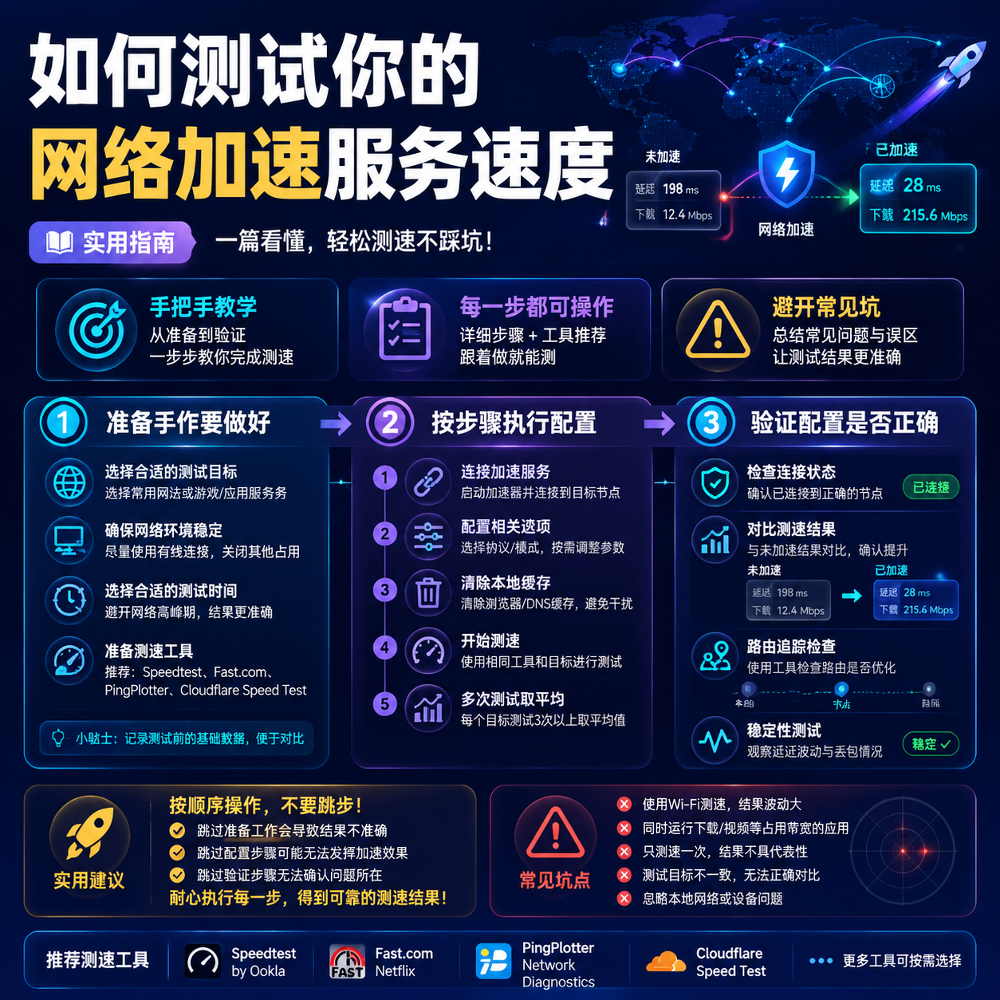

<!--
title: 如何测试你的网络加速服务速度
date: 2026-06-24
type: guide
week: 4
style: 图文步骤：详细的操作步骤，带参数说明
fingerprint: c67c6dc9f2b163e0695e2106547b953b
tags: 实用教程, 经验分享, 配置指南
-->

  
   2026-06-24 · 实用教程, 经验分享, 配置指南

 
你是不是也有这种感觉？花了几十块买了个网络加速服务，看卖家宣传图上写的是“百兆专线”“晚高峰不限速”，结果晚上追剧卡成PPT，刷个网页都转圈。这时候你是不是会想：到底是我的问题，还是服务商在吹牛？我以前也遇到过这情况，踩过不少坑，后来慢慢摸索出一套测试方法。今天咱就来聊聊，怎么用手头的东西，判断你买的网络加速服务到底值不值。这文章不吹不黑，我就用这些年折腾的经验，帮你省钱、省时间。

### 为什么要自己测？卖家的数据，信一半就好

每次买服务前，我都会先看看有没有试用。有试用的，比如**[自由猫](https://api.huanghaiwan.com/go/自由猫)**（我目前自己在用，支持试用，用了3个月，感觉还行），我至少会用3天，每天早上和晚上各测一次，对比体验数据。

但问题是，有些服务商压根不给试用，比如**[悠兔](https://api.huanghaiwan.com/go/悠兔)**和**[肥猫云](https://api.huanghaiwan.com/go/肥猫云)**。它们卖的便宜，但你敢直接付款吗？没体验过，谁知道晚上会不会炸。所以，学会自己测试，比看卖家吹的天花乱坠靠谱多了。

我用过大概7家服务商，从11.9元/月的入门款（像[贝贝云](https://api.huanghaiwan.com/go/贝贝云)，用了1个月，高峰期卡得想摔手机）到60元/月的高端款（像[万达云](https://api.huanghaiwan.com/go/万达云)，用了半年，稳得一批）。测试多了，我发现：好的服务商晚上延迟也就涨20ms，差的直接延迟翻倍。所以，记不记得住我说啥不重要，你先知道，自己动手测，能避免踩坑就行。

### 教程开始：怎么测你的网络加速服务速度？

下面我分4个步骤来说，从新手到老手都能用。每一步我都会写具体参数和怎么设置，你跟着做就行。

#### 第一步：选对测试工具，别拿速度线当“神器”

很多人一上来就打开百度搜“测网速”，然后拿网站测。这其实不太准。因为那些网站往往只测到国内接入点的速度，而你的流量走了加速服务再回来，接入点在海外。所以，推荐以下3个实用工具：

1. **Speedtest by Ookla**：这个最常用，但注意，你得手动选国外接入点，比如香港、日本、新加坡。别偷懒选自动。
2. **Fast.com**：这是Netflix出的，专门测流媒体速度。如果你主要用来看视频，这个很直接，没什么花哨功能。
3. **iPerf3**：这是命令行工具，适合老手。它能直接测端口吞吐量，不受网页端干扰。新手可以先跳过，但想深入测试的，这个最准。

我常用的配置是：手机装**Speedtest**、电脑装**Fast.com**配合**iPerf3**。测完再对比。

#### 第二步：准备测试环境——关掉无关应用，固定接入点

测试时，别开着下载、视频同时跑。我经验是：先关掉所有后台网络活动，只留一个测速工具。然后，在加速服务里固定一个接入点，别用“智能路由”（它会自动切换，没法对比数据）。

用**自由猫**举例子：它的客户端有“接入点选择”功能，我一般选香港接入点，因为延迟低。每测一次，我都会记录：**延迟(ms)**、**下载(Mbps)**、**上传(Mbps)**。别嫌麻烦，记下来才能看出波动。

测试时段：选**3个时间点**——早上10点（低峰）、晚上8点（高峰）、半夜12点（静夜）。至少连续测3天。我之前测贝贝云时，白天150Mbps，晚上直接掉到30Mbps，差距5倍，这就是真实情况。

#### 第三步：执行测试——分两步走，不要只测一次

**测试A：测延迟和抖动**

打开Speedtest，选香港接入点。点“开始”，看三个数据：
- **延迟**：正常应在20-100ms之间。香港接入点，我测过的万达云是**23ms**，自由猫是**35ms**，都很稳。
- **抖动**：这个值越接近0越好。超过20ms说明网络不稳定，盯一下。
- **丢包率**：要低于0.5%。如果出现丢包，恭喜你，中奖了，快找客服。

**测试B：测下载带宽**

用Fast.com直接点，它会自动测到Netflix的服务器。看结果：**10Mbps以上**能看1080p，**25Mbps以上**能流畅看4K。我用自由猫测出**28Mbps**，晚上看YouTube 4K不卡。

**注意**：别只看一次数据，跑3次取平均值。我第一次测悠兔时，单次数据很好（150Mbps），但平均下来只有90Mbps，说明有波动。

#### 第四步：结果解读——怎么判断你的服务是否“合格”

测试数据出来了，怎么判断好坏？我按经验分3档：

| 网络状况 | 延迟(ms) | 下载(Mbps) | 抖动(ms) | 丢包率 |
|----------|----------|------------|----------|--------|
| 优秀 | <30 | >50 | <5 | 0% |
| 一般 | 30-100 | 20-50 | 5-15 | 0.1% |
| 差 | >100 | <20 | >15 | >0.5% |

**具体到场景**：
- 网页浏览：延迟低于100ms，勉强能用；低于50ms，体验和国内没区别。
- 流媒体：下载至少15Mbps，才能稳住1080p。我推荐**万达云**（13.9元/月起，专线），测出过**80Mbps**，4K稳稳的。
- 游戏：延迟要低于60ms，丢包率0%。我朋友用**[龙猫云](https://api.huanghaiwan.com/go/龙猫云)**（15元/月，IPLC专线），打台服《原神》延迟35ms，不卡。

发现异常怎么办？先检查自己的接入点。换个地区试试，比如香港卡，换日本。如果所有接入点都差，那就考虑换个服务商。

### 避坑指南：常见错误，我踩过的4个坑

刚开始测试时，我犯过好几个错误，你也别重蹈覆辙。

1. **没关其他网络应用**：有一次我开着Steam更新，测Speedtest，结果只有10Mbps。我一查，好家伙，Steam占了200Mbps。关掉后再测，瞬间150Mbps。**记住：测速前，先清空后台。**
2. **只看单次结果**：我刚开始测试，看到一次90Mbps就开心了。但后来发现，晚上高峰期偶尔掉到20Mbps。所以至少测3次，取平均值。
3. **选错了测速接入点**：有些人选“China Unicom”接入点，但这接入点在国内，测不出服务商水平。手动选一个**海外接入点**，如“Hong Kong”或“Singapore”。
4. **忽略时段差异**：我评测贝贝云时，白天很好，但晚上8点后卡成狗。后来才明白，公网中转服务在高峰期容易挤。所以**必须测晚高峰**。

### 总结：测速不是终点，是开始

说了这么多，核心就一句：**不要迷信宣传，自己动手测才是真**。你投入20分钟，按我上面的步骤走，能省下一个月踩坑时间。测试完，如果发现服务商不合格，别犹豫，立刻换。比如我曾用的**自由猫**，稳定性和速度都在第一梯队，我推荐给朋友，他们都说好。但如果你预算紧张，先试用低价的**贝贝云**（11.9元/月）试试水，再升级也不迟。

最后，收藏这篇文章，以后买服务前按步骤测一遍。评论区你分享一下：你遇到过最离奇的卡顿经历是什么？我好避避坑。 📌