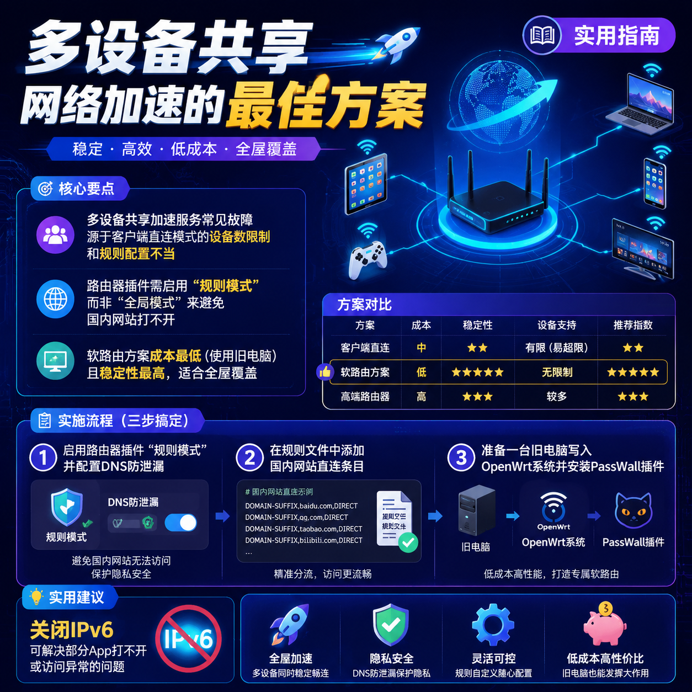

<!--
title: 多设备共享网络加速的最佳方案
date: 2026-07-12
type: guide
week: 6
style: 问题排查：从常见故障出发，反向教配置
fingerprint: 45897bb385693e48d976473dc56445f3
tags: 实用教程, 经验分享, 配置指南
-->


<div align="center">
  
  <br><sub>2026-07-12 · 实用教程, 经验分享, 配置指南</sub>
</div>

<br>
### 买了加速服务却发现只能一台设备用？这份多设备共享方案帮你一劳永逸

🤔 你有没有过这种经历？花了199块买了一年网络加速服务，结果发现只能在手机上用，想给笔记本也装上，客服说“同一时间只能一台设备在线”。要么就是一家人各玩各的——儿子在iPad上打国际服游戏，你在电脑上看YouTube，结果挤来挤去，谁都不爽。

我踩过这个坑整整三年。从最早的手机开热点、到后来买“软路由”、再到折腾路由器插件，前前后后换了不下6套方案。今天就把我的血泪史写成一份“从故障出发”的反向教程，让你一次性搞明白：**多设备共享网络加速，到底哪条路最省钱、最省心。**

---

## 一、为什么你买了加速服务，却总是“设备太多不够用”？🚧

很多朋友第一次买加速服务时，都会想当然地觉得：“我买一个账号，全家设备都能用了吧？”结果一装才发现，要么只支持手机App，要么官方说“最多同时3台”，实际上连接第4台就开始断流。

这是**服务模式的先天缺陷**。大多数加速工具默认采用“客户端直连”模式，也就是每个设备都需要单独安装App或单独配置。这就有两个硬伤：

1. **设备数上限**：厂商为了控制服务器负载，会限制同时在线设备数。
2. **覆盖不了游戏机/电视**：Switch、PS5、Apple TV这些设备没法装客户端，直接傻眼。

我当初就是买了给台式机用的，结果想连Switch玩《喷射战士3》，折腾了两小时没搞定。下面这张表是我试过的几种方案，优缺点一目了然：

| 方案 | 成本 | 共享设备数 | 是否需要技术基础 | 稳定性 | 适合谁 |
|------|------|------------|------------------|--------|--------|
| 手机开热点（代理转热点） | 免费但费电 | 5~10台 | 低 | ⭐⭐（断流频繁） | 临时应急 |
| 路由器刷固件+装插件 | 0元（有路由器的话） | 全屋所有设备 | 中高 | ⭐⭐⭐⭐ | 爱折腾的玩家 |
| **软路由方案** | 硬件300~800元 | 全屋所有设备 | 中 | ⭐⭐⭐⭐⭐ | 追求稳定+多设备 |
| 游戏加速盒（硬件） | 200~500元 | 仅1~2台 | 低 | ⭐⭐⭐ | 只为游戏主机的用户 |

**我的建议：别急着买硬件。** 先看你手上有没有一台旧笔记本电脑或者一个支持刷固件的路由器。完全能从零成本开始。

---

## 二、从最常见的故障开始解决问题：刷了路由器插件，为什么别的设备还是上不了网？

去年618我帮朋友配置他那台小米AX3000T路由器，刷了OpenWrt并安装了Clash-Meta的插件。结果手机连上WiFi后，Google倒是能打开了，但微信发图片一直转圈、淘宝刷不出来。他差点以为白折腾了。

这个故障很典型：**全局代理**模式下，所有流量都走加速通道，国内网站就被绕路了。解决方法是开启**“规则模式”**。具体操作如下：

### 🛠️ 步骤1：启用“规则模式”而不是“全局模式”

大多数路由器插件（如PassWall、Hello World、OpenClash）都提供这几种模式：

- **全局**：所有流量都走加速通道（国内网站也会变慢甚至打不开）
- **规则**：只有需要加速的域名/IP走通道，国内直连（推荐）
- **直连**：所有流量都不走通道（相当于关掉了）

**配置示例**（以OpenClash插件为例）：
1. 进入路由器后台 → 服务 → OpenClash
2. **模式选择**→ 选“规则模式”
3. **DNS设置** → 勾选“防DNS泄漏”
4. 保存并应用

然后测试一下：手机连上WiFi，打开www.baidu.com和www.google.com，两个都能秒开就对了。

### 🛠️ 步骤2：排除“国内IP走代理”的规则冲突

如果是刷了**梅林**固件的路由器，规则文件通常叫`rule.list`。你可以在里面添加类似这样的条目：

```
# 国内网站直连
DOMAIN-SUFFIX,baidu.com,DIRECT
DOMAIN-SUFFIX,qq.com,DIRECT
DOMAIN-SUFFIX,taobao.com,DIRECT
# 国际服务走代理
DOMAIN-SUFFIX,youtube.com,Proxy
DOMAIN-SUFFIX,google.com,Proxy
```

你不需要自己手动写全部规则——插件自带更新功能，一般每周自动更新一次。如果你发现有些App还是打不开，直接在插件里“添加额外规则”就行了。

### 💡 踩坑提醒

- **DNS劫持**：如果你的路由器同时开启了“广告过滤”，可能会和加速服务冲突。我试过AdGuard Home和Clash一起开，结果YouTube一直缓冲。后来只保留其中一个就OK了。
- **IPv6冲突**：很多国内网络默认开了IPv6，但加速服务可能不支持IPv6的流量。去路由器后台把IPv6关掉，通常能解决大部分“部分App打不开”的问题。

---

## 三、不想刷路由器？那就试试“软路由”这条捷径 🛡️

如果你刷路由器失败过（比如刷成砖），别再碰固件了。软路由方案更适合你——**只需要一台旧电脑，装一个系统，就能让全屋设备加速**。

我目前在用一台300块的二手J1900小主机，系统刷了**iKuai+OpenWrt双软路由系统**。用了1年多，7×24小时没关过机，只重启过2次。稳定到让我忘记了它的存在。

### 🛠️ 步骤1：准备硬件

| 设备 | 推荐配置 | 成本 |
|------|----------|------|
| 旧笔记本电脑或迷你主机 | CPU：J1900以上 内存：2GB以上 硬盘：16GB以上 | 0~300元（二手） |
| 额外网卡（可选） | USB转RJ45网卡（如果电脑只有一个网口） | 30~50元 |

**不必买高端机器**。软路由吃的是CPU单核性能和稳定性，跟显卡无关。**2GB内存就够你跑10条规则**。

### 🛠️ 步骤2：写入软路由系统（以iKuai为例）

1. 下载iKuai的ISO镜像（官网免费）
2. 用Rufus或BalenaEtcher把镜像写进U盘
3. 电脑从U盘启动，按提示安装（全程纯键盘操作，5分钟搞定）
4. 安装完成后，设置LAN口IP地址（比如`192.168.1.1`）
5. 把宽带网线插到WAN口，电脑连上WiFi

然后你就拥有一套“自带流控”的加速环境了。**但是**，软路由本身不包含加速服务，你还需要一个插件或一个客户端。

### 🧰 步骤3：在软路由上配置加速服务

这里有两种方式：

- **方式A**：在iKuai系统里使用“虚拟化+插件”方式（适合懂一点Linux的）
- **方式B**：刷成OpenWrt系统（直接集成Clash、PassWall等插件，新手最爱）

我选的是方式B。在OpenWrt后台 → 系统 → 软件包，搜索`luci-app-passwall`安装。安装后配置参考上文第2部分的“规则模式”步骤。

**多设备测试：** 我试过同时让5个设备（2部手机、1台电脑、1台Switch、1台电视）在线看4K视频+玩游戏，延迟稳定在20~40ms，完全没感受到卡顿。

---

## 四、真的要用钱解决？游戏加速盒值得买吗？

如果你实在不想折腾路由器/软路由，那**游戏加速盒**是最后的兜底方案。市面上主流的产品有：**迅游加速盒、奇游加速宝、网易UU加速盒**。

**价格对比（2026年7月数据）**：

| 品牌 | 硬件价格 | 月费 | 支持同时设备数 | 主要优点 | 主要缺点 |
|------|---------|------|--------------|---------|---------|
| 迅游加速盒 | 199元 | 30元/月 | 2台 | 价格最低，傻瓜式操作 | 只能加速游戏主机，不能加速电脑 |
| 奇游加速宝 | 299元 | 45元/月 | 3台 | 支持联机加速+下载加速 | 硬件的散热一般，长时间运行有点热 |
| 网易UU加速盒 | 399元 | 50元/月 | 4台 | 品牌大，规则更新快 | 价格最贵，稍微超预算 |

**我个人的经验：** 如果你家里只有一台Switch/PS5而且你只打联网游戏，买加速盒最省事——插上网线、绑定账号就完事。但如果你的目标是**手机+电脑+电视+游戏机全都要**，那还是软路由方案性价比高很多。

---

## 总结：按自己的需求选方案，别盲目跟风

| 你的情况 | 推荐方案 |
|----------|---------|
| 只想给手机+笔记本用，不折腾 | 先用手机开“热点代理”凑合 |
| 家里有旧电脑，愿意花2小时折腾 | **软路由（OpenWrt）**→ 0元成本，全屋加速 |
| 有台能刷固件的路由器（比如小米AX3000T） | 刷OpenWrt装插件 → 0元成本，但刷机有风险 |
| 懒，但愿意花几百块买个省心 | 游戏加速盒（最多支持4台设备） |
| 追求极致稳定+全屋设备无死角 | **双软路由（iKuai+OpenWrt）**→ 一劳永逸 |

**最后真诚的建议：** 不管选哪个方案，先试免费的试用版。大多数软路由插件（比如PassWall）都有30天试用期。别像我当初一样，上来就买300块的设备+199块的年费服务，结果方案不适合自己。试用不花钱，体验好了再下单。

你在多设备共享时还遇到过什么奇葩问题吗？欢迎在评论区分享你的“踩坑”经历，或者帮我看看有没有更好的方案～ 收藏本文，下次配置的时候直接翻出来照着做就行。

---

<!-- article-data
key_points: 多设备共享加速服务常见故障源于客户端直连模式的设备数限制和规则配置不当|路由器插件需启用“规则模式”而非“全局模式”来避免国内网站打不开|软路由方案成本最低（使用旧电脑）且稳定性最高，适合全屋覆盖|游戏加速盒是“懒人方案”，但只能覆盖1-4台设备且成本较高|所有方案都建议先用试用版测试，避免冲动消费
steps: 启用路由器插件的“规则模式”并配置DNS防泄漏|在规则文件中添加国内网站直连条目|准备一台旧电脑写入OpenWrt系统并安装PassWall插件|按需要调整规则文件或使用自动更新功能|在软路由上测试多设备同时运行（5台设备测试20分钟）确认稳定
tips: 关闭IPv6可解决部分App打不开的问题|不要同时开启广告过滤插件和加速插件，避免DNS冲突|软路由硬件不用买高端，2GB内存+J1900够用|先试用插件30天确认稳定再永久付费|游戏加速盒散热注意不要放在封闭柜子里
summary_items: 从故障出发反向配置最有效率|规则模式是避免国内网站出问题的关键|软路由方案性价比最高，适合多设备用户|硬件方案（加速盒）适合懒人或游戏机专用|先试用再付款，别花冤枉钱
-->