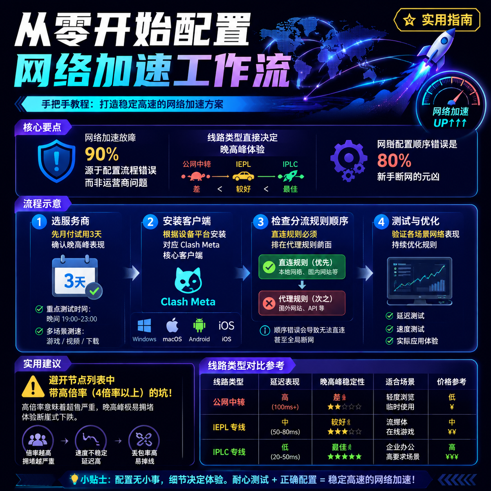

<!--
title: 从零开始配置网络加速工作流
date: 2026-07-16
type: guide
week: 7
style: 问题排查：从常见故障出发，反向教配置
fingerprint: 5114e9a9d581e08b049bea1b9110347c
tags: 实用教程, 经验分享, 配置指南
-->


<div align="center">
  
  <br><sub>2026-07-16 · 实用教程, 经验分享, 配置指南</sub>
</div>

<br>
# 断网自救指南：从"YouTube转圈圈"到"4K秒开"，我只改了这4个地方

你是不是也经历过这种崩溃时刻？

打开YouTube准备摸鱼，结果进度条转成陀螺，画质自动降到144p还卡成PPT。打开X刷个帖子，等了10秒才加载出来。游戏延时直接飙到300ms，队友已经开始骂你送人头。

**先别急着砸键盘，90%的加速问题不是运营商的问题，而是你的配置流程压根没对。**

我折腾访问国际网络这玩意儿已经快4年了，踩过的坑比走过的路还多。今天我就从最常见的故障出发，**反向教你**怎么把网络加速工作流配得丝滑。如果你照着做还卡，那你来找我。

---

## 🚨 故障现象1：YouTube能看，X加载慢，游戏进不去

**症状对照：** 看视频还行（流量大但延迟不敏感），刷网页和打游戏就拉胯。

**问题根源：** 你用的接入点可能是"公网中转"类型，或者接入点本身带宽小、倍率虚标。

你以为所有"香港接入点"都是一样的？**差远了。**

我把市面上常见线路类型列个表，你看看自己用的是哪种：

| 线路类型 | 代表服务商 | 延迟表现 | 晚高峰表现 | 价格区间 |
|---------|-----------|---------|-----------|---------|
| 公网隧道中转 | [贝贝云](https://api.huanghaiwan.com/go/贝贝云)、[瑶瑶领先](https://api.huanghaiwan.com/go/瑶瑶领先) | 50-120ms | 容易炸 | 11-22元/月 |
| IEPL专线 | [自由猫](https://api.huanghaiwan.com/go/自由猫)、[万达云](https://api.huanghaiwan.com/go/万达云)、[肥猫云](https://api.huanghaiwan.com/go/肥猫云) | 30-60ms | 稳定 | 15-40元/月 |
| IPLC内网专线 | [龙猫云](https://api.huanghaiwan.com/go/龙猫云)、万达云 | 20-40ms | 非常稳 | 15-30元/月 |
| BGP中转+专线出口 | [闪狐云](https://api.huanghaiwan.com/go/闪狐云) | 30-80ms | 不限速稳 | 20-40元/月 |

**实操建议：**
1. 如果你现在用的是公网中转接入点（接入点名带"中转""隧道"字样），且晚高峰必卡，**果断换IEPL或IPLC专线**
2. **别迷信"香港接入点"四个字** — 有些香港接入点是廉价家宽线路，高峰期延迟能到200ms+
3. 我目前在用 **自由猫**（主力）和 **万达云**（备用），自由猫的MPTCP多路复用技术在丢包环境下表现确实好，万达云的全专线方案13.9元/月起步，倍率x1没有隐藏消费，适合入门

**💡 避坑提示：** 接入点列表里如果看到"XX倍率"（比如4倍、5倍），赶紧跑。用完100G流量发现实际只用了20G，剩下全被倍率吞了。

---

## 🚨 故障现象2：不开加速器能上百度，开了反而连不上

**症状对照：** 开启加速后才有的问题，关闭后正常。

**问题根源：** 你的客户端规则配置有bug，或者分流规则太乱。

我敢说**80%的新手**踩过这个坑 — 一装上客户端就把"全局模式"打开，结果国内网站全走外网线路，不卡才怪。

**正确的配置姿势：**

### 客户端选择建议

| 设备平台 | 推荐客户端 | 配置方式 |
|---------|-----------|---------|
| Windows | Clash Verge / v2rayN | Clash Meta内核 |
| macOS | ClashX Pro / Surge | Clash规则 |
| iOS | Shadowrocket / Stash | 一键导入 |
| Android | Clash Meta for Android | 订阅链接 |
| 路由器 | OpenClash | 自定义规则 |

### 规则配置必查清单

1. **检查分流规则顺序** — 规则列表里"直连"规则必须排在"代理"规则前面。配置（YAML格式）长这样：

```yaml
rules:
  - DOMAIN-SUFFIX,baidu.com,DIRECT  # 国内走直连
  - DOMAIN-SUFFIX,qq.com,DIRECT
  - DOMAIN-SUFFIX,youtube.com,Proxy  # 国外走代理
  - GEOIP,CN,DIRECT  # 国内IP走直连
  - MATCH,Proxy  # 其余全部代理
```

2. **常见错误：** 很多人把"MATCH,Proxy"写在了最前面，结果所有流量都走了代理 — 国内网站访问慢是必然的

3. **推荐方案：** 直接用网络服务商提供的"ACL4SSR"规则集，或者Clash自带的"规则模式"。**别自己手动配规则，除非你真懂正则**

**💡 避坑提示：** 我见过一个朋友，配置里写了50条自己的规则，结果其中有3条写反了，排查了3天。**用现成的规则解构就行，别自作聪明。**

---

## 🚨 故障现象3：测速正常，实际用起来还是卡

**症状对照：** 速度测试跑满带宽，但刷YouTube还是卡，加载网页还是要等。

**问题根源：** 测速工具被"针对"了，或者你测速方式不对。

这个坑真的是**防不胜防**。一些服务商会把测速网站的IP做特殊路由，让你测速时体验满分，实际用起来拉胯。

**正确的测速姿势：**

1. **别用网络服务商自带的测速功能** — 那个数据大概率是假的
2. **用第三方工具交叉验证**：
   - [Fast.com](https://fast.com)（Netflix出品，不依赖Speedtest接入点）
   - [YouTube视频流测试](https://www.youtube.com/watch?v=6v4cXJ8_4YU)（4K视频缓冲速度）
   - 实际打开几个不同国家的网站感受延迟

3. **正确的测速方式：**
   - 测速前关闭所有其他占用网络的应用
   - 连续测3次，取中位数
   - **看延迟抖动，而不是看最大速度** — 速度冲到50Mbps但每2秒掉一次包，还不如稳定在20Mbps

4. **用"无门槛"的测速网站** — 推荐 [cloudflare.com/speed-test](https://cloudflare.com/speed-test)，Cloudflare的接入点不被绝大多数加速服务商针对

**💡 避坑提示：** 如果你测速表现和实际体验差距超过30%，90%的情况是服务商在测速上做了手脚。**直接换服务商，别犹豫。**

---

## 🚨 故障现象4：手机能用，电脑不行 / 电脑能用，路由器不行

**症状对照：** 同一服务在不同设备上表现差异巨大。

**问题根源：** 设备配置不一致，或者部分设备缓存了旧配置。

我是个**多设备重度用户** — 工作电脑、个人笔记本、两部手机、iPad、电视盒子，加起来超过6台设备。如果每台设备都手动配置，光维护就疯了。

**我的解决方案：**

### 方案A：客户端规则同步（推荐新手）
1. 在 **一台主力设备**（比如电脑）上配好规则
2. 把配置文件（YAML/JSON）上传到 **Gist 或私有云盘**
3. 其他设备通过 **订阅链接** 或 **远程配置URL** 读取同一份文件
4. 以后改规则只改一处，所有设备自动同步

### 方案B：软路由方案（推荐极客玩家）
1. 搞个OpenWrt软路由（二手J4125机器350元左右）
2. 装OpenClash或PassWall，配置一次全覆盖
3. 所有设备无感加速，不需要在每个设备上装客户端
4. **晚高峰体验最好**，因为软路由的处理能力远强于手机/电脑

**💡 避坑提示：** 软路由方案**不推荐**用Wi-Fi连接主路由器 — 网速会被Wi-Fi拖累。建议软路由通过有线连接主路由，作为旁路由使用。

---

## 总结：从零开始的配置流程

如果你现在就是从零开始，照着这个流程来，**不会再有问题**：

1. **选服务商** → 别盲买年付。先买个 **月付**（推荐自由猫/万达云），试个3天，确认晚高峰不卡再考虑长付
2. **装客户端** → 根据设备配Clash Meta核心（Windows用Clash Verge，iOS用Shadowrocket）
3. **配规则** → 直接用网络服务商提供的现成规则，手动改最多3条（如果有特殊需求）
4. **测速验证** → 用Fast.com + 实际打开YouTube 4K视频，看延迟抖动
5. **设备协同** → 统一配置文件，或者上软路由一劳永逸

**最后说一句掏心窝的话：** 别为了每个月省20块钱选便宜的，结果每天花2小时排故障。**时间成本比那点差价贵多了。**

如果你现在用的是月付10几块的公网中转方案，并且每天都要在"转圈圈"中度过半小时，**我建议你趁着今天这个周末，花1小时把配置全面升级一下**。

---

*你有遇到过什么奇葩的网络加速问题？欢迎在评论区分享你的"排坑经历"，如果问题经典我后续出专门文章来拆解。有用的朋友建议先收藏，回头配置的时候照着做。*

<!-- article-data
key_points: 网络加速故障90%源于配置流程错误而非运营商问题|线路类型直接决定晚高峰体验（公网中转<IEPL<IPLC）|规则配置顺序错误是80%新手断网的元凶|测速数据可能被针对，需用第三方工具交叉验证|多设备用户建议统一配置文件或上软路由方案
steps: 选服务商时先月付试用3天确认晚高峰表现|根据设备平台安装对应Clash Meta核心客户端|检查分流规则顺序（直连规则必须排代理规则前面）|用Fast.com+YouTube 4K视频实际测试延迟抖动|多设备场景上传配置文件至Gist实现统一同步
tips: 避开接入点列表中带高倍率（4倍率以上）的坑|别自己手动配规则直接用现成ACL4SSR规则集|测速数据与实际体验差距超30%需警惕服务商针对性优化|软路由方案必须通过有线连接主路由避免Wi-Fi瓶颈|优先选IEPL/IPLC专线接入点避免晚高峰拥堵
summary_items: 从零配置的正确流程：选服务商→装客户端→配规则→测速验证→设备协同|线路选择优先级：IPLC内网专线>IEPL专线>BGP中转>公网隧道|规则配置核心：直连规则在前代理规则在后|长期稳定方案：自由猫主力+万达云备用|多设备最佳实践：单点配置全设备同步或软路由全覆盖
-->