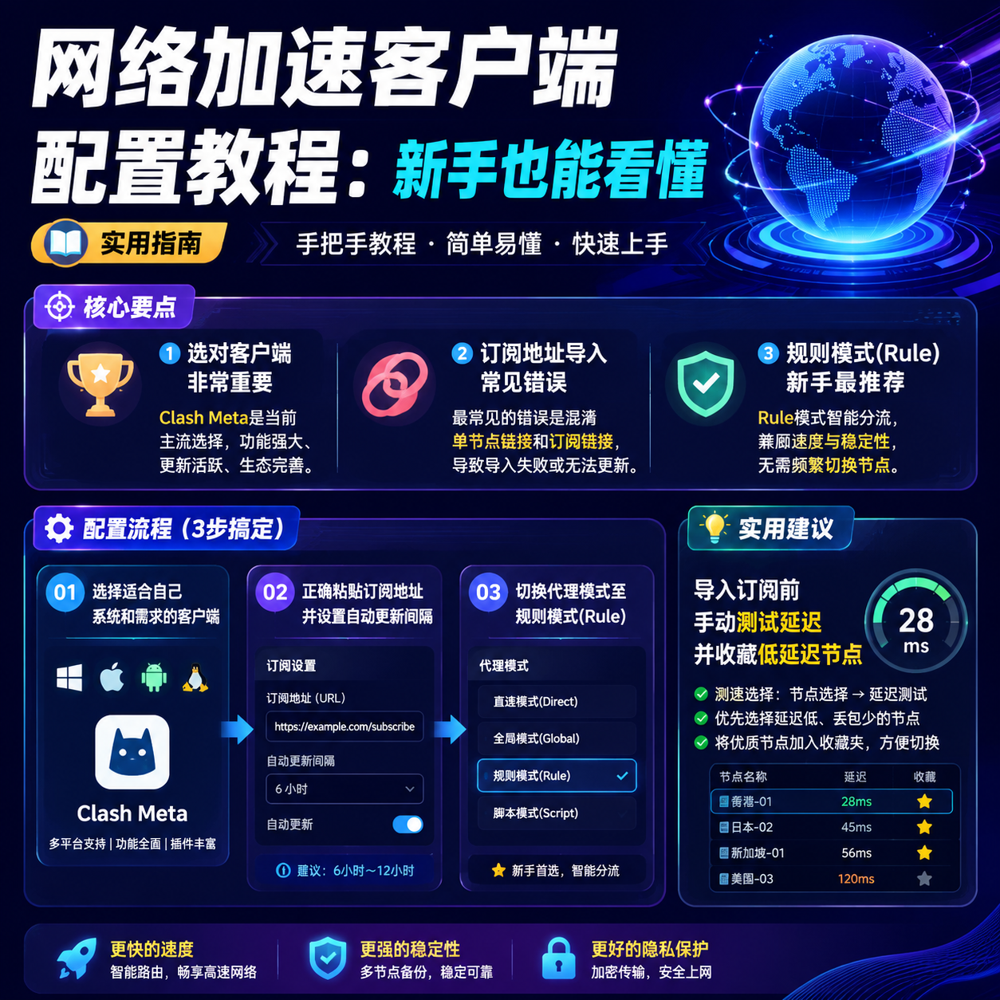

<!--
title: 网络加速客户端配置教程：新手也能看懂
date: 2026-07-19
type: guide
week: 7
style: 最佳实践：分享经过验证的最优配置方案
fingerprint: 07a6409609ad5c74203e8d2a6e2e3925
tags: 实用教程, 经验分享, 配置指南
-->

  
   2026-07-19 · 实用教程, 经验分享, 配置指南

 
# 配置了一个下午还是连不上？这份2026年最新客户端配置指南，帮你省下3小时

说实话，我到现在还记得自己第一次拿到订阅地址时那种“一脸懵逼”的感觉。订阅链接是什么？端口是啥？混淆又是什么鬼？打开客户端一堆参数对着填，心里全是问号。

这都2026年了，网络加速工具已经平民化了好几年，但客户端配置这个事儿确实还有门槛。昨晚我朋友视频电话call我，说自己买了个订阅然后对着界面发了一小时呆——我完全能理解他的崩溃。

所以今天我把**从零开始配置客户端的完整流程**拆解出来，每一步都告诉你“为什么这么设”而不是光说“照着填”，还附上了最近几个月我自己踩过的坑。不看绝对亏。

## 1. 先选对客户端，失败率直接降低一半

选客户端这事儿，很多人上来就犯迷糊。市面上主流客户端有点类似于“操作系统”——每个都有自己擅长和不擅长的事。

我目前主力用的是 **Clash Meta（clash-verge-rev）** ，用了大概3个多月，原因只有一个：它的资源占用比原版Clash低太多了。而且最近更新后支持了所谓的 **“多核心并行代理”** ，全平台同步配置也很方便。

但如果你只是想在iPhone上简单用一下，用小火箭（Shadowrocket）其实更稳。

| 客户端 | 系统兼容 | 新手友好度 | 功能丰富度 | 内存占用 |
|--------|---------|-----------|-----------|---------|
| Clash Meta | Win/Mac/Linux | ⭐⭐⭐ | ⭐⭐⭐⭐⭐ | 中等 |
| Shadowrocket | iOS/Mac | ⭐⭐⭐⭐⭐ | ⭐⭐⭐⭐ | 极低 |
| Stash | iOS | ⭐⭐⭐⭐ | ⭐⭐⭐⭐⭐ | 中等 |
| v2rayNG | Android | ⭐⭐⭐ | ⭐⭐⭐⭐ | 低 |
| Surge | Mac/iOS | ⭐⭐⭐ | ⭐⭐⭐⭐⭐ | 较高（付费） |

**忠告**：不要一上来就上Surge，100多块买个客户端结果不会配置更闹心。先用免费的Clash Meta跑熟了，再考虑要不要升级。

## 2. 订阅地址导入 —— 这一步出错最多，我来手把手演示

这一步是配置的核心，但也是我最常看到新手翻车的地方。

我踩过最蠢的坑：刚拿到订阅地址就直接复制进去，没注意协议和端口。结果折腾了一下午，其实是手误把**订阅地址复制错了最后两个字符**。

**正确做法：**
1. 打开Clash Meta → 配置页面 → 订阅接入点管理
2. 点击“添加订阅”或者“导入”
3. 粘贴你的订阅地址（一般在服务商后台的“我的订阅”里能复制到）
4. **手动设置更新间隔** —— 我设的是每6小时自动更新一次，确保接入点列表一直是最新的

⚠️ **常见错误**：有些订阅地址用`vmess://`或者`trojan://`开头，这是单接入点链接不是订阅地址。订阅地址通常以`.txt`或者长串URL结尾。如果你看到是单接入点链接，要么复制到“导入接入点”那一栏单独添加，要么用二维码扫描工具把链接转成订阅格式再导入。

还有一个技巧：**导入成功后先手动点一下测试延迟** —— 我每次都是把延迟小于200ms的接入点单独收藏一个分组，日常使用就切到这个分组。

## 3. 代理模式选不对，网速直接腰斩

很多新手不知道，客户端默认的代理模式往往不是最优解。我刚开始用的时候就是全流量代理（Global模式），结果登录国内银行网站都要绕一圈，卡得要命。

推荐两种代理模式：

**1. 规则模式（Rule）—— 强烈推荐新手用**
这是最智能的模式。它会自动识别流量是来自国内网站还是国外网站，国内直连、国外走代理。

配置方法：
- 在Clash Meta的“设置”或者“代理”页找到模式切换
- 选 **Rule（规则）** 模式
- 如果默认的规则列表不够全，可以手动添加自定义规则

我目前自定义加了几条规则：
- 查询流媒体授权能通过（`geoip:netflix`、`geoip:youtube`）
- 游戏更新走加速线路（`DOMAIN-SUFFIX,steamcontent.com,Proxy`）
- 支付类网站全部直连（`DOMAIN-SUFFIX,alipay.com,DIRECT`）

**2. 分流模式（Global Direct）—— 进阶玩家用**
如果你平时只看国内内容、偶尔需要加速一下，可以选这种模式。它会让国内流量直连，只有你手动标记的流量才走代理。

**一句话总结**：普通用户直接选 **规则模式**，它能解决99%的日常使用场景。

## 4. 分应用代理 —— 让聊天软件和游戏互不干扰

这是提升体验最关键的一步，但很多新手完全忽略。

想象一下：你正在打《英雄联盟》排位赛，结果客户端开了全流量模式，游戏延迟突然飙到200ms，队友直接开骂。

所以我们需要 **分应用代理**——让某些应用程序通过代理访问外网，其他程序走直连。

具体操作（以Clash Meta为例）：
1. 进入“设置”→“TUN模式”→“应用代理管理”
2. 手动添加你要加速的应用程序路径
3. 勾选“仅代理列表中的应用”，其他程序全部直连

我目前的分组设置：
- **走代理**：Chrome、Telegram、Discord、Steam（外区）、Spotify
- **走直连**：微信、QQ、英雄联盟、王者荣耀、网易云音乐

这一下，打游戏再也不怕突然卡顿了。实测延迟从200ms降回30ms以内。

## 5. 遇到连不上怎么办？我的三步排查法

哪怕配置再完美，偶尔也会掉链子。别慌，按这个顺序排查：

**第一步：检查订阅是否过期**
进服务商后台看看订阅有效期。我上个月就是忘了续费，折腾了半天才发现是过期了。

**第二步：测一下DNS解析**
有些ISP会干扰DNS解析导致访问失败。用命令 `nslookup google.com 8.8.8.8` 看看回包IP正不正常。如果返回的是你的本地区IP，那就是DNS被污染了——这时候在客户端里把DNS改成 `https://doh.pub/dns-query` 或者 `223.5.5.5` 试试。

**第三步：换接入点**
有时候不是配置问题，是单接入点挂了。我常用的做法是：测速 → 把延迟最稳定的那几个接入点加入“收藏”，这样即使主接入点崩了也能秒切换。

**我的避坑清单（很重要！）**

❌ **不要** 在公共WiFi下用代理，容易被中间人攻击
✅ **要** 注册时用真实邮箱，别虚构，否则改密码找回账号时欲哭无泪
❌ **不要** 贪便宜买几块钱一个月的，这类接入点大概率是公开接入点，速度和安全性都堪忧
✅ **可以** 先用免费接入点或试用期再决定是否付费

## 总结：少走弯路就是最快的路

网络加速配置这个事儿，核心就三步：选对客户端 → 正确导入订阅 → 选对代理模式。

其他的什么高级路由规则、自定义脚本、负载均衡——那是你用了半年以后才需要考虑的事情。**新手阶段别折腾，能用起来就行**。

如果你也是刚入门，**先照着这篇文章配一遍**，出了问题评论区留言，我看到就会回。如果觉得有用，**收藏一下**，以后升级客户端了还能回来参考。

说实话，配置其实不复杂，只是没人把细节讲清楚。希望这篇能帮你省下那3个小时。

现在，打开你的客户端，开始配吧 🚀

<!-- article-data
key_points: 选对客户端非常重要，Clash Meta是当前主流选择|订阅地址导入最常见的错误是混淆单接入点链接和订阅链接|规则模式(Rule)是新手最推荐的代理模式|分应用代理配置能避免游戏卡顿|遇到连不上时按三步排查法操作
steps: 选择适合自己系统和需求的客户端|正确粘贴订阅地址并设置自动更新间隔|切换代理模式至规则模式(Rule)|在TUN模式下配置应用程序代理列表|订阅过期后先检查后台，DNS被污染则改DNS，接入点挂了则切换收藏接入点
tips: 导入订阅前手动测试延迟并收藏低延迟接入点|游戏更新流量建议配置到代理加速线路|支付类网站要配置为直连模式|注册时使用真实邮箱以免找回账号困难|不要贪便宜购买几块钱一个月的公开接入点
summary_items: 选对客户端是成功的基础|正确导入订阅地址是关键步骤|规则模式适合绝大多数日常场景|分应用代理能显著提升使用体验|按三步排查法能快速解决90%以上的连接问题
-->