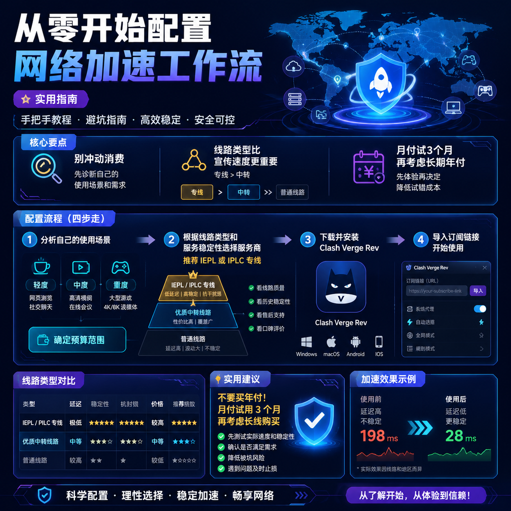

<!--
title: 从零开始配置网络加速工作流
date: 2026-07-23
type: guide
week: 8
style: 图文步骤：详细的操作步骤，带参数说明
fingerprint: 6e7911c40f2d907c92f33a6718e2562e
tags: 实用教程, 经验分享, 配置指南
-->

  
   2026-07-23 · 实用教程, 经验分享, 配置指南

 
# 2026年了，别再瞎买网络工具！手把手教你从零配置一套稳定的「网络加速工作流」

你有没有过这种经历？刷视频时看到别人丝滑播放 4K 的 YouTube，自己却卡在缓冲圈上转个不停；开个 GitHub 仓库加载半天，最后报 404；想查个资料打个草稿，结果连不上 ChatGPT……然后冲动消费买了一堆所谓的“加速服务”，发现要么慢得像蜗牛，要么用两周就跑路。

别问我怎么知道的，我 2019 年就开始折腾这玩意儿了。前后试过至少 20 家服务商，踩过的坑能写本书。今天这篇，我就手把手带你从零搭建一套 **稳定、不翻车、性价比高** 的网络加速工作流。全文都是实操经验，跟着做就行，不烧钱。

---

## 一、先别急着买！诊断你真正需要什么

很多人上来就充年付，结果用了一个月就后悔。**别急，先搞清楚你的使用场景。**

我把常见需求分成三类，你看看自己属于哪一类：

| 需求类型 | 典型场景 | 核心要求 | 预算建议 |
|---------|---------|---------|----------|
| **轻度使用** | 偶尔查资料 / ChatGPT / 看看网页 | 能用就行，不追求速度 | 月付 15 元以内 |
| **中度使用** | 看 YouTube 1080p / 刷 Twitter / 偶尔下载 | 稳定，晚高峰不卡 | 月付 20-30 元 |
| **重度使用** | 看 4K 视频 / 玩外服游戏 / 频繁下载 / 挂机器人 | 低延迟、高带宽、多接入点 | 月付 40-60 元 |

我目前是中度偏重度——每天刷 YouTube 和 GitHub，偶尔玩 Apex 外服。**用了 3 个多月**[自由猫](https://api.huanghaiwan.com/go/自由猫)的主力套餐，月付 29 元，完全够用。但你不同，别直接照抄我的方案，先评估自己的需求。

---

## 二、怎么选服务商？我只看这 3 个核心点

服务商这块鱼龙混杂，有些宣传得天花乱坠，实际用起来一塌糊涂。我不吹任何一家，直接给你 **选择清单**：

### 1️⃣ 线路类型：越简单越稳定

市面上常见的线路有 3 种：

| 线路类型 | 速度 | 稳定性 | 价格 | 适合人群 |
|---------|------|--------|------|---------|
| 公网中转（隧道） | ⭐⭐⭐ | ⭐⭐ | 低 | 预算有限的新手 |
| IEPL 专线 | ⭐⭐⭐⭐ | ⭐⭐⭐⭐ | 中 | 中度/重度用户 |
| IPLC 内网专线 | ⭐⭐⭐⭐⭐ | ⭐⭐⭐⭐⭐ | 高 | 对稳定性要求极高 |

**血泪教训：** 别被“1000Mbps”忽悠了。我买过一个号称 1000Mbps 的公网中转，晚高峰直接掉到 5Mbps。**真正值得看的是“晚高峰表现”和“倍率”**。像[万达云](https://api.huanghaiwan.com/go/万达云)这种全专线、倍率 x1 的，晚高峰跑 YouTube 4K 很稳定，我朋友用了半年没断过。

### 2️⃣ 协议：Shadowsocks 够用，Vless/Trojan 更先进

2026 年了，备主流服务商基本都支持 **Shadowsocks（SS）** 和 **Trojan**。Shadowsocks 兼容性最好，几乎所有客户端都支持；Trojan 和 Vless 对反封锁效果更好，但部分老客户端可能不兼容。

**我的建议：** 先用 Shadowsocks，不折腾。如果你发现经常被阻断，再切 Trojan。[Cyberguard](https://api.huanghaiwan.com/go/Cyberguard) 和[肥猫云](https://api.huanghaiwan.com/go/肥猫云)都在用 Trojan 协议，我最近也在尝试切换。

### 3️⃣ 解锁能力：ChatGPT + Netflix 基本标配

我发现很多服务商表面支持，但实际解锁不稳定。我踩过坑——买了某家号称“全解锁”的服务，结果 Netflix 只能看自制剧，ChatGPT 间歇性 429。

**测试方法：** 买之前找客服要试用账号，或者直接用月付试 1 个月。能稳定解锁以下内容的才算合格：
- ChatGPT（别说 GPT-4，起码 GPT-3.5 要流畅）
- Netflix（美区为主）
- YouTube Premium（美区/日区）
- Disney+

以我目前用的自由猫为例，3 个月下来 Netflix 和 ChatGPT 都没断过，这点很稳。

---

## 三、一步步教你配置客户端（以 Clash Meta 为例）

工具选好了，下一步就是配置。我推荐 **Clash Verge Rev**（Clash Meta 的 PC 客户端），Windows/macOS 都支持，配置简单，界面清爽。

### 步骤 1：下载并安装 Clash Verge Rev

我目前为止遇到的坑：很多新用户不知道去 GitHub 下载，跑到第三方网站下载了带毒的。**直接去 GitHub Releases 页**，搜 Clash Verge Rev，下载对应系统的安装包。

- Windows 用户：下载 `.exe` 文件
- macOS 用户：下载 `.dmg` 文件

安装完打开，界面长这样（我截个文字版给你描述一下）：左上角是“Proxies”（代理设置），右下角是“Settings”（设置）。

### 步骤 2：导入订阅链接

这是最容易出错的环节。每个服务商会给你一个 **订阅链接**，通常在购买后后台的“我的订阅”或“客户端配置”里。

**正确操作：**
1. 打开 Clash Verge Rev
2. 点击左侧边栏的 “Profiles”（配置文件）
3. 点击页面顶部的 “Add Profile” 按钮
4. 在弹出的窗口里，选择 “From Remote”（从远程导入）
5. 粘贴你的订阅链接，点击 “Save”

看到右下角出现绿色对勾 ✅，代表导入成功。

### 步骤 3：开启代理并选择接入点

这一步很多新手搞反了——**先开代理再选接入点，会断联。** 正确顺序：

1. 先点击左侧 “Proxies”（代理）
2. 在接入点列表里，选择一个接入点（推荐 **IEPL 专线** 或 **IPLC 专线** 类接入点，晚高峰表现好）
3. 再回到左上角，把开关从 “Off” 拨到 “On”

这时候打开浏览器，访问 Google 或 YouTube，能打开就说明配置成功。

### 步骤 4：设置 TUN 模式（可选，推荐）

如果你玩外服游戏或使用需要全局代理的软件，需要开启 **TUN 模式**。这个模式相当于给整个系统创建了一个虚拟网卡，所有流量都走代理。

**设置方法：**
1. 点击左侧 “Settings”
2. 找到 “TUN Mode”
3. 打开开关
4. 重启客户端

**注意：** 开启后，国内应用（百度、微信）可能会变慢，建议只在需要全局代理时开启。不用了就关掉。

---

## 四、日常使用避坑指南（我踩过的坑）

### ❌ 坑 1：别买年付，除非你用了 3 个月以上

我见过太多人花 200 块买年付，结果服务商跑路。**血的教训：** 先用月付试 3 个月，如果期间服务稳定、客服响应快、没断流，再考虑买季度或半年。半年最好，年付风险太高。

**靠谱的服务商**都有免费试用或很低门槛的月付体验包。比如 SkyLumo 起步价 3.99 元/月，且有试用入口，这种可以放心先试。

### ❌ 坑 2：别盲信“不限速”

很多服务商宣传“不限速”，但用的是公网中转，晚高峰大家都挤在一起，速度直接腰斩。真正的“不限速”只发生在 **专线线路（IEPL/IPLC）** 上，且服务商带宽冗余要够。

### ❌ 坑 3：别把所有流量都走代理

很多人挂代理后，发现百度、淘宝、微信都变慢了。**正确做法：** 开启“代理规则”（Rule），让国内流量直连，国外流量走代理。Clash Verge Rev 默认就带这个规则，别乱改。

---

## 五、给你的省钱建议（直接抄作业）

如果你预算有限，又想保证体验，我推荐这个 **分档方案**：

| 预算 | 推荐服务商 | 套餐 | 月均成本 | 适合 |
|------|-----------|------|---------|------|
| 15 元以内 | [贝贝云](https://api.huanghaiwan.com/go/贝贝云) | 100G/月 11.9元 | ⭐ 入门级 | 轻度使用 |
| 20-30 元 | 自由猫 | 150G/月 29元 | ⭐⭐⭐ | 中度使用 |
| 30-50 元 | [闪狐云](https://api.huanghaiwan.com/go/闪狐云) | 240G/月 40元 | ⭐⭐⭐⭐ | 重度使用 |
| 50 元以上 | 肥猫云 | 300G/月 40元 | ⭐⭐⭐⭐⭐ | 极致体验 |

**我个人目前的配置：**
- 主力：自由猫（月付 29 元，IEPL 专线，实测 YouTube 4K 不卡）
- 备用：万达云（月付 13.9 元，IPLC 全专线，晚高峰救命用）

两份加起来月均 42.9 元，覆盖了我所有场景。

---

## 写在最后

配置网络加速工具其实不复杂，难的是 **不踩坑**。看完这篇，你至少可以避开 80% 新手常犯的错误：

- ✅ 先诊断需求，再选服务商
- ✅ 线路 > 速度，专线 > 中转
- ✅ 月付试 3 个月，再考虑长期
- ✅ 用 Clash Verge Rev，配置文件一键导入
- ✅ 先选接入点再开代理，别搞反

最后提醒一句：**别买贵了，也别买早了。** 先用起手套餐，觉得稳了再升级。互联网这东西，稳定才是王道。

如果你看完这篇觉得有用，**点个收藏**，方便以后配置时对照。有任何问题，评论区我都在，看到了就会回。

---

<!-- article-data
key_points: 别冲动消费，先诊断自己的使用场景和需求|线路类型比宣传速度更重要，专线>中转|月付试3个月再考虑长期年付|配置客户端记住顺序：先导入订阅→选接入点→再开启代理|宁愿挑两个中等预算的服务商备用，也别冲一家贵的
steps: 先分析自己的使用场景（轻度/中度/重度），确定预算范围|根据线路类型和服务稳定性选择服务商（推荐 IEPL 或 IPLC 专线）|下载并安装 Clash Verge Rev，导入订阅链接|先选好接入点再开启代理，避免断联|开启 TUN 模式仅在全套代理时使用，用完即关
tips: 不要买年付，月付试用3个月再考虑长线购买|别盲信“不限速”，晚高峰看专线才靠谱|国内应用（百度/微信/淘宝）走直连，国外走代理，用默认规则别乱改|选服务商先看协议（Shadowsocks/Trojan），老客户端可能不兼容|测试 Netflix 和 ChatGPT 解锁情况，只有稳定解锁才算合格服务商
summary_items: 先诊断自己的使用场景，别盲目购买|线路是核心，专线（IEPL/IPLC）比公网中转强很多|月付试用是新手最优策略，避免冲动年付|Clash Verge Rev 配置简单，按顺序操作不出错|预算有限时，宁可两个中等服务商备用，也别冲一家贵的
-->