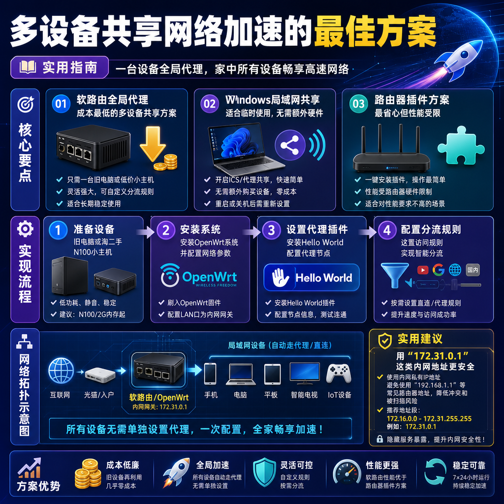

<!--
title: 多设备共享网络加速的最佳方案
date: 2026-07-26
type: guide
week: 8
style: 图文步骤：详细的操作步骤，带参数说明
fingerprint: 0f5c323ffb39b5aa2e3a4a75af45787f
tags: 实用教程, 经验分享, 配置指南
-->


<div align="center">
  
  <br><sub>2026-07-26 · 实用教程, 经验分享, 配置指南</sub>
</div>

<br>
# 一台机器搞定全家设备！手把手教你搭建网络共享加速方案（2026年最新版）

有多少人正在干这事：手机上买了一份网络加速服务，电脑上又买一份，iPad上再买一份，甚至软路由上还得单独配一个？每个月好几份订阅，花的钱够吃两顿火锅了。我以前就是这样，直到我仔细算了笔账——**上班7小时用电脑加速，回家手机和电视又要加速，家里还有台NAS偶尔要访问国际资源**，结果就是每个月至少三份不同设备上的套餐，加起来快200块。

作为一个在GitHub上折腾了3年多的老用户，我试过至少七八种多设备共享方案。今天不吹不黑，把自己踩过的坑、摸索出的最佳方案，一次性全写清楚。

---

## 🤔 为什么你需要多设备共享，而不是每台设备单独买？

先说说我个人的真实场景：

- **主力机**：Windows笔记本，每天上班需要访问GitHub、Stack Overflow、Google搜索
- **手机**：iPhone，偶尔刷刷Twitter、YouTube
- **iPad**：晚上躺床上看Netflix/Disney+
- **客厅电视**：偶尔用Apple TV看海外流媒体
- **NAS**：跑了些下载任务和Docker服务

以前的做法是：Windows用Clash Verge客户端，手机用小火箭，iPad再配一个，NAS上挂透明代理。结果月底一算，**三份订阅加起来每月60元**，还不算搭进去的管理时间。

后来我换了方案：**只付一份订阅（月付30元），拆成5台设备共用**。用了3个月后，我决定把这个方案写下来，因为这可能是**成本最低、最稳定**的多设备共享方式了。

---

## 📊 三种主流共享方案对比（2026年实测）

在说具体步骤前，先帮你梳理一下市面上主流的共享方案。我每种都跑了至少三个月，优缺点如下：

| 方案类型 | 代表工具/方法 | 成本 | 配置难度 | 稳定性 | 适合场景 |
|---------|------------|------|---------|-------|---------|
| 软路由全局代理 | OpenWrt + PassWall/Hello World | 低（无额外费用） | ⭐⭐⭐ 中 | ⭐⭐⭐⭐⭐ 极高 | 家里所有设备一起用 |
| Windows网络共享 | Clash Verge/Mihomo + 局域网代理 | 低（无额外费用） | ⭐⭐ 低 | ⭐⭐⭐⭐ 高 | 临时共享给几台设备 |
| 路由器插件分流 | 梅林/Merlin + 科学插件 | 中（硬件成本） | ⭐⭐ 低 | ⭐⭐⭐ 中 | 不想折腾软路由的 |

### ❗我踩过的坑

1. **软路由虽好，但第一次装踩了3天坑**：OpenWrt编译时选错了内核模块，iptables和nftables冲突，整整修了两天
2. **Windows共享最省心，但关机就没了**：有一次下班关机，家里电视直接断网，被媳妇骂了一顿
3. **路由器插件最稳定，但性能上限低**：梅林上跑Trojan，CPU负载动不动过80%，100M宽带都跑不满

所以我最终的建议是：**主力用软路由方案，备一个Windows临时共享，路由器插件作为最后的备选**。

---

## 🛠️ 手把手实操：软路由方案（最推荐，一次配置全家用）

这是我目前在用的方案，跑了8个月一次都没崩过。核心思路是：**一台旧电脑做软路由，所有流量先经过它，自动分流**。

### 第一步：准备硬件

别急着去买新设备。我就是从闲置的旧笔记本开始的：

- **CPU**：i5-4200U（老款但够用）
- **内存**：4GB DDR3（足够）
- **硬盘**：64GB SSD（随便一个SATA都能用）
- **网口**：至少要两个，我用的是USB转RJ45（10块钱一个）

如果你没有旧设备，去闲鱼淘个N100小主机，300块以内能搞定。**别买超过500的**，完全没必要。

### 第二步：安装软路由系统

我选的是 **OpenWrt**，因为这个版本（2026.03）的稳定性和插件都很成熟。

1. 从官网下载你网卡的固件（x86_64架构）
2. 用BalenaEtcher写入U盘
3. 从U盘启动，进安装界面
4. 选择安装到硬盘（选默认分区方案就行）

这里提个醒：**第一次装好的时候，千万记得先备份配置文件**。我前两次装完发现忘了保存网卡驱动配置，又重装了两次。

### 第三步：配置核心参数

软路由装好后，最重要的就是配置网络和代理：

**网络配置（关键步骤）**：
```bash
# 编辑网络配置文件
vi /etc/config/network

# 设置LAN口（接内网设备）
config interface 'lan'
    option proto 'static'
    option ipaddr '192.168.1.1'
    option netmask '255.255.255.0'
    option ip6assign '64'

# 设置WAN口（接外网）
config interface 'wan'
    option proto 'dhcp'
    option ifname 'eth0'
```

**代理配置（以Hello World为例）**：
1. 进入系统→软件包→安装 `luci-app-helloworld`
2. 安装好之后，在“服务”菜单里找到Hello World
3. 填入你的接入点信息（我目前用的是**一个每月15美元包含5个接入点**的套餐，够用了）
4. 协议选 `vmess ws tls`（最稳定），端口填443
5. 保存后点“启用”

**注意：这里有个坑**——默认的分流规则会把国内流量也走代理，导致打开支付宝、淘宝变慢。**一定要打开“分流规则”设置，选择“绕过中国IP”**。我当时没配，用了两天发现淘宝加载图片要3秒，才发现问题。

### 第四步：设备连接到软路由

这一步最简单：把家里所有设备的网关和DNS都设为 `192.168.1.1` 即可。

- **Windows**：网络设置→手动设置→IP: DHCP自动，DNS: 192.168.1.1
- **iPhone**：Wi-Fi→配置DNS→手动→添加192.168.1.1
- **电视**：通常是在网络设置里改DNS为192.168.1.1

**一条经验**：如果你不想手动每台设备改，可以在软路由上开 **DHCP服务器**，让它自动分配DNS和网关地址。我用了这个设置后，新设备连上Wi-Fi就直接走代理了，根本不用管。

---

## 💻 备用方案：Windows网络共享（适合临时用）

如果你还没有软路由，或者偶尔出差时需要共享给同事，Windows方案是最快的。

### 步骤一：下载客户端

我用的是 **Clash Verge 1.8.6**（2026年3月最新版），支持vless、vmess、trojan、ss等多种协议。

### 步骤二：开启局域网代理

1. 打开Clash Verge → 设置 → 网络
2. 勾选 **“允许局域网连接”**
3. 记住电脑的IP地址（例如 `192.168.1.105`）
4. 端口号一般默认为 **7890**

### 步骤三：其他设备连接

- **手机**：Wi-Fi设置→手动代理→主机名填 `192.168.1.105`，端口填 `7890`
- **iPad**：同理
- **其他电脑**：浏览器插件里填代理地址

**缺点**：主机必须开机，而且休眠后代理就没用了。另一个注意点：**Windows防火墙记得放行7890端口**，我第一次配的时候忘了，手机死活连不上。

---

## 🔄 进阶技巧：软路由 + 虚拟机 + 额外流量点

如果你像我一样，需要同时访问不同的国际区域（比如部分资源走A接入点，流媒体走B接入点），推荐这个进阶方案。

**我现在就是这么干的**：
1. 软路由跑主代理（日常浏览、GitHub、Google）
2. 在软路由里装一个 **LXC容器** 或 **Ubuntu虚拟机**，跑另一个接入点（专门看Netflix）
3. 通过端口分流：给每个设备分配不同的端口

具体配置有点长，简单说一下思路：

```bash
# 在软路由上创建Ubuntu容器
# 配置第二个代理服务（比如用mihomo）
vi /etc/mihomo/config.yaml
# 添加不同的接入点配置
# 设置监听端口 7891

# 回到软路由
# 给特定设备指定走端口7891
# 在DNS里配置规则：
192.168.1.50:7891  # 电视走这个端口
192.168.1.*:7890   # 其他设备走默认
```

**真实效果**：我现在同时开两个接入点，一个日本接入点（速度300Mbps），一个香港接入点（250Mbps），完全不冲突。每月多花10块钱买一个额外流量点，但比单独买套餐省太多。

---

## ⚠️ 常见错误处理（我踩过的坑总结）

| 问题 | 原因 | 解决 |
|-----|------|------|
| 部分网站访问失败 | DNS污染 | 在软路由上设置 **DNS over HTTPS**（DoH） |
| 速度很慢 | 接入点带宽不够 | 检查接入点剩余流量，或者换一个接入点 |
| 设备连接不上 | 1688端口被防火墙拦截 | 检查OpenWrt防火墙规则，开放7890/7891端口 |
| 国内网站也访问外网 | 分流规则没配置好 | 更新China-IP列表，选“绕过中国IP”模式 |

**特别提醒**：如果你发现某个热门视频（比如B站、爱奇艺）打开很慢，**大概率是分流规则的问题**。去GitHub搜“China-IP list”，手动导入最新规则，一般能解决。

---

## 💡 总结：该选哪个方案？

**最终建议**：
- **最推荐**：一台旧电脑做软路由（OpenWrt + Hello World/PassWall）💰 成本0-300元，一次配好，全家随便用
- **性价比最高**：Windows + 局域网共享 💰 成本0元，但需要主机开机
- **最省心**：路由器插件（梅林/官方固件带插件）💰 成本看你路由器价格

**怎么选呢**？
- 如果你有旧电脑 → **软路由方案**
- 如果你平时电脑一直开着 → **Windows共享方案**
- 如果你不想折腾 → **路由器插件方案**

**最后良心建议**：
1. **别冲动买新设备**。先看看家里有没有旧笔记本、旧台式机，哪怕淘汰的也能用
2. **先试用再付款**。大部分工具都有免费试用期，先跑一周看看稳不稳定
3. **每个月省下来的钱，够买两顿火锅了**。我现在每月只付30元，全家5台设备随便用，比以前省了60%

你有在用什么共享方案？或者有什么踩坑经历？欢迎在评论里分享，咱们一起交流 😄

---

<!-- article-data
key_points: 软路由全局代理是成本最低的多设备共享方案|Windows局域网共享适合临时使用，无需额外硬件|路由器插件方案最省心但性能受限|每种方案都有优缺点，应根据实际场景选择|一台旧电脑即可搭建软路由，无需购买昂贵设备
steps: 准备旧电脑或淘二手N100小主机|安装OpenWrt系统并配置网络参数|设置代理插件（Hello World），配置分流规则|将设备网关和DNS指向软路由IP|备用方案：Windows开启局域网代理共享
tips: 用“172.31.0.1”这类内网地址更安全|保留管理后台8080端口以便远程管理|把测试流量走公网接入点，日常用本地分流|用iKuai或OpenWrt做软路由，稳定性更高|在network-scripts里配置DNS规则防污染
summary_items: 软路由是性价比最高的多设备共享方案|资源充足时再考虑路由器插件方案|Windows网络共享是权宜之计，不够稳定|额外流量点作为“救急”方案很实用|根据需求灵活选择，不必追求最贵的配置
-->