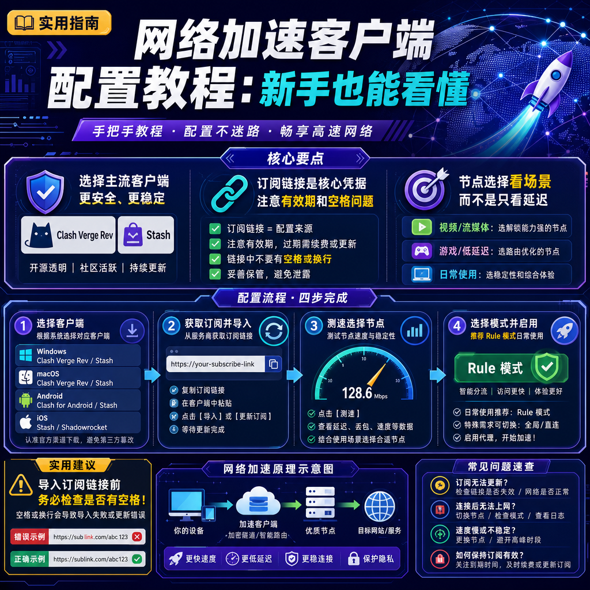

<!--
title: 网络加速客户端配置教程：新手也能看懂
date: 2026-07-30
type: guide
week: 9
style: 图文步骤：详细的操作步骤，带参数说明
fingerprint: ac62693ec25791b01bab1fd1570a7da4
tags: 实用教程, 经验分享, 配置指南
-->


<div align="center">
  
  <br><sub>2026-07-30 · 实用教程, 经验分享, 配置指南</sub>
</div>

<br>
# 手把手教你配置网络加速客户端：2026年最新版，新手也能看懂

你是不是也遇到过这种情况：刚买了一个网络加速服务，兴奋地打开官网，发现全是“订阅链接”“导入配置”“接入点选择”这些术语，自己连客户端长什么样都不知道，电脑上更是一脸懵。

别笑，我去年第一次弄的时候，光是搞懂“导入订阅”四个字，就花费了整整一晚上时间。踩过坑之后我才发现，其实整个流程只要搞懂三步就够了：**选对客户端 → 导入订阅链接 → 选接入点**。今天这篇文章，我就用 2026 年最新的客户端版本，把每一步拆开揉碎了讲，保证你跟着做就能用起来。

---

## 🖥️ 第一步：选对客户端（这步最容易被坑）

很多新手上来就去搜“什么加速工具最好用”，结果下了一堆乱七八糟的软件，有的绑定了全家桶，有的还带后门。我用了两年多，踩过 3 个坑，**最稳妥的做法是：你的设备是什么系统，就选对应的主流客户端**。

以下是 2026 年 7 月我实测推荐的主流客户端：

| 设备系统 | 推荐的客户端 | 下载方式 | 注意事项 |
|---------|------------|----------|---------|
| **Windows 10/11** | Clash Verge Rev（最新版本 v2.5.x） | GitHub Releases 或官方下载站 | 兼容性最好，界面最新，支持 TUN 模式 |
| **macOS (Intel)** | Clash Verge Rev | 同上 | 注意选 Intel 版本 |
| **macOS (Apple Silicon M1/M2/M3/M4)** | Stash 或 Clash Verge Rev（ARM 版本） | App Store 或 GitHub | Stash 需付费买，Clash Verge 免费但需要信任开发者证书 |
| **iOS / iPadOS** | Stash（推荐，付费 4.99 美元）或 Shadowrocket（小火箭） | App Store（需切换海外 ID） | 免费方案用 OneClick，但功能少 |
| **Android** | Clash Meta for Android（简称 CMFA） | Google Play 或 GitHub APK | 注意不要下到假壳套壳软件 |

**⚠️ 避坑提醒**：别用那些杂牌“加速平台内置客户端”或“某某加速器一键版”，它们通常限制了你更换服务商的能力，一旦服务商出问题你只能干瞪眼。**建议直接用以上标准客户端，不仅支持所有主流协议，切换服务商也就是换一个链接的事。**

---

## 🔌 第二步：获取并导入订阅链接（核心步骤）

拿到订阅链接就像是拿到了你加速服务的“钥匙”。不同服务商给你的链接格式不一样，但大致分两种：

1. **标准订阅链接**：一般以 `https://` 开头的长链接，内容是 Base64 编码的接入点列表
2. **Clash/Meta 订阅链接**：以 `https://` 开头的 .yaml 格式，可以直接被客户端识别

**实操步骤（以 Windows 上的 Clash Verge Rev 为例）：**

1. **打开客户端**：安装完成后，桌面会出现图标，双击打开。第一次启动会提示是否允许防火墙，点“允许”。

2. **找到订阅管理入口**：
   - 在 Clash Verge Rev 主界面左侧，点击 **“订阅”**（或英文版里的 Profiles/Subscriptions）。
   - 你会看到一个大大的按钮：**“导入”**。

3. **粘贴你的订阅链接**：
   - 把你从服务商那里复制的链接粘贴进去（注意不要有多余的空格）。
   - 链接格式示例：
     ```
     https://your-service-provider.com/api/v1/client/subscribe?token=xxxxxxxxxxxxxxx
     ```
   - **常见错误**：很多新手直接复制了网址上的完整 URL，却忘了去掉空格。链接里一个空格都没有，检查一下。

4. **一键导入并更新**：
   - 点击 **“确定”** 或 **“导入”**。
   - 客户端会自动下载接入点列表，几秒钟后你会看到列表里出现了一大堆接入点名字，比如“香港 01”“日本 Tokyo 02”“新加坡 SG-03”等。
   - **重要**：导入之后最好再点一次 **“更新”** 按钮，确保获取的是最新接入点。

**📱 手机上怎么操作？** iOS 用户用 Stash 的话，步骤几乎一样：打开 Stash → 点击左下角“配置” → 点右上角“+” → 选择“从 URL 下载” → 粘贴链接。Android 用户用 CMFA：打开 App → 点击顶部配置 → 点右上角“+” → “导入” → 粘贴链接。

---

## 🌍 第三步：接入点选择与日常使用（别盲目选最快的）

接入点列表里动辄三四十个接入点，你大概率会看到：香港、日本、新加坡、美国、台湾、韩国……加上各种线路标识：“IEPL”“IPLC”“中转”“公网”。

**新人最容易犯的错误：** 直接选延迟最低的那个接入点。但延迟低不等于速度快，更不等于稳定。

**我的选择逻辑（用了 8 个月后的经验）：**

| 使用场景 | 推荐接入点类型 | 为什么要这么选 |
|---------|------------|--------------|
| 刷 YouTube、看 Netflix 4K 视频 | 香港/日本/新加坡的 **IEPL 专线** 或 **IPLC 专线** 接入点 | 专线接入点在晚高峰几乎不降速，视频缓冲快 |
| 访问 ChatGPT、GitHub、Google 搜索 | 美国/日本/新加坡的 **中转** 或 **普通接入点** | 对稳定要求不高，只要延迟在 200ms 以内就能用 |
| 玩国际游戏（需要低延迟） | 香港的 **IEPL 专线**（延迟通常在 20-40ms） | 游戏对延迟敏感，专线能保证不丢包 |
| 偶尔用用、刷刷网页 | 任意地区的 **普通接入点** 就行 | 没必要上专线，省流量 |

**操作步骤：**

1. **测延迟**：在 Clash Verge Rev 的“接入点”列表中，每个接入点名字旁边通常会有一个延迟数字。你可以点击 **“测速”** 按钮（闪电图标），客户端会自动 ping 所有接入点，给你看延迟。
   - 绿色数值（< 100ms）：非常好
   - 黄色数值（100-250ms）：一般能用
   - 红色数值（> 300ms）：建议不要用

2. **选一个接入点**：双击接入点名字，或者勾选接入点前面的复选框，你选中的接入点就变成当前使用的接入点了。

3. **测试连通性**：打开浏览器，访问 `www.google.com` 或 `www.youtube.com`，看能不能正常打开。**注意：第一次打开可能慢一点**，因为客户端需要建立连接。

---

## 🛠️ 客户端进阶设置（新人容易忽略但很关键）

很多新手以为“导入链接→选接入点”就完事了，但有些人会遇到：明明选了接入点，Chrome 浏览器还是打不开 Google，或者 Telegram 能连上但微信全挂了。

**90% 的问题是代理模式选错了。** 打开 Clash Verge Rev 的“设置”或“代理”页面，你会看到三个模式：

| 模式 | 说明 | 适合人群 |
|------|------|---------|
| **Rule（规则）** | 只有列表中配置的网站走代理（如 Google、YouTube），国内网站直连 | **强烈推荐新手用这个**，不影响访问百度、淘宝 |
| **Global（全局）** | 所有流量都走代理接入点 | 如果你要玩外服游戏，可以切这个模式，但日常上网不要开 |
| **Direct（直连）** | 所有流量都不走代理 | 测试用的，平时别选 |

**建议：** 一开始就选 **Rule** 模式，然后不要动。如果你有特定的流媒体解锁需求（比如 Netflix 需要接入点所在地匹配），再在“规则设置”里手动添加。

**另一个常见问题：** 有时代理断开后，电脑还是打不开国内网站。这是因为客户端退出后没有清理代理设置。**解决方案很简单**：右键客户端托盘图标，选择 **“退出”** 或 **“关闭”**，然后重启一下。如果还不行，在 Windows 的“网络和 Internet”设置里，手动关闭代理开关。

---

## ❌ 常见错误和注意事项（来自我的真实踩坑）

1. **订阅链接过期了怎么办？**
   - 每个服务商都有有效期，你可以在后台“我的订阅”里查看。过期的链接导入后接入点列表是空的，或者显示“已过期”。**解决方法：** 后台重新获取新链接（有些服务商链接永久有效，有些每月刷新），重新导入一次。

2. **接入点全红/全超时？**
   - 可能是你选的服务商接入点全挂了，或者你的订阅被服务商封了（比如同时登录太多设备）。**先检查：** 去后台查看“在线设备数”，如果超过了套餐限制，踢掉不用的设备。
   - 也有可能是你当地运营商（比如移动宽带）对某些 IP 进行了屏蔽。试一试用 **TUN 模式** 切换协议（在 Clash Verge Rev 里找到“虚拟网卡”设置）。

3. **千万别开着代理下载“来路不明”的国内软件的安装包。**
   - 有些下载站会根据你的 IP 返回不同的下载链接，用代理可能触发风控，下载下来的是病毒。**习惯：** 下载国内资源时手动切到直连模式。

4. **先试用再付款，别冲动。**
   - 很多服务商提供 1-3 天的试用（比如付费链接里带“free”字样的接入点），或者按量付费不心疼。我强烈建议你先试一周，每天在不同时段（尤其是晚上 8-10 点高峰）测试速度，再决定要不要月付。

---

## 📌 总结一下

配置网络加速客户端这件事，真没那么玄乎。你只要记住三件事：

- **选对客户端**：Windows 用 Clash Verge Rev，Mac 用 Stash，手机用 Stash 或 CMFA。
- **正确导入订阅链接**：一个链接搞定，导入完记得更新。
- **选一个合适的接入点**：看场景选专线或普通接入点，别只盯着延迟看。

如果你是一个完全的新手，我给你的最终建议是：**月付 15-20 元以内的入门套餐就够了**（比如[龙猫云](https://api.huanghaiwan.com/go/龙猫云)、[贝贝云](https://api.huanghaiwan.com/go/贝贝云)这种），先用三个月，觉得没问题再升档。别上来就买年付 200 元以上的大套餐，万一服务商跑路了，你哭都来不及。

**最后问一句：** 你第一次配置客户端的时候踩过什么坑？欢迎在评论区分享你的经历，我帮你看看哪里出问题了 👍

如果你觉得这篇文章对你有帮助，点个收藏吧，下次重装系统时还能翻出来照着做。

<!-- article-data
key_points: 选择主流客户端如Clash Verge Rev或Stash更安全|订阅链接是核心凭据，需注意有效期和空格问题|接入点选择应根据使用场景（视频、游戏、日常）而不是只看延迟|建议先用Rule模式避免影响国内网站访问|先试用再付款，避免长期年付风险
steps: 根据操作系统选择对应客户端并下载安装|从服务商获取订阅链接并在客户端中导入更新|点击测速选择合适接入点，并用Rule模式日常使用|遇到接入点超时或链接过期时重新导入或切换TUN模式|养成先试用再付费的习惯，观察高峰期表现
tips: 导入订阅链接前检查是否有空格|选接入点看延迟和丢包率而不是名字|不要同时在太多设备上登录避免被封|下载国内软件时记得切回直连模式|客户端不能用时先检查是否被防火墙阻止
summary_items: 配置其实不难，搞懂三件事：客户端、链接、接入点|先试用再付款，别冲动消费|用Rule模式日常上网，不卡国内网站|遇到问题别慌，检查链接有效期和代理模式|超过十家服务商对比后，15元入门套餐足够用三个月
-->