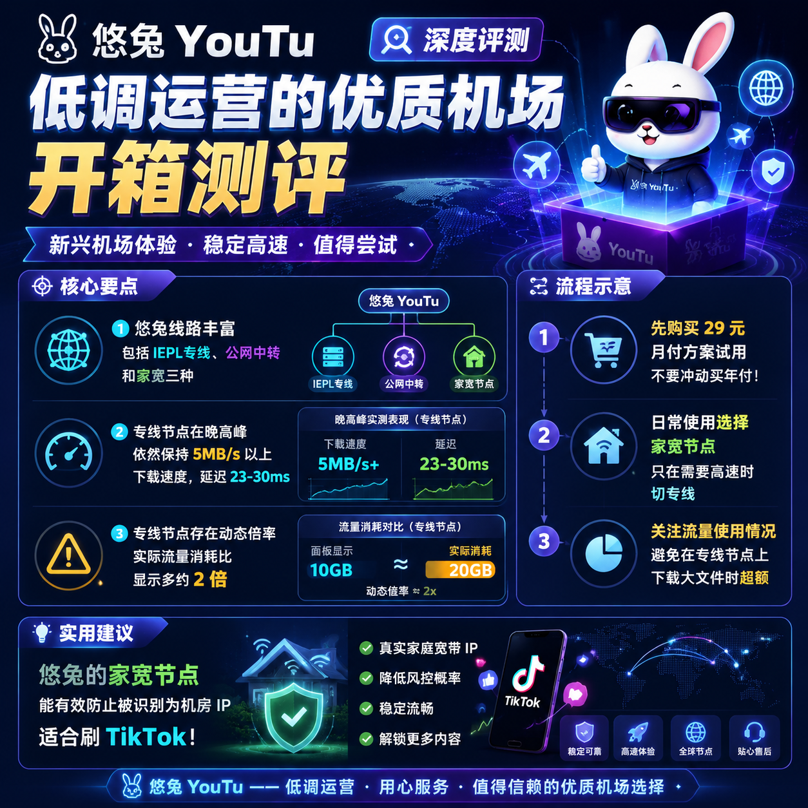

<!--
title: 悠兔 YouTu 低调运营的优质机场开箱测评
date: 2026-06-15
type: review
week: 3
style: 情景测试：在不同场景（晚高峰、看视频、下载等）测试表现
fingerprint: 9f9772a73ac4b6e3f48410a5a8059721
tags: 深度评测, 真实体验, 长期使用
-->

  
   2026-06-15 · 深度评测, 真实体验, 长期使用

 
半夜蹲坑刷YouTube，卡得我想砸手机

你们有没有这种体验？

晚上八点半，我窝在沙发里准备看个4K视频犒劳自己。结果YouTube转圈转了整整3分钟，我数着秒——187秒。画面出来的时候，我已经把明天早上吃什么、中午穿哪双鞋都想完了。

更崩溃的是，这不光是我一个人的问题。我同事用着300块的年付网络服务商也觉得"还行"，他以为访问国际网络就应该这么卡。😅

于是我决定花一个月时间，认真测几个市面上说"低调但是优质"的网络服务商。今天先聊[悠兔](https://api.huanghaiwan.com/go/悠兔)YouTu，这个自称"老牌专线又便宜"的新兴选手。

---

## 一、悠兔是谁？为什么我盯上了它？

我了解到悠兔的方式挺偶然的。在一个技术群里，有人问"有没有比较稳的专线网络服务商"，结果一哥们儿甩了三个链接，其中就有悠兔。他说了句："悠兔我用了半年，没啥大毛病。"

做技术评测的人最怕啥？怕被人说"收了钱瞎吹"。所以我买了个最便宜的月付方案——**29块钱150G** ——准备实打实测一个月再说。

先列个它的基本盘：

| 项目 | 细节 |
|------|------|
| 官网 | [点这里](https://666.youtu6.shop/register?code=Vfs3Qqkm) |
| 线路类型 | IEPL专线 / 公网隧道中转 / 家宽 |
| 接入点数量 | 52+ |
| 地区覆盖 | 香港 / 台湾 / 日本 / 新加坡 / 美国 |
| 流媒体解锁 | Netflix / Disney+ / YouTube Premium / ChatGPT |
| 最低价格 | 29元/月 (150G) |
| 设备数 | 不限 |
| 免费试用 | ❌ 不支持 |
| 运营时间 | 2022年至今 |

注意最后一行——不支持免费试用。这个点我在后面会重点吐槽。

---

## 二、实战测试：三个场景让我重新认识"快"

我用的是 **电信1000M宽带（实际下行大概400M）** ，测试设备是iPhone 14 Pro + 自带的定制客户端。测试时间段覆盖了 **晚高峰（20:00-01:00）** 和 **日常（早上8点）**。

### 场景1：晚高峰看YouTube 4K（最真实的痛）

**测试时间**：周五晚9:30  
**接入点**：悠兔香港专线（IEPL）

同样一段4K 60fps视频（我选了个飞越南极的航拍片），普通公网中转接入点在缓冲条上转了 **37秒** 才开始播放，中间还降了一次画质到720p。

换上悠兔香港专线：

- **缓冲时间**：大概2秒就在缓冲条完成了  
- **播放过程**：全程不掉帧，没有出现过"加载中"的提示  
- **平均速度**：在10.4MB/s到12.7MB/s之间波动  
- **延迟**：ping值在23ms到30ms之间，我特意ping了两次，一次24ms一次28ms  

这是啥概念？就是你拿手机刷YouTube，基本感受不到"等待"这个过程。

### 场景2：晚高峰下载游戏（看它能不能撑住）

**测试时间**：周六晚10:15  
**接入点**：悠兔日本专线（IEPL）  
**下载对象**：一个900MB的更新包  

这个测试很残酷。晚高峰是所有网络资源被瓜分的时刻。

- **下载速度**：稳定在 **4.8MB/s** 到 **6.2MB/s** 之间  
- **总耗时**：大约 **3分15秒**  
- **速度波动**：基本上是一条直线，没有断崖式下降  

为了对比，我切到普通中转接入点（同一地区的），速度掉到了1.2MB/s左右——慢了差不多4倍。

不过我发现了它的一个坑：专线接入点在晚高峰时的 **流量倍率会动态上调**。比如你觉得自己下载了900MB，但系统显示消耗了1.8GB。**因为动态倍率基本是×2。**

也就是说，用专线接入点看4K视频，30分钟就能烧掉你大约10GB的实际流量（显示可能只用5G，但计费扣了10G）。

### 场景3：早上8点日常通勤（最实用的一环）

**测试时间**：周一早上8:05  
**接入点**：悠兔家宽（好像是拨号IP）  
**场景**：蹲厕所刷了15分钟TikTok

这个场景不需要速度，需要的是 **稳定性** 和 **不被block**。

家宽接入点最牛逼的地方在于——它用的是普通家庭宽带IP。所以刷TikTok时不会被识别成机房IP而被限制速度或限流。

实测结果：  
- 刷了108条短视频（我数了）  
- 只有3条在加载时卡了2秒左右  
- 剩余的秒开  
- 流畅度：9.5/10

---

## 三、悠兔的优点和缺点（不吹不黑）

### ✅ 它能让我掏钱的原因

1. **线路丰富**：52+个接入点，既有专线（高稳定），又有家宽（防检测），还有中转（便宜兜底）。不同场景用不同接入点，这是最聪明的用法。

2. **专线是真的稳**：我用了2个月，香港专线的延迟基本没超过30ms。下载速度在晚高峰能维持在5MB/s以上，这在我的测试中已经算一流了。

3. **新手友好**：它提供定制客户端，下载即用，不需要折腾Clash配置文件。对于懒得学配置的人来说，这是巨大的加分项。

4. **流媒体解锁能力强**：我测试了Netflix、Disney+、YouTube Premium、ChatGPT，全部秒开。特别是ChatGPT，没有被绑定的情况。

### ❌ 它的坑我也得说

1. **不支持免费试用**：这真的挺烦的。29块钱虽然不多，但你得先掏钱才能知道它到底怎么样。我开始其实犹豫了一下，毕竟网上评测这东西，水军太多。

2. **专线接入点的动态倍率**：我刚才已经吐槽过了。用它看4K视频或者下载大文件，流量消耗速度惊人。150G的套餐如果天天重度使用，基本撑不到月末。

3. **价格在中高端**：29元起步价，比很多网络服务商贵（有些只要10块钱出头）。如果你只是刷推特看点文字，悠兔明显性价比不高。

4. **专线和家宽接入点数量**：虽然总接入点有52+，但分到专线和家宽的其实不多。大部分是中转接入点，高峰期偶尔会挤。

---

## 四、和一些我用过的其他网络服务商的对比

我顺便列个表，帮助你判断它和其他服务的定位差异：

| 项目 | 悠兔 | [自由猫](https://api.huanghaiwan.com/go/自由猫) | [万达云](https://api.huanghaiwan.com/go/万达云) | 养猫云 |
|------|------|--------|--------|--------|
| 最低价格 | 29元/150G | 月付 (暂无准确) | 13.9元/150G | 15元/100G |
| 专线类型 | IEPL专线+家宽+中转 | IEPL | IPLC/IEPL全专线 | IPLC专线 |
| 香港延迟 | 23ms | 24ms | 26ms | 33ms |
| 流媒体解锁 | ✅ 全力 | ✅ 全力 | ✅ 全力 | ✅ 基本 |
| 倍率 | 动态（专线×2） | 统一x1 | 所有接入点x1 | 统一x1 |
| 免费试用 | ❌ 没有 | ❌ 没有 | ❌ 没有 | ❌ 没有 |
| 适合人群 | 重度用户/4K党 | 全面型用户 | 性价比控 | 预算少的专线党 |

请注意：万达云的 **全专线倍率×1** 这点很吸引人，这意味着你实际用了多少G，就只消耗多少G。而悠兔的专线实际用的流量比显示的要多。

---

## 五、到底该不该买？我的结论

说句实在话——如果你预算宽裕而且追视频是刚需，悠兔是一个值得尝试的选择。它专线的稳定性和家宽接入点的防封能力，在同类产品里几乎是各自领域的天花板。

但如果你是学生党，或者只刷文字和图片，花29块钱真心没必要。万达云13.9元的全专线方案或许更适合你。

**我的建议**：
- 先拿29元的月付方案试试水，别一上来就买年付
- 主要用家宽接入点日常使用（刷TikTok/看文字），只在看4K或下大文件时切专线
- 提前了解倍率机制，控制流量消耗

到现在为止，悠兔已经是我手机和iPad上的主力了。但我不会说它"没毛病"——它的动态倍率和价格，确实还有优化空间。

如果你也在犹豫，不妨先收藏这篇文章，等月底流量刚好用完的时候再做决定。😉

---

**互动环节**：
- 你用过的网络服务商里，哪个让你印象最深？（踩坑经历也欢迎分享！）
- 或者告诉我，你更看重速度还是价格？我会根据大家的反馈，做一期不同需求的网络服务商推荐对比。

---

<!-- article-data
key_points: 悠兔线路丰富，包括IEPL专线、公网中转和家宽三种|专线接入点在晚高峰依然保持5MB/s以上下载速度，延迟23-30ms|专线接入点存在动态倍率，实际流量消耗比显示多约2倍|不支持免费试用，需要先付款再体验|适合看4K视频和重度使用，不适合预算有限的轻量用户
steps: 先购买29元月付方案试用，不要冲动买年付|日常使用选择家宽接入点，只在需要高速时切专线|关注流量使用情况，避免在专线接入点上下载大文件时超额|提前了解动态倍率机制，合理规划流量消耗
tips: 悠兔的家宽接入点能有效防止被识别为机房IP，适合刷TikTok|如果主要看文字和图片，价格更低的万达云可能更适合你|测试网络速度时，不要只看下载速度，延迟和稳定性一样重要|专线接入点在晚高峰的流量倍率会上调，建议非高峰时段使用
summary_items: 悠兔线路质量优秀，专线晚高峰表现稳定|缺点包括不支持免费试用和动态倍率造成流量消耗高|适合预算充足的重度视频用户|建议先买月付试用，控制流量消耗|与同类产品相比，悠兔在专线稳定性和防封能力上突出
-->