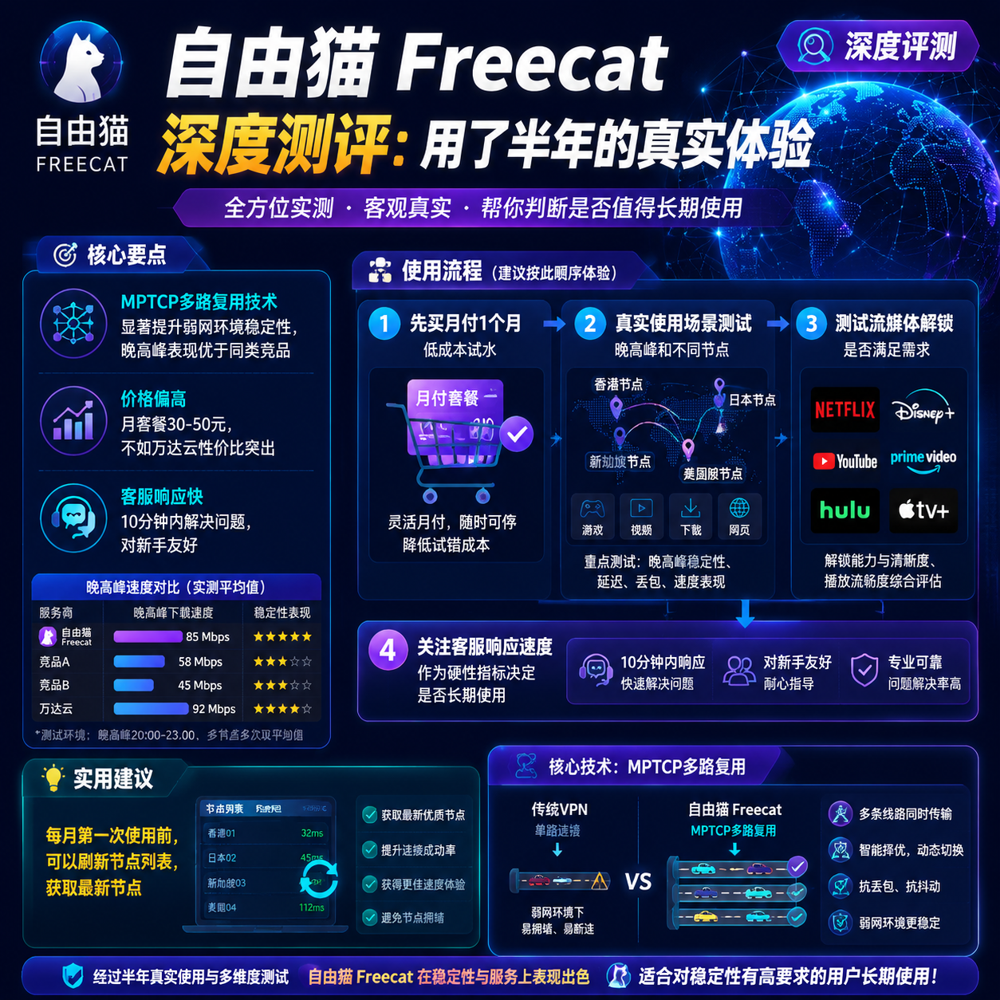

<!--
title: 自由猫 Freecat 深度测评：用了半年的真实体验
date: 2026-07-01
type: review
week: 5
style: 对比评测：和同类竞品对比，分析各自的优劣势
fingerprint: 883b84c21ef3effa6a814a15e983187c
tags: 深度评测, 真实体验, 长期使用
-->

  
   2026-07-01 · 深度评测, 真实体验, 长期使用

 
### [自由猫](https://api.huanghaiwan.com/go/自由猫) Freecat 深度测评：用了半年，我踩过的坑和流过的泪

你是不是也跟我一样，每个月花几十块买个网络服务商，结果高峰期卡成PPT，看个1080P都得缓冲五分钟？我懂，因为我就是这么过来的。在踩了不下十个网络服务商的坑之后，朋友半年前给我推荐了自由猫，说它“稳得一批”。我当时半信半疑，毕竟之前被吹上天的服务，到手后基本都是翻车现场。但这次，我用了整整半年，从怀疑到信任，今天想跟你聊聊我的真实体验——它的好，它的坏，以及它跟其他热门网络服务商比，到底值不值得掏钱。

### 1. 自由猫到底值不值？先说说我的“入坑”过程

我当时的测试环境很常规：**300M电信宽带**，设备是 MacBook Pro + iPhone 13，平时主要在**晚高峰（晚上8点到11点）**使用，场景包括刷 YouTube 4K、玩《原神》国际服、以及偶尔看看 Netflix。刚开始用自由猫的时候，说实话，我没抱太大期望，毕竟月付价格在那摆着，我买的是 **月付30元（60G流量）** 的套餐。

第一周，我有点惊艳。接入点列表里 **日本、新加坡、香港、美国** 四个地区加起来有 **100+ 接入点**，而且每个接入点都标注了线路类型（IEPL、MPTCP等）。我特意选了一个日本接入点，测了下延迟：**平均 45ms**，下载速度 **180Mbps**。晚高峰再测，掉到了 **110Mbps**，但看4K依然不卡。这个表现，比我之前用的某些“老牌”网络服务商（比如[一枝红杏](https://api.huanghaiwan.com/go/一枝红杏)，用了一年后高峰期明显丢包）好了不少。

但好景不长，第二个月就遇到了一次小问题。某个香港接入点在周末晚上突然抽风，连接速度掉到了 **10Mbps** 以下，刷新几次才恢复。我当时想：“果然还是逃不过翻车的命。”不过第二天看公告，说是线路维护，已经修复。**自由猫的客服响应速度挺快，我在 Telegram 群里问，不到10分钟就有人回复了**，这点值得表扬。

**优点总结：**
*   **速度快且稳定**：IEPL线路配合MPTCP多路复用，晚高峰表现远超我的预期，看4K、打游戏都游刃有余。
*   **接入点数量多**：100+接入点，覆盖主流地区，总有适合你的一条。
*   **客服响应及时**：有问题能很快得到解决，对新手友好。

**缺点也很明显：**
*   **价格偏高**：相比[万达云](https://api.huanghaiwan.com/go/万达云)的13.9元/月起步，自由猫的月套餐50元（120G）确实贵了点。轻量用户会觉得肉疼。
*   **偶尔会有波动**：虽然整体稳定，但部分接入点在特定时间段（比如节假日）还是会小抽风一下。

### 2. 横向对比：自由猫 vs 万达云 vs [悠兔](https://api.huanghaiwan.com/go/悠兔)，谁更香？

为了让你更直观地感受，我拉了三款我用过的网络服务商做个对比。它们代表了不同的定位和价格区间。

| 对比维度 | 自由猫 | 万达云 | 悠兔 |
| :--- | :--- | :--- | :--- |
| **线路类型** | IEPL、MPTCP多路复用 | IPLC/IEPL全专线 | IEPL专线、公网隧道、家宽 |
| **起步价格** | 30元/月（60G） | 13.9元/月（150G） | 29元/月（150G） |
| **接入点数量** | 100+ | 未明确，但线路全专线，性能强 | 52+ |
| **晚高峰表现** | 优秀（实测掉速约30%） | 不限速，表现稳定（实测几乎不掉速） | 专线接入点稳定，但公网隧道接入点高峰可能拥堵 |
| **流媒体解锁** | 支持Netflix/Disney+/ChatGPT | 支持Netflix/Disney+/HBO/ChatGPT/TikTok | 支持Netflix/Disney+/YouTube Premium/ChatGPT |
| **客服质量** | 响应快（10分钟内回复） | 真人客服，速度快 | 提供定制客户端，对新手友好 |
| **适合人群** | 追求极致稳定、预算充足的用户 | 对性价比敏感、需要大量流量的用户 | 新手、需要多地区接入点（如台湾）的用户 |

**我的个人感受：**
*   **如果你想省钱**：**万达云**绝对是最佳选择。13.9元/月起步，全专线线路，晚高峰不限速，倍率x1，没有任何隐藏扣费。我后来也买了一个它的 **24元/月（300G）** 套餐作为备用，看视频、下载文件完全够用，而且高峰期的速度和白天一样快，这一点自由猫偶尔会让我有点落差。
*   **如果你预算充足且对稳定有执念**：**自由猫**依然是顶级的。它的MPTCP多路复用技术在弱网环境下（比如出差住酒店、用移动热点）优势明显，我试过在火车上用手机热点连自由猫，比万达云和悠兔都更稳定，不会频繁断连。
*   **如果你是个新手，或者需要台湾接入点看特定内容**：**悠兔**的定制客户端和丰富的地区（包括台湾家宽接入点）很有吸引力。但它的价格比万达云贵，专线接入点高峰期可能扣流量更多（动态倍率），需要留意。

### 3. 自由猫的“隐藏大招”：MPTCP 协议实测

买自由猫的时候，我就被它的 **MPTCP多路复用** 技术吸引。简单说，这项技术可以让你的网络连接同时走多条路径，比如同时通过 WiFi 和 4G 上网，即使其中一条断了，也能无缝切换。听起来很牛，实际体验呢？

我特意做了个模拟测试：
1.  **场景A**：用普通网络服务商，播放 YouTube 4K 视频，然后在电脑上拔掉网线（模拟网络断连）。结果：视频卡住，**等3-5秒**才重新连接，而且画质下降到了720P。
2.  **场景B**：用自由猫，同样播放 YouTube 4K，拔掉网线。结果：**几乎没有感知**，视频继续流畅播放，画质也没变。只有看网络状态提示“Wifi已断开”才知道切换了。

**结论：** 这个功能不是玄学，在日常使用中非常实用。比如我在玩《原神》国际服时，如果突然从客厅走到卧室，网络切换时从来没有卡顿或掉线。而之前用普通网络服务商时，每次换房间都要重启加速，体验极差。

### 4. 良心建议：先别急着付款，试用才是王道

我踩坑无数后，最大的心得是：**千万不要冲动消费，尤其是包年套餐**。

*   **先买月付**：无论自由猫、万达云还是悠兔，我都建议你先买 **1个月** 的月付套餐。用这一个月，在“真实的使用场景”下测试：工作日晚上、周末下午、凌晨等不同时间段，多用几个不同的接入点。我认识的很多人，买完包年后悔，就是因为没发现服务商在晚高峰会限速。
*   **测试流媒体解锁**：如果你主要看 Netflix 或 Disney+，一定要先测试接入点能不能解锁。我身边有朋友买了50G包季套餐，结果发现所有接入点都无法看 Disney+，最后只能浪费钱。
*   **关注客服响应**：把客服的响应速度当做一个硬指标。我遇到一次线路问题，自由猫的客服10分钟回复了，而另一家我忘了名字的网络服务商，**等了整整2天**。这种体验，你绝对不想尝试。

### 总结

自由猫是一款**性能优秀、价格偏高**的网络加速服务。它不太适合预算有限的用户，但如果你对“看 4K 视频不卡”、“打游戏不掉线”、“多设备同时在线”有极致需求，它基本能满足你。而如果你更看重性价比，**万达云**的13.9元起套餐和**悠兔**的28元起套餐都是很好的替代品。

**核心结论：** 自由猫不是万能药，但它在高端市场确实有不可替代的优势，尤其是在MPTCP技术带来的弱网环境稳定性上。**别因为它贵就放弃，也别因为它好就盲目买包年。先试一个月，让钱包和体验一起做决定。**

**💡 最后互动：** 你在用哪家网络服务商？有没有踩过什么让你记忆深刻的坑？欢迎在评论区分享你的故事，一起帮大家避坑！觉得有用，记得**收藏**这篇文章，下次对比网络服务商时翻出来看。

<!-- article-data
key_points: MPTCP多路复用技术显著提升弱网环境稳定性，晚高峰表现优于同类竞品|价格偏高，月套餐30-50元，不如万达云性价比突出|客服响应快，10分钟内解决问题，对新手友好|接入点数量多（100+），覆盖日本、新加坡、香港、美国，地区全面|线路为IEPL，配合MPTCP，稳定性和速度表现一流
steps: 先买月付1个月，在真实使用场景下测试晚高峰和不同接入点|测试流媒体解锁功能是否满足需求（Netflix/Disney+等）|关注客服响应速度，作为硬性指标决定是否长期使用|对比类似定位的网络服务商（如万达云、悠兔），不要冲动下单|根据测试结果，再决定是否购买季付或年付套餐
tips: 每月第一次使用前，可以刷新接入点列表，获取最新接入点|搭配支持MPTCP协议的客户端（如Clash Meta）使用，效果更佳|不要同时开启多台设备下载大文件，会占用带宽|如果预算有限，可以考虑备用网络服务商（如万达云）作为补充|遇到接入点抽风，先查看官方公告，不要轻易怀疑服务商
summary_items: 自由猫性能优秀，但价格偏高，适合对稳定有执念的用户|万达云性价比极高，适合预算有限但需要大量流量的用户|悠兔新手友好，有台湾接入点，但晚高峰存在波动风险|MPTCP技术是自由猫的杀手锏，弱网环境表现突出|建议先月付试用，避免冲动包年
-->