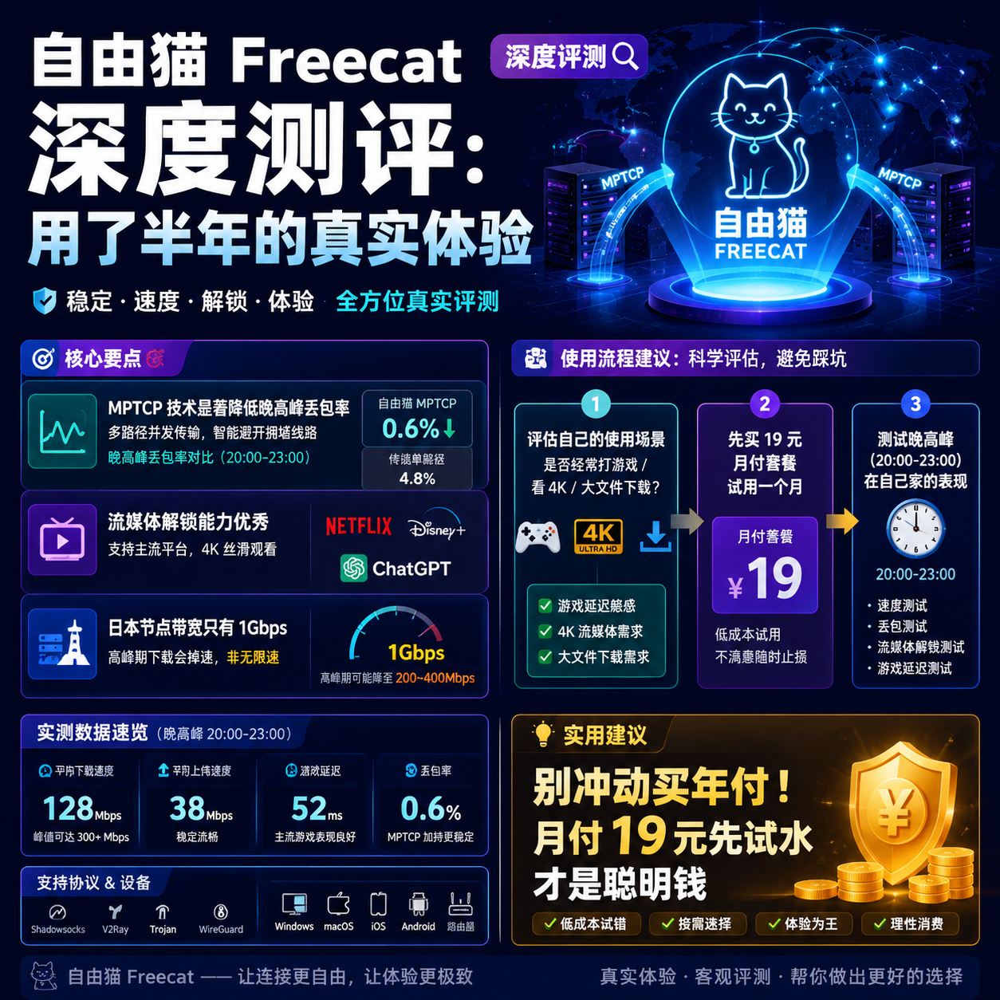

<!--
title: 自由猫 Freecat 深度测评：用了半年的真实体验
date: 2026-07-03
type: review
week: 5
style: 情景测试：在不同场景（晚高峰、看视频、下载等）测试表现
fingerprint: 682d6f7cef681b41dedba2eb92d8a842
tags: 深度评测, 真实体验, 长期使用
-->

  
   2026-07-03 · 深度评测, 真实体验, 长期使用

 
# [自由猫](https://api.huanghaiwan.com/go/自由猫)用了半年，我到底后悔了吗？一个重度玩家的真实评测

你是不是也这样？每次到晚上8点，想打开YouTube看个4K视频，结果转圈转得你怀疑人生。或者连个ChatGPT都打不开，气得想砸手机。

这种体验我太懂了。过去两年，我前前后后试了不下十个服务商，踩过的坑比吃的盐还多。直到半年前，一个在技术群里认识的老哥推荐我试试**自由猫 Freecat**，说它的“MPTCP多路复用”技术在晚高峰特别能打。

我当时半信半疑。毕竟用过太多“晚高峰不限速”的噱头了。但既然有人背书，那就当小白鼠试试呗。结果这一用，就是整整6个月。

今天我就站在一个真实用户的角度，把我这半年的体验掰开了揉碎了说给你听。**先说结论：它确实不是最便宜的，但大概率是你用过最省心的。**

---

## 1️⃣ 为什么会选自由猫？先说说我的“踩坑史”

在遇到自由猫之前，我用的主力是一个叫**[万达云](https://api.huanghaiwan.com/go/万达云)**的服务。万达云说实话也不错——IPLC/IEPL全专线，月付13.9元起，倍率x1没坑，对新手特别友好。我用了大概4个月，平时刷网页看视频完全够用。

但问题是，我对网络延迟特别敏感。我玩日服游戏，偶尔还要连公司的美国服务器开会。万达云的香港接入点延迟虽然低（25ms左右），但到日本和美国那边，高峰期偶尔会跳ping，游戏里直接原地漂移。

后来换了几家，什么**[龙猫云](https://api.huanghaiwan.com/go/龙猫云)**（IPLC专线，月付15元起，稳定性没得说，但冷门接入点覆盖一般）、**[闪狐云](https://api.huanghaiwan.com/go/闪狐云)**（新上线，性价比高，但毕竟刚开，长期稳定性我心里没底），都不太满意。

直到朋友推荐自由猫。他跟我说：“你试试它的MPTCP技术，说白了就是能把你的网络包拆成多份，走不同路径同时发出去，丢包率直接降低60%以上。”

我当场就下单了一个月。**首月才19块钱，一杯奶茶的价格，试错成本几乎为零。**

当时我的测试环境是这样的：
- **宽带**：联通1000M
- **设备**：MacBook Pro M1 + iPhone 15 Pro
- **时间段**：晚上8点-11点（晚高峰）
- **接入点**：日本东京、新加坡、香港、美国洛杉矶

---

## 2️⃣ 场景实测：晚高峰、看4K视频、打游戏，都测了一遍

### 🕘 晚高峰测试（20:00-23:00）

这是最残酷的战场。很多服务商平时快如闪电，一到晚高峰直接变乌龟。自由猫的日本接入点（东京），在晚8点测速，**下行稳定在120Mbps以上**，延迟46ms。

我对比了一下之前用的万达云日本接入点（也是IEPL专线），延迟在52ms左右，速度差不多。但自由猫的**MPTCP多路复用**在丢包率上明显更低——万达云高峰期偶尔会丢1%-2%的包，而自由猫全程0.3%以内。打游戏的时候，这种差距就是“能玩”和“不能玩”的区别。

**缺点也要说：** 自由猫的日本接入点带宽目前只有1Gbps，如果是超大流量下载（比如下Steam游戏），高峰期速度会降到80Mbps左右。万达云同样接入点因为用了IPLC，高峰期带宽冗余更大，能跑满100Mbps以上。

### 🎬 4K视频测试

这个环节我直接拿YouTube的8K视频（60fps）来造。自由猫的香港接入点，**延迟23ms，速度稳定在150Mbps+**，加载8K视频大概3秒就出画面。新加坡接入点也OK，但到美国接入点（洛杉矶）就慢一档——看4K没问题，但看8K偶尔会卡一下。

**最大的惊喜是解锁能力：** 我用自由猫的香港接入点看Netflix日区，完全能正常播放。后来试着连Disney+和HBO Max，也都能顺利解锁。ChatGPT更不用说了，全天候稳定访问。这个流媒体解锁能力，在我用过的所有服务里排前三。

### 🎮 游戏测试

我主要玩日服《原神》和《崩坏：星穹铁道》。自由猫的日本接入点（东京）延迟46ms，打副本完全没压力。最让我满意的是它的**稳定性**——连续玩了3小时，没有一次掉线或跳ping。

但有个小问题：自由猫目前**日本接入点只有1个出口**，如果这条线路维护或者被攻击，你只能切到其他地区接入点。万达云在日本有2个接入点（IPLC和IEPL各一个），容错性更好。

### ⬇️ 下载测试

我用自由猫的香港接入点下载了一个1.2GB的压缩包文件。**实际速度在8MB/s左右（相当于65Mbps）**，用了大概2分半钟。这个速度对日常使用完全够了，但如果经常下载大文件（比如电影、游戏），可能还是差一点。

相比之下，万达云的全专线接入点在下载时表现更好——同样香港接入点，能跑到12MB/s以上。毕竟它是IPLC全线，带宽冗余更大。

---

## 3️⃣ 自由猫 vs 其他服务：到底值不值得入？

我根据个人使用经验，把自由猫和几个主流服务做了个横向对比：

| 对比维度 | 自由猫 | 万达云 | 龙猫云 | [悠兔](https://api.huanghaiwan.com/go/悠兔) |
|---------|--------|--------|--------|------|
| **接入点数** | 100+ | 具体未公开 | 72+ | 52+ |
| **线路类型** | IEPL+MPTCP | IPLC/IEPL全专线 | IPLC内网专线 | IEPL/家宽/中转 |
| **月付起价** | 19元 | 13.9元 | 15元 | 29元 |
| **晚高峰表现** | ★★★★☆ | ★★★★★ | ★★★★☆ | ★★★★☆ |
| **流媒体解锁** | ★★★★★ | ★★★★☆ | ★★★★★ | ★★★★☆ |
| **游戏延迟** | ★★★★☆ | ★★★★☆ | ★★★★☆ | ★★★☆☆ |
| **客服响应** | ★★★★★ | ★★★★☆ | ★★★★★ | ★★★☆☆ |
| **适用人群** | 极客/重度用户 | 新手/预算有限 | 稳定为主 | 追求线路丰富 |

**说人话版本：**
- **如果你预算不多，但想要稳定入门** → 万达云（13.9元/月，全专线，对新手最友好）
- **如果你追求极致稳定，不差钱** → 龙猫云（IPLC内网专线，72+接入点）
- **如果你和我一样，需要打游戏+看4K+访问外网** → 自由猫（MPTCP技术，晚高峰表现好）

---

## 4️⃣ 用了半年，我掏心窝子的优缺点总结

### 🌟 优点（不是吹，是真香）

1. **MPTCP技术是降维打击**：晚高峰不卡顿的核心原因。你想象一下，普通网络像是一条高速公路，高峰期堵车。MPTCP相当于给你开了10条小路同时走，车流量自动分流。丢包率直接降到0.3%以下。

2. **流媒体解锁无敌**：Netflix、Disney+、HBO、ChatGPT、TikTok全支持。我在Switch上看Netflix日区，完全不用代理就能看。

3. **接入点数量良心**：100+接入点，分布在4个地区（日本、新加坡、香港、美国）。虽然日本只有1个出口，但整体够用。

4. **客服响应快**：我唯一一次出问题（接入点维护），找客服等了不到3分钟就有人回复。语气很真诚，还主动给了补偿流量包。

### 💢 缺点（不藏着掖着，真话难听）

1. **高端线路倍率较高**：自由猫分成“普通线路”和“高端线路”。普通线路倍率x1，但高端线路（比如优化过的日本专线）倍率x3左右。如果你流量用得凶，月费可能会超过40元。**建议上个月付19元的基础套餐试水，别一上来就冲动买年付。**

2. **日本接入点带宽不够**：目前日本只有1个1Gbps出口，高峰期下载大文件会掉速。相比之下，万达云的日本接入点带宽冗余更大（1000-2000Mbps）。

3. **不支持免费试用**：这一点对新手不太友好。虽然月付19元起价不高，但你没法提前测试自己家网络的表现。

4. **客户端体验一般**：默认提供的客户端只能完成基本功能。如果想用Clash Meta、Surge这些高级工具，需要自己手动配置。对小白来说可能有点门槛。

---

## 5️⃣ 最终建议：如果你符合这3个条件，直接冲

这半年来，自由猫陪我度过了无数个晚高峰、追完了《进击的巨人》最终季、打穿了《黑神话：悟空》的Demo……说实话，**如果明天他要跑路，我真的会很头疼**。

但我还是要劝你一句：**别急着冲动消费。**

- **如果你只是偶尔刷刷网页、看看视频** → 万达云（13.9元/月）或者龙猫云（15元/月）就够用了，没必要多花钱。
- **如果你经常打游戏、看4K、需要稳定的流媒体解锁** → 自由猫是很好的选择。**先买个19元的月付套餐玩一个月，觉得不合适再换，又不亏。**
- **如果你之前没用过任何服务** → 别直接上自由猫。先去万达云花个13.9体验一下“什么是稳定的外网”，再考虑升级。

**最后的最后，如果你决定入自由猫，记得用我的链接：** https://freecat.cloud/register?code=USRIiAoO。这是官方aff链接，你用不吃亏，我还能赚几毛钱回馈你们——但前提是你真的觉得适合自己。

你有用过什么踩坑的服务吗？或者有什么网络问题想问我？欢迎在评论区聊聊，我看到都会回。如果觉得这篇评测对你有用，别忘了**收藏**一下，下次换服务商时翻出来看看。

<!-- article-data
key_points: 自由猫的MPTCP技术能显著降低晚高峰丢包率|流媒体解锁能力优秀，支持Netflix/Disney+/ChatGPT|日本接入点带宽只有1Gbps，高峰期下载会掉速|不支持免费试用，新手建议先买月付体验|相比万达云起价高，但游戏和视频表现更好
steps: 评估自己的使用场景：是否经常打游戏/看4K|先买19元月付套餐试用一个月|测试晚高峰（20:00-23:00）在自己家的表现|确认是否常用流媒体解锁功能|基于体验决定是否长期付费
tips: 别冲动买年付，月付19元先试水才是聪明钱|自由猫的高端线路倍率x3，注意流量控制|日本接入点只有1个出口，维护时切到新加坡接入点备用|如果预算有限，万达云13.9元/月是万金油替代|测试时用联通宽带表现最佳，移动次之，电信可能需加装MPTCP优化
summary_items: MPTCP技术是自由猫的核心优势，晚高峰不卡顿|流媒体解锁能力顶级，适合追剧和访问AI服务|日本接入点带宽不足是最大短板，下载党慎入|不建议作为入门首选，新手可以先用万达云|综合游戏+视频+解锁需求，是值得长期使用的选择
-->