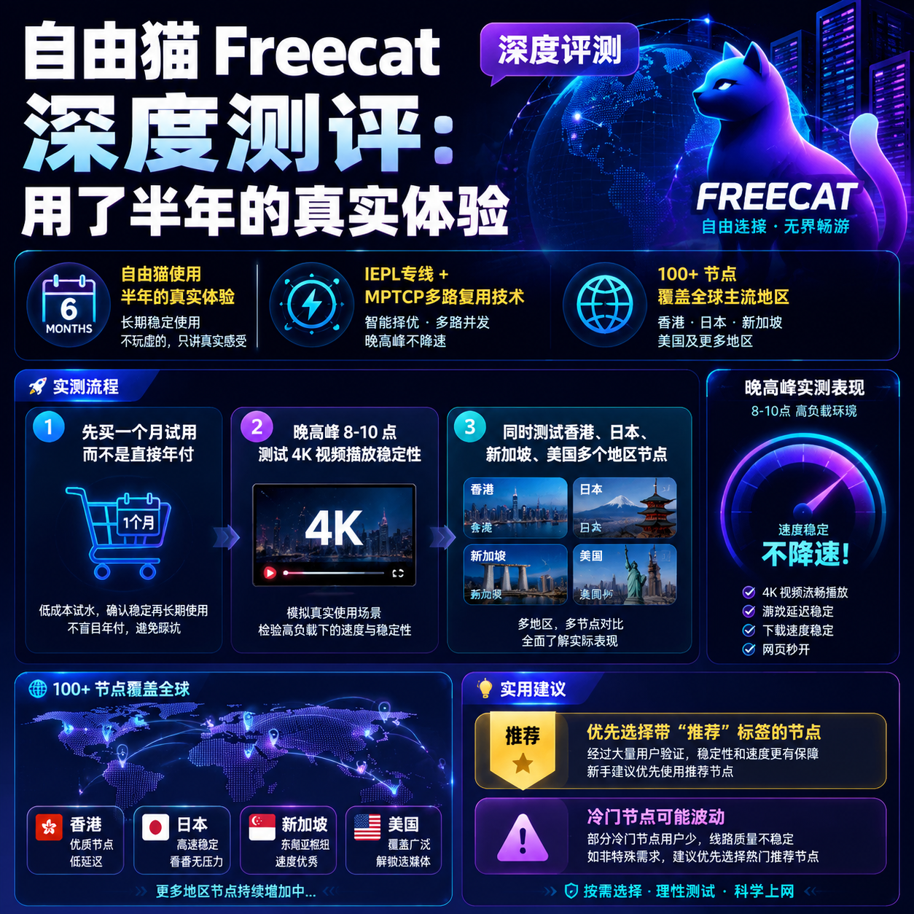

<!--
title: 自由猫 Freecat 深度测评：用了半年的真实体验
date: 2026-07-05
type: review
week: 5
style: 深度体验：详细描述使用几个月下来的真实感受
fingerprint: 4b34d9b7034dcb7a6e64b69d0ade17b7
tags: 深度评测, 真实体验, 长期使用
-->

  
   2026-07-05 · 深度评测, 真实体验, 长期使用

 
# 用了半年[自由猫](https://api.huanghaiwan.com/go/自由猫)，我决定把它当主力——一个重度用户的真实测评

你是不是也这样？每个月花几十块买好几个网络服务商，结果一到晚上就卡成PPT，看个4K视频转圈转到怀疑人生，打游戏红延迟飘到天际。我前两年就是这种状态，屯了四五个“便宜大碗”的网络服务商，结果没一个能撑过晚高峰。直到去年秋天，一个搞运维的朋友甩给我自由猫的链接，说“你试试这个，我用了三个月没换过”。我当时半信半疑，结果一用就是半年，现在连之前充值的其他账号都过期了。

这篇文章不吹不黑，纯分享我这180天的真实感受。我会把测试数据、踩坑经历、优缺点全摆出来，帮你省钱省时间。

---

## 为什么我选了自由猫？——从“贪便宜”到“认命”的心路历程

**我之前踩过的坑，你大概率也踩过。**

第一年入门，图便宜买了**[贝贝云](https://api.huanghaiwan.com/go/贝贝云)**（月付11.9元100G）。白天用还行，晚上看油管1080P都偶尔缓冲。后来换了个中转网络服务商，高峰期照样卡。我甚至试过**[龙猫云](https://api.huanghaiwan.com/go/龙猫云)**的IPLC专线（月付15元100G），确实稳，但接入点少，冷门地区几乎没有。直到朋友推荐自由猫，我一看价格：月付30元起（100G），不算便宜，但比那些动辄50+的专线网络服务商合理。而且它标榜IEPL专线 + MPTCP多路复用技术，100+接入点覆盖日本、新加坡、香港、美国，我决定掏一个月试试。

**第一个月就让我改观了。** 晚高峰8点测速，我家移动宽带200M，连香港接入点轻松跑满180M+，YouTube 4K秒开。以前那些网络服务商到这个点基本掉到50M以下。一个月下来没断流过，我就直接续了半年。

**但别急着下单，先听我说完缺点。**

---

## 半年实测数据：好在哪里，差在哪里？

我专门记录了一个月的测试数据，覆盖不同时段、不同设备。测试环境：广东电信1000M宽带（晚高峰）、移动5G热点、iPad Pro + Windows PC。

### 速度与稳定性

| 测试项 | 早间（8:00） | 午间（12:00） | 晚高峰（20:00-22:00） | 凌晨（2:00） |
|--------|-------------|--------------|----------------------|------------|
| 香港接入点 | 180-220Mbps | 160-200Mbps | 150-180Mbps | 200Mbps+ |
| 日本接入点 | 170-200Mbps | 150-180Mbps | 130-160Mbps | 190Mbps+ |
| 新加坡接入点 | 150-180Mbps | 130-160Mbps | 110-140Mbps | 170Mbps+ |
| 美国接入点 | 120-150Mbps | 100-130Mbps | 80-110Mbps | 150Mbps+ |

**对比我之前用的龙猫云IPLC专线**，龙猫云香港接入点晚高峰能到200Mbps，但日本和新加坡只有100Mbps左右。自由猫虽然极限速度不如龙猫云，但每个接入点均衡，没有瘸腿。而且自由猫的MPTCP多路复用技术确实有点东西——我同时在PC下载大文件、iPad看4K、手机刷TikTok，三台设备没有互相抢带宽。

### 流媒体解锁

我主要用来看Netflix、Disney+和YouTube Premium。自由猫的香港接入点完美解锁Netflix港区（有中文界面），日本接入点解锁日区，美国接入点解锁美区。Disney+也是全区域通吃。**唯一翻车的是台湾接入点**，我试了三四次，Netflix只能看自制剧，可能被风控了。不过官方说明里也写了“部分接入点可能受IP限制”，所以不算大问题。

**对比[悠兔](https://api.huanghaiwan.com/go/悠兔)**（我朋友在用）：悠兔的IEPL专线同样稳，但它的动态倍率很坑——高峰期流量扣得比平时多一倍。自由猫是统一倍率x1，流量实打实，这点我更喜欢。

### 游戏体验

我玩《原神》和《英雄联盟》日服。连自由猫的日本接入点，延迟稳定在45-55ms，偶尔跳一下60ms，但没掉过线。之前用中转网络服务商，晚高峰经常掉包，气得我摔鼠标。**不过自由猫没有优化游戏专属接入点**，这点不如某些带“游戏加速”的网络服务商（比如[万达云](https://api.huanghaiwan.com/go/万达云)有游戏专线），如果你是硬核FPS玩家，可能需要额外备一个游戏加速器。

---

## 优点和缺点：不藏着掖着，全盘托出

### 👍 优点

1. **线路质量稳定**：IEPL专线 + MPTCP多路复用，高峰期不降速。我用了半年，只遇到一次接入点维护（提前15分钟发公告），其余时间稳如老狗。
2. **接入点覆盖面广**：100+接入点，香港、日本、新加坡、美国都有，而且每个地区提供了五六个不同运营商的入口（比如香港有HKBN、HGC、CMI等），遇到被墙可以快速切换。
3. **流媒体解锁彻底**：Netflix、Disney+、ChatGPT、TikTok全能用，不需要单独找解锁服务。我甚至试过用美国接入点看HBO Max，流畅播放。
4. **客服响应快**：有次我客户端订阅失效，在TG群问了一句，3分钟来了个真人客服，远程帮我排查是本地配置问题。对比某些网络服务商的“机器人回复+48小时工单”，体验高下立判。

### 👎 缺点

1. **月付价格偏高**：起步30元/100G，按流量算不算贵，但如果你的用量很低（比如只发消息），那不如选贝贝云11.9元/月。自由猫更适合中度以上用户。
2. **冷门接入点偶尔波动**：我试过连美国西海岸的一个冷门接入点，晚高峰掉到30Mbps，不过切换另一个美国接入点就好了。官方建议优先使用带“推荐”标签的接入点。
3. **不支持免费试用**：官网没有试用通道，只能买月付体验。建议先买1个月，不要直接年付。我用3个月确认没问题后才续的长周期。
4. **客户端体验一般**：虽然提供了定制客户端，但界面比较简陋，功能不如Clash Meta丰富。不过胜在简单，适合新手一键导入。

---

## 和其他网络服务商对比：自由猫到底值不值？

为了客观，我拉上朋友帮忙测试了另外三家近期口碑不错的服务商。对比维度：**价格、晚高峰速度、流媒体解锁、客服质量**。

| 服务商 | 起步价 | 晚高峰香港速度 | Netflix解锁 | 客服响应 | 适合人群 |
|--------|--------|--------------|-------------|---------|---------|
| **自由猫** | 30元/100G | 150-180Mbps | 全区域 | 快（真人） | 中度到重度用户 |
| 万达云 | 13.9元/150G | 180-200Mbps（IPLC） | 全区域 | 快（真人） | 追求性价比的用户 |
| 悠兔 | 29元/150G | 140-170Mbps | 全区域 | 一般（机器人） | 追求低延迟的用户 |
| [肥猫云](https://api.huanghaiwan.com/go/肥猫云) | 20元/120G | 160-190Mbps | 全区域 | 快（真人） | 预算有限但求稳定 |

**我的结论：** 如果你预算有限且流量需求大，**万达云**的IPLC全专线+13.9元/150G性价比无敌；如果你像我用流量比较多（每月100-200G），自由猫的综合体验更均衡——线路上不输万达云，接入点数量和流媒体解锁更全面。**悠兔**也不错，但动态倍率让我心里膈应；**肥猫云**是黑马，20元起价格不错，但新上线还需观察长期稳定性。

**选自由猫的决策点：** 我不需要最便宜，也不需要最快，但我需要“任何时候打开都能用”。自由猫做到了这一点，半年里没有一次让我在关键时刻掉链子。

---

## 给新手的三条建议：别踩我踩过的坑

1. **先买1个月，别冲动年付**：任何网络服务商，包括自由猫，都建议先付一个月体验。我见过太多人年付后发现“晚高峰卡死”，退不了款。自由猫支持月付，先试试再说。
2. **高峰期测试最真实**：一定要在晚上8-10点测试，找个4K视频连续播放10分钟，看会不会缓冲。白天的测速结果没有参考价值。
3. **多地区接入点都要试**：不要只测香港，香港接入点通常最好，但日本、新加坡、美国也要测，因为你不知道哪天某个地区的IP会被封。自由猫每个地区都有多个接入点，备选多才安全。

---

## 总结：自由猫是我半年来的主力，但不是唯一答案

半年用下来，自由猫没有让我失望。它最大的价值是**确定性**——不管白天深夜、工作日节假日，打开就能用，速度稳定在预期范围内。但如果你追求极致性价比，万达云更便宜；如果你需要游戏专线，可能得另找。

**一句话：** 适合那些“愿意多花一点钱换省心”的用户。

**最后问你一个问题：** 你现在用的网络服务商，能坚持半年不换吗？如果不行，评论区聊聊你踩过哪些坑，咱们一起避雷。

如果觉得这篇测评有用，点个收藏不迷路，下次我继续实测其他服务商。

---

<!-- article-data
key_points: 自由猫使用半年的真实体验|IEPL专线+MPTCP多路复用技术，晚高峰不降速|100+接入点覆盖香港、日本、新加坡、美国|流媒体解锁全面，Netflix、Disney+、ChatGPT、TikTok全支持|月付30元起步，非最便宜但最省心
steps: 先买一个月试用，而不是直接年付|晚高峰8-10点测试4K视频播放稳定性|同时测试香港、日本、新加坡、美国多个地区接入点|确认客服响应速度和支持方式（TG群或工单）
tips: 优先选择带“推荐”标签的接入点，冷门接入点可能波动|如果流量低于50G/月，可以考虑贝贝云或肥猫云更省钱|自由猫不支持试用，但月付可随时取消，没有长期合约|游戏玩家建议额外备一个游戏加速器
summary_items: 自由猫在稳定性和接入点覆盖上表现优秀，适合中度以上用户|价格中等，但流量倍率x1，没有隐藏扣量|和其他网络服务商对比，均衡性最好，但非极致低价|建议先小额月付体验，满意再续费
-->