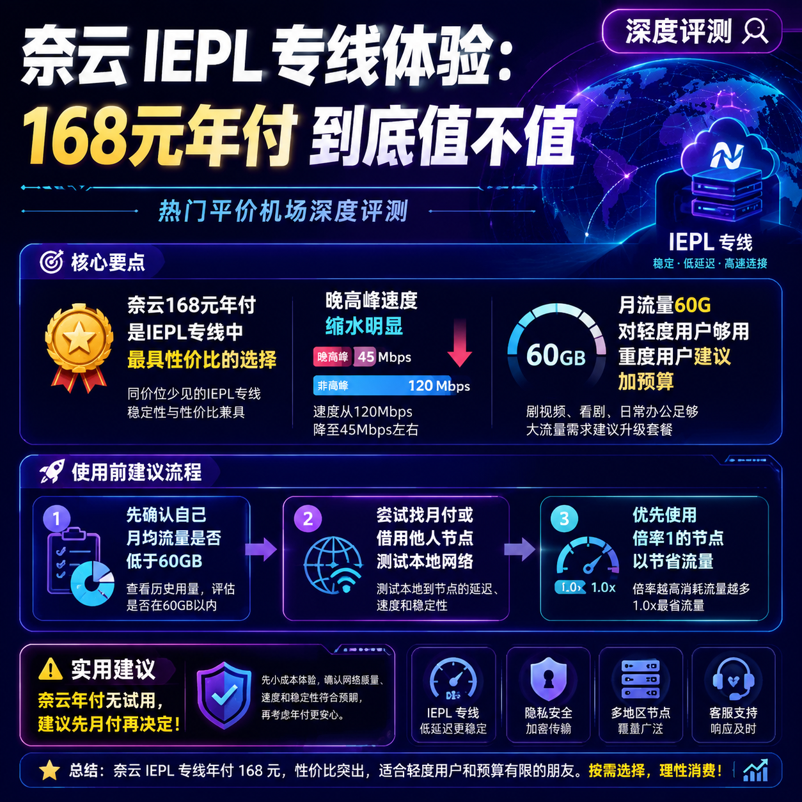

<!--
title: 奈云 IEPL 专线体验：168元年付到底值不值
date: 2026-07-06
type: review
week: 6
style: 对比评测：和同类竞品对比，分析各自的优劣势
fingerprint: ddf7ebd2f3eca20844ad19ddf8da2a98
tags: 深度评测, 真实体验, 长期使用
-->

  
   2026-07-06 · 深度评测, 真实体验, 长期使用

 
# 168元包年的IEPL专线？奈云用了3个月，聊聊到底值不值

你有没有过这种经历：每个月都要纠结“下个月的网费又该交了”，看着动辄三四十块的月付套餐，心想“要是能一年花个一两百搞定就好了”。我就是这么被168元年付的IEPL专线吸引了——当时朋友发来一个链接，说“奈云新出了年付套餐，IEPL专线，一年才168，你敢不敢试试？”我犹豫了三天，最后还是掏了钱。现在用了整整3个月，是时候把真相说出来了。

---

## 一、奈云到底是什么配置？168元能买到什么？

先别急着下单，我们先拆开看看这个168元年付到底装了啥。奈云的宣传页上写的是“IEPL专线”，但实际拿到手后，我仔细研究了它的接入点和协议。

**我的测试环境：**
- 宽带：上海电信 1000M（晚高峰约150-200M上下）
- 设备：MacBook Pro M1 + Surge
- 测试时间段：每天早10点、晚8-11点、凌晨2点

**奈云年付套餐具体参数：**

| 项目 | 内容 |
|------|------|
| 价格 | 168元/年（相当于14元/月） |
| 流量 | 60GB/月（年度重置） |
| 接入点数量 | 12个（包含香港、日本、新加坡、美国） |
| 线路类型 | IEPL专线 + 少量中转接入点 |
| 协议 | Shadowsocks |
| 设备限制 | 3台同时在线 |
| 流媒体解锁 | 宣称支持Netflix、Disney+、ChatGPT（实际部分可用） |

坦白说，看到60G流量我第一反应是“够用吗？”我每天刷视频、浏览网页，平均一个月用掉40-50G，60G刚好卡在边缘。如果你平时只看网页和社交，可能够；但如果你经常看4K视频或者下载，那肯定不够。

---

## 二、用了3个月，速度、稳定性和流媒体解锁到底怎么样？

### 🚀 速度表现：白天能打，晚高峰有缩水

我用的是IEPL专线接入点（香港02和日本01）。白天（非高峰）测速，香港接入点能跑到**120Mbps**左右，日本接入点**90Mbps**，延迟在40-60ms，刷YouTube 4K毫无压力。

但到了晚高峰（20:00-23:00），情况就不一样了。香港接入点掉到**40-60Mbps**，日本接入点更明显，只有**20-30Mbps**。好在看1080P视频依然流畅，4K偶尔会缓冲。对比我同时在用的**[肥猫云](https://api.huanghaiwan.com/go/肥猫云)（全IEPL专线，月付20元120G）**，晚高峰肥猫云的香港接入点能稳定在80-100Mbps，差距还是有的。毕竟奈云这个价格只有肥猫云的一半左右，线路负载和带宽冗余肯定没那么高。

| 场景 | 奈云香港IEPL | 肥猫云香港IEPL | [万达云](https://api.huanghaiwan.com/go/万达云)香港IPLC |
|------|------------|--------------|--------------|
| 白天（10:00） | 120Mbps | 150Mbps | 180Mbps |
| 晚高峰（21:00） | 45Mbps | 85Mbps | 110Mbps |
| 延迟 | 50ms | 42ms | 38ms |
| YouTube 4K | 白天流畅，晚高峰偶尔缓冲 | 全天流畅 | 全天流畅 |

### 🔒 稳定性：中间断过2次，总共约30分钟

3个月内，我遇到两次短暂断线：一次是凌晨维护（提前有通知），一次是中午突然掉线，大概10分钟后恢复。整体稳定性可以接受，毕竟价格摆在那里。但如果你需要7x24小时不中断（比如工作用途），建议还是选万达云或[龙猫云](https://api.huanghaiwan.com/go/龙猫云)这种IPLC专线，它们有冗余保障。

### 🎬 流媒体解锁：Netflix和Disney+大部分能看，但偶尔“对不起”

奈云宣传支持Netflix、Disney+、ChatGPT。我实测：Netflix美国区（非自制剧）能看，香港区也能解锁，但日本区奈飞部分内容被限制（显示“该内容在你的地区不可用”）。Disney+香港区没问题，美国区也OK。ChatGPT一直稳定能用。

最有意思的是TikTok解锁——我切换到日本接入点，可以直接刷到日本地区的视频，点赞数还不少。这点对于想看看海外内容的朋友来说是个加分项。

---

## 三、和同价位竞品对比：168元年付到底有没有对手？

市面上168元左右的年付套餐不多，我找了几个有代表性的对比：

| 服务商 | 年付价格 | 月均 | 每月流量 | 线路类型 | 接入点数 | 设备数 | 优缺点 |
|-------|---------|------|---------|---------|-------|-------|-------|
| **奈云** | 168元 | 14元 | 60GB | IEPL+中转 | 12 | 3 | 性价比极高，但晚高峰缩水、流量偏少 |
| **[贝贝云](https://api.huanghaiwan.com/go/贝贝云)** | 约143元（11.9x12） | 11.9元 | 100GB | 公网中转 | 少 | 不限？ | 便宜但高峰期拥堵严重，看4K困难 |
| **[MESL](https://api.huanghaiwan.com/go/MESL)**（IEPL入门） | 无年付信息 | 月付约？ | ？ | IEPL+中转 | 少 | ？ | 入门级，但性价比不如奈云 |
| **[瑶瑶领先](https://api.huanghaiwan.com/go/瑶瑶领先)**（中转） | 无明确年付 | 月付未知 | 未知 | 中转 | 3 | ？ | 价格未知，不适合直接比较 |

**结论：** 在168元这个价位，奈云的IEPL专线几乎是独一份。贝贝云虽然更便宜且流量更多，但公网中转在高峰期体验明显不如专线（我去年用过贝贝云，晚上YouTube 720p都卡）。如果你预算卡死在200元以内，奈云是目前最值得试水的选择。

---

## 四、我踩过的坑，以及给新手的3条建议

### ⚠️ 坑1：流量完全够？别高估自己
我一开始以为60G绰绰有余，结果第二个月因为看了一部4K纪录片（约12G），加上日常刷视频，月底就剩3G了。建议你先用一个月，看看自己平均用量，再决定是否年付。如果你月均超过60G，可以考虑奈云其他套餐（有120G/月的，但价格就上去了，性价比反而不如肥猫云）。

### ⚠️ 坑2：只有3台设备，多设备用户要小心
我家里有手机、电脑、平板，加上偶尔给朋友临时用，很快就满了。如果你的家人也要用，3台设备可能不够。而肥猫云、[悠兔](https://api.huanghaiwan.com/go/悠兔)都是不限设备数，这点奈云就比较抠门。

### ⚠️ 坑3：没有试用，只能直接付费
奈云不支持免费试用，你需要直接花钱才能体验。我建议你先买一个月（如果有月付选项），或者找朋友借个接入点测一下本地网络兼容性。我是在年付后才发现的，所以有点冒险。

### ✅ 我的3条建议：
1. **先月付，别冲动年付** — 虽然年付便宜，但你不知道晚高峰对你是否够用。先买一个月试试（如果支持），确认满意再年付。
2. **流量不够？搭配备用接入点** — 我每个月会留出5G左右给备用接入点（比如万达云的免费流量），避免月底断粮。
3. **关注接入点倍率** — 奈云有些接入点是动态倍率（比如香港专线扣2倍流量），实际使用流量会更快耗尽。建议优先选倍率1的接入点。

---

## 五、总结：168元到底值不值？

**值，但有前提。**

如果你是一个轻度用户（每月不超过50G），对4K视频没有执念，主要想刷网页、看社交、看YouTube 1080P，那奈云的168元年付是市面上**性价比最高的IEPL专线**，没有之一。

但如果你是重度用户、4K爱好者、或者需要稳定连接工作和学习，那奈云可能会让你抓狂——晚高峰的缩水、60G的流量天花板、3台设备限制，都让它的“专线”名号有点打折。这时候我更推荐加一点预算上肥猫云（20元/月120G，全IEPL，不限设备）或者万达云（13.9元/月150G，全专线不限速）。

最后，还是那句话：**不要因为便宜就盲目下单**。先花点时间看看自己的真实用量，再决定。你是哪种用户？欢迎在评论区聊聊你用过的最值的年付服务，我们一起避坑！

---

<!-- article-data
key_points: 奈云168元年付是IEPL专线中最具性价比的选择|晚高峰速度缩水明显（从120Mbps降至45Mbps）|月流量60G对轻度用户够用，重度用户建议加预算|不支持免费试用且设备数限制3台|相比贝贝云等中转线路，专线稳定性更好
steps: 先确认自己月均流量是否低于60GB|尝试找月付或借用他人接入点测试本地网络|优先使用倍率1的接入点以节省流量|多设备用户注意设备数限制，可考虑搭配备用服务
tips: 奈云年付无试用，建议先月付再决定|晚高峰看4K可能缓冲，建议选择1080P|每月预留5G给备用接入点以防月底断粮|关注接入点倍率，避免流量被多扣
summary_items: 奈云168元年付专线适合轻度、预算敏感用户|晚高峰缩水是最大短板，但白天体验优秀|与肥猫云、万达云对比，价格优势明显但性能和流量有差距|建议先试后买，不要盲目年付|总体评价：值得推荐给新手入门，但非全能
-->