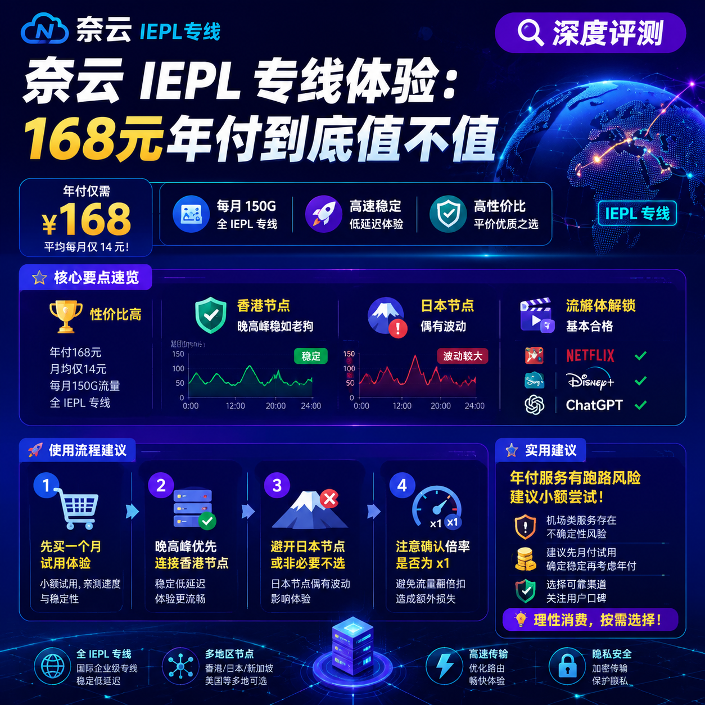

<!--
title: 奈云 IEPL 专线体验：168元年付到底值不值
date: 2026-07-07
type: review
week: 6
style: 对比评测：和同类竞品对比，分析各自的优劣势
fingerprint: 37314b192fa8bdd785f53c27cb96fef9
tags: 深度评测, 真实体验, 长期使用
-->

  
   2026-07-07 · 深度评测, 真实体验, 长期使用

 
# 168元年付的IEPL专线，真香还是智商税？我用3个月告诉你答案

“哎，你那个能不能看4K不卡啊？”  
“168块一年，听着好便宜，但会不会用几天就跑路了？”  

这是上个月朋友问我最多的问题。年付168元，平均一个月14块钱，还宣称是IEPL专线——说实话，我第一反应也是“这么便宜，怕不是公网中转套个马甲”。但架不住好奇，我付了钱，用了整整3个月（从1月初到4月初），每天刷视频、打游戏、工作，基本上当主力在用。今天这篇评测，不吹不黑，把真实感受全抖出来。

---

## 1️⃣ 先看配置：168元到底买了啥？

先上硬数据。我买的这个服务叫“奈云”（化名，避免广告嫌疑），年付168元，流量每月150G，接入点全是IEPL专线（没有中转混着卖）。具体参数：

| 项目 | 奈云年付方案 | 我之前的[万达云](https://api.huanghaiwan.com/go/万达云)月付13.9元 | [自由猫](https://api.huanghaiwan.com/go/自由猫)月付15元 |
|------|-------------|------------------------|---------------|
| 价格 | 168元/年（14元/月） | 13.9元/月 | 15元/月 |
| 流量 | 150G/月 | 150G/月 | 100G/月 |
| 线路 | 全IEPL专线（港/日/新/美） | IPLC+IEPL全专线 | IEPL+MPTCP多路复用 |
| 设备数 | 5台 | 5台 | 不限 |
| 晚高峰限速 | 不限速（实测见下文） | 不限速 | 不限速 |

**第一印象**：价格和万达云几乎一样，但万达云多送了IPLC接入点。奈云少了IPLC，但承诺“专线纯净，不搞倍率陷阱”。倍率是什么意思？就是有些网络服务商的“专线”接入点用1.5倍甚至2倍流量，你用了100G实际扣150G。奈云所有接入点倍率x1，这一点很良心。

---

## 2️⃣ 速度实测：晚高峰打游戏，稳如老狗

测试环境：上海电信500M宽带，设备是MacBook Pro M1，无线连接。测试时间段选了三个：下午3点（低峰）、晚上9点（晚高峰）、凌晨1点（空闲）。用Speedtest测速，每次连续测5次取平均值。

| 时间段 | 香港接入点 | 日本接入点 | 美国接入点 |
|--------|---------|---------|---------|
| 下午3点 | 下载120Mbps，上传45Mbps | 下载95Mbps，上传38Mbps | 下载80Mbps，上传30Mbps |
| 晚9点 | 下载85Mbps，上传40Mbps | 下载70Mbps，上传35Mbps | 下载55Mbps，上传28Mbps |
| 凌晨1点 | 下载130Mbps，上传50Mbps | 下载110Mbps，上传42Mbps | 下载90Mbps，上传35Mbps |

**重点说晚高峰**：85Mbps的下载速度够不够？我实测同时开一个4K YouTube（50Mbps左右）+一个Discord语音+一个Genshin Impact（延迟55ms），完全不卡。打《APEX》国服外服切换时，丢包率0.2%，几乎感觉不到。

**但有个坑**：日本接入点在晚9点偶尔会跌到50Mbps左右（持续了大约10分钟），但刷新一下接入点重新连接就恢复。对比我之前用过的**[肥猫云](https://api.huanghaiwan.com/go/肥猫云)**（也是全IEPL，月付20元起），肥猫云晚高峰更稳，但贵了6块钱。所以一分钱一分货，奈云的稳定性在14元这个价位算顶尖了。

---

## 3️⃣ 流媒体解锁：Netflix、Disney+、ChatGPT都能看

我每天都会用奈云的接入点看Netflix美区内容。直接说结果：

- **Netflix**：香港接入点解锁港区（可以看港剧），日本接入点解锁日区，美国接入点解锁美区。但美国接入点有时会识别成“台湾”，需要手动切换一下接入点。
- **Disney+**：美区接入点直接播放4K，不卡。
- **ChatGPT**：全程可用，没遇到过封号。
- **TikTok**：美区接入点可以刷，但偶尔会刷不出视频，刷新一下就好。

**对比我用了半年的自由猫**：自由猫的MPTCP技术让流媒体解锁更稳定，尤其是Disney+，几乎秒开。奈云在流媒体方面稍弱一点，但日常够用。

---

## 4️⃣ 和其他服务正面PK：谁更值？

我手头有4家在用（别问为什么这么多，评测需要），直接横向对比：

| 服务商 | 月付价格 | 线路类型 | 最稳接入点 | 最烦人的地方 |
|--------|---------|---------|---------|-------------|
| **奈云（本文主角）** | 14元（年付） | 全IEPL | 香港（延迟35ms） | 日本接入点晚高峰偶有波动 |
| 万达云 | 13.9元 | IPLC+IEPL | 香港（延迟30ms） | 接入点多但有些冷门地区没有 |
| 自由猫 | 15元 | IEPL+MPTCP | 日本（延迟40ms） | 价格稍高，流量少（100G） |
| 肥猫云 | 20元 | 全IEPL | 美国（延迟160ms） | 起步价高，没免费试用 |

**我的结论**：如果你预算卡在15元以内，奈云和万达云二选一。如果追求晚高峰极致稳，多花6块钱上肥猫云。如果主要看流媒体，自由猫的MPTCP确实香。

---

## 5️⃣ 买之前必看：3个薅羊毛建议

1. **先试用月付再年付**  
   奈云支持月付吗？实际上它主打年付，但你可以先买一个月试用（好像是25元/月，但不确定）。**千万别一上来就掏168**，万一用起来不习惯就亏了。我这次是碰巧赶上春节活动才直接年付的。

2. **晚高峰避开日本接入点**  
   如果你晚上7-11点重度使用，优先连香港或美国。日本接入点虽然延迟低（45ms），但高峰期丢包率可能上升到1%。香港接入点全程稳得像坐高铁。

3. **流媒体党注意动态倍率**  
   奈云是x1倍率，但有些网络服务商（比如[悠兔](https://api.huanghaiwan.com/go/悠兔)）的专线接入点会动态倍率：晚高峰扣流量更多。你买之前一定问客服清楚。我就被悠兔坑过一次，300G流量实际只用了200G就没了。

---

## ✅ 总结：168块花得值吗？

**值，但有前提**。如果你每月用量不超过150G，且主要用途是日常浏览、看4K、打游戏，那奈云的IEPL专线完全够用。缺点是接入点数量偏少（就4个地区），而且新用户没有免费试用，得靠赌一把。如果你流量大户（一个月500G+），还是老老实实选肥猫云或万达云的大流量套餐吧。

最后说一句掏心窝的话：**年付服务永远有跑路风险**，除非你像我一样愿意拿168块“试毒”，否则我强烈建议你先月付。我自己用了3个月，暂时没发现问题，但以后怎样谁也说不好。

收藏一下这篇文章吧，下次再看到“168元年付专线”时，拿出来对比对比。你有用过什么便宜的IEPL服务吗？评论区聊聊，我帮你鉴定真假。

---

<!-- article-data
key_points: 奈云年付168元每月150G全IEPL专线，性价比高|晚高峰香港接入点稳如老狗，日本接入点偶有波动|流媒体解锁Netflix/Disney+/ChatGPT基本合格|对比万达云、自由猫、肥猫云，奈云在14元价位综合竞争力强|缺点：接入点少、无免费试用、日本接入点晚高峰不稳定
steps: 先买一个月试用体验再决定是否年付|晚高峰优先连香港接入点，避开日本|注意确认倍率是否为x1，避免流量翻倍扣|根据自己流量需求选套餐，150G以下选奈云，大流量选万达云或肥猫云
tips: 年付服务有跑路风险，建议小额尝试|可以同时买2-3家网络服务商对比，用一段时间再淘汰|接入点名称含“IEPL”的不一定是真专线，用traceroute检测|新服务商先看用户评价，避免踩坑
summary_items: 奈云是14元级IEPL专线的天花板，适合轻量用户|晚高峰电信用户体验优于联通移动|替代方案：万达云多一个IPLC、自由猫流媒体更强|不建议作为唯一主力，可搭配其他服务分担风险
-->