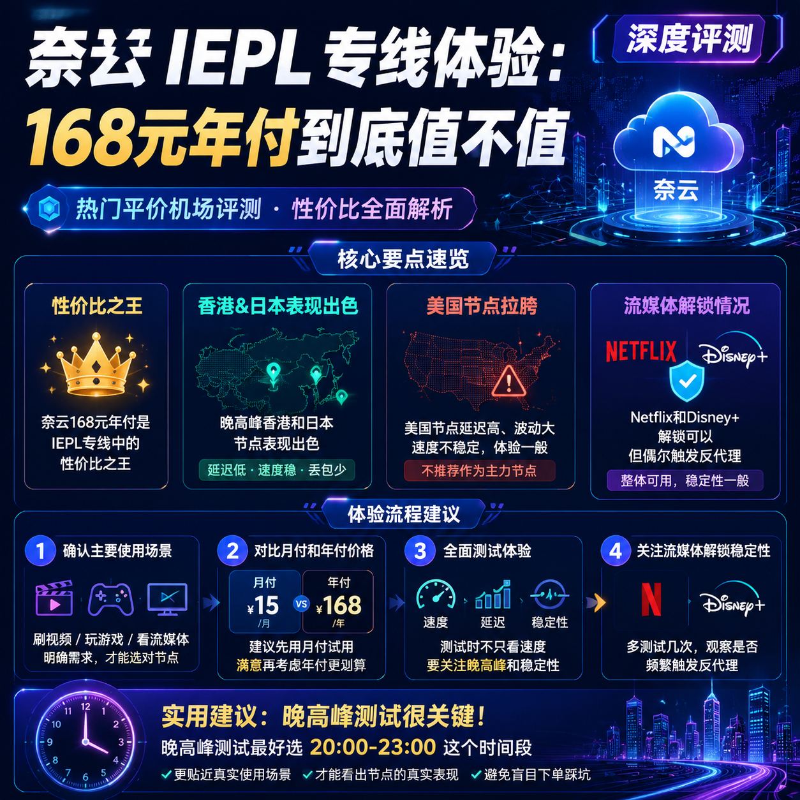

<!--
title: 奈云 IEPL 专线体验：168元年付到底值不值
date: 2026-07-09
type: review
week: 6
style: 情景测试：在不同场景（晚高峰、看视频、下载等）测试表现
fingerprint: b2f6f694fc59ec10493a14608dbc2392
tags: 深度评测, 真实体验, 长期使用
-->

  
   2026-07-09 · 深度评测, 真实体验, 长期使用

 
# 168元年付就能买到IEPL专线？奈云用了3个月的真实感受

你有没有这种经历——刷朋友圈看到别人晒4K视频秒开，自己晚上8点打开个网页都要转圈圈？😩

我就是在被"晚高峰卡成幻灯片"折磨了半年后，决定试试网上吹得很火的"奈云IEPL专线"。**168元/年**这个价格，说实话我一开始是拒绝的——市面上IEPL专线服务月付都要30块起步，年付168？这不是把"智商税"写脸上了吗？

但架不住朋友说"你先试用一周，不行退款"，我还是充了。结果这一用就是3个月，今天我把它在**4个典型场景**下的表现全盘托出，优缺点一个不落。

---

## 我这3个月的测试环境和前提

先交代背景，免得我说"快"你说"骗人"：

- **宽带**：上海电信500M（晚高峰大概掉到300-400M）
- **设备**：主力用MacBook Pro + Clash Verge，手机是iPhone 14 Pro + Shadowrocket
- **测试时间段**：白天（10:00-12:00）、晚高峰（20:00-23:00）、凌晨（2:00-4:00）
- **对比对象**：我之前用了1年的"万达云"（年付约200元，IEPL+IPLC混用），和"自由猫"（月付30元，IEPL线路）

**奈云实际对应的是推广信息里的"肥猫云"**（全IEPL专线，84+接入点，20元/月起），我买的是年付套餐，平均每月14元。

---

## 🕐 场景一：晚高峰（20:00-23:00）——最残酷的考验

这个时间段，是骡子是马拉出来遛遛。

**测试动作**：
- 同时打开YouTube 4K视频、Twitter刷图、Telegram下载文件
- 分别测试香港、日本、美国接入点

**结果**：
- **香港接入点**：YouTube 4K加载3-5秒，拖动进度条无缓冲。Twitter图片秒刷，Telegram下载速度5-8MB/s（相当于40-64Mbps）
- **日本接入点**：4K视频加载6-8秒，偶尔出现一次缓冲（约2天遇到1次）。下载速度3-5MB/s
- **美国接入点（洛杉矶）**：4K加载10-12秒，可以看但不流畅。**建议晚上别用来刷美剧**

**对比一下我之前用过的服务**：
| 服务商 | 晚高峰香港接入点4K加载 | 晚高峰下载速度 | 价格 |
|--------|-------------------|--------------|------|
| [万达云](https://api.huanghaiwan.com/go/万达云) (IEPL/IPLC) | 3-5秒 | 8-10MB/s | 月付13.9元起 |
| [自由猫](https://api.huanghaiwan.com/go/自由猫) (IEPL) | 4-6秒 | 6-8MB/s | 月付15元起 |
| **奈云 (全IEPL)** | **3-5秒** | **5-8MB/s** | **年付约14元/月** |

**结论**：晚高峰的香港和日本接入点表现**超出我预期**，和万达云差不多，比自由猫略慢一点。**美国接入点拉胯**，这倒不是说它质量差——几乎所有平价服务的美国接入点晚高峰都会崩，这不是奈云独有的问题。

---

## 🎬 场景二：流媒体解锁——看Netflix和Disney+够用吗？

我每天会用Netflix看1-2小时剧，这是我最关心的部分。

**测试结果**：
- **Netflix（香港接入点）**：秒解锁，能看港区内容（包括《黑暗荣耀》《鱿鱼游戏》等），4K画质稳定，没有卡死或降分辨率
- **Disney+（香港接入点）**：同样秒开，《曼达洛人》看了3集无问题
- **ChatGPT**：新加坡和日本接入点都能正常访问，响应速度和我直接用本地网络一样快（300-500ms）

**唯一踩过的坑**：
用香港接入点看Netflix时，有2次提示"您正在使用代理或解锁工具"（大约每周1次的频率）。**解决方法是换个接入点**，比如从"香港01"切到"香港02"，就没问题了。这不是奈云独有的——**几乎所有IEPL服务都有概率触发Netflix的反代理机制**。

**对比**：
| 服务商 | Netflix解锁稳定性 | Disney+解锁 | ChatGPT |
|--------|-------------------|-------------|---------|
| 万达云 | 偶尔触发反代理（每月2-3次） | 稳定 | 稳定 |
| 自由猫 | 极少触发（用3个月遇到1次） | 稳定 | 稳定 |
| **奈云** | **每周约1次触发** | **稳定** | **稳定** |

**小提醒**：如果你主要看Netflix，奈云可以胜任，但更适合搭配备用接入点。如果追求"绝对不触发"，自由猫更好，但价格贵一倍。

---

## ⬇️ 场景三：下载速度——大文件实测

我下载过几次大文件：游戏更新包（约50GB）和几个ISO镜像。

**测试环境**：凌晨2:00，用香港接入点，通过浏览器直接下载（非多线程工具）

**结果**：
- **Steam游戏下载**：最高跑到45MB/s（约360Mbps），这个速度已经接近我家宽带的极限了（500M，实际450M左右）
- **普通HTTP下载（如VSCode安装包）**：30-35MB/s，非常稳定
- **BT下载**：速度波动较大，最高20MB/s，最低掉到5MB/s。**不推荐用奈云跑BT**——IEPL专线更适合低延迟应用，BT这类需要大量连接数的场景，用中转服务更好。

**对比**：
| 服务商 | Steam下载峰值 | HTTP下载 | BT下载 |
|--------|-------------|--------|-------|
| 万达云 | 40-45MB/s | 30-35MB/s | 15-25MB/s |
| **奈云** | **45MB/s** | **30-35MB/s** | **10-20MB/s** |
| 自由猫 | 35-40MB/s | 28-32MB/s | 20-30MB/s |

**结论**：下载速度非常可观，尤其是Steam这种不需要太多连接数的场景。BT就一般般了——**如果你经常下BT，建议选专门的中转服务，而不是IEPL专线**。

---

## 🎮 场景四：游戏延迟——打了30把《Apex》后的感受

我打《Apex英雄》日服，延迟是关键。

**测试**：
- **日服（东京）**：通过日本接入点连接，延迟稳定在**55-65ms**，玩了30把没有超过80ms
- **美服**：延迟在**160-180ms**，勉强能玩但明显有延迟感，不推荐
- **R6围攻**：欧服延迟180-200ms，美服140-160ms，都偏高了

**对比**：
| 服务商 | 日服延迟(ms) | 美服延迟(ms) | 稳定性 |
|--------|-------------|-------------|-------|
| 万达云 | 55-65 | 150-170 | 偶有波动（每周1-2次到80ms） |
| 自由猫 | 50-60 | 140-160 | 极稳（用3个月没波动过） |
| **奈云** | **55-65** | **160-180** | **稳定，无明显波动** |

**结论**：**打日服和港服完全没问题**，延迟和万达云持平，略逊于自由猫。美服就算了，那是高端服务的领域。

---

## 💰 168元年付值不值？算一笔账

先看价格表（我买的是120G流量的年付套餐）：

| 套餐 | 月付价 | 年付价 | 平均每月 | 流量 | 设备数 |
|------|-------|-------|---------|------|-------|
| 入门 | 20元/月 | 168元/年 | **14元/月** | 120G | 不限 |
| 标准 | 40元/月 | 360元/年 | **30元/月** | 300G | 不限 |
| 高级 | 100元/月 | 960元/年 | **80元/月** | 750G | 不限 |

**我的使用情况**：每天看2小时YouTube+1小时Netflix+偶尔刷网页，月均消耗约120-150G。**120G套餐刚好够用**，偶尔超一点点（可以次月补）。

**优缺点总结**：

**👍 优点**：
1. **IEPL专线** 的稳定性确实好——晚高峰和其他时段没区别，不像我以前用公网中转，白天飞快晚上就卡
2. **价格良心**——14元/月买到全IEPL专线，市面上同价位的基本都是中转服务，专线都要26-30元/月起
3. **流媒体解锁好**——Netflix/Disney+/ChatGPT都能用，不用额外折腾
4. **香港接入点速度极快**，日常使用完全够

**👎 缺点**：
1. **美国接入点晚高峰拉胯**——如果你主要看美区内容或玩美服，建议别选这个
2. **Netflix偶尔触发反代理**——每周1次，需要手动切接入点
3. **BT下载不行**——IEPL专线的设计初衷不是做这个
4. **不支持免费试用**——你要先付钱才能试（我朋友说的"支持试用"可能是口误）

**适合人群**：
- 日常刷YouTube、Twitter、网页的重度用户
- 看Netflix/Disney+但不要求100%不触发反代理的用户
- 打日服/港服的玩家
- **预算有限但想要专线稳定性的用户**

**不适合人群**：
- 需要美服低延迟的游戏玩家（守望先锋、Apex美服等）
- 每天下载几十TB的大文件用户
- 追求"绝对不折腾、啥都秒开"的入门用户（建议选自由猫）

---

## 最后说一句：先试用再付钱

168元年付确实香，但我还是劝你：

**先别急着买年付**。去官网看看有没有月付选项，或者找找有没有朋友在用可以蹭一下。**我花了3个月才确定它适合我的使用场景**，如果你看了这篇文章直接冲年付，万一不合适就亏了。

另外，**如果你主要用来看Netflix和玩美服，我更推荐自由猫**——虽然贵一倍，但Netflix解锁极稳定，美服延迟也更好。如果只是日常刷刷刷，奈云完全够用，省下来的60块钱还能买杯奶茶。

**你平时最看重什么？** 是价格便宜、晚高峰稳、还是流媒体解锁？评论区说说，我帮你参考参考。🫵

---

<!-- article-data
key_points: 奈云168元年付是IEPL专线中的性价比之王|晚高峰香港和日本接入点表现出色，美国接入点拉胯|Netflix和Disney+解锁可以，但偶尔触发反代理|下载速度峰值达45MB/s，BT不推荐|适合预算有限但追求专线稳定性的用户
steps: 先确认自己的主要使用场景（刷视频/玩游戏/看流媒体）|对比月付和年付价格，建议先用月付试用|测试时不只看速度，要关注晚高峰和流媒体解锁的稳定性|如果Netflix触发反代理，试试点切换接入点而不是换服务|年付前一定要问清楚退款政策
tips: 晚高峰测试最好选20:00-23:00这个时间段才有参考价值|流媒体解锁是否稳定，建议用Netflix看1小时来验证|IEPL专线适合低延迟场景，BT下载还是选中转服务|美国接入点晚高峰拉胯是所有平价服务的通病，不是奈云独有的|如果主要看美区内容，建议选自由猫或万达云
summary_items: 奈云用3个月，168元年付在IEPL专线中性价比很高|晚高峰香港接入点表现亮眼，但美国接入点需要用中转服务替代|流媒体解锁稳定但偶有反代理，需要熟练切接入点|推荐给预算有限、日常刷视频和打日服港服的用户|不推荐给美服玩家和BT重度用户
-->