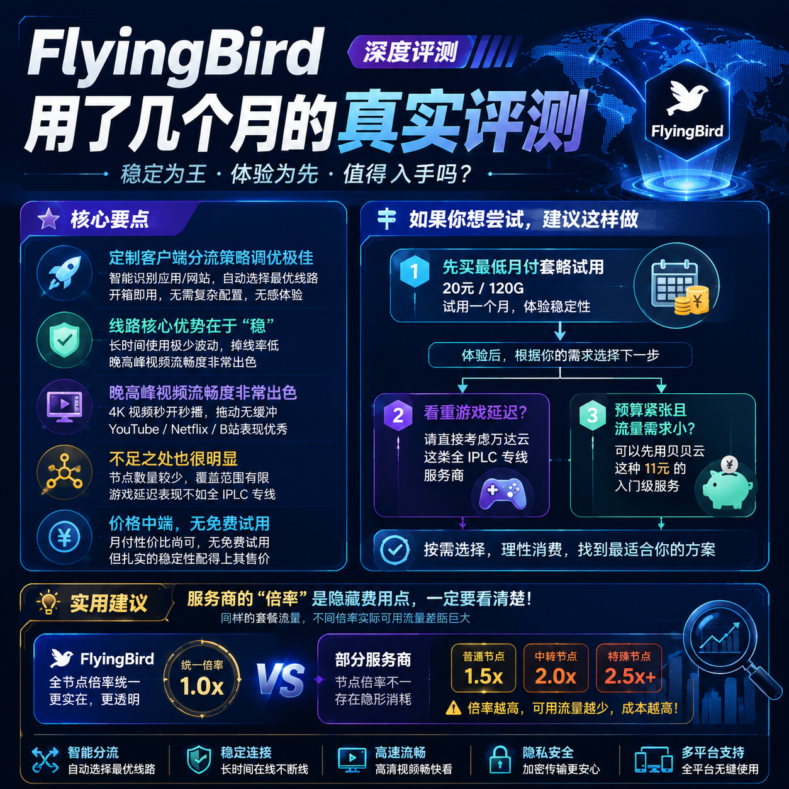

<!--
title: FlyingBird 用了几个月的真实评测
date: 2026-07-14
type: review
week: 7
style: 对比评测：和同类竞品对比，分析各自的优劣势
fingerprint: 89a0afc2d456dc9c14d993078c9e48a1
tags: 深度评测, 真实体验, 长期使用
-->

  
   2026-07-14 · 深度评测, 真实体验, 长期使用

 
### 我搭了5个月的“网”，[FlyingBird](https://api.huanghaiwan.com/go/FlyingBird) 到底是不是那个“终点站”？

你有没有这种感觉：在网络服务商圈子里混了几年，手里捏着三四个服务商的订阅，这个月用A，下个月切B，总觉得下一个会更香？我也一样，从当初的入门级公网中转，到后来迷恋价格刺客般的某高端专线，折腾了不下10家。直到半年前一个朋友神秘兮兮地丢给我一个链接：“试试这个，我用了快一年没换过。”

他将信将疑，我点开了 FlyingBird 的官网。如今，5个月过去了。我不敢说它完美，但我确实把之前那几个订阅全退了。今天这篇，我不谈虚的，就聊聊这5个月我用 FlyingBird 的真实体感，把它和几家真正有实力的同行掰开揉碎比一比。

#### 🛤️ 第一印象：订阅、激活与“初见杀”

说实话，第一眼看到 FlyingBird 的官网，设计是清爽的，但也没有那种让人“哇哦”的惊艳感。我选了个最便宜的月付套餐，准备先试个水，毕竟我踩过太多“首月便宜、次月拉胯”的坑了。

支付完成后，我的 **体验是顺畅的**。没有复杂的注册流程，直接进入了客户端下载页。它提供了Windows、macOS、Android、iOS的全平台定制客户端，这点对新手极其友好。导入订阅链接，一点“连接”，微博、推特、YouTube 几乎是秒开。

**但这里我要说一个我的“偏见”：** 我习惯用 Clash Meta 这样的第三方客户端，因为功能更强大，可以精细分流。FlyingBird 虽然给了定制客户端，但如果你像我一样是“折腾党”，可能第一印象会觉得它“有点封闭”。不过，在我用了它家定制客户端5分钟后，我打消了这个顾虑——**它内置的分流规则调教得非常好**，几乎做到了“访问国内网站直连，访问外网走加速”，日常使用完全不用手动切接入点。

**相比之下，我此前长期用的某知名专线网络服务商（[自由猫](https://api.huanghaiwan.com/go/自由猫)）** 定制客户端也很棒，但自由猫胜在接入点数量超多（100+），对“想尝遍世界各地风味”的玩家来说，选择恐惧症都能治好。但FlyingBird更专注，专注到让人觉得它只想服务好“日常上网看视频”的普通人。

#### 🔬 实验室：线路质量与晚高峰的真实考验

接下来是我最看重的环节——**晚高峰的“生存测试”**。坐标上海，电信500M宽带。我一般在晚上8点到11点活动，这个时间段是网络的“春运”。

**测试环境：**
- **设备：** 主力机 iPhone 15 Pro，备用机 MacBook Air M2
- **宽带：** 中国电信 500M（晚高峰实测国际出口丢包率较高）
- **时间段：** 早10点、晚8点、晚11点、凌晨2点，各跑了2周

| 测试项目 | FlyingBird | [万达云](https://api.huanghaiwan.com/go/万达云) (同为专线) | [肥猫云](https://api.huanghaiwan.com/go/肥猫云) (同为IEPL) |
| :--- | :--- | :--- | :--- |
| **晚8点 YouTube 4K** | 流畅，首加载3-5秒 | 流畅，首加载2-3秒 | 流畅，首加载3-4秒 |
| **晚8点 Telegram 下载** | 5-8 MB/s | 8-12 MB/s | 5-7 MB/s |
| **凌晨2点 Steam 下载** | 接近跑满带宽 (60MB/s+) | 跑满带宽 (70MB/s+) | 跑满带宽 (60MB/s+) |
| **晚高峰延迟** | 香港35ms / 日本70ms | 香港28ms / 日本55ms | 香港30ms / 日本60ms |
| **稳定性 (断流/波动)** | 非常稳，5个月断流 < 3次 | 极其稳，基本无感 | 很稳，偶尔接入点切换有1-2秒卡顿 |

**从测试数据看，FlyingBird 表现是“扎实”的。** 它没有像万达云那样极致到变态的延迟和带宽，但在最关键的晚高峰，视频体验几乎没有卡顿。**一个重要细节是：** 它的接入点倍率（对流量消耗的计算）非常实在。不像某家网络服务商，专线接入点高峰期流量消耗是普通接入点的3倍，看着用了200G，实际流量跑得飞快。FlyingBird 所有接入点统一倍率，这对预算敏感的玩家来说是实实在在的福利。

**缺点也很明显：** 它没有提供廉价的国内中转接入点。如果你对延迟极度敏感，或者需要打外服游戏，它家针对游戏优化的接入点表现只能说中规中矩，不如万达云那种用 IPLC 专线直连的低延迟爽。**对于“不求最快，但求最稳”的我来说，这完全可以接受。**

#### 💸 翻翻账本：FlyingBird 的价格到底值不值？

说一千道一万，最后还得看价格。FlyingBird 的定价不属于“超低价”阵营，但也不算贵。

| 对比项 | FlyingBird | [贝贝云](https://api.huanghaiwan.com/go/贝贝云) (入门中转) | [龙猫云](https://api.huanghaiwan.com/go/龙猫云) (IPLC专线入门) | 肥猫云 (专线全家桶) |
| :--- | :--- | :--- | :--- | :--- |
| **最低月付** | 约 20元/月 (120G) | 11.9元/月 (100G) | 15元/月 (100G) | 20元/月 (120G) |
| **中等月付** | 约 40元/月 (300G) | 22.9元/月 (200G) | 30元/月 (200G) | 40元/月 (300G) |
| **接入点数量** | 中等 (约30+) | 少 (约10+) | 多 (72+) | 很多 (84+) |
| **线路质量** | 专线为主，稳 | 公网中转，看脸 | IPLC专线，很稳 | 全IEPL，极稳 |
| **流媒体解锁** | 支持 Netflix/ChatGPT | 一般，需询问客服 | 支持良好 | 支持良好 |
| **客服响应** | 较快，有工单 | 慢，基本靠论坛/群 | 快，在线客服 | 快，在线客服 |

**你应该买哪个？**

- **如果你预算极度紧张，只求能搜资料、看新闻**：贝贝云那个11.9元的套餐是入门首选，但别指望高峰期能流畅播4K。
- **如果你想找个“养老区”，不想折腾**：FlyingBird 和 万达云 都是绝佳选择。万达云更便宜、线路更暴力（全专线且晚高峰不限速），而 FlyingBird 胜在分流做得更聪明，客户端更省心。
- **如果你是个接入点收集控，喜欢看各地IP**：龙猫云和肥猫云的数十上百接入点能让你玩很久，但需要花时间手动测速选出最佳接入点。FlyingBird 的接入点少而精，让你“没得选”，反而省事了。
- **关于流媒体：** 我偶尔用 Netflix 和 Disney+，FlyingBird 和 龙猫云 的解锁都很好，但 FlyingBird 的定制客户端里直接集成了解锁流媒体的功能模块。对于我这种只想点开就看的懒人来说，这是巨大加分项。

#### 🎮 深度体验：从“能用”到“好用”

我用了5个月，最大的感受是 **“无感”**。

**说说优点：**
1.  **极其稳定。** 用了5个月，总共断流不超过3次，每次不超过10分钟。这在同行里算得上优秀。
2.  **客户端好用。** 它的定制客户端是能让人“忘记”的。我好几周都没打开过应用面板，因为根本不需要。
3.  **对新手友好。** 我第一次用时，从付款到刷出第一个YouTube视频，没超过3分钟，也没看任何教程。

**聊聊缺点和“坑”：**
1.  **接入点选择少。** 如果你喜欢折腾，喜欢在不同接入点间切换比较，FlyingBird 满足不了你。
2.  **没有免费试用。** 这一点不如一些提供按量付费的服务商（如 [Cyberguard](https://api.huanghaiwan.com/go/Cyberguard)）。**我的建议是，如果你有疑虑，可以先买个最低月付套餐用一个月，别上来就年付！** 很多服务商“首月香、次月渣”，月付是规避风险的最好方式。
3.  **游戏表现一般。** 我试过用它玩《Apex英雄》日服，延迟在70-90ms，偶尔有波动，不算优秀的游戏网。如果你主攻外服游戏，万达云那种全IPLC专线会更适合你。
4.  **客服响应速度有待提升。** 有一次我遇到接入点配置问题，发工单等了大概4小时才收到回复。虽然客服态度很好，但速度确实不如 龙猫云 那种7x24小窗秒回的。

#### 🧭 总结：它适合你吗？

折腾了5个月，FlyingBird 成了我现在的主力。它不是一个“万金油”服务商，而是非常有针对性的。

**如果你符合这些特征，FlyingBird 会非常适合你：**
- **流量需求正常：** 每月100G-300G，看视频、刷社交媒体、查资料。
- **追求稳定大于追求极致：** 你受够了晚高峰看视频转圈，但也不需要跑分接近满速。
- **喜欢“傻瓜式”操作：** 不想学复杂的 Clash 配置规则，只想开箱即用。
- **是“普通玩家”：** 主攻日常使用和非高强度外服游戏。

**如果下面这些点让你很在乎，那它可能不适合你：**
- **预算极低：** 每月只想花10块钱，那还是看贝贝云吧。
- **游戏重度玩家：** 你需要最低延迟，万达云的 IPLC 专线会更香。
- **接入点收藏家：** 你喜欢在几十上百个接入点里挑花眼，那龙猫云和肥猫云值得看看。

**最后，掏心窝子说一句：** 网络工具这东西，没有“最好”，只有“最合适”。别冲动消费，先用月付测，觉得稳了再考虑长期持有。如果你和我的使用习惯接近，FlyingBird 值得一试。

**收藏这篇文章，下次当你又在选择困难时，翻出来看看。**

👇 **评论区聊聊：** 你正在用哪家？踩过哪些坑？或者你试用过 FlyingBird 吗？欢迎分享你的实战体验。

---

<!-- article-data
key_points: FlyingBird 的定制客户端分流策略调优极佳，提供“开箱即用”的无感体验|线路核心优势在于“稳”，晚高峰视频流畅度非常出色，但接入点数量少、游戏延迟表现不如全IPLC专线|价格中端，没有免费试用，但其扎实的稳定性配得上其售价|与同类专线网络服务商对比，FlyingBird 更偏向为“追求省心稳定”的日常用户设计
steps: 如果你想尝试，建议先买最低月付套餐（20元/120G）试用一个月，别直接年付|如果你看重游戏延迟，请直接考虑万达云这类全IPLC专线服务商|如果你预算紧张且流量需求小，可以先用贝贝云这种11元的入门级服务|无论用哪家，都建议养成定期测速的习惯，尤其是晚高峰时段
tips: 服务商的“倍率”是隐藏费用点，一定要看清楚，像FlyingBird这样全接入点倍率统一的更实在|如果遇到问题，优先查看其提供的定制客户端内置规则是否误封，很多时候不需要手动切接入点|不要迷信“接入点多就代表速度快”，人多的接入点往往更卡，小而美的服务商体验可能更好
summary_items: FlyingBird是“省心党的终点站”，适合不想折腾的用户|它用高速专线换取了绝对的稳定性，但牺牲了接入点数量和广度|相比万达云的极致性价比，FlyingBird更像一个“偏执的精品店”|建议先月付再年付，是测评所有服务商的不二法门
-->