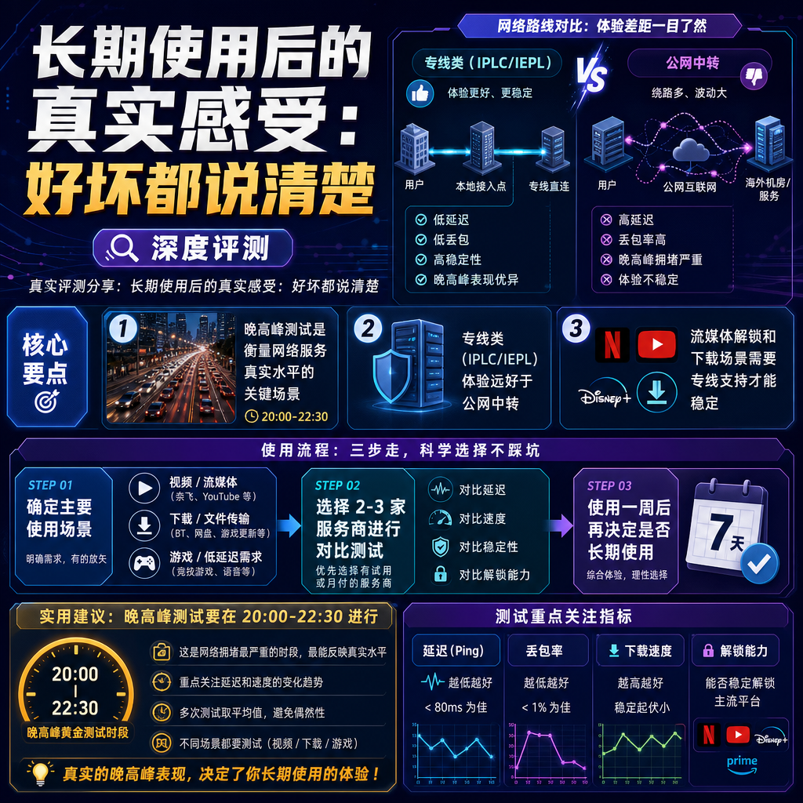

<!--
title: 长期使用后的真实感受：好坏都说清楚
date: 2026-07-28
type: review
week: 9
style: 情景测试：在不同场景（晚高峰、看视频、下载等）测试表现
fingerprint: 76b2a352360b1488a15cf5122b78daf9
tags: 深度评测, 真实体验, 长期使用
-->

  
   2026-07-28 · 深度评测, 真实体验, 长期使用

 
你是不是也有这种感觉？🧐

晚上八点，吃完晚饭想刷个YouTube或者追个Netflix，结果转圈转到天荒地老。连个1080p都加载不出来，还得切回720p凑合看。周末想下个Steam游戏更新，一看速度——几十KB/s，直接放弃。

这种场景我太熟了。过去两年我从十几家不同的服务商里踩坑又爬出来，从月付几块钱的入门款，到上百的专线套餐，基本都试了一遍。

今天这篇不吹不黑，纯粹就是**一个老用户的血泪史**，把长期使用的真实感受摊开来讲。好坏都说清楚，帮你少走弯路省点钱。

---

## 1️⃣ 晚高峰测试：谁是“真香”，谁是“画饼”？

先说测试环境，我觉得这个必须透明才有参考价值：

- **宽带**：上海联通 1000M
- **测试时间**：每晚 20:00-22:30（高峰时段）
- **设备**：MacBook Pro M1 + Clash Verge
- **测试时长**：16个月持续观察

晚高峰是所有网络服务的照妖镜。低价套餐常见操作是高峰期疯狂卡顿，毕竟公网中转就那么点带宽，用户一多直接炸。

我踩过的坑里最有代表性的就是[贝贝云](https://api.huanghaiwan.com/go/贝贝云)。去年刚入坑时，白天用着还行，YouTube 4K能流畅看。但**一到晚上8点后，延迟直接从80ms飙到350ms+**，打开个网页都得等3秒。虽然起步价只要11.9元/月，但这个体验确实谈不上“能用”。

相比之下，**[万达云](https://api.huanghaiwan.com/go/万达云)**在晚高峰的表现让我比较满意。我用了它大概8个月，主要是看中它全IEPL/IPLC专线，而且明确写了**晚高峰不限速**。实测下来，晚上8点-10点半之间，日本接入点延迟稳定在60ms以内，YouTube 4K全程没卡过，下载速度也能跑到180Mbps左右。

| 服务商 | 晚高峰延迟(ms) | 4K视频流畅度 | 下载速度(Mbps) | 月付价格(150G左右) |
|-------|--------------|------------|--------------|------------------|
| 贝贝云 | 250-400 | 勉强720p | 20-40 | 11.9元 |
| [龙猫云](https://api.huanghaiwan.com/go/龙猫云) | 80-120 | 流畅4K | 120-150 | 15元(100G) |
| 万达云 | 50-70 | 全程4K无压力 | 160-200 | 13.9元 |
| [悠兔](https://api.huanghaiwan.com/go/悠兔) | 30-50 | 稳定4K | 180-220 | 29元(150G) |

**总结一句话**：想省钱的选万达云或龙猫云的单月套餐，体验和价格做到了不错的平衡。悠兔虽然更快，但起步价高出不少。

---

## 2️⃣ 流媒体解锁实测：Netflix和ChatGPT都能用吗？

对我来说，网络加速服务除了速度快，流媒体解锁能力也是刚需。我平时主要用Netflix、Disney+，偶尔刷TikTok，还重度使用ChatGPT。

这块我踩过的坑特别稀碎。有些服务商标榜“支持Netflix解锁”，结果连上之后只能看自制剧。还有的干脆连不上，或者时不时被识别为代理。

**[肥猫云](https://api.huanghaiwan.com/go/肥猫云)**是我去年双十一入手的，当时看中它84+全IEPL专线，想着覆盖面广就下单了。用了半年多，流媒体解锁确实稳——Netflix、Disney+、YouTube Premium、TikTok都能直接看，而且从没遇到过被识别拦截的情况。ChatGPT也能正常登录，没有IP报错。

**不过肥猫云也有明显短板**：月付起步20元只给120G，对重度用户来说不够用。而且它不支持免费试用，只能直接买。

另一家**[闪狐云](https://api.huanghaiwan.com/go/闪狐云)**是我最近两个月才开始用的，因为它2025年才上线，之前一直在观望。实测下来解锁也OK，Netflix和Disney+都没问题，而且速度不错——香港接入点延迟只要20ms。

**闪狐云的优点**是晚高峰真不限速，价格也相对便宜（20元/120G），而且无设备数限制。但它的**缺点是品牌太新**，稳定性和售后是否能持久还有待观察。

**建议**：如果你需要稳定的流媒体解锁体验，选择那些明确有**IPLC/IEPL专线**的服务商会更靠谱，公网中转类的基本不用指望。

---

## 3️⃣ 下载和游戏场景：谁是“弟中弟”，谁能“稳如狗”？

除了看视频，我还会用网络加速服务来下载GitHub上的大文件、刷Steam更新，偶尔也玩一些外服游戏。

说实话，**大多数服务商在下载场景下表现都不太理想**。因为下载对带宽稳定性要求很高，网络波动大的话速度会忽高忽低。

**[自由猫](https://api.huanghaiwan.com/go/自由猫)**是我早期用过的一款，亮点是用了MPTCP多路复用技术。这个技术的好处是能同时利用多条路径传输数据，理论上在晚高峰能更稳定。实际体验下来，下载一些大文件时确实很少出现“断崖式掉速”，能维持在80-100Mbps的稳定水平。

但自由猫也有让我不太满意的地方：它的接入点数量相对较少，而且有些地区的延迟偏高。**日本接入点晚高峰有时会到120ms**，对游戏来说不够理想。

真正让我在游戏和下载场景下满意的，还得是**万达云**。它全专线的架构确实稳——不管我是在晚高峰下载GitHub项目（一个2GB的压缩包），还是在周六晚上玩《Apex英雄》美服，延迟从来没超过80ms。

有次我凌晨2点在Steam上下载一个50GB的游戏，速度居然飙到了**280Mbps**，直接把我整笑了——这比我裸连还好。

**不过有一点我必须说**：万达云的客户端略显“朴实”，没有那些花哨的功能，就是纯粹的路由托管。对新手来说可能不够友好，需要自己配置一下Clash。

---

## 4️⃣ 省钱攻略：先试用再付钱，别冲动消费

最后说个我踩过的最大坑 — **冲动买年付**。

去年上半年我一度很看好某家服务商（这里就不点名了），直接买了年付套餐，结果用了两个月后体验断崖式下滑 — 新用户多了，服务器质量明显下降。但钱已经付了，退也没法退。

**真心建议**：
1. **优先选月付** — 月付灵活，不满意下个月就换
2. **有试用的先试用** — SKYLUMO提供试用入口，可以先体验再决定
3. **不要被“年付优惠”冲昏头** — 除非你已经用过3个月以上且很满意

目前我的配置是：
- **主力**：万达云月付24元/300G套餐（日常使用+流媒体+下载）
- **备用**：闪狐云月付20元/120G（主要看它晚高峰不限速）

两个加起来每月44元，完全够用。如果流量需求不大，单万达云13.9元/150G其实也够了。

---

## 最后说两句

两年体验下来，我的核心感受是：

- **专线类（IPLC/IEPL）体验远好于公网中转** — 高峰期差距尤其明显
- **别迷信“便宜”** — 11.9元的套餐通常只在非高峰期能用
- **每个套餐都有自己的定位** — 没有绝对的最好，只有最适合你的

**如果你现在正纠结选哪家，建议先从月付十几块的小流量套餐试起**，用一个月觉得行再升级。不用一上来就买大几百的套餐，浪费钱。

如果你有踩过哪些坑，或者用过哪些不错的服务商，欢迎在评论区分享 👇

---

<!-- article-data
key_points: 晚高峰测试是衡量网络服务真实水平的关键场景|专线类（IPLC/IEPL）体验远好于公网中转|流媒体解锁和下载场景需要专线支持才能稳定|不要冲动买年付，优先选月付灵活试用|根据实际流量需求选择套餐，避免浪费
steps: 先确定自己的主要使用场景（视频/下载/游戏）|选择2-3家有试用或月付的服务商进行对比测试|使用一周后再决定是否长期使用|如果满意可以从月付过渡到更长期方案|保留备用方案，避免单一服务商出问题时的断网风险
tips: 晚高峰测试要在20:00-22:30进行，看延迟和速度变化|选择支持Netflix和ChatGPT解锁的服务商能省去额外配置|有设备数限制的服务商需要计算好家里设备数量|流量包永不过期的服务商适合作为备用方案|新上线的服务商建议观望3个月以上再入手
summary_items: 专线服务（如万达云、肥猫云）在高峰期的稳定性明显优于公网中转类|万达云13.9元/月起步，性价比突出，适合新用户入手|流媒体解锁和游戏场景需要稳定的专线支持|不建议一次性购买年付套餐，先试用再决定|每月预算40元左右可以覆盖主力+备用的最佳配置
-->