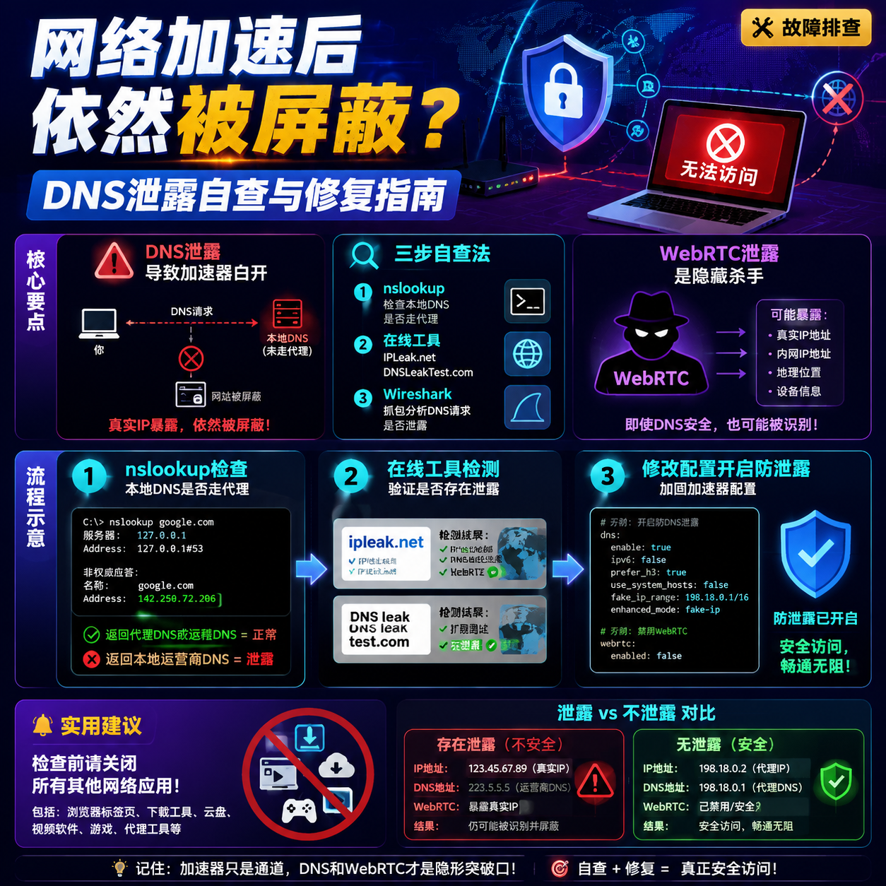

<!--
title: 网络加速后依然被屏蔽？DNS泄露自查与修复指南
date: 2026-06-06
type: troubleshooting
week: 1
style: 经验总结式：从踩过的坑里提炼出通用解法
fingerprint: fba9fae90d595a45adae16d0778a5e97
tags: 故障排查, 常见问题, 实用技巧
-->


<div align="center">
  
  <br><sub>2026-06-06 · 故障排查, 常见问题, 实用技巧</sub>
</div>

<br>
# 开了加速器还被屏蔽？80%的人踩过DNS泄露的坑，3步自查+修复

你有没有这种感觉：明明网络加速工具开着，打开Google却提示“无法访问此网站”，或者访问某些流媒体直接被拒。更诡异的是，有时候关掉加速器反而能上，开了反倒被墙？

跟我一样“折腾命”的朋友请注意：你不是被针对了，你大概率是 **DNS泄露** 了。这我当年折腾V2ray时踩过的大坑，当时还以为是网络服务商不行，换了3家，钱花了好几百，问题依旧。后来仔细一查——好家伙，DNS查询根本没走代理，直接裸奔出去了。

今天我把这3年踩过的坑、看过的文档，总结成这篇 **自查+修复指南**，帮你省下那几百块冤枉钱。

---

## 一、DNS泄露是什么？为什么加速器都防不住？

简单理解：你的网络加速工具就像一条“秘密通道”，你访问外网的流量会钻进通道绕一圈再出去。但如果 **DNS查询** 没走这条通道，而是直接从你家路由器发出去了，那你的“真实IP”和“目标域名”就暴露了。

举个🌰：你想访问 `example.com`，浏览器会先问DNS服务器“这家的IP地址在哪？”如果这个查询直接发给了你本地的电信DNS（比如114.114.114.114），那你的运营商就知道：**这个用户要访问外网了**。然后——直接给你“阉割”掉。

**问题核心：** 有些加速工具只代理HTTP/HTTPS流量，但DNS查询默认走系统配置，没被路由进虚拟网卡。

**一个真实案例：** 我朋友用某一线网络服务商，打开状态栏看“连接正常”，但访问 `youtube.com` 始终显示“连接超时”。我让他用我说的工具一查——DNS请求全部泄漏给了当地电信DNS。后来他改了一处配置，5分钟解决。

---

## 二、怎么查？3个工具+2个在线网站

**⚠️ 重要提醒：** 在开始检查前，**先关闭所有其他网络应用**，只保留加速工具运行。检查过程中不要切换网络或开关加速器。

### 第一步：用 `nslookup` 验证本地DNS

打开终端（Windows用cmd/powershell，Mac/Linux用终端），输入：

```bash
nslookup google.com
```

你会看到类似：

```
服务器:  UnKnown
Address:  192.168.1.1
```

如果Address显示的是 **你的路由器地址**（192.168.x.x / 10.x.x.x），而不是加速工具的虚拟网卡地址（通常为10.0.0.x或172.x.x.x），说明DNS没走代理，**裸奔了**。

### 第二步：用在线工具双重确认

推荐两个我用了一年的免费工具：

| 工具 | 网址 | 特点 | 我踩的坑 |
|------|------|------|----------|
| **IPLeak.net** | `ipleak.net` | 直接显示你的IP和DNS服务器 | 第一次测时显示的是我家电信DNS，直接傻眼 |
| **DNSLeakTest.com** | `dnsleaktest.com` | 分“标准测试”和“扩展测试” | 扩展测试会连续请求多个域名，更容易发现间歇性泄露 |

**操作方法：** 开加速器 → 打开以上网站 → 点击“Start Test” → 等10-15秒。如果列表中出现任何 **不属于你选择的DNS服务器** 的IP，恭喜你中奖了。

**一个细节：** 我平时会用IPLeak.net配合 `ping -n 10 google.com` 测试10次，看看有没有偶尔“掉线”的情况——有些加速工具只在首连接时泄露，后续正常，更难被普通工具检测到。

### 第三步：更狠的——用Wireshark抓包

这招是给“硬核玩家”准备的。如果你发现前两步查不出问题，但某些网站依然被屏蔽，可能是 **间歇性泄露**。

1. 下载Wireshark，选择你的**本地网卡**（非虚拟网卡）
2. 输入过滤器：`dns`
3. 开加速器，访问被屏蔽的网站
4. 看Wireshark结果里有没有 **从本地IP发出的DNS请求**，且请求的是外网域名

如果有——**泄露是间歇性的**。这种情况通常是因为操作系统缓存了DNS结果，加速器没配置好“请求路由”。

---

## 三、怎么修？4种方案，从简单到硬核

### 方案一：开启加速工具自带的“DNS防泄露”功能

**这80%的情况都能解决。**

以Clash为例：编辑配置文件，在 `dns` 段中增加：

```yaml
dns:
  enabled: true
  listen: 0.0.0.0:53
  default-nameserver:
    - 119.29.29.29
    - 223.5.5.5
  nameserver:
    - https://dns.alidns.com/dns-query
    - tls://dns.google
  fallback:
    - tls://dns.google
    - https://dns.quad9.net/dns-query
  fallback-filter:
    geoip: true
    ipcidr:
      - 240.0.0.0/4
```

**关键参数解释：**
- `default-nameserver`：必须放 **国内可用的DNS**（腾讯/阿里），否则DNS解析会卡死
- `nameserver`：你真正想走代理查询的DNS
- `fallback`：当nameserver不可用时备用
- `fallback-filter.geoip: true`：只对“外网IP”走代理查询

**我踩过的坑：** `default-nameserver` 我放了 `8.8.8.8`，结果加速器启动后整个网络瘫痪——因为国内连不上谷歌DNS。改为 `119.29.29.29` 后解决。

**其他工具：** 
- **Surge**：点开“高级” → 勾选“强制所有DNS查询” 
- **Clash Meta**：新增 `tun` 模式 → DNS泄漏几乎被拦截在底层
- **Quantumult X**：在“DNS设置”里选“系统DNS”，然后勾选“拦截本地DNS”

### 方案二：改系统的DNS设置（适合临时急救）

**操作步骤：**

1. **Windows：** 
   - 打开“网络和共享中心” → “更改适配器设置”
   - 右键当前网卡 → 属性 → 双击“Internet协议版本4”
   - 将DNS改为：**119.29.29.29**（国内）和 **8.8.8.8**（备用）

2. **Mac：** 
   - 系统偏好设置 → 网络 → 高级 → DNS
   - 删除默认的192.168.1.1，新增 **1.1.1.1** 和 **8.8.8.8**

3. **iOS/Android：** 
   - 设置 → Wi-Fi → 当前网络 → 手动DNS → 填入 **1.1.1.1** 或 **阿里DNS**

**⚠️ 注意：** 这只是个临时方案，因为你的系统DNS查询依然不会走代理隧道，只是换了个服务器。万一你用的公共DNS服务器（如1.1.1.1）被屏蔽，那就彻底崩了。

**我推荐的做法：** 用系统DNS作为备用，但**主DNS一定要是加速工具提供的DNS**。

### 方案三：用 `hosts` 文件硬编码IP

**适用场景：** 你只需要固定访问某个网站，且该网站IP不容易变。

以Windows为例：
1. 右键“记事本” → 以管理员身份运行
2. 打开 `C:\Windows\System32\drivers\etc\hosts`
3. 新增一行：`[IP地址] [域名]`，例如：`142.250.80.46 google.com`
4. 保存，重启浏览器

**优点：** 零泄露，不走DNS查询
**缺点：** IP变了你得手动改；多个网站查不够用；对攻防场景基本无效

**我实际用过的场景：** 2023年某段时间谷歌DNS被间歇性降级，我当时就这样开了个“白名单”，写了10个常用网站的IP，用了3周直到修复。

### 方案四：上路由级防泄露（给折腾党）

**适合：** 有软路由或能刷OpenWrt的朋友

在OpenWrt上配置 `dnsmasq` + 透明代理：

```bash
# 安装依赖
opkg update
opkg install dnsmasq-full luci-app-shadowsocks

# 配置dnsmasq
uci set dhcp.@dnsmasq[0].rebind_domain='lan'
uci set dhcp.@dnsmasq[0].rebind_protection='1'
uci set dhcp.@dnsmasq[0].filter_aaaa='1'
uci commit
```

然后在代理工具的配置里，**开启`tun`模式**，让所有流量都经过虚拟网卡。

**我的体验：** 路由级方案最稳定，用了1年多再没出现过泄露问题。缺点是需要前期投入（一块刷了系统的设备），但对全家设备都管用——你手机、电视、iPad全部自动防泄露。

---

## 四、还有一个最容易忽略的：WebRTC泄露

**你可能会问：** DNS查完了没问题，为啥有时候打开某些网站（特别是流媒体）依然显示“区域限制”？

**答案：** 你的浏览器有 **WebRTC漏洞**。

WebRTC是浏览器的一个API，用来做音视频通话。但它有个“副作用”：**即使你开了代理，它也会尝试用“最直接的方式”获取你的真实IP**（STUN请求），然后泄露出去。

**怎么查：**
1. 打开 `browserleaks.com/webrtc` 
2. 查看“Public IP”列
3. 如果出现 **多个IP**，且其中一个是你本地的真实IP（不是代理的IP）→ 泄露了

**怎么修（3种选择）：**

| 方案 | 具体操作 | 缺点 | 我试过吗？ |
|------|----------|------|-----------|
| 浏览器插件 | 安装 WebRTC Leak Prevent (Chrome) / WebRTC Network Limiter | 每次更新浏览器可能失效 | 用了2个多月，发现插件有后台请求 |
| 修改浏览器配置 | Chrome: chrome://flags → 搜索 "WebRTC" → 禁用 | 配置易被重置 | 稳定，但不够灵活 |
| 用永备代理 | 在系统层面拦截STUN请求（如Proxifier） | 复杂，增加误杀风险 | 只用了一次，觉得太麻烦 |

**我最推荐的方式：** **浏览器插件**（如WebRTC Leak Prevent）。选一个评价好的，装完就不用管了。2024年我用了这个方法，到今天没出过问题。

---

## 五、收尾：一个杀手级组合方案

我用了1年多、每天跑满不翻车的一套配置：

1. **加速器：** Clash Meta（开源，支持TUN模式）
2. **DNS配置：** 如第一节所述，启用了防泄露配置
3. **浏览器插件：** WebRTC Leak Prevent
4. **验证工具：** IPLeak.net + `nslookup` 双重检查，每周跑一次

**成本：** 
- 加速器订阅：月付30元左右（别买年付，先用一个月）
- 浏览器插件：免费
- 时间：首次配置30分钟，后续每周1分钟检查

**你不需要做的：**
- ❌ 不要迷信“瑞士服务器”、“纯净IP”，先把基础防泄露做扎实
- ❌ 不要一上来就改路由，先从配置加速器开始

---

**最后一句真心话：** DNS泄露不是你的问题，是很多加速工具的设计缺陷。你不需要买更贵的套餐，你只需要懂一点配置。**收藏这篇文章，下次拿到新设备/新工具时，花15分钟做一次完整排查。**

**现在，去做你的第一个检测吧——开加速器，点开`ipleak.net`，看看你的DNS去哪了。**

有更好的方案或踩过其他坑，欢迎评论区留言，一起省时间、省钱包。

---

<!-- article-data
key_points: DNS泄露导致加速器白开|三步自查法（nslookup+在线工具+Wireshark）|WebRTC泄露是隐藏杀手|路由级防泄露最稳定|无需换套餐，配置即可解决
steps: 用nslookup检查本地DNS是否走代理|用IPLeak.net和DNSLeakTest.com做在线检测|修改加速器配置文件开启防泄露|安装WebRTC Leak Prevent插件|每周用IPLeak.net做一次验证
tips: 检查前关闭所有其他网络应用|default-nameserver必须用国内可用的DNS|WebRTC泄露要单独用browserleaks.com检测|不要买年付套餐，先试用一个月|路由级方案适合全家设备
summary_items: 80%的DNS泄露可通过配置加速器解决|WebRTC是浏览器层面的漏洞，需单独处理|自检+修复全程耗时不超过30分钟|正确配置后无需频繁更换加速工具|优先从简单方案开始，逐步升级
-->