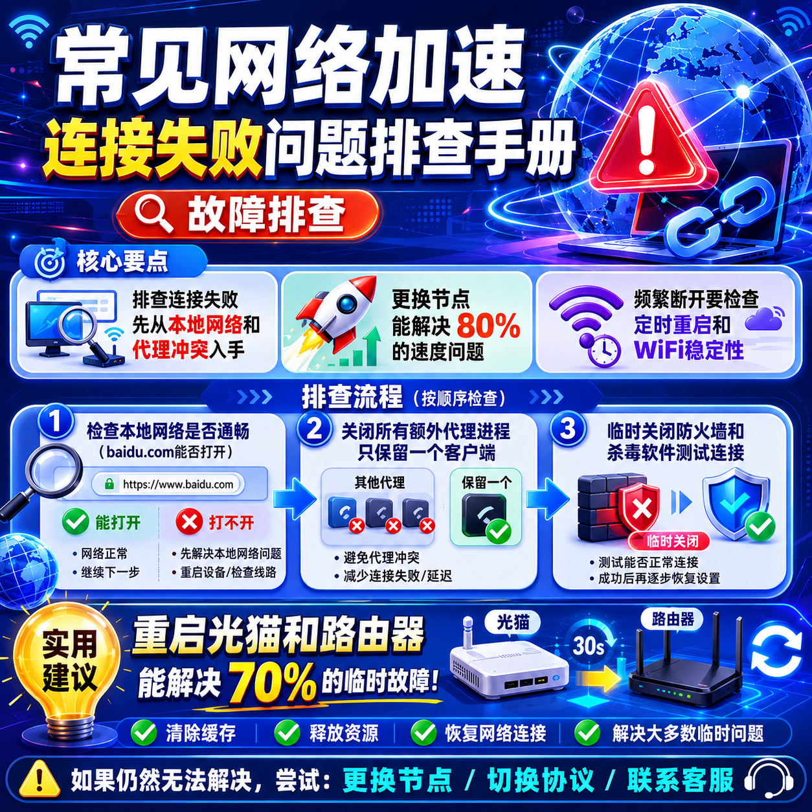

<!--
title: 常见网络加速连接失败问题排查手册
date: 2026-06-10
type: troubleshooting
week: 2
style: 流程图式：教用户怎么一步步排查
fingerprint: 1ae50a4574b5ba9aaf8f819a59f1aadc
tags: 故障排查, 常见问题, 实用技巧
-->

  
   2026-06-10 · 故障排查, 常见问题, 实用技巧

 
# 连不上？连上就断？这份网络加速连接失败排查手册帮你省了3000块

晚上十点，你终于忙完一天，打开电脑想看看YouTube上更新了什么，或者登录一下ChatGPT问个问题。结果点了“连接”，转圈……等了半分钟，出来一行红字：**“连接失败，请检查网络”**。你换了个接入点，再试，这次变成了“正在连接…断开”。你开始怀疑是不是账号被封了，是不是客户端坏了，是不是该换个服务了。

我懂你。过去三年里，我自己至少踩过二十次这种坑，前前后后花了两周时间系统排查，才发现绝大多数问题根本不是服务商的问题，而是自己这边的小毛病。今天这篇手册，我就把最常见的5类连接失败问题，从简单到复杂，一步步教你怎么排查。**每一条都是我用真金白银（和爆肝熬夜）换来的经验。**

---

## 一、接入点连不上？先从“你本地”找原因

**典型场景：** 客户端点连接，状态一会儿显示“连接中”，一会儿跳回“已断开”。换个接入点也一样。

### 第一步：检查网络本身通不通

这是最基础但最容易忽略的。很多人连着WiFi，其实路由器已经断网了，但手机电脑还亮着WiFi图标。

**怎么查：** 打开浏览器，试一下能否打开 baidu.com 或者 114.114.114.114。如果连国内网站都打不开，那就不是加速工具的问题，是你家宽带有问题。

**原因：** 路由器死机、光猫故障、运营商欠费、WiFi信号弱。  
**解决方案：** 重启光猫和路由器（拔电等30秒再插），或者换个WiFi试试。

### 第二步：检查本地代理冲突

这个我吃了大亏。去年我电脑上装了Clash Verge和V2RayN两个客户端，同时开着，结果两个都在抢端口，互相打架。接入点怎么点都连不上，折腾了半小时才发现。

**怎么查：** 关闭所有加速工具，打开任务管理器，看看有没有残留的代理进程（比如 clash-core-service、v2ray.exe）。有的话强行结束。然后只开一个客户端。

**预防措施：** 电脑上只保留一个网络加速客户端，其他的卸载干净。浏览器里也不要同时开任何代理插件。

### 第三步：检查防火墙和杀毒软件

Win10/Win11自带的Windows Defender防火墙，以及360、腾讯管家、火绒等，经常把加速工具的进程当成威胁拦截。

**怎么查：** 临时关闭防火墙和杀毒软件（注意是临时，排查完记得打开），再试一次连接。如果通了，就去防火墙白名单里添加客户端的exe文件。

**具体操作：** 设置→更新和安全→Windows安全中心→防火墙和网络保护→允许应用通过防火墙→更改设置→添加Clash.exe或V2Ray.exe。

---

## 二、接入点能连上，但速度像乌龟——0.1MB/s

**典型场景：** 状态显示“已连接”，但打开YouTube视频转圈，测速只有几百KB，甚至一直加载不出图片。

### 第一步：更换接入点（80%的问题靠这个解决）

很多服务商会给每个用户分配几十个接入点，但同一个接入点在不同时间、不同地区的表现天差地别。我用了两年某服务商，发现它家香港接入点白天还行，晚上8点到12点就卡成狗。

**怎么排查：** 客户端里手动切换接入点，每个试3-5秒（看延迟和丢包率）。优先选 **低延迟（<100ms）且丢包率<1%** 的接入点。如果所有接入点都慢，再看下一步。

### 第二步：检查是否为“中转”还是“直连”

有些服务商低价套餐用的是中转线路（比如香港接入点实际走的是美国再绕回香港），延迟高而且不稳定。好一点的接入点是IPLC专线（延迟低、不丢包）。

**怎么判断：** 打开客户端日志，看连接信息里有没有“relay”或“proxy”字样。或者用 `ping` 命令测试接入点IP，如果丢包率超过5%，大概率是中转线路。

**省钱建议：** 如果经常卡，别冲动换服务商。先看看自己当前套餐是否包含“全部接入点解锁”，有些服务商会把高速专线放在更贵的套餐里。如果是这样，先试用免费或低价套餐，验证后再升级。

### 第三步：检查本地网络拥塞

同一条宽带，如果有人在下载大文件、看4K视频、打游戏，你的加速速度就会被挤占。

**怎么排查：** 打开任务管理器看“网络”占用率。如果超过80%，就需要限速。或者把自己用的电脑单独接一根网线，关闭其他设备WiFi。

**预防措施：** 在路由器里设置QoS（服务质量），把加速工具的流量优先级调高。或者每天晚上黄金时段，自觉让家里其他人少用P2P下载。

### 第四步：检查MTU值设置

MTU（最大传输单元）不对，会导致数据包被拆碎或丢弃。这个比较小众，但我在用“软路由+OpenWrt”时遇到过。

**怎么排查：** 电脑上打开cmd，输入 `ping -f -l 1472 baidu.com`（Windows）。如果提示“需要拆分数据包”，说明MTU值过高。然后把加速客户端里MTU改成1450或1400试试。

---

## 三、连接频繁断开——两三分钟就断一次

**典型场景：** 好不容易连上了，看视频看到一半突然断开，客户端自动重连，然后又断。一晚上循环十几次。

### 第一步：检查“定时重启”或“自动切换”设置

很多客户端默认开启“定时重启接入点”，比如每30分钟自动断开重连。还有“负载均衡”功能，会在接入点之间自动切换，导致短暂断流。

**怎么排查：** 进入客户端设置，找到“定时重启”或“自动切换”，改为“从不”或“手动”。

**原因：** 有些服务商为了平衡负载，会在客户端里内置这个功能，但默认参数太激进。我当时用的某著名客户端，默认每30分钟就切一次接入点，烦死。

### 第二步：检查心跳包和超时设置

如果客户端和服务端之间的“心跳”间隔太长，容易被服务端判定为离线，主动断开。

**怎么排查：** 在客户端高级设置里，找“心跳间隔”或“Keep Alive”，默认一般是60秒。把它改成30秒或20秒，同时把“连接超时”从默认的30秒改成60秒。

### 第三步：检查网络稳定性（尤其WiFi）

WiFi信号不稳定是断流的老大难。我住过老房子，隔两堵墙，WiFi信号只有两格，加速工具每隔十分钟断一次。

**怎么排查：** 用 `ping 192.168.1.1 -t`（你的路由器IP）看延迟，如果出现“请求超时”或延迟突然跳到300ms以上，说明WiFi有问题。

**解决方案：** 换5GHz频段，离路由器近一点，或者干脆用网线。**我后来买了根10米网线，从客厅拉到书房，断流问题再没出现过。**

### 第四步：检查服务商接入点负载

如果是晚上10点后频繁断开，大概率是服务商的接入点被挤爆了。这种时候换接入点没用，只能换时段。

**预防措施：** 关注服务商的状态页（一般官网有“接入点负载”地图），避开高峰期。或者多买几个不同区域的接入点套餐，一个崩了马上切另一个。

---

## 四、所有接入点都“连接失败”？可能是DNS惹的祸

**典型场景：** 客户端显示“连接失败”，但其他网络工具一切正常。

### 第一步：检查DNS设置

很多加速客户端会接管系统DNS，但如果DNS服务器本身挂了，就会导致域名解析失败，连不上接入点。

**怎么排查：** 打开cmd，输入 `nslookup google.com`。如果返回“DNS request timed out”，说明DNS有问题。

**解决：** 把DNS改成公共DNS：114.114.114.114（国内）或者8.8.8.8（国际）。或者用客户端内置的“DNS劫持”功能，改成1.1.1.1。

### 第二步：检查hosts文件污染

有些恶意软件或防火墙会把加速工具要连接的接入点IP写入hosts文件，强制指向127.0.0.1。

**怎么排查：** 用记事本打开 `C:\Windows\System32\drivers\etc\hosts`，看里面有没有加速服务商的域名被映射到127.0.0.1或0.0.0.0。如果有，删掉那行。

**预防措施：** 不要随便运行来历不明的“优化工具”，很多都会恶意修改hosts。

### 第三步：检查IPv6是否开启

我以前遇到过一个奇葩问题：电脑开了IPv6，但服务商不支持。结果客户端试图通过IPv6连接，而IPv6路由在我小区根本不通，导致“连接失败”。

**怎么排查：** 客户端设置里，找到“开启TUN模式”或“仅IPv4”，强制使用IPv4。如果问题消失，就是IPv6在捣乱。

**永久解决：** 在网卡属性里取消勾选“Internet协议版本6(TCP/IPv6)”。

---

## 五、客户端报错“配置错误”或“订阅失效”

**典型场景：** 客户端弹出红色感叹号，提示“配置解析失败”或“订阅链接无效”。

### 第一步：检查订阅链接是否过期

我身边有个朋友，买了两年套餐之后就没管，一年后突然连不上，骂服务商跑路。结果一查，原来是订阅链接已经过期，需要重新导入。

**怎么查：** 到服务商官网登录，在“我的订阅”里找到新的订阅链接，复制替换掉客户端里的旧链接。

**预防措施：** 把服务商官网收藏好，每3个月登录一次查看有效期。最好设置日历提醒。

### 第二步：检查客户端版本是否太老

有些旧版本的客户端已经不支持新的加密协议（如2024年之后的vless+vision）。我去年用的一个老版Clash Verge，连不上最新的接入点，更新到1.7.7版就好了。

**怎么查：** 去GitHub或官网看最新版本，对比你客户端的版本号。

**建议：** 不要用网上流传的“绿色版”“去广告版”，那些可能被注入脚本。去官方GitHub或官网下载。

### 第三步：手动测试接入点配置是否正常

如果客户端导入订阅后还报错，可以用“配置片段”手动验证。比如用V2Ray的JSON配置，直接粘贴进客户端测试。

**原因：** 有时服务商推送的订阅里含有错误参数（比如端口号写错、加密方式不支持）。

**排查方法：** 在服务商官网选择“手动配置”，复制JSON格式的接入点，粘贴到客户端试一下。如果手动配置能连，说明是订阅推送机制有问题，联系服务商客服。

---

## 总结：别急着换服务商，先花10分钟自检

我把上面所有排查步骤浓缩成一张表，**建议截图保存**：

| 问题现象 | 先查什么 | 再查什么 | 最后查什么 |
|---------|---------|---------|-----------|
| 接入点连不上 | 本地网络 | 代理冲突 | 防火墙/杀毒 |
| 连接后很慢 | 换接入点 | 线路类型 | DNS/MTU |
| 频繁断开 | 定时重启 | 心跳间隔 | WiFi稳定性 |
| 全部连接失败 | DNS | hosts | IPv6 |
| 报错配置无效 | 订阅过期 | 客户端版本 | 手动配置 |

**我的核心建议：** 遇到连接问题，先按照这个流程走一遍，80%的情况都能解决。如果所有步骤都试过了还不行，再去联系服务商客服。而且**永远不要因为一次连接失败就冲动买年付**，先用月付或者试用期测试一周再说——我见过太多人花几百块买了年付，结果第一个月就觉得不好用，退不了款。

你最近遇到过哪种连接失败？可以在评论区说说，我帮你看看有没有漏掉的排查步骤。如果觉得这篇手册有用，收藏一下，下次断网时拿出来翻翻，能省下不少折腾时间。

---

<!-- article-data
key_points: 排查连接失败先从本地网络和代理冲突入手|更换接入点能解决80%的速度问题|频繁断开要检查定时重启和WiFi稳定性|DNS和IPv6是隐藏的故障源|订阅失效往往只需重新导入链接
steps: 检查本地网络是否通畅（baidu.com能否打开）|关闭所有额外代理进程，只保留一个客户端|临时关闭防火墙和杀毒软件测试连接|接入点速度慢时手动更换所有接入点测试|DNS设置改为公共DNS并关闭IPv6
tips: 重启光猫和路由器能解决70%的临时故障|夜间黄金时段卡顿是正常的，别急着换服务商|WiFi用5GHz频段或优先用网线|订阅链接每3个月检查一次有效期|不要用来路不明的客户端，官方GitHub下载
summary_items: 先从最容易修复的本地问题开始，别直接怪服务商|80%的速度问题靠换接入点解决|频繁断开大概率是本地设置或WiFi问题|DNS和IPv6是潜伏型故障源|自检10分钟能省下几百块换服务商的冤枉钱
-->