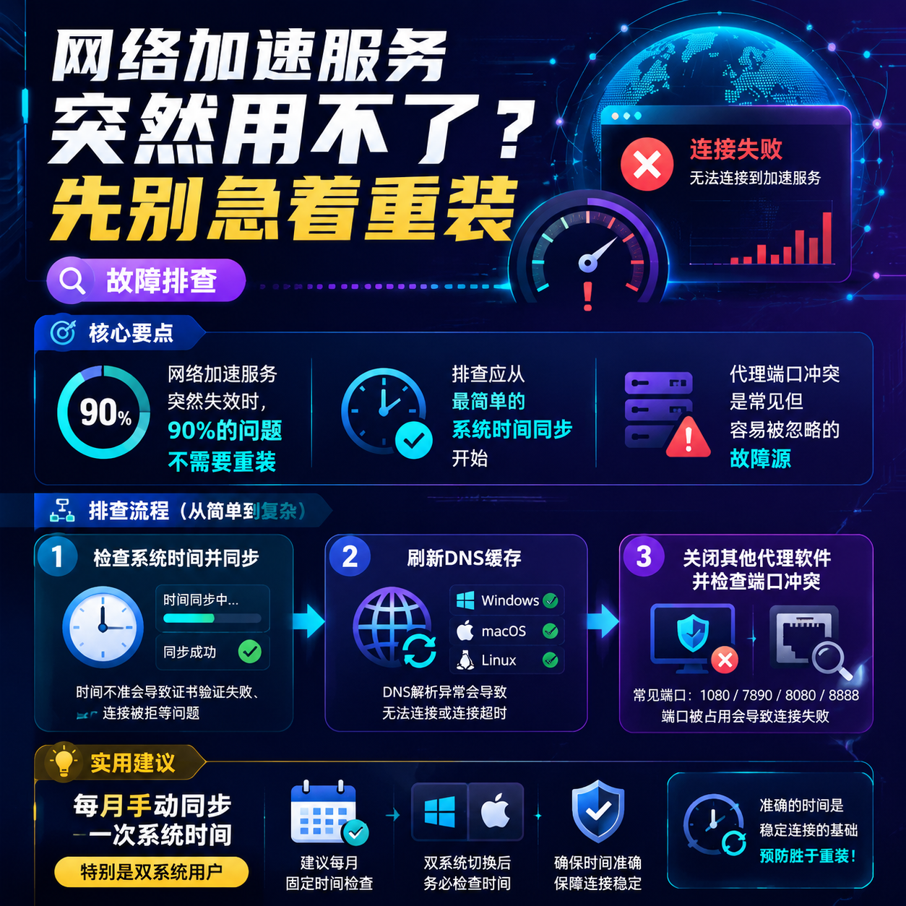

<!--
title: 网络加速服务突然用不了？先别急着重装
date: 2026-06-20
type: troubleshooting
week: 3
style: 经验总结式：从踩过的坑里提炼出通用解法
fingerprint: 61bc07080f7978251b2f165aa5380070
tags: 故障排查, 常见问题, 实用技巧
-->

  
   2026-06-20 · 故障排查, 常见问题, 实用技巧

 
# 网络加速服务突然“罢工”了？别急着删掉重装，这5步能省你半天时间

你有没有过这种经历？晚上正打算看个新出的美剧，或者第二天有个重要的海外会议，打开加速客户端，结果图标一直转圈圈，最后弹出“连接失败”或“无法访问网络”。血压瞬间上来了对吧？我玩了三年网络加速，踩过至少二十次这种坑。前两年我也跟你一样，第一反应就是卸载重装，折腾半小时发现没用，最后怀疑人生。后来花了一周时间系统梳理，发现90%的“突然用不了”其实都是小问题，根本不用重装。今天就把我血泪总结的排查清单交给你，下次再遇到，按这个顺序来，10分钟搞定。

---

## 1️⃣ 最容易被忽视的“低级错误”：系统时间不对 & DNS缓存

**现象**：客户端显示已连接，但实际打不开任何网站；或者直接提示“证书错误”。

**原因**：  
网络加速服务依赖TLS/SSL加密，而证书验证要依赖准确的系统时间。如果系统时间偏差超过几分钟（常见于双系统切换、主板电池没电），加密握手就会失败。另外，DNS缓存如果存了旧的解析记录，也可能导致域名无法解析。

**排查步骤（从简到繁）**：  
1. **检查系统时间**：  
   - Windows：右下角时间 → 右键“调整日期/时间” → 确保“自动设置时间”开启。  
   - macOS：系统偏好设置 → 日期与时间 → 勾选“自动设置日期与时间”。  
   - 手动校准一次：比如用 `time.nist.gov` 强制同步。  
2. **刷新DNS缓存**：  
   - Windows：管理员模式运行cmd，输入 `ipconfig /flushdns`。  
   - macOS：终端输入 `sudo killall -HUP mDNSResponder`。  
   - 建议每次更换接入点后都做一次，成本几乎为零。  
3. **测试基础网络**：  
   - 先断开加速，直接 `ping baidu.com` 或 `ping 8.8.8.8`。如果后者能通但前者不通，说明域名解析有问题；如果都通，说明加速本身没影响基础网。

**预防措施**：  
- 每月手动同步一次系统时间（特别是用双系统的用户）。  
- 不要随意禁用Windows的“Windows Time”服务。

---

## 2️⃣ 端口冲突 & 代理设置被“绑架”

**现象**：加速客户端显示已连接，但浏览器报“代理服务器出现问题”；或者某个应用能访问，另一个不能。

**原因**：  
很多加速工具默认监听 `127.0.0.1:7890`（Clash系）或 `127.0.0.1:1080`（SS/SSR系）。如果你同时开了其他代理软件（比如公司网络加速服务、游戏加速器、甚至某些浏览器的代理扩展），它们会抢端口。另外，系统代理设置可能被非正常修改（比如恶意插件）。

**排查步骤**：  
1. **关闭所有其他代理相关软件**：  
   - 任务管理器/活动监视器里检查有没有 `v2ray`、`sslocal`、`clash`、`proxifier` 等进程。我踩过最坑的一次，是QQ自带的一个加速服务在后台偷偷占用1080端口。  
2. **检查系统代理设置**：  
   - Windows：设置 → 网络和Internet → 代理，确保“使用代理服务器”是关闭状态。  
   - macOS：系统偏好设置 → 网络 → 高级 → 代理，把所有代理都取消勾选。  
3. **修改加速工具端口**：  
   - 如果冲突无法避免，手动把加速客户端的监听端口改成自己常用的（比如 `7891`、`1081`），然后重启客户端。

**预防措施**：  
- 只用一个全局加速工具，其他需要代理的应用走该工具的“规则模式”或“分应用代理”。  
- 避免同时开启多个网络加速服务类服务（包括公司网络加速服务和游戏加速器）。

---

## 3️⃣ 接入点“死”了？别死磕一个，多测几个

**现象**：某天开始，你一直在用（比如用了3个月）的“日本接入点”突然连不上，但其他接入点（比如美国）正常。

**原因**：  
接入点被封锁、服务器流量超限、上游网络波动，甚至服务商迁移IP还没生效。其实很多加速服务有几十个接入点，不可能同时全挂。

**排查步骤**：  
1. **换2-3个不同区域的接入点测试**：  
   - 先选一个冷门地区（比如新加坡、台湾、韩国），再选一个热门地（美国西海岸）。如果冷门能用，说明你常用接入点真的被墙了。  
   - 注意：不要只换同一个地区的另一个接入点，因为同一地区的IP段可能一起被拉黑。  
2. **用“延迟测试”或“真实速度测试”工具**：  
   - 很多客户端自带延迟测速（比如Clash Dashboard的“延迟”列）。如果延迟超过500ms或显示超时，基本可以判定接入点不可用。  
   - 也可以用 `tcping` 命令手动测试：`tcping 接入点IP 端口`。  
3. **尝试切换协议**：  
   - 如果你用的服务支持多种协议（Shadowsocks、V2Ray、Trojan），尝试换一个。比如V2Ray的VLESS协议被干扰概率比Shadowsocks低很多。  

**预防措施**：  
- 定期（每周）备份一个“备用接入点”的配置链接，不要只用那个“最快”的。  
- 关注服务商公告，很多被封接入点会在12小时内更换新IP。

---

## 4️⃣ 系统防火墙、杀毒软件 & 系统更新“背后捅刀”

**现象**：加速客户端能打开，但完全没网速；或者启动后系统网页全部打不开，连国内网站也不行。

**原因**：  
- Windows Defender或第三方杀毒（360、火绒）会误拦截加速工具的虚拟网卡或代理端口。  
- Windows 10/11的大版本更新（如22H2）会重置网络堆栈，甚至关闭TUN/TAP驱动。  
- 某些校园网或公司网络本身限制TUN设备。

**排查步骤**：  
1. **临时关闭杀毒软件**：  
   - 先退出火绒、360、迈克菲等。如果关了之后恢复正常，就去软件的白名单里添加加速客户端及其目录。  
   - Windows Defender：在“病毒和威胁防护” → “管理设置” → 排除项里添加加速工具文件夹。  
2. **检查虚拟网卡**：  
   - Windows：`设备管理器` → 网络适配器，看看有没有“TAP-Windows Adapter V9”或“Wintun”。如果没有，重新安装加速客户端（或者在驱动目录里手动安装）。  
   - macOS：`网络`设置里看有没有加速工具创建的虚拟接口（如 `utun`）。  
3. **查看系统更新影响**：  
   - 如果问题出现在Windows更新后，尝试回滚网卡驱动：右键网卡 → 属性 → 驱动程序 → 回退驱动程序。  
   - 或者卸载最近的系统更新（设置 → 更新和安全 → 查看更新历史记录 → 卸载更新）。

**预防措施**：  
- 安装加速工具后，第一时间把整个安装目录加入杀毒白名单。  
- 重要系统更新前先备份加速配置，更新后测试一次。

---

## 5️⃣ 服务商真的挂了？看状态页 or 问社群

**现象**：所有接入点都连不上，客户端无报错，但网络就是不通。

**原因**：  
服务商的服务器被DDoS攻击、机房维护、域名解析被污染。这种情况你本地折腾一晚上也没用，只能等厂商修复。

**排查步骤**：  
1. **查询服务商官方状态页**：  
   - 如果用的人多，通常会有 `status.服务商域名.com` 或 `服务商域名/status`。我用过的一个服务商每个月会发邮件通知维护时间。  
   - 没有状态页的，去Telegram群组或Discord频道看看最新公告。  
2. **用第三方监测工具验证**：  
   - 在 `downforeveryoneorjustme.com` 输入服务商的域名。如果显示“It's not just you”，那大概率是服务商挂了。  
   - 也可以找个国外的朋友（或自备一台海外VPS）帮你测试接入点是否可达。  
3. **切换备用服务器或手动更新订阅**：  
   - 有些服务商只挂了部分入口，重新拉取订阅链接可能获得新IP。  
   - 手动添加一个你之前保存的备用配置文件（比如从邮件里找）。

**预防措施**：  
- 尽量选择有24小时客服、有Telegram群组且活跃的服务商。  
- 至少保留两个不同服务商的备用配置（一个月付30元和月付50元的各一个，关键时刻不用求人）。

---

## 总结 & 收藏提示

想当初我为了一个“连接失败”重装系统两次，后来才发现只是时间慢了5分钟。我花了3年踩的坑，今天用5个步骤帮你总结完了。下次网络加速突然用不了，请默念三步：**先查时间，再换接入点，最后看杀毒**。按顺序来，90%的问题10分钟内解决，剩下10%大概率是服务商挂了，等就行。

**这篇文章值得收藏**，因为你不确定下次哪一天又遇到类似问题。也可以在评论区分享你遇到过最奇葩的故障原因，我猜肯定有人跟我一样被“电源插座没插紧”坑过 😂

---

<!-- article-data
key_points: 网络加速服务突然失效时，90%的问题不需要重装|排查应从最简单的系统时间同步开始|代理端口冲突是常见但容易被忽略的故障源|接入点本身的问题可以通过切换测试快速定位|服务商服务器故障可通过官方状态页确认
steps: 检查系统时间并同步|刷新DNS缓存|关闭其他代理软件并检查端口冲突|换2-3个不同地区接入点测试|临时关闭杀毒软件并检查虚拟网卡
tips: 每月手动同步一次系统时间（特别是双系统用户）|只用一个全局加速工具，避免多个网络加速服务类服务同时运行|定期备份一个备用接入点的配置链接|安装加速工具后立即将其加入杀毒白名单|至少保留两个不同服务商的备用配置
summary_items: 故障排查先从基础检查（时间、DNS、网络连通性）入手|代理端口冲突和系统代理设置问题很容易修复|接入点被封或服务商故障通过切换测试和官方公告处理|杀毒软件和系统更新是隐藏的干扰源，需提前设置白名单|按“时间→端口→接入点→杀毒→服务商”顺序排查，省时高效
-->