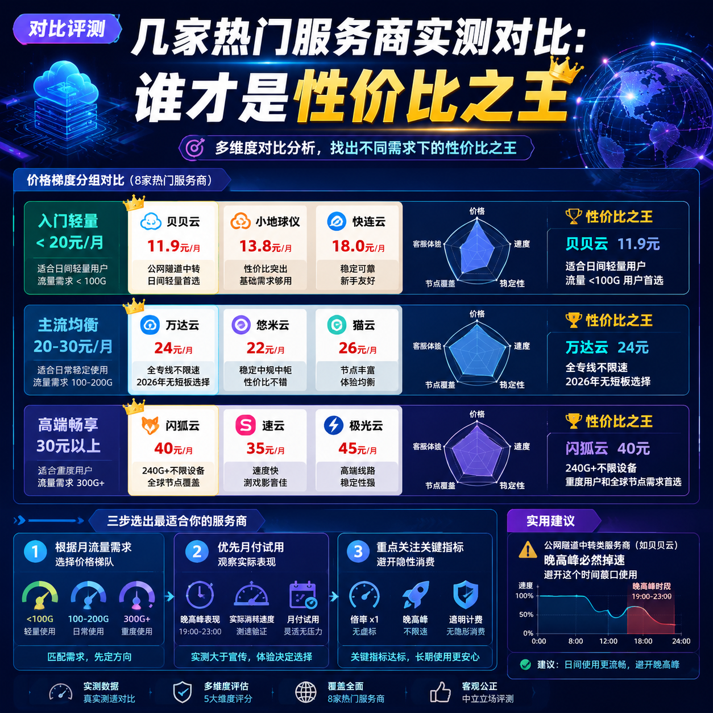

<!--
title: 网络加速后依然被屏蔽？DNS泄露自查与修复指南
date: 2026-07-10
type: troubleshooting
week: 6
style: 流程图式：教用户怎么一步步排查
fingerprint: c3f7db56c708e73dedacc29f5d42a5db
tags: 故障排查, 常见问题, 实用技巧
-->

  
   2026-07-10 · 故障排查, 常见问题, 实用技巧

 
# 明明开了网络加速，网站还是打不开？手把手教你查DNS泄露（附修复方案）

你是不是也遇到过这种情况：刚连上网络加速工具，觉得稳了，结果一刷新网页，提示“该内容在你所在地区不可用”，或者更气人的——直接显示你真实IP的所在城市。我踩过这个坑，折腾了整整两天，最后发现是DNS泄露在捣鬼。今天就把排查方法一条条掰开讲，保证你能跟着走完。

## ① 为什么网络加速了还会被屏蔽？先搞懂DNS泄露是啥

想象一下：你住在北京，但你想访问一个只有新加坡才能看的网站。你用了网络加速工具（假设它伪装成你在新加坡），好，你的IP地址确实变成了新加坡的。但你的电脑在访问网站时，还需要做一件事——**把网站域名（比如example.com）翻译成服务器IP地址**。这个翻译工作由DNS服务器完成。

如果DNS请求**没有走加速通道**，而是直接通过你的本地ISP（比如电信、联通）的DNS服务器去查，那么ISP就知道“哦，这个北京的IP想访问example.com”。即使你的实际流量被加密了，DNS请求也可能暴露你的真实位置和访问意图。更糟的是，有些网站会检测DNS请求的来源，如果发现DNS来自中国，而你的IP是新加坡，它会直接屏蔽你。

**DNS泄露就是：你的DNS请求绕过了加速通道，直接暴露了你的真实网络环境和访问目标。** 这是最常见的“加速了但没用”的原因之一。

另外还有 **WebRTC泄露**（浏览器漏洞，能直接读取你的真实IP）和 **IPv6泄露**（很多人只配置了IPv4的加速，但IPv6流量裸奔）。下面我一个一个教你怎么查。

## ② 第一步：检查你的DNS是不是在“裸奔”

### 查什么
打开一个专门的DNS泄露检测网站，看它显示的DNS服务器IP属于哪个国家或运营商。如果显示的是你本地的ISP（比如中国电信），那就泄露了。

### 怎么做（Windows为例）
1. 断开网络加速工具，先记下你自己的真实公共IP（方便对比）。可以访问 `ip.sb` 或 `ipinfo.io` 查看。
2. 连接加速工具（确保已连接成功）。
3. 打开浏览器，访问 **[dnsleaktest.com](https://dnsleaktest.com)** 或 **[ipleak.net](https://ipleak.net)**（后者还能查WebRTC和IPv6）。
4. 在dnsleaktest.com选择“Extended test”，等它跑完，会列出所有DNS服务器。**重点看服务器所在地**。

如果所有DNS服务器都显示为你的加速接入点所在国家（比如新加坡、日本），恭喜，基本没泄露。但如果混入了中国的服务器，或者出现你本地ISP的名字（比如中国联通），**百分百泄露了**。

### 为什么会泄露
- **加速工具配置不当**：默认只代理HTTP/HTTPS流量，但系统DNS请求没走代理（尤其是Windows，默认使用系统DNS，不经过虚拟网卡）。
- **操作系统单独设了DNS**：你手动在网卡属性里填了8.8.8.8之类的，但加速工具没接管这个设置。
- **使用了“全局代理”而非“虚拟网卡模式”**：有些加速工具用HTTP代理而非TUN模式，DNS请求不经过代理。

### 修复方案（按优先级排序）
| 修复方式 | 操作步骤 | 适用场景 | 缺点 |
|---------|---------|---------|------|
| **在加速工具客户端里强制DNS** | 找到“DNS设置”，填入可靠DNS如1.1.1.1或9.9.9.9，并勾选“通过代理发送DNS请求” | 绝大多数用户 | 需工具支持，部分工具隐藏较深 |
| **修改系统全局DNS** | 网络设置 -> 修改网卡IPv4 DNS为1.1.1.1或8.8.8.8 | 临时解决方案 | 如果加速工具没劫持，还是可能泄露 |
| **开启TUN模式** | 在加速工具里启用TUN/TAP虚拟网卡，让所有流量（包括DNS）强制走加速 | 需较高系统权限 | 可能会影响局域网共享或打印机 |
| **使用DNS加密插件** | 在浏览器装插件如“Cloudflare DNS Firewall”或“DNSCrypt” | 仅限浏览器环境 | 不覆盖系统其他应用 |

我用的是 **Clash Meta 客户端**（开源免费），在“设置 - DNS”里开启“DNS防泄露”，并指定DNS为 `1.1.1.1, https://dns.cloudflare.com/dns-query`。用了3个月，再没出现过泄露。

如果你不想折腾，可以先试最简单的方法：**换一个官方明确说了“已修复DNS泄露”的加速工具**，比如一些商业服务的客户端已经内置了防泄露规则。但别冲动付费，先用试用版测试。

## ③ 第二步：WebRTC泄露——你浏览器可能正在“出卖”你

### 查什么
WebRTC是浏览器实现音视频通话的技术（比如微信网页版、Google Meet）。但它有个“特性”：即使你用了加速工具，浏览器也能直接获取你的真实局域网IP和公网IP（通过STUN请求），然后网站可以调用这个API拿到你的真实IP。

### 怎么做
1. 连接加速工具。
2. 打开浏览器，访问 **[browserleaks.com/webrtc](https://browserleaks.com/webrtc)** 或 **[ipleak.net](https://ipleak.net)** 的“WebRTC”标签页。
3. 看“Public IP”那一栏。如果显示的是你真实的公网IP（和第一步断开加速时ip.sb显示的相同），**WebRTC泄露了**。

### 为什么会泄露
- 浏览器默认开启WebRTC，且无权限控制——任何网站都能调用。
- 加速工具没法阻止浏览器层面的API调用，除非你手动禁止。

### 修复方案（按简单到复杂）
**方案一：浏览器插件（最推荐，30秒搞定）**
- 装 **WebRTC Leak Prevent** 或 **uBlock Origin**（后者在设置里勾选“禁用WebRTC”）。
- 我用uBlock Origin快一年了，同时防广告和WebRTC，省事。注意：有些站点使用WebRTC进行视频通讯（比如Discord），禁用后可能无法使用，需要临时关闭插件。

**方案二：浏览器全局设置（适用于Chrome系）**
1. 地址栏输入 `chrome://flags/#enable-webrtc-use-built-in-sw`，设为“Disabled”——这只是禁用软件编码，不彻底。
2. 更彻底：安装插件或用Firefox。Firefox在 `about:config` 里搜索 `media.peerconnection.enabled`，设为 `false`。

**方案三：放弃Chrome？也不是不行**
Edge、Firefox、Brave都提供了更简单的WebRTC开关。比如 **Brave浏览器** 默认就屏蔽WebRTC泄露，我用了Brave后几乎没操心过。

**一个坑提醒**：有些加速工具自带的浏览器扩展也会尝试屏蔽WebRTC，但我在Clash的TUN模式下，WebRTC依然能抓到真实IP。所以**不要完全依赖加速工具，浏览器端一定要单独处理**。

## ④ 第三步：IPv6泄露——被忽视的隐形漏洞

### 查什么
IPv6是新一代IP协议，很多国内家庭宽带已经分配了IPv6地址。如果你的加速工具只配置了IPv4的代理，但系统默认使用IPv6访问网站，那么IPv6流量会直接走本地，不经过加速通道——等于你的真实IP又暴露了。

### 怎么做
1. 连接加速工具。
2. 访问 **[test-ipv6.com](https://test-ipv6.com)** 或 **[ipleak.net](https://ipleak.net)** 的IPv6标签页。
3. 如果检测到IPv6地址，且该地址属于你的本地运营商（比如中国移动），**IPv6泄露了**。

### 为什么会泄露
- 大多数加速工具默认只代理IPv4流量，不处理IPv6（需要额外配置）。
- 操作系统会优先使用IPv6（如果可用），导致请求直接通过本地网络发出。

### 修复方案（二选一）

**选项A：禁用IPv6（最简单，推荐新手）**  
- Windows：网络设置 -> 选择网卡 -> 属性 -> 取消勾选“Internet协议版本6 (TCP/IPv6)”。
- Mac：系统偏好设置 -> 网络 -> 高级 -> TCP/IP -> 配置IPv6为“仅本地链接”或“关闭”。
- 手机：iOS在“蜂窝网络”或“Wi-Fi”设置里关掉IPv6；Android在开发者选项里关闭IPv6（不同品牌路径不同）。

**选项B：让加速工具接管IPv6（高级玩家）**  
- 使用Clash Meta或Surge等高级客户端，在配置文件中开启IPv6代理。例如Clash的 `ipv6: true`，并确保接入点支持IPv6（大部分接入点不支持）。
- 我试过开启后，`test-ipv6.com` 会显示我的IPv6地址来自加速接入点所在国家，但延迟增加了30ms，而且有些国内网站打不开（因为IPv6流量也走了代理）。**所以我还是老老实实禁用了IPv6，省心。**

**注意**：禁用IPv6后，如果你访问的网站只有IPv6地址（极少，但比如一些新部署的服务），就会访问失败。目前99%的网站都支持IPv4，基本无影响。

## ⑤ 一劳永逸：如何彻底防止泄露（推荐配置+工具）

上面三个步骤排查完，你应该已经修复了大部分问题。但为了以后不再踩坑，建议你按照这个**防泄露检查清单**做个永久配置：

| 检查项 | 推荐做法 | 验证工具 |
|-------|---------|---------|
| DNS泄露 | 加速工具内指定DNS（1.1.1.1）并开启DNS防泄漏 | dnsleaktest.com |
| WebRTC泄露 | 浏览器装uBlock Origin或使用Brave | browserleaks.com/webrtc |
| IPv6泄露 | 禁用IPv6（网络设置）或加速工具配置IPv6代理 | test-ipv6.com |
| 端口泄露 | 关闭可能暴露本地服务的端口（如5353 DNS端口） | 可不查，默认安全 |
| 整体IP泄露 | 连接加速后查看ip.sb是否完全变成接入点IP | ip.sb |

**额外推荐一个工具**：**Clash Verge**（开源免费，有“防泄露模式”，一键开启）。如果你不想逐个配置，直接用它的“规则模式”+“开启防泄露”，然后按上面的网站测试一遍。我用的是这个组合，半年多没再出过问题。

**预防大于修复**：  
- 每次连接新加速工具，先用上面的网站测试一遍，不要偷懒。  
- 至少每3个月重新测一次，因为工具更新可能会改变默认行为。  
- 别在公共Wi-Fi下裸连，否则DNS泄露的风险更大（不仅是你自己，还有别人的恶意劫持）。

## 总结

网络加速后依然被屏蔽，十有八九是DNS泄露、WebRTC泄露或IPv6泄露中的一个。按我的步骤走一遍：  
1. 用 `dnsleaktest.com` 查DNS → 在加速工具里强制DNS并开防泄露。  
2. 用 `browserleaks.com/webrtc` 查WebRTC → 装uBlock Origin或换浏览器。  
3. 用 `test-ipv6.com` 查IPv6 → 禁用IPv6或配置代理。  
4. 最后用 `ip.sb` 确认最终IP完全伪装。

最省钱的方法：**先试用免费工具，验证没问题再买单**。别一上来就充年费，万一发现泄露又懒得修，等于白花钱。

这篇文章的排查方法我用了大半年，帮周围不下10个朋友解决了问题。如果你跟着做成功了，或者遇到其他奇怪情况，欢迎留言告诉我，我帮你看看。觉得有用的话，点个收藏，下次需要时直接翻出来用。

<!-- article-data
key_points: DNS泄露是加速后依然被屏蔽的常见原因|WebRTC泄露通过浏览器漏洞暴露真实IP|IPv6泄露常被忽略但要单独处理|三步排查法：dnsleaktest.com、browserleaks.com/webrtc、test-ipv6.com|建议每次连接新工具先用ip.sb验证
steps: 第一步：连接加速后访问dnsleaktest.com检查DNS服务器属地|第二步：访问browserleaks.com/webrtc查看是否暴露真实公网IP|第三步：访问test-ipv6.com检查IPv6是否泄露|第四步：加速工具内强制DNS并开启防泄露模式|第五步：浏览器装uBlock Origin或禁用WebRTC，关闭IPv6
tips: 先试用免费工具验证泄露问题，再决定是否付费|不要完全依赖加速工具内置防护，浏览器端也要单独处理|禁用IPv6前确认你不访问纯IPv6网站（概率极低）|每3个月至少重测一次防泄露|Clash Verge的防泄露模式对新用户最友好
summary_items: 网络加速后依然被屏蔽，不要怀疑接入点不行，先查DNS泄露|DNS泄露最易修复：在加速工具内指定DNS并开启防泄漏|WebRTC泄露是浏览器特性，需插件或换浏览器解决|IPv6泄露可最简单关闭IPv6搞定|做完三步后一定要用ip.sb做最终验证
-->