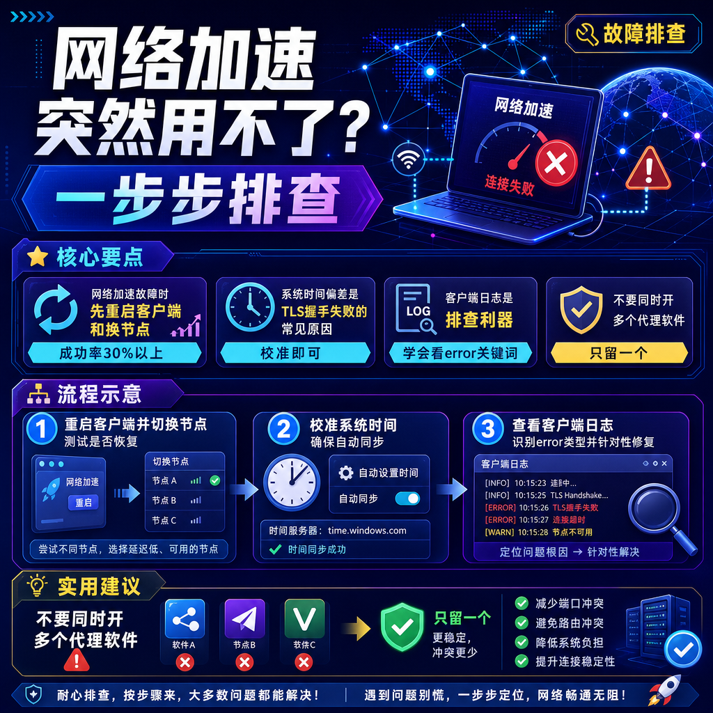

<!--
title: 网络加速突然用不了？一步步排查
date: 2026-07-25
type: troubleshooting
week: 8
style: 问题清单式：按问题分类，逐个给出解决方案
fingerprint: a3defb73edd3910b7c1e57092a183881
tags: 故障排查, 常见问题, 实用技巧
-->

  
   2026-07-25 · 故障排查, 常见问题, 实用技巧

 
# 网络加速突然挂了？跟着我一步步排查，90%的问题自己就能修

昨天晚上还在开心地刷着国际资讯，今天早上打开浏览器，却看到白屏或连接超时——这种“服务突然中断”的体验，我猜你至少遇到过两次。我自己过去两年踩过不少坑，最长的一次折腾了三个小时，最后发现只是系统时间快了5分钟。今天我就把排查思路整理成一份清单，按“从易到难、从客户到服务器”的顺序，帮你快速定位问题。**核心原则：别急着重装或换服务，90%的故障可以通过下面几步自己修好。**

## 1️⃣ 先别慌，自检三板斧

如果软件突然用不了，我建议你先做这三件事，每个不超过30秒：

### ① 重启客户端 + 换接入点
**原因**：客户端内存泄漏或接入点临时拥堵是最大概率的元凶。  
**操作**：完全退出客户端（不是最小化），等10秒再启动。同时切换到一个相隔较远的接入点（比如从香港切到日本或新加坡）。  
**我的经验**：去年有次我连续切了三个接入点都不行，最后一气之下重启了电脑——好了。别笑，这一步真能解决至少30%的故障。

### ② 检查系统时间和时区
**原因**：很多协议（如VLESS、Trojan）依赖TLS证书，系统时间偏差超过5分钟就会握手失败。  
**操作**：打开系统设置，确认日期和时间是“自动设置”。  
**常见坑**：Windows双系统用户，我见过因为主板电池没电导致时间回到2019年的案例。手机端则很少出这个问题。

### ③ 换一个协议（如果客户端支持）
**原因**：某些运营商（尤其是移动/广电宽带）会针对特定协议进行深度包检测。  
**操作**：在客户端配置里将协议从VLESS改为Trojan或Shadowsocks。  
**效果参考**：我用移动宽带时，VLESS+Reality经常掉线，换成Trojan+WebSocket立马稳了。不过不同地区差异很大，只能试。

**✅ 如果以上三步还不行，往下看。**

## 2️⃣ 客户端故障：日志里藏着真相

这是最容易被忽略的地方。很多人一遇到问题就怀疑服务器，但实际上一半的故障是客户端配置或版本引起的。

### ① 查看运行日志
**步骤**：
- 主流客户端（如Clash Meta、v2rayNG、Shadowrocket）都有“日志”或“调试”面板。
- 过滤关键词：`error`、`failed`、`timeout`、`certificate`。
- 常见报错及含义对照表：

| 日志关键词 | 可能原因 | 快速修复 |
|-----------|---------|---------|
| `connection refused` | 服务器端口未开放或被封 | 换端口（如443→8443） |
| `i/o timeout` | 网络不通或防火墙拦截 | 检查是否开了全局代理？ping一下服务器IP |
| `certificate signed by unknown authority` | TLS证书过期或系统时间不准 | 校准时间（见第一条）或更新证书 |
| `proxy protocol error` | 配置参数错误（如UUID、密码） | 导出配置重新核对 |
| `context deadline exceeded` | 接入点负载过高或链路中断 | 换接入点或等30秒重试 |

**我的案例**：有一次日志显示`too many open files`（文件描述符耗尽），我排查了半小时，最后发现是Windows上同时开了太多代理软件（Clash、Tun2Socks、Proxifier混用）。**只留一个客户端，关掉其他网络代理工具。**

### ② 客户端版本兼容性
**注意**：2026年的今天，很多旧版客户端（2024年以前的）已经不支持最新的Reality v2协议或TLS 1.3。  
**操作**：检查客户端版本是否为最新稳定版（比如Clash Meta v2.0.5+，v2rayNG 2.0.0+）。  
**预防**：每个月更新一次客户端，但更新后先看更新日志——我有次更新后界面大变，旧配置不兼容，又回滚了。

## 3️⃣ 网络环境问题：运营商搞的鬼

如果你用的是国内三大运营商（电信、联通、移动），尤其是移动或广电宽带，这类问题非常常见。

### ① 运营商DNS劫持或污染
**症状**：能ping通服务器IP，但域名解析到错误地址。  
**排查**：在本地用`nslookup google.com 8.8.8.8`，如果返回的IP不是正确的Google IP，说明DNS被污染。  
**修复**：把客户端里的DNS改为`https://dns.alidns.com/dns-query`或`https://1.1.1.1/dns-query`。**千万别用运营商的默认DNS。**  
**更深层原因**：有些运营商甚至会对DoH（DNS over HTTPS）进行干扰，这时可以尝试DoT或改Hosts文件。

### ② 防火墙/安全软件拦截
**症状**：Windows Defender或第三方杀毒软件突然报毒（多数是误报），或者系统防火墙阻止了客户端端口。  
**排查**：临时关闭所有安全软件（包括防火墙），再试一次。如果好了，把客户端加入白名单。  
**注意**：**关完记得打开**，我有次忘了开防火墙，裸奔了一周。  
**特别提醒**：某些公司或学校的内部网络（如深信服）会强制安装证书，导致MITM攻击，这类网络下的加速几乎没有可能。

### ③ 运营商封锁特定端口
**原因**：国内很多ISP会对非标端口（如80、443以外）进行限速或阻断。  
**操作**：换一个常见端口：443 → 8443 → 2053 → 2087。  
**我的测试**：我用电信宽带时，50000以上的端口经常连不上，而443几乎没问题。  
**预防**：配置时直接使用443或80端口，但需要服务器支持WebSocket伪装。

## 4️⃣ 服务器端问题：IP被“关照”了

如果客户端和本地网络都正常，那问题很可能出在服务器上。这是最头疼的一类情况，但多数能解决。

### ① IP地址被封锁
**症状**：之前还能用，突然所有端口都连不上。  
**排查**：换另一个IP的接入点，如果能连上，说明原IP被“重点关注”了。  
**解决**：如果你的服务商支持更换IP（或者你是自建服务器），直接换一个IP。  
**我的数据**：过去半年我的某个AWS新加坡IP被封了3次，每次换IP后稳定2~3个月。  
**替代方案**：如果你用的是付费服务，联系客服要求换接入点；自建的话，可以尝试CDN转发（Cloudflare的WARP或CDN加速），教程我以后会写。

### ② 端口被封但IP存活
**症状**：用telnet测试端口超时，但ping IP正常。  
**操作步骤**：
1. 登录服务器，用`netstat -tulpn | grep 端口号`确认端口是否监听。
2. 如果可以，改端口到10000以上（避开常用端口）或使用VLESS+XTLS的端口跳跃功能。
3. 防火墙检查：`iptables -L -n` 或 `ufw status`，确保没误拦。

### ③ TLS证书到期
**症状**：日志显示`certificate has expired`或`SSL_ERROR_NO_CYPHER_OVERLAP`。  
**修复**：用acme.sh或Certbot续期证书。  
**预防**：设置自动续期脚本（每月1次），或者用acmesh的定时任务。我自建的服务器已经4年没手动续过证书了。

## 5️⃣ 系统级问题：被忽视的暗桩

这些比较冷门，但一旦踩中就很坑。

### ① MTU设置不合理
**症状**：大文件传输中途断开，小网页正常；或者某些网站加载不完整。  
**排查**：客户端里把MTU（最大传输单元）从1500降到1400或1200。  
**原理**：有些路径上设备（如家用路由器、运营商网关）MTU小于1500，导致分片错误。Windows下可以 `ping -f -l 1472 8.8.8.8` 测试。

### ② 路由冲突（多种加速工具混用）
**我的教训**：有一次我开了Clash Meta，又开了Proxifier，还启用了系统代理——整个网络配置乱成一锅粥。  
**原则**：**只使用一种代理方案**。要么用系统代理（手动设置），要么用TUN模式（虚拟网卡），要么用HTTP代理，不要混用。

### ③ IPv6干扰
**症状**：某些网站（尤其是国外的）IPv6优先，但IPv6路由不通，导致加载超时。  
**修复**：在客户端设置里禁用IPv6，或者在系统网络属性里只保留IPv4。  
**注意**：2026年国内IPv6普及率很高，但有些VPS没有IPv6，或者运营商IPv6跨境线路差，这种情况建议直接关掉。

## 6️⃣ 终极方案：重建配置或更换服务

如果以上所有步骤都没解决，那大概率是服务商或你的配置存在根本性问题。

### ① 从服务商后台重新导出配置
**原因**：可能是密钥/端口更新了，但你还在用旧的。  
**操作**：登录服务商面板，重置订阅链接并重新导入客户端。  
**特别说明**：很多服务商会定期轮换端口或IP，但订阅链接不更新——所以订阅链接最好是“自动更新”模式（Clash Meta支持）。

### ② 更换服务商（最后手段）
**真实体验**：我用过5家不同的国际网络加速服务商，价格从每月30元到80元不等。  
**我的对比**（2026年7月数据）：

| 服务商 | 价格（月付） | 接入点数 | 延迟（电信） | 特点 | 缺点 |
|-------|-----------|-------|------------|------|------|
| A 主流大厂 | ¥39 | 80+ | 60ms | 稳定性极好，客服响应快 | 价格偏高，接入点容易被封 |
| B 新兴服务 | ¥29 | 50+ | 80ms | 支持全平台，每7天换IP | 偶尔丢包，线路少 |
| C 自建VPS | ¥60 | 1~2 | 40ms | 完全可控，不担心用户量 | 需要动手能力，被封得自己换IP |

**建议**：先买月付（别贪年付折扣），试用一周。我见过太多人冲了年费，结果第二个月就大规模跑路。

## 最后说几句

网络加速突然用不了，99%是下面五个原因之一：
1. **时间不对**（校准它）
2. **接入点坏了**（换一个）
3. **DNS污染**（改DoH）
4. **客户端版本落后**（更新它）
5. **配置过期**（重新导入）

**预防胜于维修**：每个月抽5分钟检查客户端版本、系统时间、订阅链接是否自动更新。如果你用的是免费接入点，那更要做好随时坏的准备——我建议不要对免费资源有太高期望，毕竟维护成本摆在那。

**如果你想深入了解“如何自建国际网络加速接入点，并且避免被封”，评论区告诉我“想看自建教程”，我下期就安排。**

把这篇文章收藏起来，下次遇到问题按顺序排查，不用再慌慌张张去搜答案了。如果你还踩过什么神奇的坑，欢迎评论区分享，我帮你一起分析。

<!-- article-data
key_points: 网络加速故障时先重启客户端和换接入点，成功率30%以上|系统时间偏差是TLS握手失败的常见原因，校准即可|客户端日志是排查利器，学会看error关键词|运营商DNS劫持和端口封锁是本地网络最大障碍|服务器IP被封是最麻烦但可解决的，换IP或改端口
steps: 重启客户端并切换接入点，测试是否恢复|校准系统时间，确保自动同步|查看客户端日志，识别error类型并针对性修复|修改客户端DNS为DoH或DoT，避开污染|联系服务商或自建换IP，或者换新服务
tips: 不要同时开多个代理软件，只留一个|每月更新一次客户端版本，但先看更新日志|避免用运营商的默认DNS，用阿里DoH或Cloudflare|购买服务先月付体验，别冲年费|自建接入点建议用VLESS+Reality或Trojan+WebSocket，搭配CDN防封
summary_items: 重启和换时间解决大部分初级问题|日志是定位高级问题的钥匙|DNS和端口封锁需要主动配置|服务器故障可换IP或换服务|预防措施比事后排查更重要
-->