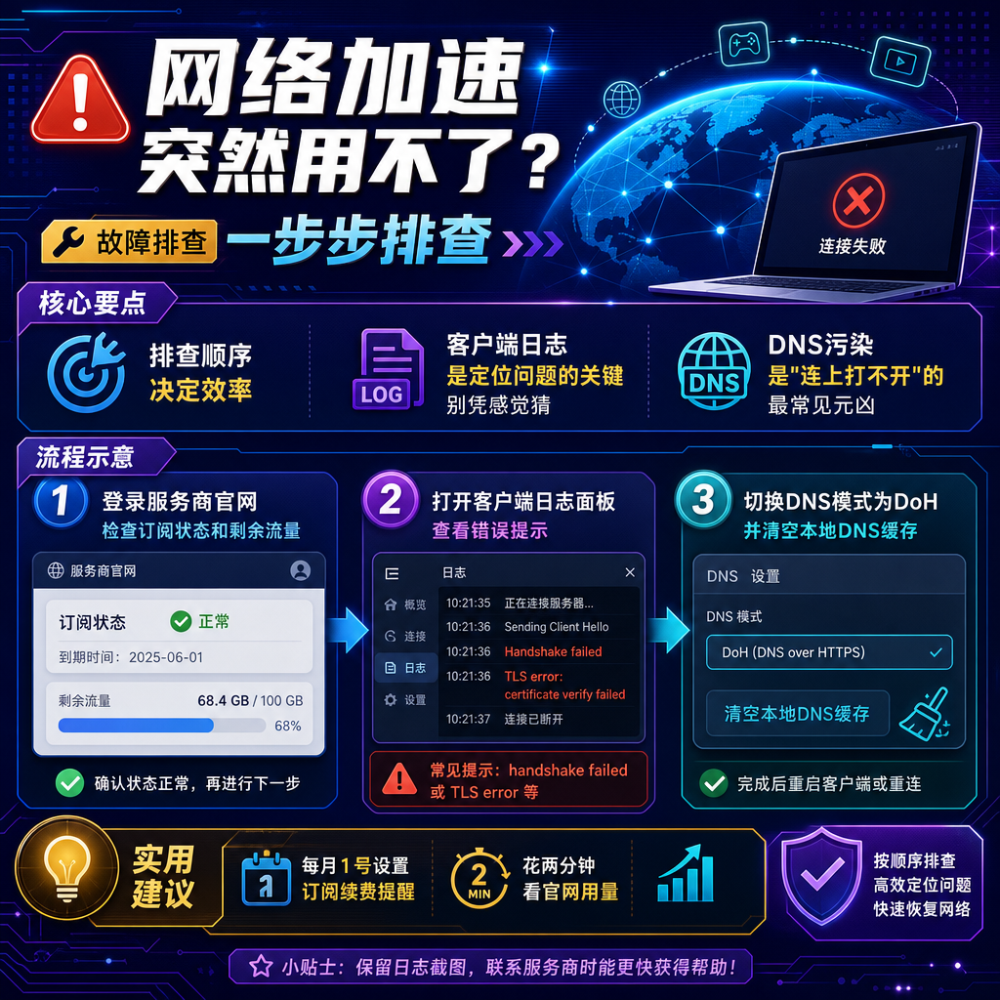

<!--
title: 网络加速突然用不了？一步步排查
date: 2026-08-08
type: troubleshooting
week: 10
style: 经验总结式：从踩过的坑里提炼出通用解法
fingerprint: e21d40a02d8d50d57301958be9ff943e
tags: 故障排查, 常见问题, 实用技巧
-->

  
   2026-08-08 · 故障排查, 常见问题, 实用技巧

 
网络加速突然罢工？别急着删软件，按这个顺序排查能救回 80% 的情况

你有没有遇到过这种情况：上午刷推还丝滑，下午开个网页就转圈三分钟，最后直接给你来个"无法连接到服务器"。我 2026 年 8 月就碰上了这么一遭，而且偏偏是在工作到一半、急着查一份海外资料的时候。

我当时的第一反应是"服务商跑路了"，第二反应是"我是不是被针对了"，第三反应才是冷静下来做排查。结果你猜怎么着？**真正的原因简单到让人想掀桌子**——我的订阅到期了，只是客户端没提示。就这？

后来这半年，我又陆续帮三个朋友排查过类似问题，踩过的坑积累下来，发现大部分"突然用不了"其实就那么几类原因。今天我把这些经验整理成一套从简到繁的排查流程，你照着做一遍，大概率能自己修好。

## 第一刀：先从最蠢的地方下手（对，就是到期和流量）

我那个"订阅到期没提示"的故事不是个例。很多人订阅是季度付或者半年付，到期日自己都记不清。客户端有时候因为时区或者服务器端的问题，并不会弹红色警告，只是默默失效。

排查步骤很简单：

1. **登录服务商官网**，看订阅状态。这一步别偷懒，别只看客户端显示。我见过客户端显示还有 17 天，官网其实早就欠费的情况。
2. 看**流量用量**。有些服务商是"不限量但达峰降速"，有些是"限量用完即断"。我有个朋友买的是每月 100G 的套餐，他以为"100G 够用了"，结果他每天开着视频会议 + 后台自动备份，20 号就把流量烧光了。
3. **手动换一个接入点试试**。注意，不是换一个国家的，是换个协议或端口完全不同的接入点。

我自己现在的习惯是：**日历里设一个"订阅续费日"提醒，每月 1 号花两分钟登录官网看一眼用量和到期时间**。这习惯养成了，能挡掉一半的"突然罢工"。

## 第二刀：看了日志才知道，不是所有"连不上"都一样

如果订阅没问题，那就要观察现象了。我总结过，故障大概分三类，对应不同的排查方向：

| 故障现象 | 大概率原因 | 先查什么 |
|---------|-----------|---------|
| 所有接入点都连不上，提示超时 | 本地网络 / 运营商封锁 | 裸连测速、换 DNS |
| 部分接入点能连，部分不行 | 特定 IP 被封锁 | 换地区、换协议 |
| 连上了但打不开网页 / 速度极慢 | DNS 污染或分流规则错乱 | 清 DNS 缓存、更新规则 |

今年遇到的一个典型情况是——**服务商升级了协议，旧版客户端不兼容**。我有个朋友的客户端停在了 2025 年底的版本，而服务商在 2026 年 3 月切换到了新的传输协议。结果就是：客户端显示"已连接"，但所有流量都走不出去。

这种情况看日志最明显。**打开客户端的日志面板（一般在设置或右上角小图标里），找 "handshake failed" 或 "TLS error" 字样**。看到这类词，基本可以确定是协议不匹配或 TLS 指纹被识别，解决方案就是**更新客户端到最新版，或者换个端口/混淆方式**。

另一个高频坑：**本地防火墙或安全软件拦截**。这个很隐蔽，因为症状很像"接入点挂了"——所有接入点都连不上，但裸连正常。2026 年 5 月我自己遇到过一次，排查了半天，最后发现是 Windows 更新后重置了防火墙规则，把我的加速工具主程序给拦了。

排查方法：暂时关掉防火墙和安全软件（注意是暂时，测完记得开回来），如果能连上，那就在防火墙里把客户端程序加入白名单。

## 第三刀：DNS 这个"幕后黑手"，80% 的"连上了但打不开"都是它

你有没有这种经历：接入点连上了，Telegram 能刷，但打开浏览器访问 Google 就转圈，最后报错 "ERR_NAME_NOT_RESOLVED"。

这个坑我在 2025 年踩过一次大的。当时我以为是接入点问题，换了七八个接入点都没用，最后才发现是 **DNS 设置被污染了**。具体原因是我的路由器开了"魔法上网"模式，但 DNS 设置里用的是默认值，导致部分域名解析出了国内 IP，访问自然就失败。

解决步骤：

1. 在客户端里，把 DNS 模式改成 "DNS over HTTPS"（DoH），或者手动指定 DNS 服务器，比如 `1.1.1.1` 或 `8.8.8.8`。
2. 然后**清本地 DNS 缓存**：Windows 在命令行敲 `ipconfig /flushdns`，macOS 敲 `sudo dscacheutil -flushcache`。
3. 最后，**退掉所有规则模式，切换到"全局模式"测试**。

说到"全局模式"，我得提醒你一个容易翻车的点：**如果你用的是"规则模式"（Rule），有时候新装的 App 没被识别，流量走了直连，就会表现成"打不开"**。这不是故障，是分流规则没覆盖到。你可以打开客户端的"连接日志"，看某个域名的流量到底走了哪个出口。

如果是 Win 系用户，还有个系统级技巧：**检查网络适配器里的 DNS 是否被改了**。又是在系统更新之后，我的以太网适配器 DNS 被重置成了"自动获取"，而自动获取到的是一个被污染的结果。手动改成 `1.1.1.1` 之后立竿见影。

## 第四刀：如果以上都试过了，那就是你被"特别照顾"了

这说明什么？说明你访问的目标站点或服务，对你的出口 IP 做了更精细的封锁。

2026 年这个时间点，单纯的 IP 封锁已经不是主要手段了。**更常见的是 TLS 指纹识别和流量特征分析**。表现特征很典型：连上了，但特定网站（比如 Google 搜索或某些需要登录的海外服务）打开就是验证码、403，或者直接白屏。

这个基本无解，但有几个缓解办法可以轮换着试：

- 换**更小众的接入点**（不是香港、新加坡、日本这种大众热门地）
- 切换**协议**（比如从 VMess 换到 VLESS + Reality，或者 Trojan，有的工具支持 TUIC 或 Hysteria2，可以都试试）
- 打开客户端的 **"UDP 支持"开关**，有些服务依赖 UDP 传输，默认关掉会导致部分功能异常
- 更新客户端到最新版本，然后**完全退出并重新启动**，让客户端的伪装参数刷新

如果以上都无效，那就换一个服务商的"中转接入点"试试。比如，你在美国接入点被识别了，就不如走一个**日本 → 美国的中转链**。有些服务商提供这种"落地中转"或"家宽接入点"，专门应对这类问题。

## 最后一道防线：我用的 3+1 预防方案

修好了之后，我给自己定了一套预防机制，目前保持了 3 个月没再出过问题：

| 频率 | 动作 | 目的 |
|-----|------|-----|
| 每月 1 日 | 登录官网看订阅状态和剩余流量 | 避免"假到期" |
| 每次系统更新后 | 检查客户端是否需要升级、防火墙规则是否变化 | 避免"不兼容" |
| 每季度 | 换一次常用接入点（换国家） | 避免"IP 疲劳" |
| 随时 | 手机里存一个服务商的 Status 页面地址 | 快速判断是"自己坏了"还是"服务商断了" |

最后这个特别值得说。**服务商挂了你是没法修的，但你得知道它挂了**，省得你反复重启路由器和电脑浪费时间。我用的方式是：在 Telegram 里把服务商的通知频道置顶，出问题前 5 分钟它会发公告。

## 总结一句干货

"突然用不了"的排查顺序是：**先看订阅 → 再看客户端 → 再看 DNS → 再考虑被封锁**。前两步解决了 60% 的问题，第三步能多解决 20%，剩下 20% 看缘分和"抗封锁能力"。

你最近有没有遇到过类似的"突然罢工"？最后是怎么解决的呢？欢迎在评论区分享你的排查经历——说不定你的经验正好能救一个正在抓狂的朋友。觉得这篇有用的话，不妨**收藏备用**，下次遇到问题可以直接照着查。

<!-- article-data
key_points: 排查顺序决定效率，先看订阅再查配置|客户端日志是定位问题的关键，别凭感觉猜|DNS污染是"连上打不开"的最常见元凶|特定网站被封锁需要换协议或走中转接入点|预防机制比事后排查更重要，定期检查能挡掉80%故障
steps: 登录服务商官网检查订阅状态和剩余流量|打开客户端日志面板查看handshake failed或TLS error提示|切换DNS模式为DoH并清空本地DNS缓存|暂时关闭防火墙或安全软件排除拦截可能|在全局模式下测试并将客户端程序加入白名单
tips: 每月1号设置订阅续费提醒，花两分钟看官网用量|手机里存服务商状态页地址，先判断是不是服务商挂了|系统更新后要检查防火墙规则是否重置了客户端权限|在Telegram里置顶服务商通知频道，故障前会有公告
summary_items: 60%的"突然用不了"是订阅到期或流量耗尽|客户端一直挂着旧版本会和服务端协议不兼容|DNS缓存污染会导致连上接入点但打不开网页|被特别照顾时切换小众接入点和协议比换国家更有效|养成每月检查和季度换接入点的习惯可减少故障
-->